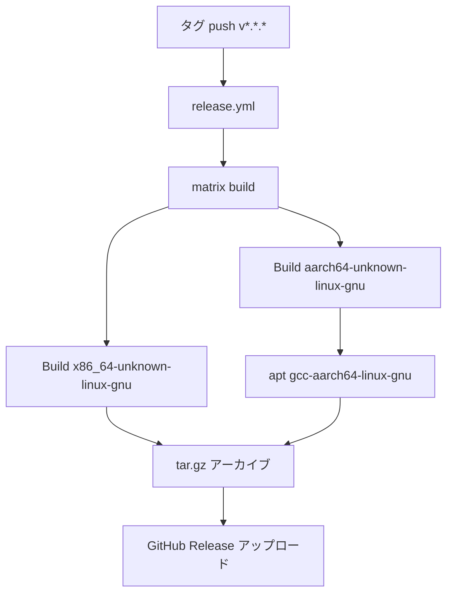
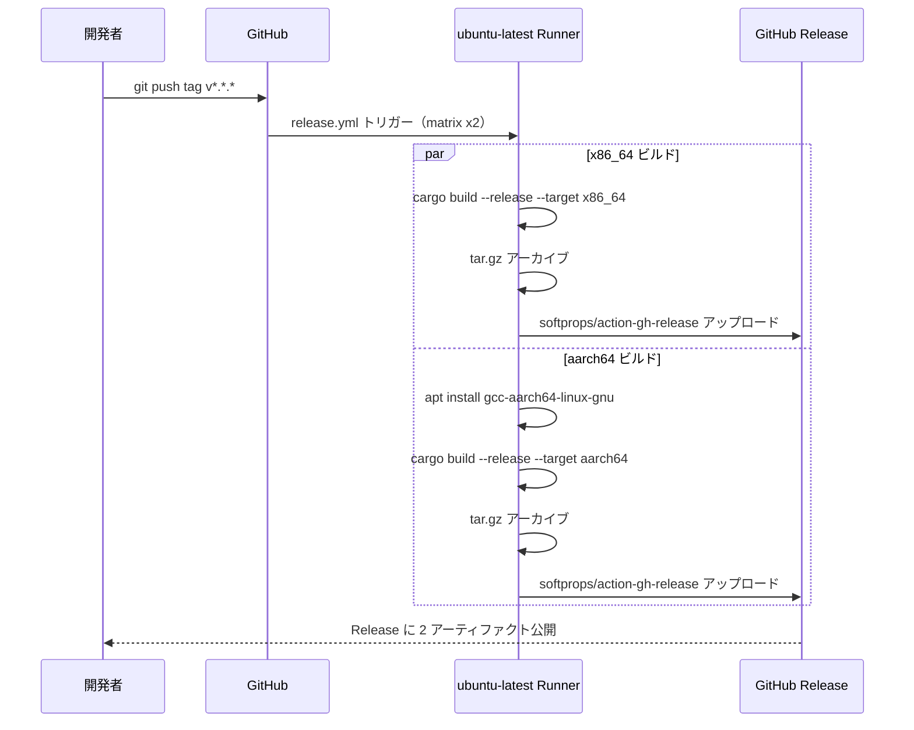

# Design Document: add-aarch64-release-target

## Overview

本機能は GitHub Actions Release ワークフロー（`.github/workflows/release.yml`）を新設し、`v*.*.*` タグ push をトリガーとして `x86_64-unknown-linux-gnu` および `aarch64-unknown-linux-gnu` 向けバイナリを自動ビルド・GitHub Release へアップロードする。

**Purpose**: Raspberry Pi 5 等の ARM64 Linux デバイスユーザーに、cupola の公式バイナリを GitHub Release から直接ダウンロードできる手段を提供する。
**Users**: cupola の ARM64 Linux デバイスユーザーおよびリリース管理を行う開発者。
**Impact**: 新規ワークフローファイル `.github/workflows/release.yml` の追加のみ。既存の `ci.yml` および Rust ソースコードへの変更はない。

### Goals

- タグ push 時に x86_64 / aarch64 の 2 ターゲット向けバイナリをビルドする
- GitHub Release に `cupola-aarch64-unknown-linux-gnu.tar.gz` を含む成果物を自動公開する
- rusqlite bundled feature を含むクロスコンパイルを ubuntu-latest 上で成功させる

### Non-Goals

- macOS / Windows ターゲットのリリースバイナリ生成（スコープ外）
- `cross` crate の導入（ターゲットが少ないため不採用）
- Release Note の自動生成（別 Issue で対応）

## Architecture

### Existing Architecture Analysis

現状 `.github/workflows/ci.yml` は PR および main push に対して fmt/clippy/test を実行するが、リリースビルドと GitHub Release へのアップロードは行っていない。`release.yml` は `ci.yml` とトリガーが完全に分離されるため、干渉しない。

### Architecture Pattern & Boundary Map



**Architecture Integration**:
- Selected pattern: matrix include — ターゲットごとにビルドパラメータを定義し、共通ステップを DRY に保つ
- Existing patterns preserved: `dtolnay/rust-toolchain@stable`、`Swatinem/rust-cache` を ci.yml と同様に使用
- New components rationale: `softprops/action-gh-release@v2` — Release 作成と成果物アップロードを単一ステップで実現
- Steering compliance: 変更は CI/CD 設定ファイルのみ。Rust ソース・Clean Architecture レイヤー構造に影響なし

### Technology Stack

| Layer | Choice / Version | Role in Feature | Notes |
|-------|------------------|-----------------|-------|
| CI/CD | GitHub Actions | ワークフロー実行基盤 | ubuntu-latest |
| Rust Toolchain | dtolnay/rust-toolchain@stable | Rust コンパイラ + aarch64 ターゲット追加 | `targets: aarch64-unknown-linux-gnu` |
| キャッシュ | Swatinem/rust-cache@v2 | Cargo ビルドキャッシュ | ci.yml と同一バージョン |
| クロスコンパイラ | gcc-aarch64-linux-gnu (apt) | aarch64 向けリンカー + C コンパイラ | rusqlite bundled 対応 |
| リリース | softprops/action-gh-release@v2 | GitHub Release 作成・アーティファクトアップロード | matrix 並行実行対応 |

## System Flows



## Requirements Traceability

| Requirement | Summary | Components | Interfaces | Flows |
|-------------|---------|------------|------------|-------|
| 1.1 | タグ push で release.yml トリガー | release.yml | `on.push.tags: v*.*.*` | TagPush → ReleaseWorkflow |
| 1.2 | 2 ターゲットを matrix ビルド | release.yml matrix | `strategy.matrix.include` | MatrixBuild |
| 1.3 | バイナリを tar.gz アーカイブ | Archive ステップ | `tar -czf cupola-<target>.tar.gz cupola` | Archive |
| 1.4 | GitHub Release にアップロード | softprops/action-gh-release | `files: <archive>` | GHRelease |
| 2.1 | aarch64 Rust ターゲット追加 | dtolnay/rust-toolchain | `targets: aarch64-unknown-linux-gnu` | BuildArm |
| 2.2 | C クロスコンパイラインストール | apt install ステップ | `gcc-aarch64-linux-gnu` | CrossSetup |
| 2.3 | リンカー環境変数設定 | cargo build ステップ | `CARGO_TARGET_AARCH64_UNKNOWN_LINUX_GNU_LINKER` | BuildArm |
| 2.4 | ビルド失敗時の後続ステップ停止 | GitHub Actions デフォルト | ジョブ失敗で後続ステップをスキップ | エラーハンドリング |
| 3.1 | aarch64 tar.gz が Release に含まれる | softprops/action-gh-release | `files: cupola-aarch64-unknown-linux-gnu.tar.gz` | GHRelease |
| 3.2 | アーカイブにバイナリ単体を含む | Archive ステップ | `tar -czf <archive> cupola` | Archive |
| 3.3 | Release が存在しない場合は自動作成 | softprops/action-gh-release | デフォルト動作 | GHRelease |
| 3.4 | x86_64 のビルド・公開も維持 | release.yml matrix | matrix.include に x86_64 を含む | BuildX86 |

## Components and Interfaces

| Component | Domain/Layer | Intent | Req Coverage | Key Dependencies | Contracts |
|-----------|--------------|--------|--------------|------------------|-----------|
| release.yml | CI/CD | タグ push をトリガーとした matrix リリースビルド | 1.1–1.4, 2.1–2.4, 3.1–3.4 | GitHub Actions, ubuntu-latest | Batch |
| matrix.include | CI/CD | ターゲットごとのビルドパラメータ定義 | 1.2, 2.1–2.3, 3.4 | — | State |
| Archive ステップ | CI/CD | バイナリを tar.gz にパッケージング | 1.3, 3.2 | cargo build 成果物 | Batch |
| softprops/action-gh-release | CI/CD | GitHub Release 作成・アップロード | 1.4, 3.1, 3.3 | GitHub Token | API |

### CI/CD

#### release.yml

| Field | Detail |
|-------|--------|
| Intent | `v*.*.*` タグ push 時に複数ターゲット向けリリースバイナリをビルド・公開する |
| Requirements | 1.1, 1.2, 1.3, 1.4, 2.1, 2.2, 2.3, 2.4, 3.1, 3.2, 3.3, 3.4 |

**Responsibilities & Constraints**
- `on.push.tags` で `v*.*.*` パターンのみをトリガーとする
- matrix.include で各ターゲットの設定を一元管理する
- `GITHUB_TOKEN` は GitHub Actions が自動提供するシークレットを使用する

**Dependencies**
- External: `dtolnay/rust-toolchain@stable` — Rust ツールチェーン (P0)
- External: `Swatinem/rust-cache@v2` — Cargo ビルドキャッシュ (P1)
- External: `softprops/action-gh-release@v2` — Release 管理 (P0)
- External: `gcc-aarch64-linux-gnu` (apt) — aarch64 クロスリンカー (P0、aarch64 のみ)

**Contracts**: Batch [x]

##### Batch / Job Contract

**matrix.include 定義**:

```
target: x86_64-unknown-linux-gnu
archive: cupola-x86_64-unknown-linux-gnu.tar.gz
# apt_packages, linker は未定義（条件実行でスキップ）

target: aarch64-unknown-linux-gnu
archive: cupola-aarch64-unknown-linux-gnu.tar.gz
apt_packages: gcc-aarch64-linux-gnu
linker: aarch64-linux-gnu-gcc
```

**ビルドステップ順序**:
1. `actions/checkout` — ソースチェックアウト
2. `dtolnay/rust-toolchain@stable` with `targets: ${{ matrix.target }}` — ターゲット追加
3. `Swatinem/rust-cache@v2` — キャッシュ復元
4. `apt-get install -y ${{ matrix.apt_packages }}` (if: matrix.apt_packages) — クロスコンパイラ
5. `cargo build --release --target ${{ matrix.target }}` with env `CARGO_TARGET_AARCH64_UNKNOWN_LINUX_GNU_LINKER` (aarch64 のみ)
6. `tar -czf ${{ matrix.archive }} cupola` — アーカイブ作成
7. `softprops/action-gh-release@v2` with `files: ${{ matrix.archive }}` — Release アップロード

**Idempotency & recovery**:
- タグ push のみをトリガーとするため、べき等性は GitHub のタグ管理に依存する
- ビルド失敗時は GitHub Actions のデフォルト動作（ジョブ失敗）で後続ステップをスキップ

**Implementation Notes**:
- Integration: `CARGO_TARGET_AARCH64_UNKNOWN_LINUX_GNU_LINKER` 環境変数は matrix の `linker` フィールドが存在する場合のみ設定する。`env` ブロックで `${{ matrix.linker || '' }}` とすることで x86_64 ビルドへの影響を回避する
- Validation: `cargo build --release` の終了コードでビルド成功/失敗を判定する（GitHub Actions デフォルト）
- Risks: `gcc-aarch64-linux-gnu` の apt パッケージ名は Ubuntu バージョンアップで変わる可能性がある。`ubuntu-latest` のメジャーバージョン変更時に確認が必要

## Error Handling

### Error Strategy

GitHub Actions のジョブレベル失敗（ステップが非ゼロ終了コード）を基本とし、後続ステップは自動スキップされる。

### Error Categories and Responses

**ビルド失敗** (クロスコンパイルエラー):
- `cargo build` が非ゼロ終了 → ジョブが失敗としてマークされ、アーカイブ・アップロードステップはスキップされる（要件 2.4）
- GitHub Actions の job summary にエラーログが表示される

**アップロード失敗**:
- `softprops/action-gh-release` が失敗した場合、ジョブ失敗として記録される
- タグを削除・再 push することでワークフローを再実行できる

### Monitoring

GitHub Actions の workflow runs ページでビルド結果を確認する。追加の監視設定は不要。

## Testing Strategy

### ワークフローの動作検証

- Unit（ローカル検証）: `act` ツールを使用してローカルで GitHub Actions をシミュレーション実行
- Integration（CI 上の検証）:
  1. テストタグ（`v0.0.1-test`）を push してワークフロー全体が動作することを確認
  2. GitHub Release に `cupola-x86_64-unknown-linux-gnu.tar.gz` および `cupola-aarch64-unknown-linux-gnu.tar.gz` が生成されることを確認
  3. aarch64 バイナリが ARM64 環境（Raspberry Pi 5 または QEMU）で起動することを確認

### 確認チェックリスト

- [ ] タグ push で release.yml がトリガーされる
- [ ] x86_64 ビルドが成功し、アーカイブが Release にアップロードされる
- [ ] aarch64 ビルドが成功し、アーカイブが Release にアップロードされる
- [ ] ビルド失敗時にアップロードステップがスキップされる
- [ ] 既存 ci.yml への影響がないことを確認（PR で ci.yml のみ実行される）

## Security Considerations

- `GITHUB_TOKEN` は GitHub Actions が自動提供するシークレットを使用し、明示的なシークレット設定は不要
- `softprops/action-gh-release` には `contents: write` 権限が必要。`permissions` ブロックを明示的に設定する

```yaml
permissions:
  contents: write
```

- 外部 Action はセキュリティ観点から **コミットハッシュでピン留めする**。`.github/workflows/ci.yml` と同様に `actions/checkout@<commit>` および `Swatinem/rust-cache@<commit>` 形式を採用し、`@v2` や `@stable` などの可変タグは使用しない
