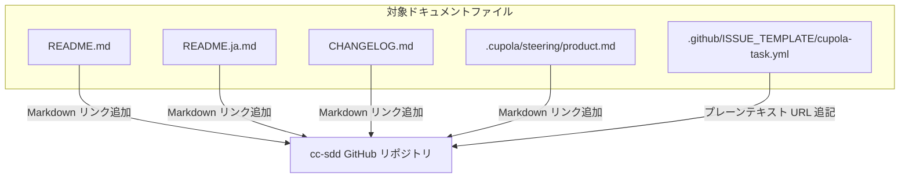

# Design Document: add-cc-sdd-links

## Overview

本フィーチャーは、プロジェクト内のドキュメントファイルに記載されている cc-sdd（外部ツール）への言及箇所に対して、GitHub リポジトリへの外部リンクを追加することで、利用者がツールの詳細を即座に参照できるようにする。

**Purpose**: 各ドキュメントの cc-sdd 言及箇所にリンクを追加し、利用者の情報アクセス性を向上させる。
**Users**: Cupola を利用する開発者・貢献者が、cc-sdd ツールの詳細を確認する際に活用する。
**Impact**: 5 つの既存ファイルに対して最小限の文字列変更のみを加える。コード・ロジック・構造への変更はない。

### Goals

- README.md, README.ja.md, CHANGELOG.md, .cupola/steering/product.md の初出箇所に `[cc-sdd](https://github.com/gotalab/cc-sdd)` 形式のリンクを追加する
- .github/ISSUE_TEMPLATE/cupola-task.yml の cc-sdd 言及箇所に URL を括弧付きで併記する
- 各ファイルの既存フォーマット・文体・インデントを維持する

### Non-Goals

- ソースコードファイル（`prompt.rs`, `init_file_generator.rs` 等）へのリンク追加
- 各ファイル内の初出以降の cc-sdd 言及へのリンク追加
- cc-sdd の説明文や内容の変更
- 本番コード用の新規ソースコードファイルの作成

## Requirements Traceability

| Requirement | Summary | 対象ファイル | 変更形式 |
|-------------|---------|------------|---------|
| 1.1 | README.md にリンク追加 | `README.md` L21 | Markdown リンク |
| 1.2 | README.ja.md にリンク追加 | `README.ja.md` L21 | Markdown リンク |
| 1.3 | CHANGELOG.md にリンク追加 | `CHANGELOG.md` L14 | Markdown リンク |
| 1.4 | steering/product.md にリンク追加 | `.cupola/steering/product.md` L3 | Markdown リンク |
| 2.1 | cupola-task.yml に URL 追記 | `.github/ISSUE_TEMPLATE/cupola-task.yml` L10 | プレーンテキスト URL |
| 2.2 | YAML 形式への対応 | `.github/ISSUE_TEMPLATE/cupola-task.yml` | 括弧付き URL 形式 |
| 3.1 | リンク URL の正確性 | 全対象ファイル | `https://github.com/gotalab/cc-sdd` |
| 3.2 | 既存フォーマットの維持 | 全対象ファイル | 最小限変更 |
| 3.3 | 初出箇所のみへの適用 | 全対象ファイル | 1ファイルにつき1箇所 |
| 3.4 | ソースコードは対象外 | ソースコードファイル | 変更なし |

## Architecture

### Existing Architecture Analysis

本フィーチャーは既存のドキュメントファイルへの文字列変更のみであり、Cupola のアプリケーションアーキテクチャ（Clean Architecture の各レイヤー）には一切影響しない。

### Architecture Pattern & Boundary Map

本フィーチャーはアーキテクチャの変更を伴わない Simple Addition であるため、コンポーネント図は省略する。変更範囲は以下の通り。

**Architecture Integration**:
- 選択パターン: Simple Addition（既存ファイルへの最小限変更）
- 既存パターン維持: 各ファイルのフォーマット・文体を厳守
- 新規コンポーネント: なし
- Steering コンプライアンス: プロジェクトのドキュメント構造に準拠

### Technology Stack

| Layer | Choice / Version | Role | Notes |
|-------|-----------------|------|-------|
| ドキュメント | Markdown (CommonMark) | リンク記法 `[text](url)` | README, CHANGELOG, product.md に適用 |
| テンプレート | YAML | プレーンテキスト URL 形式 | ISSUE_TEMPLATE に適用 |

## Components and Interfaces

### ドキュメントファイル変更

| ファイル | 変更種別 | 対応要件 | 変更内容 |
|---------|---------|---------|---------|
| `README.md` | 文字列置換 | 1.1, 3.1, 3.2, 3.3 | `Claude Code + cc-sdd to` → `Claude Code + [cc-sdd](https://github.com/gotalab/cc-sdd) to`（L21、初出箇所） |
| `README.ja.md` | 文字列置換 | 1.2, 3.1, 3.2, 3.3 | `Claude Code と cc-sdd を活用し` → `Claude Code と [cc-sdd](https://github.com/gotalab/cc-sdd) を活用し`（L21、初出箇所） |
| `CHANGELOG.md` | 文字列置換 | 1.3, 3.1, 3.2, 3.3 | `using cc-sdd` → `using [cc-sdd](https://github.com/gotalab/cc-sdd)` |
| `.cupola/steering/product.md` | 文字列置換 | 1.4, 3.1, 3.2, 3.3 | `Claude Code + cc-sdd to` → `Claude Code + [cc-sdd](https://github.com/gotalab/cc-sdd) to` |
| `.github/ISSUE_TEMPLATE/cupola-task.yml` | 文字列置換 | 2.1, 2.2, 3.1, 3.2 | `cc-sdd の requirements フェーズ` → `cc-sdd (https://github.com/gotalab/cc-sdd) の requirements フェーズ` |

#### ファイル別変更詳細

**README.md** (L21):

変更前: `Claude Code + cc-sdd to automate design and implementation`
変更後: `Claude Code + [cc-sdd](https://github.com/gotalab/cc-sdd) to automate design and implementation`

（L25 の `cc-sdd to automatically generate` および L44 の `cc-sdd (spec-driven development)` は初出以降のため変更しない）

**README.ja.md** (L21):

変更前: `Claude Code と cc-sdd を活用し設計から実装までを自動化する`
変更後: `Claude Code と [cc-sdd](https://github.com/gotalab/cc-sdd) を活用し設計から実装までを自動化する`

（L25 の `cc-sdd を使って` および L44 の `cc-sdd（仕様駆動開発）` は初出以降のため変更しない）

**CHANGELOG.md** (L14):

変更前: `using cc-sdd`
変更後: `using [cc-sdd](https://github.com/gotalab/cc-sdd)`

**.cupola/steering/product.md** (L3):

変更前: `driving Claude Code + cc-sdd to automate`
変更後: `driving Claude Code + [cc-sdd](https://github.com/gotalab/cc-sdd) to automate`

**.github/ISSUE_TEMPLATE/cupola-task.yml** (L10):

変更前: `cc-sdd の requirements フェーズの入力として使用されます。`
変更後: `cc-sdd (https://github.com/gotalab/cc-sdd) の requirements フェーズの入力として使用されます。`

## Error Handling

### Error Strategy

本フィーチャーはドキュメントファイルの静的変更のみであるため、実行時エラーは存在しない。品質保証は手動レビューおよびリンク URL の確認によって行う。

### Error Categories and Responses

- **リンク URL の誤り**: 変更後に `https://github.com/gotalab/cc-sdd` が正確であることを目視確認する
- **フォーマット破壊**: 変更前後で周辺のマークダウン構文（太字記号 `**`、括弧等）が保持されていることをレビューで確認する
- **初出箇所の誤り**: 各ファイルで最初に cc-sdd が登場する行のみを変更対象とすること

## Testing Strategy

### 検証チェックリスト

- **リンク URL 検証**: 追加した URL `https://github.com/gotalab/cc-sdd` が正確であること
- **Markdown 構文**: 変更後も各ファイルの Markdown 構文が正しいこと（bold 記法、リンク記法の閉じ忘れなし）
- **YAML 構文**: `cupola-task.yml` の変更後も YAML として有効であること
- **初出箇所のみ**: 各ファイル内で cc-sdd へのリンクが1箇所のみ追加されていること
- **スコープ外のファイル**: ソースコードファイル（`.rs` 等）に変更がないこと
- **フォーマット維持**: 各ファイルの既存インデント・改行・文体が変更前後で一致すること
