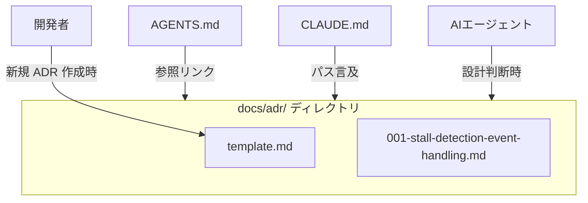

# 技術設計書: ADR（Architecture Decision Records）整備

## Overview

本フィーチャーは、Cupola プロジェクトにおける設計上の意思決定を記録・共有するための ADR 基盤を整備する。過去の議論が繰り返されることを防ぎ、人間・AIエージェント双方が設計判断の経緯を参照できる状態を実現する。

**Purpose**: ADR ディレクトリ・テンプレート・初回 ADR を作成し、`AGENTS.md` および `CLAUDE.md` に参照を追加することで、設計判断の透明性と再利用性を確保する。

**Users**: 開発者（人間）および Claude Code・Cupola などの AIエージェントが設計判断時に参照する。

**Impact**: 新たに `docs/adr/` ディレクトリを導入し、`AGENTS.md` と `CLAUDE.md` に ADR 参照リンクを追記する。既存コードへの変更はない。

### Goals

- 設計判断の記録体制を確立し、同じ議論の繰り返しを防ぐ
- AIエージェントが自律的に ADR を参照できるよう誘導する
- 将来の ADR 追加を容易にするテンプレートを提供する

### Non-Goals

- ADR の自動生成・検索機能（将来課題）
- 既存の設計判断の遡及的な ADR 化（001 以外は対象外）
- Rust コードや既存ロジックの変更

## 要件トレーサビリティ

| 要件 | 概要 | コンポーネント | インターフェース | フロー |
|------|------|----------------|------------------|--------|
| 1.1, 1.2, 1.3 | ADR ディレクトリ構造の作成 | `docs/adr/` ディレクトリ | ファイルシステム | — |
| 2.1, 2.2, 2.3, 2.4 | ADR テンプレートの作成 | `docs/adr/template.md` | Markdown ファイル | — |
| 3.1〜3.7 | 最初の ADR（001）の作成 | `docs/adr/001-stall-detection-event-handling.md` | Markdown ファイル | — |
| 4.1, 4.2, 4.3 | AGENTS.md への ADR 参照追加 | `AGENTS.md`（更新） | Markdown ファイル | — |
| 5.1, 5.2, 5.3 | CLAUDE.md への ADR 言及追加 | `CLAUDE.md`（更新） | Markdown ファイル | — |

## Architecture

### Existing Architecture Analysis

- `AGENTS.md` は「Quality Check」セクション（cargo コマンド一覧）のみを持つ単純なファイル
- `CLAUDE.md` は「Project Context > Paths」に `Steering` と `Specs` のパスが既に記載されている
- `docs/` ディレクトリは現時点で存在しないため、本フィーチャーで新規作成する

### Architecture Pattern & Boundary Map

- **選択パターン**: 静的ドキュメント集約（ファイルシステムベース）
- **既存パターンの維持**: Markdown ベースのドキュメント管理（steering との整合）
- **新規コンポーネントの根拠**: `docs/adr/` は業界標準配置であり、Issue の要件と合致する

### Technology Stack

| レイヤー | 選択 | 本フィーチャーでの役割 | 備考 |
|----------|------|------------------------|------|
| ドキュメント形式 | Markdown | ADR・テンプレートのファイル形式 | プロジェクト全体の共通フォーマット |
| ファイル配置 | `docs/adr/` | ADR の格納先 | GitHub での標準的配置 |

## Components and Interfaces

### コンポーネント一覧

| コンポーネント | 種別 | 目的 | 要件カバレッジ | 主な依存 |
|----------------|------|------|----------------|----------|
| `docs/adr/` ディレクトリ | ファイルシステム | ADR の格納場所 | 1.1, 1.2, 1.3 | — |
| `docs/adr/template.md` | ドキュメントファイル | ADR 作成テンプレート | 2.1〜2.4 | — |
| `docs/adr/001-stall-detection-event-handling.md` | ドキュメントファイル | 初回 ADR | 3.1〜3.7 | `template.md` |
| `AGENTS.md`（更新） | ドキュメントファイル | AIエージェントへの ADR 参照誘導 | 4.1〜4.3 | `docs/adr/` |
| `CLAUDE.md`（更新） | ドキュメントファイル | Claude Code への ADR パス提示 | 5.1〜5.3 | `docs/adr/` |

---

### ドキュメント層

#### `docs/adr/template.md`

| フィールド | 詳細 |
|------------|------|
| Intent | 新規 ADR 作成時のコピー元テンプレートを提供する |
| 要件 | 2.1, 2.2, 2.3, 2.4 |

**責務と制約**
- 以下の 6 セクションをすべて含む:
  1. `# ADR-NNN: タイトル`（ファイル名に対応する連番）
  2. `## ステータス`（有効値: `Accepted` / `Superseded` / `Deprecated`）
  3. `## コンテキスト`（何が問題だったか）
  4. `## 決定`（何を選んだか）
  5. `## 理由`（なぜその選択をしたか）
  6. `## 却下した代替案`（何を検討して、なぜ却下したか）
- 各セクションに記載内容のガイドコメントを含める
- ファイル命名規則（`NNN-kebab-case-title.md`）を冒頭に明記する

**依存関係**
- 外部依存なし

**コントラクト**: ドキュメントファイル [x]

**実装ノート**
- Integration: 新規 ADR 作成時はこのファイルをコピーし、`NNN` を次の連番に置き換える
- Validation: 全セクションの存在をレビュー時に確認する
- Risks: テンプレートの変更は既存 ADR に影響しない（コピーベースのため）

---

#### `docs/adr/001-stall-detection-event-handling.md`

| フィールド | 詳細 |
|------------|------|
| Intent | `step5_stall_detection` におけるイベント処理設計の判断を記録する |
| 要件 | 3.1, 3.2, 3.3, 3.4, 3.5, 3.6, 3.7 |

**責務と制約**

記録する内容：

| セクション | 内容 |
|------------|------|
| タイトル | ADR-001: step5_stall_detection でイベントを即時生成しない理由 |
| ステータス | Accepted |
| コンテキスト | stall kill 後のイベント処理方式（即時 push vs. 次サイクル step3 委譲）の選択問題 |
| 決定 | stall kill 後のイベントは次サイクルの step3 で一元処理する |
| 理由 | 即時方式（方式A）では `ProcessFailed → DesignRunning → DesignRunning` 自己遷移が発生し、stale exit guard が無効化され、step3 で `ProcessFailed` が再発火して `retry_count` が二重インクリメントされるバグが生じる |
| 却下した代替案 | 方式A: step5 で `ProcessFailed` を即時 push する方式 — 上記バグのため却下 |

**実装ノート**
- Integration: `template.md` のフォーマットに準拠する
- Validation: ステータスが `Accepted` であること、全 6 セクションが揃っていることを確認する
- Risks: 記述内容は Issue #169 の要件に基づき固定されており、技術的な誤りが混入するリスクは低い

---

#### `AGENTS.md`（更新）

| フィールド | 詳細 |
|------------|------|
| Intent | AIエージェントが設計判断時に ADR を参照できるよう誘導する |
| 要件 | 4.1, 4.2, 4.3 |

**責務と制約**
- 既存の「Quality Check」セクションの構造を破壊しない
- 新セクション「Design References」を追加し、以下を記載する:
  - `docs/adr/` へのリンク
  - 設計・実装判断時に ADR を参照すべき旨の説明

**実装ノート**
- Integration: ファイル末尾に新セクションを追加する
- Validation: 既存セクション（Quality Check）が維持されていることを確認する
- Risks: なし

---

#### `CLAUDE.md`（更新）

| フィールド | 詳細 |
|------------|------|
| Intent | Claude Code セッション開始時に ADR の存在と参照先を把握させる |
| 要件 | 5.1, 5.2, 5.3 |

**責務と制約**
- 既存の「Project Context > Paths」セクションに `ADR: docs/adr/` を追記する
- 設計判断時に参照すること、という説明を含める
- 既存の構造・フォーマットを維持する

**実装ノート**
- Integration: `Paths` セクションに 1 行追加するのみ
- Validation: 既存の Paths エントリ（Steering / Specs）が維持されていることを確認する
- Risks: なし

## Testing Strategy

### ドキュメントレビュー

- **テンプレート確認**: `template.md` に 6 セクション全てが含まれているか
- **ADR 001 確認**: 要件 3.1〜3.7 の全項目が記録されているか
- **AGENTS.md 確認**: 「Quality Check」セクションが維持され、ADR 参照が追加されているか
- **CLAUDE.md 確認**: `Paths` セクションに `docs/adr/` が追記されているか
- **ファイル命名確認**: `001-stall-detection-event-handling.md` というファイル名が規則に準拠しているか

## Error Handling

### エラー戦略

本フィーチャーはドキュメント追加のみであり、ランタイムエラーは発生しない。レビュー時のチェックポイントを以下に示す。

### エラーカテゴリと対応

| 状況 | 対応 |
|------|------|
| セクション欠落 | 該当セクションを追記する |
| ファイル命名不正 | `NNN-kebab-case-title.md` 形式に修正する |
| AGENTS.md / CLAUDE.md の構造破損 | git diff で変更差分を確認し、追記のみであることを検証する |
