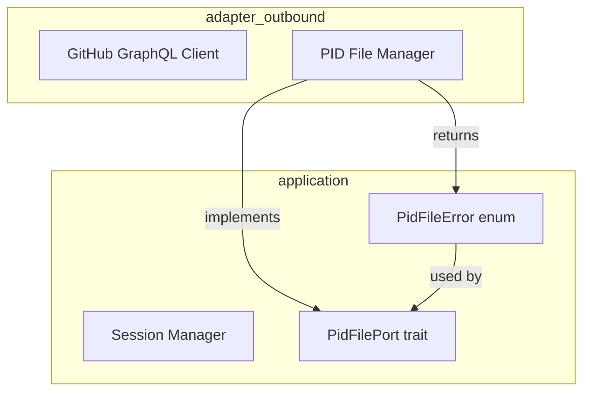
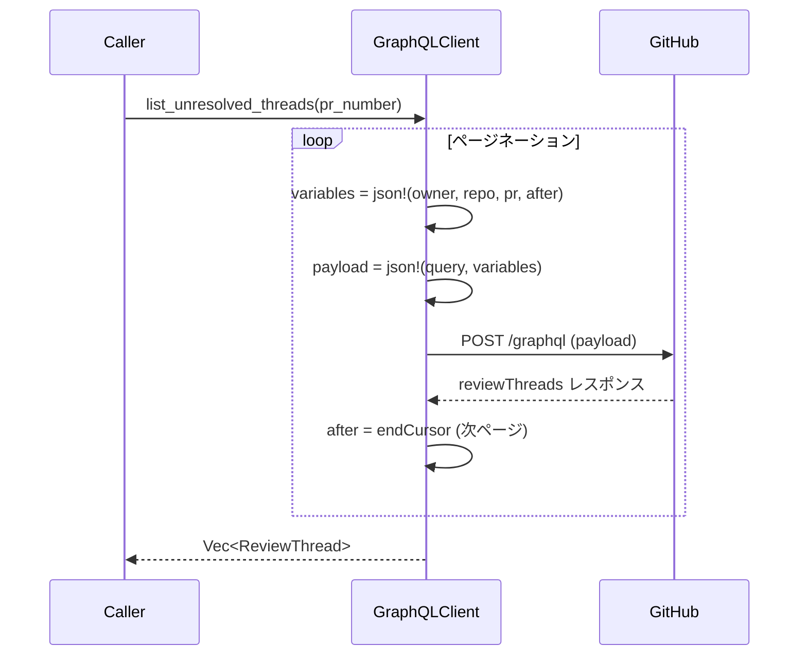
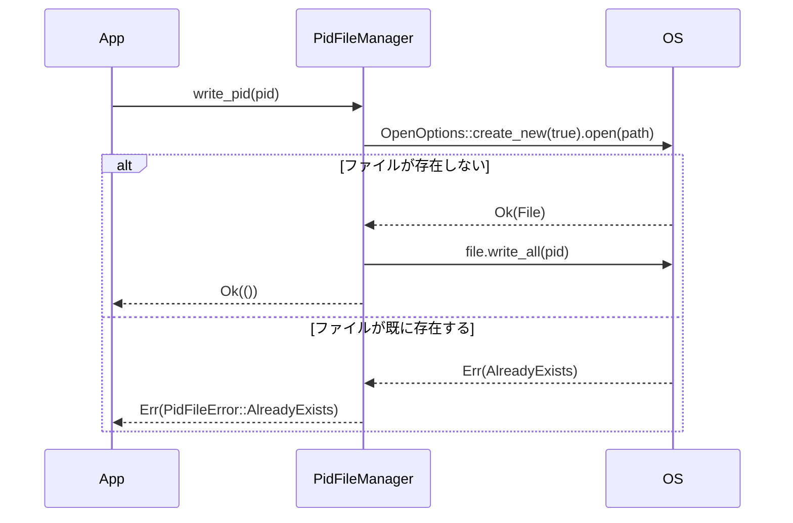

# Design Document: bugfix-graphql-session-pid

## Overview

本ドキュメントは、Cupolaシステムにおける3件のMediumバグ修正の技術設計を定義する。

**Purpose**: GraphQLインジェクションリスクの排除・孤児プロセスの防止・PIDファイル競合状態の解消を実現する。

**Users**: Cupolaを運用する開発者が対象。修正はシステムの安定性・安全性に直結する。

**Impact**: アダプタ層（GraphQL クライアント・PID ファイルマネージャ）とアプリケーション層（セッションマネージャ）の3コンポーネントを修正する。ドメイン層への変更はない。

### Goals

- GraphQL クエリへの直接文字列補間をなくし、variables 形式に統一する（1.1〜1.4）
- 同一 issue_id への二重 `register()` 時に旧プロセスを kill し、孤児化を防止する（2.1〜2.4）
- PID ファイルの書き込みを O_EXCL 相当でアトミック化し、二重起動を防止する（3.1〜3.5）

### Non-Goals

- GraphQL クライアント全体のリファクタリング
- セッションマネージャの並行セッション数管理ロジックの変更
- PID ファイル以外の二重起動防止機構の導入

## Architecture

### Existing Architecture Analysis

変更対象は以下の3コンポーネントであり、すべて既存のClean Architectureレイヤーに収まる。

- **adapter/outbound**: `github_graphql_client.rs`（M1）、`pid_file_manager.rs`（M3）
- **application**: `session_manager.rs`（M2）
- **application/port**: `pid_file.rs` の `PidFileError`（M3 のエラー型拡張）

### Architecture Pattern & Boundary Map



**Architecture Integration**:
- 既存のClean Architectureパターンを維持。依存方向（adapter → application → domain）は変更しない
- `PidFileError` への `AlreadyExists` バリアント追加は application/port 層のみに閉じた変更
- GraphQL クライアントの変更は adapter/outbound 層のみ
- セッションマネージャの変更は application 層のみ

### Technology Stack

| Layer | Choice / Version | Role in Feature | Notes |
|-------|------------------|-----------------|-------|
| Backend | Rust (Edition 2024) | 全修正対象 | |
| GitHub GraphQL | reqwest + serde_json | M1: variables 送信 | `json!` マクロ使用 |
| プロセス管理 | std::process::Child | M2: 旧プロセス kill | `Child::kill()` |
| ファイルI/O | std::fs::OpenOptions | M3: 排他的ファイル作成 | `create_new(true)` |

## System Flows

### M1: GraphQL Variables 形式でのリクエスト送信



### M3: PID ファイル排他的作成フロー



## Requirements Traceability

| Requirement | Summary | Components | Interfaces | Flows |
|-------------|---------|------------|------------|-------|
| 1.1 | list_unresolved_threads が variables 経由で送信する | GitHub GraphQL Client | `execute_raw` / variables payload | M1 シーケンス |
| 1.2 | reply_to_thread・resolve_thread と同形式を使用 | GitHub GraphQL Client | `execute_raw` | M1 シーケンス |
| 1.3 | クエリ文字列に owner/repo/pr_number を含まない | GitHub GraphQL Client | GraphQL query string | — |
| 1.4 | 既存テストが variables 形式でもパス | GitHub GraphQL Client | テストモック | — |
| 2.1 | 二重 register 時に旧 Child を kill してから登録 | Session Manager | `register()` | — |
| 2.2 | kill 失敗時はエラーを無視して登録続行 | Session Manager | `register()` | — |
| 2.3 | 既存セッションなし時は既存動作と同等 | Session Manager | `register()` | — |
| 2.4 | 旧プロセスが kill されることをテストで検証 | Session Manager | テスト | — |
| 3.1 | `create_new(true)` で排他的にファイル作成 | PID File Manager | `write_pid()` | M3 シーケンス |
| 3.2 | ファイル既存時は AlreadyExists エラーを返す | PID File Manager / PidFileError | `write_pid()` | M3 シーケンス |
| 3.3 | stale クリーンアップ後は正常に作成できる | PID File Manager | `write_pid()` | M3 シーケンス |
| 3.4 | TOCTOU 競合がない設計を保証 | PID File Manager | `write_pid()` | M3 シーケンス |
| 3.5 | ファイル既存時のエラーをテストで検証 | PID File Manager | テスト | — |

## Components and Interfaces

### コンポーネントサマリー

| Component | Layer | Intent | Req Coverage | Key Dependencies |
|-----------|-------|--------|--------------|-----------------|
| GitHub GraphQL Client | adapter/outbound | GraphQLクエリのvariables化 | 1.1〜1.4 | reqwest, serde_json (P0) |
| Session Manager | application | 旧セッション kill + 新セッション登録 | 2.1〜2.4 | std::process::Child (P0) |
| PID File Manager | adapter/outbound | 排他的PIDファイル作成 | 3.1〜3.5 | std::fs::OpenOptions (P0) |
| PidFileError | application/port | AlreadyExists バリアント追加 | 3.2 | thiserror (P0) |

### adapter/outbound

#### GitHub GraphQL Client

| Field | Detail |
|-------|--------|
| Intent | `list_unresolved_threads` をvariables形式に変更し、文字列補間を排除する |
| Requirements | 1.1, 1.2, 1.3, 1.4 |

**Responsibilities & Constraints**

- `list_unresolved_threads` 内のページネーションループで、`owner`・`repo`・`pr_number`・`after`（nullable）をGraphQL variablesとして組み立てる
- クエリ文字列はstatic strとし、値の埋め込みを一切行わない
- `execute_raw` を直接呼ぶことで `reply_to_thread`・`resolve_thread` と同一パターンを維持する

**Dependencies**

- Outbound: GitHub GraphQL API — HTTPリクエスト送信 (P0)
- Internal: `execute_raw` — GraphQLペイロード送信 (P0)

**Contracts**: Service [x]

##### Service Interface

```
// 変更前 (概念)
async fn list_unresolved_threads(&self, pr_number: u64) -> Result<Vec<ReviewThread>>
// シグネチャは変更なし。内部実装のみ変更。

// ペイロード構造 (変更後)
payload = {
  "query": "<static query string with $owner/$repo/$pr/$after variables>",
  "variables": {
    "owner": String,
    "repo": String,
    "pr": u64,
    "after": String | null
  }
}
```

- Preconditions: `self.owner`・`self.repo` が非空文字列である
- Postconditions: クエリ文字列に owner/repo/pr_number のリテラル値を含まない
- Invariants: ページネーションカーソルが null の場合は最初のページを取得する

**Implementation Notes**

- Integration: `execute_query` ではなく `execute_raw` を直接呼び、`check_graphql_errors` は呼び出し元で実行する
- Validation: `after` は `Option<String>` を `Value::Null` または `Value::String` に変換する
- Risks: GitHub GraphQL API の `after: String` (nullable) と `after: String!` (non-null) の区別に注意。スキーマ上は nullable であることを確認済み

#### PID File Manager

| Field | Detail |
|-------|--------|
| Intent | `write_pid` を O_EXCL 相当の排他的作成に変更し、TOCTOU を排除する |
| Requirements | 3.1, 3.2, 3.3, 3.4, 3.5 |

**Responsibilities & Constraints**

- `write_pid` は `OpenOptions::new().write(true).create_new(true).open(path)` でファイルを開く
- ファイルが既存の場合は `PidFileError::AlreadyExists` を返す
- stale PID クリーンアップ（`delete_pid`）後に呼ばれた場合は正常に作成できる
- `read_pid`・`delete_pid`・`is_process_alive` のシグネチャは変更しない

**Dependencies**

- External: std::fs::OpenOptions — O_EXCL相当の排他的ファイル作成 (P0)

**Contracts**: Service [x]

##### Service Interface

```
// PidFilePort トレイト（変更なし）
fn write_pid(&self, pid: u32) -> Result<(), PidFileError>;

// PidFileError（変更あり）
pub enum PidFileError {
    Write(String),        // 既存
    Read(String),         // 既存
    Delete(String),       // 既存
    InvalidContent(String), // 既存
    AlreadyExists,        // 新規追加: ファイルが既に存在する場合
}

// write_pid の内部実装方針
// 1. OpenOptions::new().write(true).create_new(true).open(&self.pid_file_path)
// 2. ErrorKind::AlreadyExists → PidFileError::AlreadyExists
// 3. その他エラー → PidFileError::Write
// 4. 成功 → file.write_all(format!("{pid}\n").as_bytes())
```

- Preconditions: `pid_file_path` の親ディレクトリが存在する
- Postconditions: 成功時はPIDファイルが作成され `pid\n` が書き込まれる
- Invariants: ファイルが既存の場合は絶対に上書きしない

**Implementation Notes**

- Integration: `bootstrap/app.rs` の呼び出し元が `PidFileError::AlreadyExists` を処理する必要がある（「別のプロセスが起動中」のメッセージ表示）
- Validation: `create_new(true)` はOSレベルのアトミック操作のため、アプリケーション層での追加チェックは不要
- Risks: `PidFileError` が non-exhaustive でないため、既存の `match` 文が新バリアント追加でコンパイルエラーになる。実装時に全ての match を更新する

### application

#### Session Manager

| Field | Detail |
|-------|--------|
| Intent | `register()` で既存セッションを kill してから新セッションを登録する |
| Requirements | 2.1, 2.2, 2.3, 2.4 |

**Responsibilities & Constraints**

- `register()` 冒頭で同一 `issue_id` の既存エントリを `sessions.remove()` で取得する
- 取得できた場合は `old_entry.child.kill()` を呼び、`let _ =` でエラーを無視する
- 既存エントリがない場合は変更前と同等の動作を行う
- セッション登録ロジック（stdout/stderr スレッド起動・`SessionEntry` 構築）は変更しない

**Dependencies**

- Internal: `std::process::Child::kill()` — プロセス終了 (P0)
- Internal: `HashMap::remove()` — 旧エントリ取得と削除 (P0)

**Contracts**: Service [x]

##### Service Interface

```
// シグネチャ変更なし
pub fn register(&mut self, issue_id: i64, state: State, child: Child)

// 変更後の処理順序:
// 1. sessions.remove(&issue_id) で旧エントリ取得
// 2. Some(old) の場合: let _ = old.child.kill()
// 3. child の stdout/stderr を take() してスレッド起動
// 4. sessions.insert(issue_id, SessionEntry { ... })
```

- Preconditions: なし（冪等性を持つ）
- Postconditions: `issue_id` に対して新しい `SessionEntry` が登録されている
- Invariants: 旧プロセスの kill 失敗は新セッション登録を妨げない

**Implementation Notes**

- Integration: 呼び出し元（`polling_use_case.rs`）のシグネチャ変更は不要
- Validation: `kill()` の戻り値は `let _ =` で破棄する（孤児化よりkill失敗の無視を優先）
- Risks: `old.child` は `mut` である必要があるため、`remove` の戻り値の型を確認すること（`SessionEntry` の `child` フィールドは既に `Child` 型で非参照）

## Error Handling

### Error Strategy

各修正における新規エラーパスの処理方針を定義する。

### Error Categories and Responses

**M1 (GraphQL variables 化)**
- エラーなし（既存の `execute_raw`・`check_graphql_errors` エラーハンドリングを流用）

**M2 (旧セッション kill)**
- `Child::kill()` 失敗: `let _ =` で無視し、新セッション登録を続行する

**M3 (PID ファイル AlreadyExists)**
- `PidFileError::AlreadyExists`: 呼び出し元（`app.rs`）でエラーメッセージ「cupola is already running」を表示してプロセスを終了する
- `PidFileError::Write`: 既存の処理（エラー伝播）を継続する

### Monitoring

既存の `tracing` ロギングを活用。M2 の kill 失敗は `tracing::warn!` で記録することを推奨する（実装者判断）。

## Testing Strategy

### Unit Tests

各モジュールの `#[cfg(test)] mod tests` に追加する。

**M1 (GitHub GraphQL Client)**:
- `list_unresolved_threads` の variables ペイロードが正しいフォーマットであることを `execute_raw` のモックで検証
- ページネーションカーソルが variables に含まれることを検証
- クエリ文字列に owner/repo/pr_number が含まれないことを検証

**M2 (Session Manager)**:
- 同一 `issue_id` へ二重 `register()` した後、旧プロセスが終了（kill）されていることを確認
- 旧セッションなしの場合は既存動作と同等であることを確認
- `spawn_sleep` を使い、kill 後に `try_wait` が `Some` を返すことを検証

**M3 (PID File Manager)**:
- `write_pid` 後に同じパスで再度 `write_pid` を呼ぶと `PidFileError::AlreadyExists` が返ることを検証
- `delete_pid` 後に `write_pid` が成功することを検証
- 既存テストが引き続きパスすることを確認

### Integration Tests

- 既存の統合テスト（`tests/` 以下）が変更後もパスすることを確認
- `PidFileError::AlreadyExists` を処理する `app.rs` の呼び出し経路のスモークテスト

## Security Considerations

M1 の variables 化により、`owner`・`repo`・`pr_number` がGraphQLクエリの文字列補間から除外される。悪意のある値による GraphQL インジェクションのリスクを排除する。ただし、これらの値はすでに設定ファイルから取得しており、外部入力ではないため、実害のあるリスクは現時点で低い。
