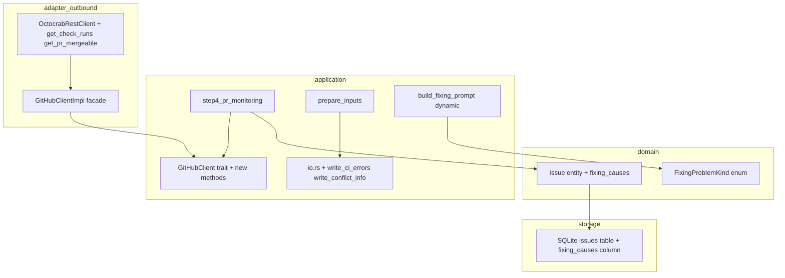
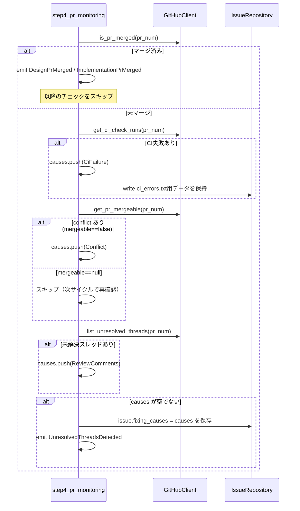
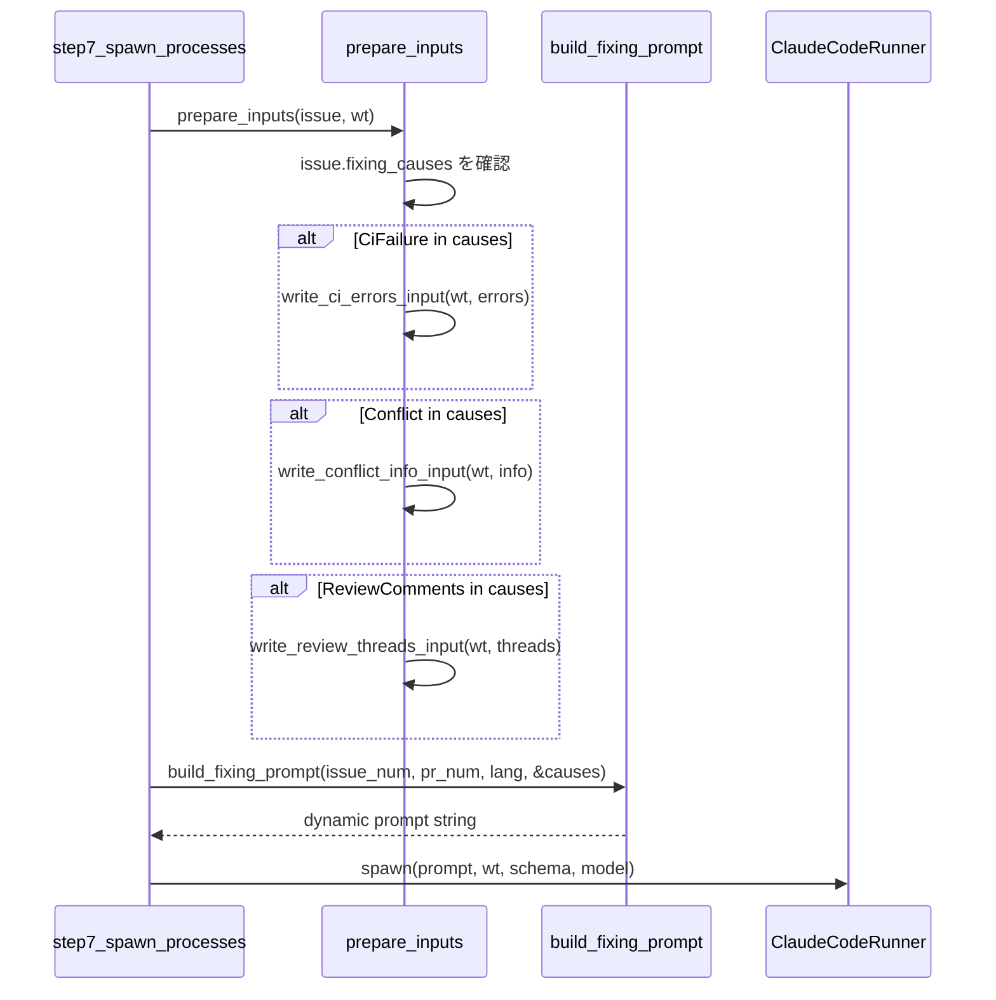

# Technical Design: ci-conflict-fixing-trigger

## Overview

cupola の `review_waiting` 状態において、PRのCI失敗およびconflictを自動検知し、問題種別に応じたfixingプロンプトと入力ファイルを準備して `fixing` 状態へ遷移させる機能拡張。

**Purpose**: CI失敗・conflictを検知することで、現在の review thread のみを対象とした監視を拡張し、PRの品質問題を包括的に自動修正サイクルへ組み込む。

**Users**: cupola を使用して GitHub Issues・PRsベースの開発を自動化する個人・小チーム。

**Impact**: `step4_pr_monitoring` の判定ロジックを拡張し、`Issue` エンティティに `fixing_causes` を追加。`build_fixing_prompt` を動的生成へ変更。新たなGitHub API呼び出し2種を追加。

### Goals
- CI失敗・conflictを `review_waiting` サイクルで自動検知し、`fixing` 遷移をトリガーする
- 複数問題が同時発生した場合に1回の `fixing` セッションで全問題の修正指示をまとめる
- `build_fixing_prompt` を問題種別リストに基づく動的生成へ移行する

### Non-Goals
- CI の再実行トリガー（push時に自動再実行される）
- merge conflict 解消戦略の自動選択（Claude Code に委任）
- CI 設定ファイルの自動修正
- `DesignReviewWaiting` 限定 vs `ImplementationReviewWaiting` 限定の区別なし（両方に適用）

## Architecture

### Existing Architecture Analysis

現在の `step4_pr_monitoring` は以下の2チェックのみ実行:
1. `is_pr_merged` → マージ済みなら `DesignPrMerged` / `ImplementationPrMerged` イベントを発行
2. `list_unresolved_threads` → 未解決スレッドがあれば `UnresolvedThreadsDetected` を発行

問題種別は `Event::UnresolvedThreadsDetected` という単一イベントで表現されており、複数問題の同時伝達機構が存在しない。`build_fixing_prompt` は問題種別に関わらず review_threads.json のみを参照するプロンプトを静的に生成している。

### Architecture Pattern & Boundary Map



**Architecture Integration**:
- 選択パターン: 既存のClean Architecture拡張（Extension）
- ドメイン境界: `FixingProblemKind` はpure domain型。I/Oや外部依存なし
- 既存パターン保持: `GitHubClient` traitのfacadeパターン、`io.rs` の入力ファイル書き出しパターン
- 新コンポーネント: `FixingProblemKind` enum、`Issue.fixing_causes` フィールド
- Steering準拠: domain→application→adapter の依存方向を維持

### Technology Stack

| Layer | Choice / Version | Role in Feature | Notes |
|-------|------------------|-----------------|-------|
| Backend / Services | Rust (Edition 2024) + tokio | 非同期pollingループ拡張 | 変更なし |
| GitHub API | reqwest (直接REST) | CI check-runs API呼び出し | octocrab非対応のため |
| GitHub API | octocrab | PR mergeable フィールド取得 | 既存 `get(pr_num)` 流用 |
| Data / Storage | SQLite (rusqlite) | fixing_causes カラム追加 | JSON配列としてシリアライズ |
| Serialization | serde + serde_json | FixingProblemKind JSON変換 | 既存パターン踏襲 |

## System Flows

### step4 判定フロー（優先順位制御）



### fixingプロセス起動フロー



## Requirements Traceability

| Requirement | Summary | Components | Interfaces | Flows |
|-------------|---------|------------|------------|-------|
| 1.1 | CI チェックを polling で確認 | step4_pr_monitoring | GitHubClient::get_ci_check_runs | step4判定フロー |
| 1.2 | CI失敗時にfixing遷移 | step4_pr_monitoring | event: UnresolvedThreadsDetected | step4判定フロー |
| 1.3 | CI エラーログを ci_errors.txt に書き出し | prepare_inputs, io.rs | write_ci_errors_input | fixingプロセス起動フロー |
| 1.4 | Checks API 失敗時はスキップ | step4_pr_monitoring | GitHubClient::get_ci_check_runs | step4判定フロー |
| 1.5 | API コールを +2回/サイクル以内に収める | step4_pr_monitoring | — | step4判定フロー |
| 2.1 | mergeable フィールドを polling で確認 | step4_pr_monitoring | GitHubClient::get_pr_mergeable | step4判定フロー |
| 2.2 | conflict 時に fixing 遷移 | step4_pr_monitoring | event: UnresolvedThreadsDetected（fixing 遷移の汎用トリガー。threads, CI, conflict など複数原因で発火しうる） | step4判定フロー |
| 2.3 | conflict 情報を conflict_info.txt に書き出し | prepare_inputs, io.rs | write_conflict_info_input | fixingプロセス起動フロー |
| 2.4 | mergeable==null はスキップ | step4_pr_monitoring | GitHubClient::get_pr_mergeable | step4判定フロー |
| 2.5 | conflict_info.txt にブランチ名を含める | io.rs | write_conflict_info_input | fixingプロセス起動フロー |
| 3.1 | 優先順位: merge > CI失敗 > conflict > review | step4_pr_monitoring | — | step4判定フロー |
| 3.2 | マージ済みは即完了、他チェックスキップ | step4_pr_monitoring | — | step4判定フロー |
| 3.3 | CI失敗後も conflict・thread 確認継続 | step4_pr_monitoring | — | step4判定フロー |
| 3.4 | conflict後も thread 確認継続 | step4_pr_monitoring | — | step4判定フロー |
| 3.5 | 複数問題を1回のfixing遷移にまとめる | step4_pr_monitoring, Issue.fixing_causes | — | step4判定フロー |
| 4.1 | 問題種別リストを引数に動的プロンプト生成 | build_fixing_prompt | FixingProblemKind | fixingプロセス起動フロー |
| 4.2 | review_comments 時の指示 | build_fixing_prompt | FixingProblemKind::ReviewComments | fixingプロセス起動フロー |
| 4.3 | ci_failure 時の指示 | build_fixing_prompt | FixingProblemKind::CiFailure | fixingプロセス起動フロー |
| 4.4 | conflict 時の指示 | build_fixing_prompt | FixingProblemKind::Conflict | fixingプロセス起動フロー |
| 4.5 | 複数問題の指示を全て含む単一プロンプト | build_fixing_prompt | FixingProblemKind | fixingプロセス起動フロー |
| 4.6 | build_fixing_prompt を動的生成方式へ変更 | prompt.rs | — | fixingプロセス起動フロー |
| 5.1 | CI失敗時にファイル存在確認後プロセス起動 | prepare_inputs | — | fixingプロセス起動フロー |
| 5.2 | conflict時にファイル存在確認後プロセス起動 | prepare_inputs | — | fixingプロセス起動フロー |
| 5.3 | ファイル書き出しは遷移前に完了 | step4_pr_monitoring, prepare_inputs | — | step4判定フロー |
| 5.4 | ファイル書き出し失敗時は遷移中止 | prepare_inputs | — | fixingプロセス起動フロー |
| 5.5 | 正常完了時は retry_count を増加させない | step3, transition_use_case | — | — |

## Components and Interfaces

| Component | Domain/Layer | Intent | Req Coverage | Key Dependencies | Contracts |
|-----------|--------------|--------|--------------|------------------|-----------|
| FixingProblemKind | domain | 問題種別の型安全な表現 | 4.1, 4.2, 4.3, 4.4 | serde | State |
| Issue.fixing_causes | domain | 現在のfixingセッションで対応すべき問題種別リスト | 3.5, 4.1 | FixingProblemKind | State |
| GitHubClient::get_ci_check_runs | application/port | CI check-runs取得ポート定義 | 1.1, 1.2, 1.3 | — | Service |
| GitHubClient::get_pr_mergeable | application/port | PR mergeable フィールド取得ポート定義 | 2.1, 2.2 | — | Service |
| step4_pr_monitoring | application | CI/conflict/review thread 検知と問題収集 | 1.1-1.5, 2.1-2.5, 3.1-3.5 | GitHubClient, IssueRepository | Batch |
| write_ci_errors_input | application/io | CI エラーログを ci_errors.txt へ書き出し | 1.3 | fs | Batch |
| write_conflict_info_input | application/io | conflict情報を conflict_info.txt へ書き出し | 2.3, 2.5 | fs | Batch |
| build_fixing_prompt (updated) | application/prompt | 問題種別リストに基づく動的プロンプト生成 | 4.1-4.6 | FixingProblemKind | Service |
| prepare_inputs (updated) | application | fixing_causesに基づく入力ファイル準備 | 5.1-5.4 | io.rs | Batch |
| OctocrabRestClient (extended) | adapter/outbound | get_check_runs/get_pr_mergeable の REST 実装 | 1.1, 2.1 | reqwest, octocrab | Service |

### Domain Layer

#### FixingProblemKind

| Field | Detail |
|-------|--------|
| Intent | fixing セッションで対応すべき問題の種別を表す値型 |
| Requirements | 4.1, 4.2, 4.3, 4.4, 4.5 |

**Responsibilities & Constraints**
- 問題種別を列挙型で網羅的に表現（exhaustive match を強制）
- serde による JSON シリアライズ（SQLite保存・deserialize用）
- 外部依存なし（derive macros のみ許可）

**Contracts**: State [x]

##### State Management
```rust
// src/domain/fixing_problem_kind.rs
#[derive(Debug, Clone, PartialEq, Eq, serde::Serialize, serde::Deserialize)]
#[serde(rename_all = "snake_case")]
pub enum FixingProblemKind {
    ReviewComments,
    CiFailure,
    Conflict,
}
```
- State model: 不変値型（変更なし）
- Persistence: `Issue.fixing_causes` フィールドに JSON 配列として保存
- Concurrency strategy: 不変のためなし

**Implementation Notes**
- Integration: `domain/mod.rs` に `pub mod fixing_problem_kind;` を追加

#### Issue（更新）

| Field | Detail |
|-------|--------|
| Intent | `fixing_causes` フィールドを追加して現在のfixingセッションの問題種別リストを保持 |
| Requirements | 3.5, 4.1, 5.1, 5.2 |

**Contracts**: State [x]

##### State Management
```rust
// src/domain/issue.rs（追加フィールド）
pub struct Issue {
    // ... 既存フィールド ...
    pub fixing_causes: Vec<FixingProblemKind>,  // 新規追加（デフォルト: 空ベクタ）
}
```
- Persistence: SQLite `issues` テーブルに `fixing_causes TEXT NOT NULL DEFAULT '[]'` カラムを追加
- スキーマ変更: `ALTER TABLE issues ADD COLUMN fixing_causes TEXT NOT NULL DEFAULT '[]'`

### Application Layer

#### GitHubClient trait（port追加）

| Field | Detail |
|-------|--------|
| Intent | CI check-runs と PR mergeable 情報取得のための新ポート定義 |
| Requirements | 1.1, 1.2, 2.1, 2.2 |

**Contracts**: Service [x]

##### Service Interface
```rust
// src/application/port/github_client.rs（追加）

#[derive(Debug, Clone)]
pub struct GitHubCheckRun {
    pub id: u64,
    pub name: String,
    pub conclusion: Option<String>,  // "success" | "failure" | "neutral" | ...
    pub status: String,              // "completed" | "in_progress" | "queued"
}

pub trait GitHubClient: Send + Sync {
    // ... 既存メソッド ...

    /// PRのCIチェック結果を取得する。失敗したcheck-runのログを含む。
    fn get_ci_check_runs(
        &self,
        pr_number: u64,
    ) -> impl std::future::Future<Output = Result<Vec<GitHubCheckRun>>> + Send;

    /// PRのmergeable状態を取得する。None はGitHubが計算中を意味する。
    fn get_pr_mergeable(
        &self,
        pr_number: u64,
    ) -> impl std::future::Future<Output = Result<Option<bool>>> + Send;
}
```
- Preconditions: `pr_number` は存在するPR番号
- Postconditions: `get_ci_check_runs` はstatusが"completed"のrun結果のみ返す
- Invariants: API失敗時は `Err(_)` を返す（panicしない）

#### step4_pr_monitoring（更新）

| Field | Detail |
|-------|--------|
| Intent | CI失敗・conflict・reviewスレッドを優先順位順に検知し、問題種別を収集してfixing遷移を発行 |
| Requirements | 1.1-1.5, 2.1-2.5, 3.1-3.5, 5.3 |

**Contracts**: Batch [x]

##### Batch / Job Contract
- Trigger: pollingサイクルのStep4
- Input / validation: `review_waiting` 状態にある全Issue
- Output / destination: `events: Vec<(i64, Event)>` に `UnresolvedThreadsDetected` を追加。`issue.fixing_causes` を IssueRepository に保存
- Idempotency & recovery: 毎サイクル `fixing_causes` を上書きするため冪等

**判定ロジック（擬似コード）**:
```
for each issue in review_waiting:
    // (1) merge確認（最優先）
    if is_pr_merged(pr_num):
        emit DesignPrMerged / ImplementationPrMerged
        continue  // 以降スキップ

    let causes = Vec::new()
    let ci_errors = Vec::new()

    // (2) CI失敗確認
    match get_ci_check_runs(pr_num):
        Ok(runs) if runs.has_failures():
            causes.push(CiFailure)
            ci_errors = runs.filter(failure)
        Ok(_) => {}
        Err(e) => log_and_skip_ci_check

    // (3) conflict確認
    match get_pr_mergeable(pr_num):
        Ok(Some(false)):
            causes.push(Conflict)
        Ok(None) => {}  // 計算中：スキップ
        Ok(Some(true)) => {}
        Err(e) => log_and_skip_conflict_check

    // (4) reviewスレッド確認
    match list_unresolved_threads(pr_num):
        Ok(threads) if !threads.is_empty():
            causes.push(ReviewComments)
        Ok(_) => {}
        Err(e) => log_warn

    // (5) 問題があればDB更新 + イベント発行
    if !causes.is_empty():
        issue.fixing_causes = causes
        // ci_errors は prepare_inputs で GitHub から再取得する（Issue には保持しない）
        issue_repo.update(&issue)
        emit UnresolvedThreadsDetected
```

**Implementation Notes**
- Integration: CI エラーログは `prepare_inputs` で GitHub から再取得してファイルに書き出す（Issue エンティティには保持しない）。`step4` では `fixing_causes` のみをDBに保存する
- Validation: merge確認後にCIチェックを実行（API効率化のため）
- Risks: `get_ci_check_runs` は2段階API呼び出し（PR head SHA取得 → check-runs取得）になるため、失敗時の部分的エラー処理を明確にすること

#### write_ci_errors_input / write_conflict_info_input（新規）

| Field | Detail |
|-------|--------|
| Intent | CI エラーログ・conflict情報を worktree の入力ファイルとして書き出す |
| Requirements | 1.3, 2.3, 2.5 |

**Contracts**: Batch [x]

##### Batch / Job Contract
```rust
// src/application/io.rs（追加）

pub struct CiErrorEntry {
    pub check_run_name: String,
    pub conclusion: String,
    pub output_summary: Option<String>,
    pub output_text: Option<String>,
}

pub fn write_ci_errors_input(
    worktree_path: &Path,
    errors: &[CiErrorEntry],
) -> Result<()>;
// → .cupola/inputs/ci_errors.txt を作成
// フォーマット: 各check-runのname + summary/text をテキスト形式で結合

pub struct ConflictInfo {
    pub head_branch: String,
    pub base_branch: String,
    pub default_branch: String,
}

pub fn write_conflict_info_input(
    worktree_path: &Path,
    info: &ConflictInfo,
) -> Result<()>;
// → .cupola/inputs/conflict_info.txt を作成
// フォーマット: head_branch, base_branch, default_branch をテキスト形式
```
- Input / validation: `errors` / `info` は呼び出し元が検証済み
- Idempotency: ファイル上書きのため冪等

#### build_fixing_prompt（更新）

| Field | Detail |
|-------|--------|
| Intent | 問題種別リストに基づき、Claude Codeへの修正指示を動的に組み立てる |
| Requirements | 4.1-4.6 |

**Contracts**: Service [x]

##### Service Interface
```rust
// src/application/prompt.rs（シグネチャ変更）

// Before:
fn build_fixing_prompt(_issue_number: u64, _pr_number: u64, language: &str) -> String

// After:
fn build_fixing_prompt(
    issue_number: u64,
    pr_number: u64,
    language: &str,
    causes: &[FixingProblemKind],
) -> String
```

**動的組み立てロジック**:
- `ReviewComments` が含まれる場合: `.cupola/inputs/review_threads.json を参照して修正してください` を追加
- `CiFailure` が含まれる場合: `.cupola/inputs/ci_errors.txt を参照して修正してください` を追加
- `Conflict` が含まれる場合: `origin/{default_branch} を取り込んでconflictを解消してください` を追加
- 複数の場合: 全指示を1プロンプトに結合

**呼び出し元の変更**:
```rust
// build_session_config に causes 引数を追加
pub fn build_session_config(
    state: State,
    issue_number: u64,
    config: &Config,
    pr_number: Option<u64>,
    feature_name: Option<&str>,
    fixing_causes: &[FixingProblemKind],  // 新規追加
) -> SessionConfig
```

#### prepare_inputs（更新）

| Field | Detail |
|-------|--------|
| Intent | `issue.fixing_causes` に基づいて必要な入力ファイルを全て書き出す |
| Requirements | 5.1-5.4 |

**Contracts**: Batch [x]

##### Batch / Job Contract
```
// 変更後のロジック（DesignFixing / ImplementationFixing ブランチ）
DesignFixing | ImplementationFixing:
    if ReviewComments in causes:
        threads = github.list_unresolved_threads(pr_num)
        write_review_threads_input(wt, &threads)?
    if CiFailure in causes:
        // CI errors は prepare_inputs で GitHub から再取得する
        errors = github.get_ci_check_runs(pr_num)でfailureのみ抽出
        write_ci_errors_input(wt, &errors)?
    if Conflict in causes:
        info = ConflictInfo { head_branch, base_branch, default_branch }
        write_conflict_info_input(wt, &info)?
```
- Idempotency: ファイル上書きのため冪等
- Error handling: 書き出し失敗時は `Err` を返してスポーンをスキップ（5.4）

### Adapter Layer

#### OctocrabRestClient（拡張）

| Field | Detail |
|-------|--------|
| Intent | CI check-runs と PR mergeable の REST API 実装 |
| Requirements | 1.1, 1.4, 2.1, 2.4 |

**Dependencies**
- External: reqwest — 直接 REST 呼び出し用（P0）
- External: octocrab — 既存 PR 取得（P1）

**Contracts**: Service [x]

##### Service Interface
```rust
// OctocrabRestClient に追加するフィールド
pub struct OctocrabRestClient {
    octocrab: Octocrab,
    owner: String,
    repo: String,
    token: String,          // 新規追加（reqwest 用）
    http_client: reqwest::Client,  // 新規追加
}

// 新メソッド
impl OctocrabRestClient {
    pub async fn get_ci_check_runs(&self, pr_number: u64) -> Result<Vec<GitHubCheckRun>> {
        // 1. PR head SHA取得: octocrab.pulls().get(pr_number).head.sha
        // 2. GET /repos/{owner}/{repo}/commits/{sha}/check-runs
        //    via reqwest + Authorization: Bearer {token}
        // 3. status == "completed" のみ抽出して返す
    }

    pub async fn get_pr_mergeable(&self, pr_number: u64) -> Result<Option<bool>> {
        // GET /repos/{owner}/{repo}/pulls/{number}
        // via reqwest（octocrab の PullRequest の mergeable フィールドが Option<bool>）
        // octocrab の PullRequest モデルで対応可能か確認が必要
    }
}
```

**Implementation Notes**
- Integration: `github_client_impl.rs` で `get_ci_check_runs` → `rest.get_ci_check_runs()`、`get_pr_mergeable` → `rest.get_pr_mergeable()` に委譲
- Risks: octocrab の `PullRequest` の `mergeable` フィールドが `Option<bool>` として提供されているかの確認が必要。提供されていない場合は reqwest で直接取得

## Data Models

### Domain Model

```
Issue
  ├── fixing_causes: Vec<FixingProblemKind>   (新規フィールド)
  └── ...（既存フィールド）

FixingProblemKind (新規)
  ├── ReviewComments
  ├── CiFailure
  └── Conflict

GitHubCheckRun (新規 - port型)
  ├── id: u64
  ├── name: String
  ├── status: String
  └── conclusion: Option<String>
```

### Logical Data Model

**Issue.fixing_causes**:
- JSON配列として保存: `["ci_failure", "conflict"]`
- 空の場合: `[]`
- `review_waiting` でなくなった際（fixing遷移後）も保持（次のfixingサイクルで上書き）

### Physical Data Model

**SQLite スキーマ変更**:
```sql
ALTER TABLE issues ADD COLUMN fixing_causes TEXT NOT NULL DEFAULT '[]';
```

`init_schema` 関数に `IF NOT EXISTS` チェックまたは `ALTER TABLE` を追加してゼロダウンタイム移行を実現。

### Data Contracts & Integration

**ci_errors.txt フォーマット**（Claude Code が読み取るテキストファイル）:
```
# CI Failure Report

## {check_run_name}
Conclusion: failure

### Summary
{output.summary}

### Details
{output.text}

---
```

**conflict_info.txt フォーマット**:
```
# Conflict Information

head_branch: {head_branch}
base_branch: {base_branch}
default_branch: {default_branch}
```

## Error Handling

### Error Strategy

**Fail-safe**: GitHub API の新規呼び出しが失敗してもpollingサイクル全体を止めない。失敗したチェックはスキップし、ログに記録して次サイクルで再試行する。

### Error Categories and Responses

| エラー種別 | 発生箇所 | 対応 |
|-----------|---------|------|
| `get_ci_check_runs` API失敗 | step4 | warn ログ、CIチェックスキップ、他のチェックは継続 (1.4) |
| `get_pr_mergeable` API失敗 | step4 | warn ログ、conflictチェックスキップ、他のチェックは継続 |
| `write_ci_errors_input` 失敗 | prepare_inputs | Err を返してスポーンをスキップ (5.4) |
| `write_conflict_info_input` 失敗 | prepare_inputs | Err を返してスポーンをスキップ (5.4) |
| `issue_repo.update` 失敗（fixing_causes更新） | step4 | warn ログ、イベント発行は行わない |

### Monitoring

既存の `tracing` 構造化ログを継続使用:
- `tracing::warn!(pr_number, error = %e, "failed to get CI check runs")` — CI APIエラー
- `tracing::info!(pr_number, cause_count = causes.len(), "fixing causes collected")` — 問題収集完了
- `tracing::info!(pr_number, "conflict detected, adding to fixing causes")` — conflict検知

## Testing Strategy

### Unit Tests

1. **`FixingProblemKind` シリアライズ/デシリアライズ** (`domain/fixing_problem_kind.rs`)
   - `serde_json::to_string(&CiFailure)` → `"\"ci_failure\""`
   - 空ベクタの JSON 変換 → `"[]"`

2. **`build_fixing_prompt` 動的生成** (`application/prompt.rs`)
   - causes = `[ReviewComments]` → `review_threads.json` の参照指示のみ含む
   - causes = `[CiFailure]` → `ci_errors.txt` の参照指示のみ含む
   - causes = `[Conflict]` → conflict解消指示のみ含む
   - causes = `[CiFailure, Conflict, ReviewComments]` → 全指示を含む

3. **`step4` 優先順位制御** (unit test / polling_use_case.rs)
   - マージ済みの場合: CI/conflict/thread チェックをスキップ
   - CI失敗 + conflict両方: causesに両方が含まれる

4. **`write_ci_errors_input` / `write_conflict_info_input`** (`application/io.rs`)
   - tempdir を使用したファイル書き出し検証
   - 既存の `write_review_threads_input` テストと同パターン

### Integration Tests

1. **MockGitHubClient を使用した `step4` 統合テスト**
   - CI失敗検知 → `UnresolvedThreadsDetected` イベント発行 + `fixing_causes` 更新
   - conflict検知 → 同上
   - 複数問題同時 → 1イベント + 全causes収集

2. **`prepare_inputs` 統合テスト**
   - `fixing_causes = [CiFailure]` → `ci_errors.txt` 存在確認
   - `fixing_causes = [Conflict]` → `conflict_info.txt` 存在確認
   - `fixing_causes = [ReviewComments, CiFailure]` → 両ファイル存在確認

### Performance Tests

API追加コールが rate limit に影響しないことを確認（pollingサイクルあたり +2回/Issue は許容範囲内）。

## Security Considerations

CI エラーログはworktree内ファイルに書き出すため、GitHub の secrets/credentials が含まれる可能性がある。ただし:
- worktreeはローカルfsのみに存在（外部共有なし）
- Claude Code のアクセス範囲はworktree配下に限定

追加のリスクなし。
