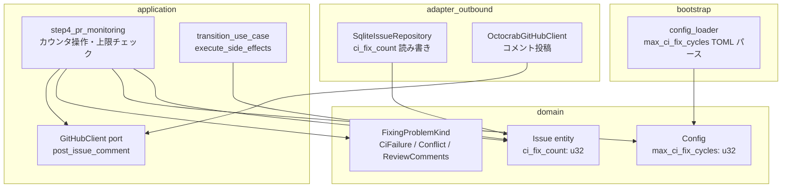
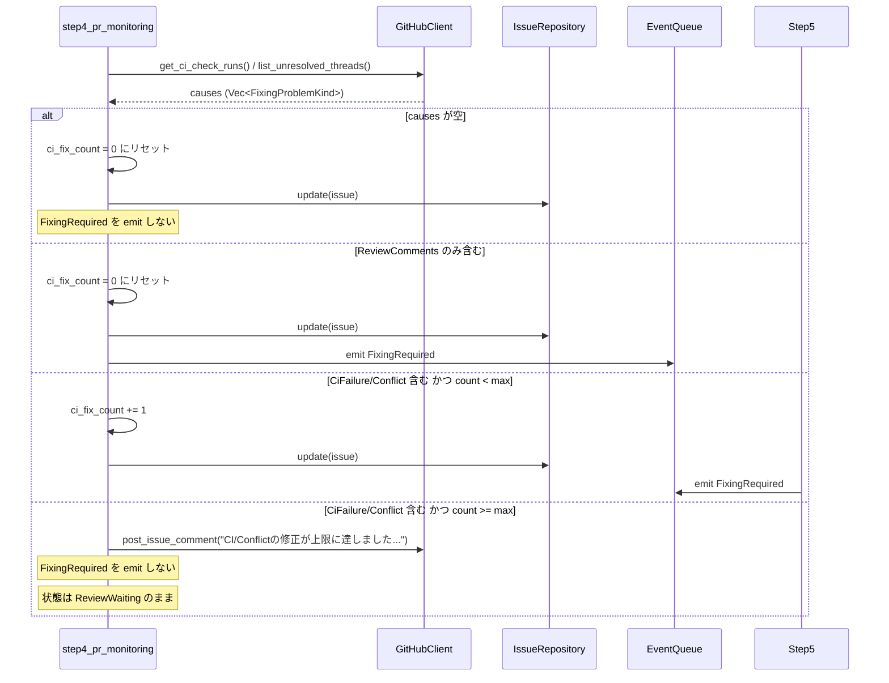
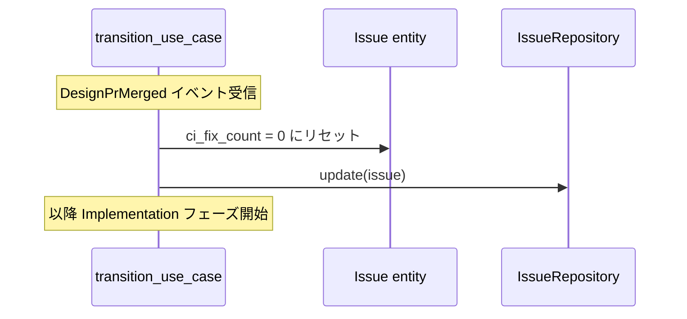
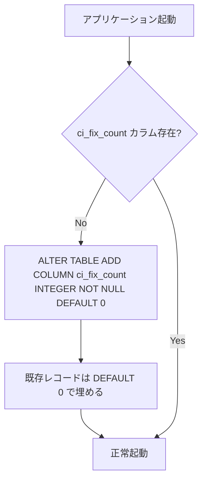

# 技術設計書: CI/Conflict 起因修正試行上限（ci-fix-count-limit）

## Overview

**Purpose**: 本機能は、Fixing ↔ ReviewWaiting 間の無限ループを防止するため、CI 失敗（CiFailure）またはコンフリクト（Conflict）を起因とする修正試行回数（ci_fix_count）に上限を設ける。

**Users**: Cupola の自動化エージェントおよびシステム運用者が対象。自動化エージェントは上限に達した際に処理を停止し、運用者への通知を行う。

**Impact**: 現在の `Issue` エンティティと `step4_pr_monitoring` ロジックを拡張し、`Config` に新しい設定項目を追加する。既存の状態遷移フローには影響を与えず、上限到達ケースのみ新しい分岐が追加される。

### Goals
- CI/Conflict 起因の修正試行回数を永続的に追跡する
- 上限到達時に ReviewWaiting のまま人間の介入を待つ
- 上限値を設定ファイルでオーバーライド可能にする
- フェーズ変更時にカウンタをリセットする

### Non-Goals
- ReviewComments 起因のループ上限（別機能として設計する場合は別途）
- UI/ダッシュボードへの表示
- Slack/メール等の外部通知

## Architecture

### Existing Architecture Analysis

Cupola は Clean Architecture（4 層）を採用している。本機能は既存アーキテクチャを拡張する形で実装する。

- **domain**: `Issue` エンティティに `ci_fix_count: u32` フィールドを追加。`Config` に `max_ci_fix_cycles: u32` を追加
- **application**: `step4_pr_monitoring` に上限チェック・カウンタ操作ロジックを追加。`transition_use_case.execute_side_effects` にフェーズ変更時のリセットを追加
- **adapter/outbound**: SQLite スキーマにカラム追加（マイグレーション）、リポジトリの読み書きロジック更新
- **bootstrap**: `config_loader.rs` で `max_ci_fix_cycles` を TOML からパース

### Architecture Pattern & Boundary Map



**Architecture Integration**:
- 選定パターン: 既存の Extension パターン。新規コンポーネントを追加せず、既存コンポーネントに責務を追加
- ドメイン境界: `ci_fix_count` は `Issue` の集約内で管理。カウンタ操作ロジックは application 層に限定
- 既存パターン維持: `retry_count` の管理パターン（domain フィールド + application 操作 + SQLite 永続化）を踏襲
- Steering 準拠: domain は純粋ビジネスロジックのみ（I/O なし）、application は port 経由で外部と通信

### Technology Stack

| Layer | Choice / Version | Role in Feature | Notes |
|-------|------------------|-----------------|-------|
| Backend / Services | Rust (Edition 2024) | Issue エンティティ・ユースケース拡張 | 既存スタック継続 |
| Data / Storage | SQLite (rusqlite) | ci_fix_count カラム追加・永続化 | ALTER TABLE マイグレーション |
| Infrastructure / Runtime | tokio (async) | ポーリングループ内での非同期処理 | 既存スタック継続 |

## System Flows

### ci_fix_count 更新フロー（step4_pr_monitoring）



**フロー上の設計決定**:
- `causes` に ReviewComments が 1 件でも含まれる場合は「ReviewComments を含む」と判定し、CiFailure の有無に関わらずリセット（コードが変わるため CI 状況もリセットが妥当）
- 上限到達コメントは `ci_fix_count == max_ci_fix_cycles` のサイクルのみ投稿し、スパム防止

### フェーズ変更時リセットフロー



## Requirements Traceability

| 要件 | Summary | Components | Interfaces | Flows |
|------|---------|------------|------------|-------|
| 1.1 | ci_fix_count フィールド保持 | Issue entity | — | — |
| 1.2 | causes 空時リセット | step4_pr_monitoring | IssueRepository | step4 更新フロー |
| 1.3 | ReviewComments のみ時リセット+Fixing | step4_pr_monitoring | IssueRepository, EventQueue | step4 更新フロー |
| 1.4 | CiFailure/Conflict 上限未満時インクリメント+Fixing | step4_pr_monitoring | IssueRepository, EventQueue | step4 更新フロー |
| 1.5 | CiFailure/Conflict 上限以上時 Fixing なし | step4_pr_monitoring | GitHubClient | step4 更新フロー |
| 1.6 | CiFailure + ReviewComments 同時はリセット優先 | step4_pr_monitoring | — | step4 更新フロー |
| 2.1 | max_ci_fix_cycles デフォルト 3 | Config | — | — |
| 2.2 | TOML オーバーライド | config_loader | — | — |
| 2.3 | 正の整数のみ受け付け | config_loader | — | — |
| 3.1 | 上限到達時 1 回コメント | step4_pr_monitoring | GitHubClient | step4 更新フロー |
| 3.2 | ReviewWaiting 状態維持 | step4_pr_monitoring | — | step4 更新フロー |
| 3.3 | Cancelled に遷移しない | step4_pr_monitoring | — | step4 更新フロー |
| 3.4 | 手動プッシュ後の自動再開 | step4_pr_monitoring | EventQueue | step4 更新フロー |
| 4.1 | フェーズ変更時リセット | transition_use_case | IssueRepository | フェーズ変更リセットフロー |
| 5.1 | SQLite カラム追加 | SqliteConnection | — | — |
| 5.2 | 更新時の永続化 | SqliteIssueRepository | — | — |
| 5.3 | 読み込み時の復元 | SqliteIssueRepository | — | — |
| 5.4 | マイグレーション対応 | SqliteConnection | — | — |

## Components and Interfaces

| Component | Domain/Layer | Intent | Req Coverage | Key Dependencies | Contracts |
|-----------|--------------|--------|--------------|-----------------|-----------|
| Issue entity | domain | ci_fix_count フィールド保持 | 1.1 | — | State |
| Config | domain | max_ci_fix_cycles 設定値保持 | 2.1 | — | State |
| step4_pr_monitoring | application | カウンタ操作・上限チェック・コメント通知 | 1.2–1.6, 3.1–3.4 | IssueRepository (P0), GitHubClient (P0) | Service |
| transition_use_case | application | フェーズ変更時のリセット | 4.1 | IssueRepository (P0) | Service |
| SqliteIssueRepository | adapter/outbound | ci_fix_count の読み書き | 5.2, 5.3 | rusqlite (P0) | Service |
| SqliteConnection | adapter/outbound | マイグレーション実行 | 5.1, 5.4 | rusqlite (P0) | Batch |
| config_loader | bootstrap | max_ci_fix_cycles TOML パース | 2.2, 2.3 | — | Service |

---

### domain

#### Issue entity

| Field | Detail |
|-------|--------|
| Intent | CI/Conflict 起因修正試行回数を集約内フィールドとして保持する |
| Requirements | 1.1 |

**Responsibilities & Constraints**
- `ci_fix_count: u32` フィールドを追加（デフォルト 0）
- ドメイン純粋性を維持（I/O なし）
- カウンタ操作ロジックは application 層が担う

**Dependencies**
- なし（ドメインエンティティは外部依存なし）

**Contracts**: State [x]

##### State Management
- State model: `ci_fix_count: u32`、デフォルト 0
- Persistence & consistency: SQLite の `ci_fix_count` カラムに永続化
- Concurrency strategy: 単一スレッドのポーリングループ内で操作されるため競合なし

**Implementation Notes**
- `retry_count: u32` と同様のパターンで追加する
- `Default` トレイトでデフォルト 0 を保証

---

#### Config

| Field | Detail |
|-------|--------|
| Intent | CI/Conflict 修正試行の上限値を設定値として保持する |
| Requirements | 2.1 |

**Responsibilities & Constraints**
- `max_ci_fix_cycles: u32` フィールドを追加（デフォルト 3）
- 値の検証（0 不可）は `config_loader` で行う

**Dependencies**
- なし

**Contracts**: State [x]

##### State Management
- State model: `max_ci_fix_cycles: u32`、デフォルト 3
- `max_retries: u32`（デフォルト 3）と同様のパターン

---

### application

#### step4_pr_monitoring

| Field | Detail |
|-------|--------|
| Intent | `fixing_causes` の内容に基づいて `ci_fix_count` を操作し、上限チェックを行う |
| Requirements | 1.2, 1.3, 1.4, 1.5, 1.6, 3.1, 3.2, 3.3, 3.4 |

**Responsibilities & Constraints**
- `causes` 評価後、以下のロジックを実行する：
  1. `causes` が空 → `ci_fix_count = 0`、`FixingRequired` emit しない
  2. `causes` に `ReviewComments` を含む → `ci_fix_count = 0`、`FixingRequired` emit する
  3. `causes` に `CiFailure` または `Conflict` を含み `ci_fix_count < max_ci_fix_cycles` → `ci_fix_count += 1`、`FixingRequired` emit する
  4. `causes` に `CiFailure` または `Conflict` を含み `ci_fix_count >= max_ci_fix_cycles` → コメント投稿、emit しない
- コメント投稿は `ci_fix_count == max_ci_fix_cycles` の瞬間のみ（スパム防止）
- `issue.ci_fix_count` 更新後は必ず `issue_repo.update()` を呼ぶ

**Dependencies**
- Inbound: PollingUseCase — ポーリングサイクルで呼び出し (P0)
- Outbound: IssueRepository — `update()` で `ci_fix_count` を永続化 (P0)
- Outbound: GitHubClient — `post_issue_comment()` で通知 (P0)
- Outbound: EventQueue — `FixingRequired` emit (P0)

**Contracts**: Service [x]

##### Service Interface
```rust
// 既存の step4_pr_monitoring シグネチャを変更なし
// 内部ロジックのみ拡張
async fn step4_pr_monitoring(&mut self, events: &mut Vec<(i64, Event)>)
```
- Preconditions: `self.config.max_ci_fix_cycles > 0`
- Postconditions: `ci_fix_count` が更新され DB に永続化済み。上限到達時は `FixingRequired` が events に追加されていない
- Invariants: 上限到達コメントは同一サイクル内で 1 回のみ

**Implementation Notes**
- Integration: 既存の `causes` 収集ロジック後、`if causes.is_empty()` ブランチを拡張する形で実装
- Validation: `contains_ci_or_conflict(causes)` / `contains_review_comments(causes)` ヘルパー関数を内部に定義
- Risks: ポーリング再起動後に上限到達コメントが重複投稿される可能性があるが実用上許容範囲

---

#### transition_use_case（execute_side_effects 拡張）

| Field | Detail |
|-------|--------|
| Intent | フェーズ変更（DesignPrMerged）時に `ci_fix_count` を 0 にリセットする |
| Requirements | 4.1 |

**Responsibilities & Constraints**
- `execute_side_effects` 内の `DesignPrMerged` ブランチで `issue.ci_fix_count = 0` を設定し `update()` する

**Dependencies**
- Outbound: IssueRepository — `update()` (P0)

**Contracts**: Service [x]

**Implementation Notes**
- Integration: 既存の `execute_side_effects` の `DesignPrMerged` ブランチに 2 行追加するだけ
- Validation: なし
- Risks: なし

---

### adapter/outbound

#### SqliteIssueRepository

| Field | Detail |
|-------|--------|
| Intent | `ci_fix_count` の読み書きを行う |
| Requirements | 5.2, 5.3 |

**Responsibilities & Constraints**
- `row_to_issue()` に `ci_fix_count` カラムの読み取りを追加
- INSERT/UPDATE クエリに `ci_fix_count` を追加

**Dependencies**
- External: rusqlite — SQLite アクセス (P0)

**Contracts**: Service [x]

**Implementation Notes**
- Integration: `retry_count` と同様のパターンで `ci_fix_count` を追加する
- Validation: `NOT NULL DEFAULT 0` 制約により null 値は防止済み
- Risks: マイグレーション前の DB ではカラムが存在しないが、マイグレーションが先行するため問題なし

---

#### SqliteConnection（マイグレーション）

| Field | Detail |
|-------|--------|
| Intent | `ci_fix_count` カラムを既存 DB に追加するマイグレーションを実行する |
| Requirements | 5.1, 5.4 |

**Contracts**: Batch [x]

##### Batch / Job Contract
- Trigger: アプリケーション起動時（`cargo run -- init` または `start`）
- Input / validation: 既存 `issues` テーブルへの `ALTER TABLE ADD COLUMN`
- Output / destination: `issues` テーブルに `ci_fix_count INTEGER NOT NULL DEFAULT 0` カラム追加
- Idempotency & recovery: `IF NOT EXISTS` 相当のエラーハンドリング（カラム既存時はスキップ）

**Implementation Notes**
- Integration: 既存マイグレーションブロックに追加するのみ
- Validation: `DEFAULT 0` により既存レコードのデータ損失なし
- Risks: なし

---

### bootstrap

#### config_loader

| Field | Detail |
|-------|--------|
| Intent | `max_ci_fix_cycles` を TOML から読み込み `Config` に設定する |
| Requirements | 2.2, 2.3 |

**Contracts**: Service [x]

**Implementation Notes**
- Integration: `max_retries` と同様のパターンで `max_ci_fix_cycles` を追加
- Validation: 値が 0 の場合はエラーを返す
- Risks: なし

## Data Models

### Domain Model

`Issue` 集約に `ci_fix_count: u32` を追加する。`ci_fix_count` は Issue の集約内フィールドであり、GitHub Issue Number に紐づいた状態の一部として管理される。

**不変条件**:
- `ci_fix_count >= 0`（u32 型により保証）
- `ci_fix_count <= max_ci_fix_cycles` の状態が ReviewWaiting で維持されるのは上限到達時のみ

### Logical Data Model

**追加フィールド**:

| Entity | Field | Type | Default | Description |
|--------|-------|------|---------|-------------|
| Issue | `ci_fix_count` | `u32` | `0` | CI/Conflict 起因修正試行回数 |
| Config | `max_ci_fix_cycles` | `u32` | `3` | 修正試行上限値 |

### Physical Data Model

**SQLite スキーマ変更**（`issues` テーブル）:

```sql
-- マイグレーション追加
ALTER TABLE issues ADD COLUMN ci_fix_count INTEGER NOT NULL DEFAULT 0;
```

**既存 CREATE TABLE への反映**（将来の init コマンド向け）:

```sql
CREATE TABLE IF NOT EXISTS issues (
    -- 既存カラム（省略） ...
    ci_fix_count INTEGER NOT NULL DEFAULT 0
);
```

## Error Handling

### Error Strategy

本機能固有のエラー処理は最小限。既存の `anyhow::Result` パターンを踏襲する。

### Error Categories and Responses

**CI コメント投稿失敗**（System Error）:
- GitHub API 呼び出し失敗時はログ記録して継続（非致命的）
- `FixingRequired` の抑制は維持されるため、ReviewWaiting 状態は保たれる

**SQLite 書き込み失敗**（System Error）:
- 既存の `?` 伝搬パターンでエラーを上位に伝達
- ポーリングループのエラーハンドリングで ProcessFailed イベントに変換

**設定値バリデーション失敗**（User Error）:
- `max_ci_fix_cycles = 0` の場合、起動時エラーとして早期終了

### Monitoring

既存の `tracing` ログに以下を追加:
- `info!`: `ci_fix_count` インクリメント時（`issue: {id}, ci_fix_count: {count}`）
- `info!`: `ci_fix_count` リセット時
- `warn!`: 上限到達時（`issue: {id}, ci_fix_count reached max: {max}`）

## Testing Strategy

### Unit Tests

1. **causes 評価ロジック** (`step4_pr_monitoring` 内の分岐):
   - causes 空 → リセット、emit なし
   - ReviewComments のみ → リセット、emit あり
   - CiFailure のみ、上限未満 → インクリメント、emit あり
   - CiFailure のみ、上限以上 → カウント変化なし、emit なし
   - CiFailure + ReviewComments 同時 → リセット、emit あり

2. **Config デフォルト値**: `max_ci_fix_cycles` のデフォルトが 3 であること

3. **config_loader バリデーション**: `max_ci_fix_cycles = 0` でエラーを返すこと

### Integration Tests

1. **Fixing ↔ ReviewWaiting ループ上限**: `max_ci_fix_cycles = 2` でモック CI 失敗を設定し、2 回目で ReviewWaiting に留まることを確認
2. **フェーズ変更後のリセット**: Design フェーズで `ci_fix_count = 2` になった後、`DesignPrMerged` で 0 にリセットされることを確認
3. **SQLite 読み書き**: `ci_fix_count` が更新・永続化・復元されることをインメモリ DB でテスト
4. **マイグレーション**: 既存スキーマに `ci_fix_count` カラムがない場合にマイグレーションが正常に適用されることを確認

## Migration Strategy



- **フェーズ**: 単一マイグレーション（ロールバック不要）
- **検証**: カラム追加後の SELECT で値が 0 であることを確認
- **ロールバック**: 不要（カラム追加のみ、データ損失なし）
