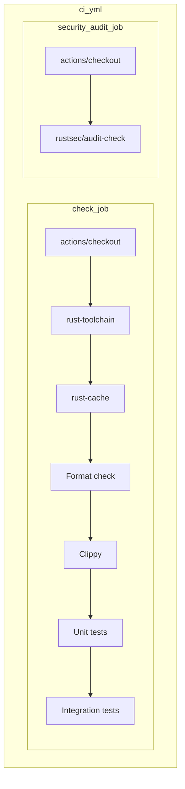
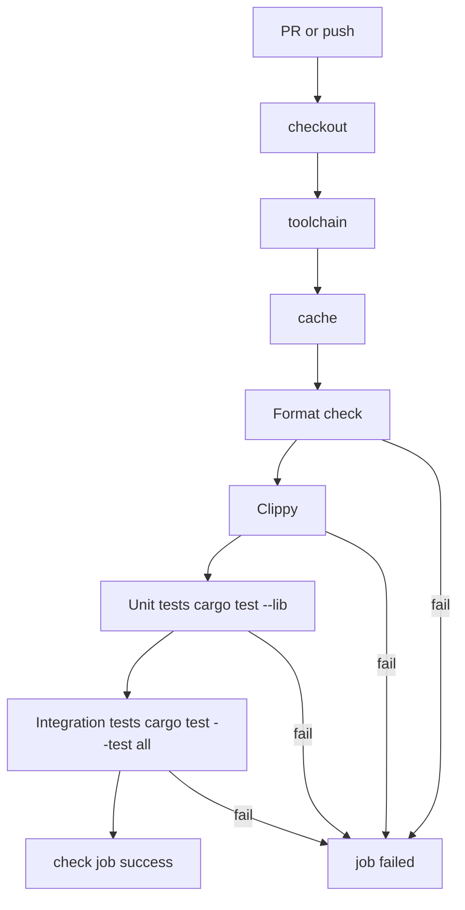
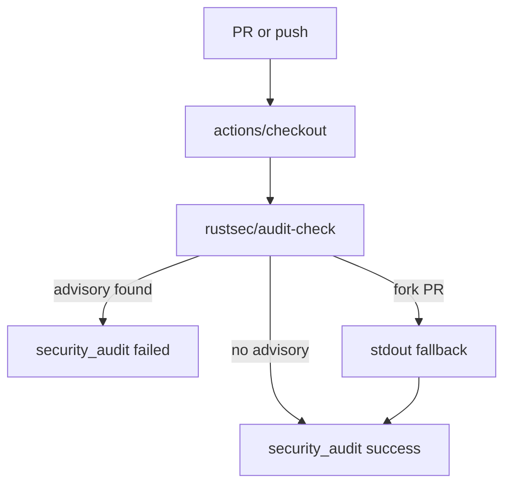

# 技術設計書

## Overview

本機能は、Cupola プロジェクトの CI パイプライン（`.github/workflows/ci.yml`）に **統合テストの実行** と **サプライチェーンセキュリティ監査** を追加する。現状、`tests/` 配下の統合テスト（17テスト）は CI で一切実行されておらず、RUSTSEC アドバイザリによるセキュリティチェックも存在しない。この変更により、リグレッション検出能力とセキュリティ可視性を向上させる。

変更対象は `.github/workflows/ci.yml` のみであり、Rust ソースコードへの変更は含まない。

### Goals

- `tests/integration_test.rs` のすべての統合テストを CI で自動検証する
- `rustsec/audit-check@v2.0.0` によるサプライチェーンセキュリティ監査を CI に追加する
- 既存の format check / clippy / unit test を引き続き正常に動作させる

### Non-Goals

- `cargo-deny` への移行（将来 Issue で対応）
- セキュリティ監査の `continue-on-error` 化や daily cron 分離（将来 Issue で対応）
- 統合テストの並列実行（SQLite ロック競合のリスクあり）
- Rust ソースコードの変更

## Requirements Traceability

| Requirement | Summary | Components | Interfaces | Flows |
|-------------|---------|------------|------------|-------|
| 1.1 | 統合テストステップの実行 | Integration Tests Step | `cargo test --test '*'` | CI Check Job |
| 1.2 | Unit tests / Integration tests の分離 | Unit Tests Step, Integration Tests Step | ステップ定義 | CI Check Job |
| 1.3 | `--test-threads=1` フラグ付与 | Integration Tests Step | `cargo test` フラグ | CI Check Job |
| 1.4 | 統合テスト失敗時のジョブ失敗 | CI Runner | デフォルト動作 | CI Check Job |
| 1.5 | ubuntu-latest 環境での実行 | CI Check Job | `runs-on: ubuntu-latest` | CI Check Job |
| 2.1 | `security_audit` ジョブの追加 | Security Audit Job | `rustsec/audit-check@v2.0.0` | CI Security Audit Job |
| 2.2 | ubuntu-latest + checkout | Security Audit Job | `actions/checkout@v4` | CI Security Audit Job |
| 2.3 | GITHUB_TOKEN の渡し方 | Security Audit Job | `token: ${{ secrets.GITHUB_TOKEN }}` | CI Security Audit Job |
| 2.4 | パーミッション設定 | Security Audit Job | `permissions` ブロック | CI Security Audit Job |
| 2.5 | Cargo.lock を基にチェック | Security Audit Job | `rustsec/audit-check` の動作 | CI Security Audit Job |
| 2.6 | fork PR での stdout フォールバック | Security Audit Job | `rustsec/audit-check` の内部動作 | CI Security Audit Job |
| 3.1 | format check の継続 | CI Check Job | `cargo fmt -- --check` | CI Check Job |
| 3.2 | clippy の継続 | CI Check Job | `cargo clippy --all-targets` | CI Check Job |
| 3.3 | unit test の継続 | CI Check Job | `cargo test --lib` | CI Check Job |
| 3.4 | 全ステップ成功時の報告 | CI Runner | デフォルト動作 | 全ジョブ |
| 3.5 | 環境変数の維持 | CI Check Job | `env` ブロック | CI Check Job |

## Architecture

### Existing Architecture Analysis

現在の `.github/workflows/ci.yml` は単一ジョブ `check` を持ち、以下のステップを直列実行する：
1. `actions/checkout@v4`（SHA ピン留め）
2. `dtolnay/rust-toolchain@stable`（rustfmt, clippy コンポーネント付き）
3. `Swatinem/rust-cache@v2`（SHA ピン留め）
4. Format check（`cargo fmt -- --check`）
5. Clippy（`cargo clippy --all-targets`）
6. Test（`cargo test --lib -- --test-threads=1`）

### Architecture Pattern & Boundary Map

**Architecture Integration**:
- 選択パターン: 既存 `check` ジョブへのステップ追加 + 独立 `security_audit` ジョブの追加
- ジョブ分離: `security_audit` は独自パーミッション（`issues: write`, `checks: write`）が必要なため独立ジョブとする
- 既存パターン維持: SHA ピン留め慣例、`ubuntu-latest`、`CARGO_TERM_COLOR`, `RUSTFLAGS` 環境変数
- Steering 準拠: 最小権限の原則、既存ワークフロー構造を尊重

### Technology Stack

| Layer | Choice / Version | Role in Feature | Notes |
|-------|------------------|-----------------|-------|
| CI Runtime | GitHub Actions | ワークフロー実行環境 | 既存 |
| OS | ubuntu-latest | ビルド・テスト環境 | 既存 |
| Test Runner | cargo test `--test '*'` | 統合テスト実行 | 追加 |
| Security Audit | rustsec/audit-check@v2.0.0 | RUSTSEC アドバイザリチェック | 追加（`actions-rs/audit-check` の後継） |
| Cache | Swatinem/rust-cache@v2 | ビルドキャッシュ | 既存（`check` ジョブで共有） |

## System Flows

### CI Check Job のステップフロー

### Security Audit Job のフロー

## Components and Interfaces

| Component | Domain/Layer | Intent | Req Coverage | Key Dependencies | Contracts |
|-----------|--------------|--------|--------------|-----------------|-----------|
| Unit Tests Step | CI / check job | 既存単体テスト実行の継続 | 3.3 | cargo, rust-cache | Batch |
| Integration Tests Step | CI / check job | 統合テスト実行を CI に追加 | 1.1, 1.2, 1.3, 1.4, 1.5 | cargo, rust-cache | Batch |
| Security Audit Job | CI / security_audit job | RUSTSEC 監査の実行 | 2.1〜2.6 | rustsec/audit-check, GITHUB_TOKEN | Batch |

### CI / check job

#### Unit Tests Step

| Field | Detail |
|-------|--------|
| Intent | `cargo test --lib` による単体テストを継続実行する |
| Requirements | 3.3 |

**Responsibilities & Constraints**
- 既存ステップ名 `Test` を `Unit tests` にリネームし、コマンドは変更しない（後方互換）
- `--test-threads=1` フラグを維持する

**Contracts**: Batch [x]

##### Batch / Job Contract
- Trigger: `check` ジョブ内で clippy ステップ後に実行
- Input / validation: `src/` 配下の `#[cfg(test)]` ブロック
- Output / destination: exit code 0（成功）/ 非0（失敗）
- Idempotency & recovery: 再実行可能（副作用なし）

**Implementation Notes**
- Integration: ステップ名のみ変更。コマンド `cargo test --lib -- --test-threads=1` は変更なし
- Risks: なし

#### Integration Tests Step

| Field | Detail |
|-------|--------|
| Intent | `tests/` 配下の統合テストを CI で実行する |
| Requirements | 1.1, 1.2, 1.3, 1.4, 1.5 |

**Responsibilities & Constraints**
- `Unit tests` ステップの後に独立ステップとして追加する
- SQLite への同時アクセスを防ぐため `--test-threads=1` が必須
- `Swatinem/rust-cache` のキャッシュを `check` ジョブ内で共有するため再ビルドが不要

**Dependencies**
- Inbound: Unit Tests Step — 直前ステップの成功が前提（P0）
- External: `tests/integration_test.rs` — テスト対象（P0）

**Contracts**: Batch [x]

##### Batch / Job Contract
- Trigger: `check` ジョブ内で Unit tests ステップ後に実行
- Input / validation: `tests/` 配下のすべての統合テスト（`--test '*'` でグロブ）
- Output / destination: exit code 0（成功）/ 非0（失敗）→ ジョブ全体を失敗にする
- Idempotency & recovery: 再実行可能。テストは in-memory または一時 SQLite ファイルを使用

**Implementation Notes**
- Integration: `check` ジョブの最終ステップとして追加
- Validation: `--test-threads=1` フラグの付与を必須とする
- Risks: 統合テストの実行時間が増大した場合、将来的に専用ジョブへの分離を検討

### CI / security_audit job

#### Security Audit Job

| Field | Detail |
|-------|--------|
| Intent | `rustsec/audit-check` を使って依存クレートの RUSTSEC アドバイザリを検査する |
| Requirements | 2.1, 2.2, 2.3, 2.4, 2.5, 2.6 |

**Responsibilities & Constraints**
- `check` ジョブとは独立したジョブとして定義する
- パーミッション `issues: write` および `checks: write` を当該ジョブスコープ内のみに限定する
- `Cargo.lock` がコミット済みであることを前提とする（本プロジェクトはコミット済み）

**Dependencies**
- External: `rustsec/audit-check@v2.0.0` — RUSTSEC アドバイザリチェックアクション（P0）
- External: `actions/checkout@v4` — コードチェックアウト（P0）
- External: `secrets.GITHUB_TOKEN` — GitHub Checks への書き込み権限（P1）

**Contracts**: Batch [x]

##### Batch / Job Contract
- Trigger: PR または main へのプッシュ時（`on: pull_request / push` のトリガー定義を継承）
- Input / validation: `Cargo.lock`（リポジトリにコミット済みであること）
- Output / destination: GitHub Checks への結果書き込み（fork PR の場合は stdout フォールバック）
- Idempotency & recovery: 再実行可能。アドバイザリ DB の更新により結果が変わる場合がある

**Implementation Notes**
- Integration: `check` ジョブと並列実行される独立ジョブ
- Validation: `rustsec/audit-check` は `Cargo.lock` の存在を前提とする。リポジトリに `Cargo.lock` がコミットされていない場合は失敗する（本プロジェクトでは問題なし）
- Risks:
  - 新規 RUSTSEC アドバイザリの追加により突発的な CI 失敗が起きる可能性がある
  - fork PR では `checks: write` 権限が制限されるが、`rustsec/audit-check` は stdout フォールバックを持つ（要件 2.6）

## Error Handling

### Error Strategy

| エラー種別 | 発生条件 | 対応 |
|-----------|---------|------|
| 統合テスト失敗 | `tests/` 内のテストがアサーション失敗 | ジョブ全体を失敗として報告（デフォルト動作） |
| RUSTSEC アドバイザリ検出 | 依存クレートに既知の脆弱性 | `security_audit` ジョブを失敗として報告 |
| fork PR でのパーミッション不足 | `checks: write` が使えない fork からの PR | stdout にフォールバック、ジョブは継続 |
| `Cargo.lock` 未コミット | リポジトリに `Cargo.lock` がない | `rustsec/audit-check` が失敗（本プロジェクトでは発生しない） |

### Monitoring

- GitHub Actions の CI ダッシュボードで各ジョブ・ステップの成否を確認できる
- `security_audit` ジョブは GitHub Checks に結果を書き込む（fork PR を除く）

## Testing Strategy

### CI ワークフロー検証

CI ワークフローの変更は GitHub Actions 上での実行によってのみ検証できる。

- **統合テスト実行確認**: PR 作成後、`check` ジョブの `Integration tests` ステップが実行され、すべてのテストが通過することを確認
- **セキュリティ監査実行確認**: PR 作成後、`security_audit` ジョブが実行され、GitHub Checks に結果が表示されることを確認
- **既存ステップの継続動作確認**: Format check / Clippy / Unit tests が引き続き正常に動作することを確認
- **ステップ分離確認**: `Unit tests` と `Integration tests` が独立したステップとして表示されることを確認

## Security Considerations

- `security_audit` ジョブのパーミッションは `issues: write` と `checks: write` のみに限定し、最小権限の原則を遵守する
- アクションの SHA ピン留め: 既存ワークフローの慣例に従い、`rustsec/audit-check@v2.0.0` についても実装時にコミット SHA でピン留めすることを推奨する（実装フェーズで確認）
- `GITHUB_TOKEN` はジョブスコープ内でのみ使用し、ソースコードには含まない
