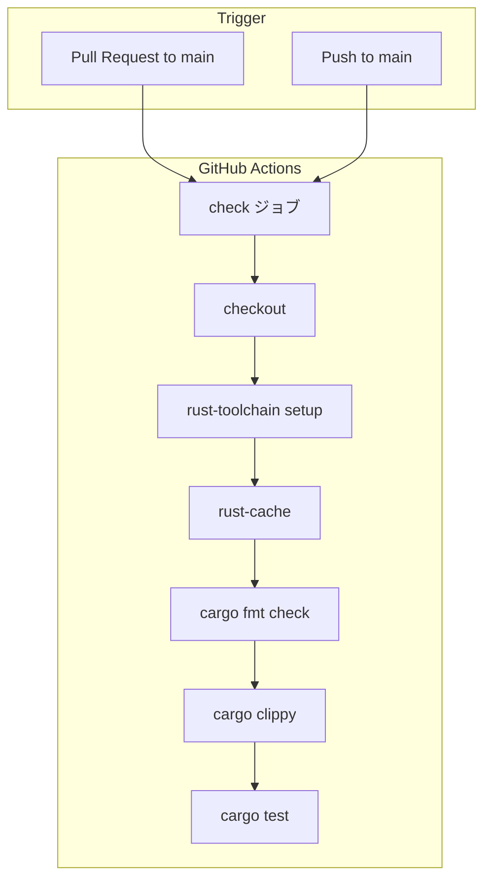

# Design Document: CI Workflow

## Overview

**Purpose**: GitHub Actions による CI ワークフローを追加し、PR・push 時にフォーマットチェック・静的解析・ユニットテストを自動実行することで、コード品質を継続的に担保する。

**Users**: 開発者が PR を作成・更新した際、および main ブランチへ push した際に自動的に品質チェックが実行される。

### Goals
- PR・push をトリガーとした自動 CI の実現
- cargo fmt, clippy, test による品質ゲートの確立
- rust-cache によるビルド時間の最適化

### Non-Goals
- CD（継続的デリバリー）パイプラインの構築
- 統合テスト・E2E テストの CI 実行
- マルチジョブ並列実行による高速化（現時点では不要）
- Dependabot によるアクション自動更新設定

## Architecture

### Architecture Pattern & Boundary Map

単一ジョブ・逐次実行の GitHub Actions ワークフロー。プロジェクトの Rust ソースコードには変更を加えず、CI 定義ファイルのみを追加する。

**Architecture Integration**:
- Selected pattern: 単一ジョブ逐次実行 — プロジェクト規模が小さくシンプルさを優先
- 既存パターン: steering の tech.md に定義されたコマンド（`cargo fmt -- --check`, `cargo clippy`, `cargo test`）をそのまま CI に反映
- 新コンポーネント: `.github/workflows/ci.yml` のみ（既存コードへの変更なし）

### Technology Stack

| Layer | Choice / Version | Role in Feature | Notes |
|-------|------------------|-----------------|-------|
| CI Runtime | GitHub Actions (ubuntu-latest) | ワークフロー実行環境 | |
| Checkout | actions/checkout@v4 (SHA 固定) | ソースコード取得 | サプライチェーン対策でコミットハッシュ固定 |
| Toolchain | dtolnay/rust-toolchain@stable | Rust stable + rustfmt, clippy | タグ指定（信頼できるメンテナ） |
| Cache | Swatinem/rust-cache@v2 (SHA 固定) | ビルドキャッシュ | コミットハッシュ固定 |

## Requirements Traceability

| Requirement | Summary | Components | Interfaces | Flows |
|-------------|---------|------------|------------|-------|
| 1.1 | PR トリガー | ci.yml `on.pull_request` | — | Trigger → Job |
| 1.2 | push トリガー | ci.yml `on.push` | — | Trigger → Job |
| 2.1 | fmt チェック実行 | ci.yml `Format check` ステップ | — | Step4 |
| 2.2 | fmt 違反時の失敗 | ci.yml `Format check` ステップ | — | Step4 (exit code) |
| 3.1 | clippy 実行 | ci.yml `Clippy` ステップ | — | Step5 |
| 3.2 | RUSTFLAGS 設定 | ci.yml `env.RUSTFLAGS` | — | — |
| 3.3 | clippy 警告時の失敗 | ci.yml `Clippy` ステップ + RUSTFLAGS | — | Step5 (exit code) |
| 4.1 | テスト実行 | ci.yml `Test` ステップ | — | Step6 |
| 4.2 | テスト失敗時の失敗 | ci.yml `Test` ステップ | — | Step6 (exit code) |
| 5.1 | rust-cache 有効化 | ci.yml `rust-cache` ステップ | — | Step3 |
| 5.2 | stable + components | ci.yml `rust-toolchain` ステップ | — | Step2 |
| 6.1 | ファイル配置 | `.github/workflows/ci.yml` | — | — |
| 6.2 | CARGO_TERM_COLOR | ci.yml `env.CARGO_TERM_COLOR` | — | — |

## Components and Interfaces

| Component | Domain/Layer | Intent | Req Coverage | Key Dependencies | Contracts |
|-----------|--------------|--------|--------------|------------------|-----------|
| ci.yml | Infrastructure / CI | CI ワークフロー定義 | 1.1–6.2 | GitHub Actions, Rust toolchain | — |

### Infrastructure / CI

#### ci.yml

| Field | Detail |
|-------|--------|
| Intent | PR・push 時に fmt, clippy, test を逐次実行する CI ワークフロー |
| Requirements | 1.1, 1.2, 2.1, 2.2, 3.1, 3.2, 3.3, 4.1, 4.2, 5.1, 5.2, 6.1, 6.2 |

**Responsibilities & Constraints**
- `.github/workflows/ci.yml` として配置し、GitHub Actions が自動認識する
- `on.pull_request.branches: [main]` と `on.push.branches: [main]` でトリガーを制限
- 環境変数 `CARGO_TERM_COLOR=always` と `RUSTFLAGS="-D warnings"` をワークフローレベルで設定
- 単一ジョブ `check` で以下のステップを逐次実行:
  1. `actions/checkout` — ソースコード取得
  2. `dtolnay/rust-toolchain@stable` — rustfmt, clippy コンポーネント付き
  3. `Swatinem/rust-cache` — ビルドキャッシュ
  4. `cargo fmt -- --check` — フォーマットチェック
  5. `cargo clippy --all-targets` — 静的解析
  6. `cargo test --lib -- --test-threads=1` — ユニットテスト

**Dependencies**
- External: actions/checkout@v4 (SHA 固定) — ソースコード取得 (P0)
- External: dtolnay/rust-toolchain@stable — ツールチェイン設定 (P0)
- External: Swatinem/rust-cache@v2 (SHA 固定) — ビルドキャッシュ (P1)

**Implementation Notes**
- アクションのバージョンは Issue の参考定義に記載されたコミットハッシュを使用
- 各ステップは失敗時にジョブ全体が失敗する（GitHub Actions のデフォルト動作）
- `--test-threads=1` により SQLite 等の共有リソースに依存するテストの競合を防止

## Error Handling

### Error Strategy
CI ワークフロー自体のエラーハンドリングは GitHub Actions のデフォルト動作に依存する。各ステップの終了コードが非ゼロの場合、ジョブは失敗として報告される。

### Error Categories and Responses
- **フォーマット違反**: `cargo fmt -- --check` が非ゼロで終了 → ジョブ失敗、差分が stdout に出力される
- **Clippy 警告/エラー**: `RUSTFLAGS="-D warnings"` により警告もエラー扱い → ジョブ失敗
- **テスト失敗**: `cargo test` が非ゼロで終了 → ジョブ失敗、失敗したテスト名と詳細が出力される

## Testing Strategy

### 検証項目
- `.github/workflows/ci.yml` のシンタックス検証（GitHub Actions が正常にパースできること）
- PR 作成時に CI ジョブが自動トリガーされること
- main ブランチへの push 時に CI ジョブが自動トリガーされること
- フォーマット違反がある場合にジョブが失敗すること
- Clippy 警告がある場合にジョブが失敗すること
- テスト失敗がある場合にジョブが失敗すること
- 全チェックがパスした場合にジョブが成功すること
- rust-cache によりキャッシュが有効化されていること（2 回目の実行でキャッシュヒット）
