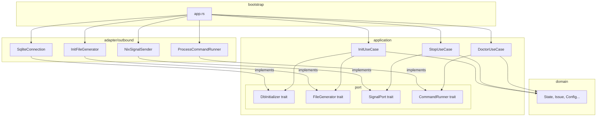
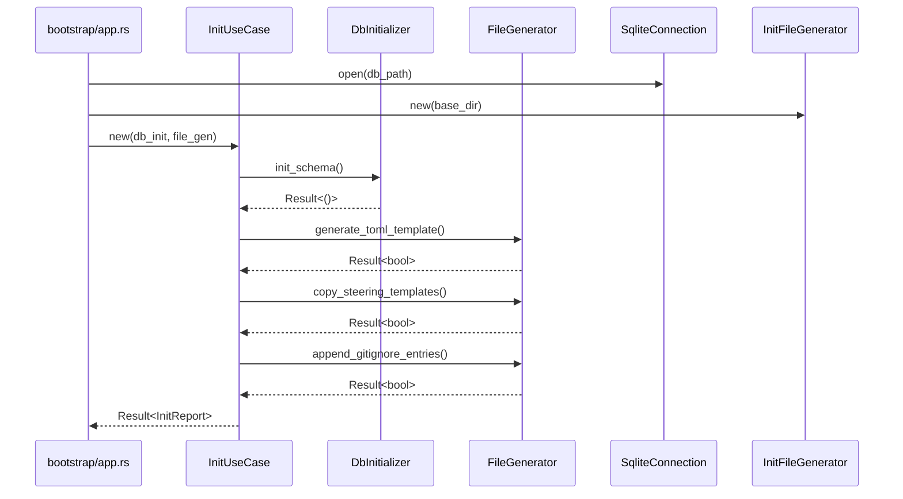
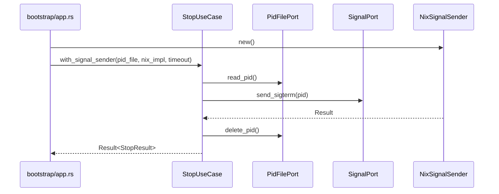

# 技術設計書: Clean Architecture 違反修正 + anyhow エラー統一

## 概要

本フィーチャーは cupola コードベースにおける Clean Architecture 依存ルール違反を全て解消し、エラー型を `anyhow::Result` に統一する。

**目的**: `application` 層が `adapter` 層の具象型に直接依存している箇所を新規ポートトレイトで抽象化し、`anyhow` による一貫したエラー伝播を確立する。

**対象ユーザー**: cupola の開発者・メンテナー。リファクタリング完了後、各 use case が独立してテスト可能になる。

**影響**: 既存の外部 API（CLI、GitHub との連携動作）は変更せず、内部の層間依存のみを修正する。次フェーズ（Issue #166: 型付きエラー設計）の土台を整える。

### ゴール

- `application` 層からすべての `adapter` 具象型インポートを排除する
- 新規ポート（`DbInitializer`、`FileGenerator`、`SignalPort`）を `application/port/` に配置する
- `NixSignalSender` を `adapter/outbound/` に移動する
- `DoctorUseCase` で既存 `CommandRunner` ポートを使用する
- 未使用の `CupolaError` と `check_result.rs` を削除する
- `cargo build` / `cargo test` / `cargo clippy --all-targets -- -D warnings` が全て警告なしで成功する状態を維持する

### 非ゴール

- 型付きエラー設計（Issue #166 のスコープ）
- 機能追加・動作変更
- `StopError`・`PidFileError`・`ConfigLoadError` の anyhow 統合（フェーズ 2 まで保留）

---

## アーキテクチャ

### 既存アーキテクチャの分析

現在の違反状況:

| ファイル | 違反内容 | 使用されている adapter 型 |
|---------|---------|--------------------------|
| `application/init_use_case.rs` | adapter 直接依存 | `SqliteConnection`, `InitFileGenerator` |
| `application/stop_use_case.rs` | adapter 実装を同居 | `NixSignalSender`（nix クレート直接使用） |
| `application/doctor_use_case.rs` | stdlib 直接使用 | `std::process::Command`（5 箇所） |
| `application/error.rs` | 未使用型 | `CupolaError`（実体参照なし） |
| `domain/check_result.rs` | デッドコード | （`DoctorCheckResult` と重複） |

### アーキテクチャパターン & 境界マップ



**アーキテクチャ統合のポイント**:
- 選択パターン: Ports & Adapters（Hexagonal Architecture）— プロジェクトの既存方針に準拠
- 新規ポート `DbInitializer`・`FileGenerator`・`SignalPort` を `application/port/` に追加
- `NixSignalSender` は `adapter/outbound/nix_signal_sender.rs` に移動
- bootstrap のみが全具象型を知る（現行と同じ）

### テクノロジースタック

| 層 | 選択 | フィーチャーでの役割 | 備考 |
|---|------|---------------------|------|
| application | Rust trait | 新規ポート定義（`DbInitializer`, `FileGenerator`, `SignalPort`） | thiserror / anyhow は cross-cutting として引き続き使用 |
| adapter/outbound | `nix` crate | `NixSignalSender` 実装（移動先） | 既存依存をそのまま adapter 層に閉じ込める |
| bootstrap | constructor injection | 具象型の組み立て・注入 | 変更点は `StopUseCase::with_signal_sender` への切り替えと DI 追加のみ |
| エラー | `anyhow` (application/adapter), `thiserror` (port-specific) | use case 戻り値型を `anyhow::Result` に統一 | ポート固有エラー（`StopError` 等）は thiserror のまま維持 |

---

## システムフロー

### init コマンド実行フロー（リファクタリング後）



### stop コマンド実行フロー（リファクタリング後）



---

## 要件トレーサビリティ

| 要件 | 概要 | コンポーネント | インターフェース | フロー |
|------|------|---------------|----------------|--------|
| 1.1–1.4 | 未使用コード削除 | `application/error.rs` 削除, `domain/check_result.rs` 削除 | — | — |
| 2.1 | `DbInitializer` ポート定義 | `application/port/db_initializer.rs` | `DbInitializer` trait | init フロー |
| 2.2 | `FileGenerator` ポート定義 | `application/port/file_generator.rs` | `FileGenerator` trait | init フロー |
| 2.3–2.6 | `InitUseCase` のポート依存化 | `InitUseCase`, `SqliteConnection`, `InitFileGenerator` | `DbInitializer`, `FileGenerator` | init フロー |
| 3.1–3.3 | `NixSignalSender` 移動 + `SignalPort` 移動 | `adapter/outbound/nix_signal_sender.rs`, `application/port/signal.rs` | `SignalPort` trait | stop フロー |
| 4.1–4.5 | `DoctorUseCase` への `CommandRunner` 注入 | `DoctorUseCase` | `CommandRunner` trait | — |
| 5.1–5.4 | `anyhow::Result` 統一 | 全 use case, adapter 層 | — | — |
| 6.1–6.5 | ビルド・テスト維持 | 全コンポーネント | — | — |

---

## コンポーネントとインターフェース

### コンポーネントサマリー

| コンポーネント | 層 | 概要 | 要件カバレッジ | 主要依存 |
|--------------|---|------|--------------|--------|
| `DbInitializer` trait | application/port | DB スキーマ初期化の抽象 | 2.1 | — |
| `FileGenerator` trait | application/port | ファイル生成操作の抽象 | 2.2 | — |
| `SignalPort` trait | application/port | OS シグナル送信の抽象（移動） | 3.1 | — |
| `InitUseCase<D, F>` | application | init ユースケース（ポート依存化） | 2.3–2.6 | `DbInitializer`, `FileGenerator` |
| `StopUseCase<P, S>` | application | stop ユースケース（変更最小） | 3.3, 3.4 | `PidFilePort`, `SignalPort` |
| `DoctorUseCase<C, R>` | application | doctor ユースケース（CommandRunner 注入） | 4.1–4.5 | `ConfigLoader`, `CommandRunner` |
| `NixSignalSender` | adapter/outbound | POSIX シグナル送信実装（移動） | 3.1–3.3 | `nix` crate |

---

### Application Layer

#### `DbInitializer` トレイト

| フィールド | 詳細 |
|-----------|------|
| Intent | SQLite スキーマ初期化を抽象化する outbound ポート |
| Requirements | 2.1 |

**責務と制約**
- `init_schema()` のみを定義し、接続管理は実装に委ねる
- `Send + Sync` を要求し、マルチスレッド環境での注入を保証する

**依存関係**
- Inbound: `InitUseCase` — スキーマ初期化呼び出し (P0)
- Outbound: なし
- External: なし（トレイト定義のみ）

**コントラクト**: Service [x]

##### Service Interface

```rust
// src/application/port/db_initializer.rs
use anyhow::Result;

pub trait DbInitializer: Send + Sync {
    fn init_schema(&self) -> Result<()>;
}
```

- 事前条件: DB ファイルまたはインメモリコネクションが開いている状態
- 事後条件: `issues` テーブルと `execution_log` テーブルが存在する
- 不変条件: 冪等（2 回呼び出しても失敗しない）

**実装メモ**
- `SqliteConnection` が `DbInitializer` を実装する
- テスト時は `MockDbInitializer` をインメモリで実装する

---

#### `FileGenerator` トレイト

| フィールド | 詳細 |
|-----------|------|
| Intent | TOML テンプレート生成・steering コピー・gitignore 更新を抽象化する outbound ポート |
| Requirements | 2.2 |

**責務と制約**
- 3 つの独立したファイル操作を 1 つのトレイトにまとめる（いずれも init 時のみ使用）
- 各メソッドは `bool` を返す（`true` = 実行した、`false` = スキップ）

**コントラクト**: Service [x]

##### Service Interface

```rust
// src/application/port/file_generator.rs
use anyhow::Result;

pub trait FileGenerator: Send + Sync {
    fn generate_toml_template(&self) -> Result<bool>;
    fn copy_steering_templates(&self) -> Result<bool>;
    fn append_gitignore_entries(&self) -> Result<bool>;
}
```

- 事後条件: 各操作は冪等（ファイル存在時はスキップして `false` を返す）

---

#### `SignalPort` トレイト（`application/port/signal.rs` へ移動）

| フィールド | 詳細 |
|-----------|------|
| Intent | OS シグナル送信を抽象化する outbound ポート |
| Requirements | 3.1 |

**責務と制約**
- 現在 `stop_use_case.rs` に定義されているが、`application/port/signal.rs` へ移動する
- `StopUseCase` はこのトレイトを `application::port::signal::SignalPort` としてインポートする

**コントラクト**: Service [x]

##### Service Interface

```rust
// src/application/port/signal.rs
use crate::application::stop_use_case::StopError;

pub trait SignalPort: Send + Sync {
    fn send_sigterm(&self, pid: u32) -> Result<(), StopError>;
    fn send_sigkill(&self, pid: u32) -> Result<(), StopError>;
}
```

**実装メモ**
- `SignalPort` の `StopError` 依存を避けるため、シグナルエラーを `anyhow::Error` に変更することも選択肢だが、`StopError` は application 層内で定義されているため依存関係は問題なし
- `NixSignalSender` を `adapter/outbound/nix_signal_sender.rs` に移動し、このトレイトを実装させる

---

#### `InitUseCase<D: DbInitializer, F: FileGenerator>`

| フィールド | 詳細 |
|-----------|------|
| Intent | cupola init コマンドのユースケース（adapter 依存を解消） |
| Requirements | 2.3, 2.4, 2.5, 2.6 |

**責務と制約**
- `SqliteConnection` / `InitFileGenerator` への直接依存を排除する
- `new(base_dir, db_init, file_gen)` コンストラクタ（または 2 つのポートをフィールドとして保持）に変更する
- ディレクトリ作成（`std::fs::create_dir_all`）は `std::fs` の直接使用として許容する（ファイルシステムの基本操作はポート抽象化対象外）

**依存関係**
- Inbound: `bootstrap/app.rs` — use case 実行 (P0)
- Outbound: `DbInitializer` — スキーマ初期化 (P0)
- Outbound: `FileGenerator` — ファイル生成 (P0)

**コントラクト**: Service [x]

##### Service Interface

```rust
pub struct InitUseCase<D: DbInitializer, F: FileGenerator> {
    base_dir: PathBuf,
    db_init: D,
    file_gen: F,
}

impl<D: DbInitializer, F: FileGenerator> InitUseCase<D, F> {
    pub fn new(base_dir: PathBuf, db_init: D, file_gen: F) -> Self;
    pub fn run(&self) -> anyhow::Result<InitReport>;
}
```

**実装メモ**
- 統合テスト: 既存のテストは `SqliteConnection` と `InitFileGenerator` を直接使用しているため、統合テストとして維持する（ポートの具象実装をそのまま使用）
- リスク: テスト内の `InitUseCase::new(tmp.path().to_path_buf())` → `InitUseCase::new(base_dir, db, file_gen)` へのシグネチャ変更が必要

---

#### `DoctorUseCase<C: ConfigLoader, R: CommandRunner>`

| フィールド | 詳細 |
|-----------|------|
| Intent | doctor コマンドのユースケース（CommandRunner ポートを注入） |
| Requirements | 4.1, 4.2, 4.3, 4.4, 4.5 |

**責務と制約**
- `DoctorUseCase<C: ConfigLoader>` から `DoctorUseCase<C: ConfigLoader, R: CommandRunner>` に変更する
- `check_git`・`detect_gh_presence`・`check_gh_label`・`check_weight_labels` の各 free 関数に `&dyn CommandRunner` を渡す形に変更する
- `check_steering` と `check_db` は `std::fs` のみを使用しており変更不要

**コントラクト**: Service [x]

##### Service Interface

```rust
pub struct DoctorUseCase<C: ConfigLoader, R: CommandRunner> {
    config_loader: C,
    command_runner: R,
}

impl<C: ConfigLoader, R: CommandRunner> DoctorUseCase<C, R> {
    pub fn new(config_loader: C, command_runner: R) -> Self;
    pub fn run(&self, config_path: &Path) -> Vec<DoctorCheckResult>;
}
```

**実装メモ**
- `MockCommandRunner`（既存の `test_support` モジュール）を使ったユニットテストで `check_git`・`check_gh` 等を単独テスト可能になる
- bootstrap: `ProcessCommandRunner::new()` を `DoctorUseCase::new(loader, runner)` に注入
- 既存のテスト `doctor_use_case_all_ok_with_mock_loader` は `DoctorUseCase::new(loader, MockCommandRunner::new())` に更新する

---

### Adapter Layer

#### `NixSignalSender`（`adapter/outbound/nix_signal_sender.rs` に移動）

| フィールド | 詳細 |
|-----------|------|
| Intent | POSIX シグナル（SIGTERM / SIGKILL）を nix クレート経由で送信する実装 |
| Requirements | 3.1, 3.2, 3.3 |

**責務と制約**
- `stop_use_case.rs` から移動するのみ、ロジックは変更しない
- `SignalPort` トレイトを実装する（import パスを `application::port::signal::SignalPort` に更新）

**依存関係**
- External: `nix` crate — OS シグナル送信 (P0)

**コントラクト**: Service [x]

**実装メモ**
- `stop_use_case.rs` の `impl<P: PidFilePort> StopUseCase<P, NixSignalSender>` ブロック（`NixSignalSender` を内部生成するコンストラクタ）は削除し、bootstrap で `with_signal_sender` を使用する形に切り替える

---

## データモデル

本リファクタリングはデータモデルを変更しない。DB スキーマ・エンティティ・バリューオブジェクトはすべて現状維持。

---

## エラーハンドリング

### エラー戦略

| 層 | エラー型 | 方針 |
|---|---------|------|
| domain | `thiserror` 派生型 | 純粋なドメインエラー（現行維持） |
| application（use case）| `anyhow::Result<T>` | `?` 演算子で伝播、`.context()` でコンテキスト付加 |
| application（port 固有）| `thiserror`（`StopError`, `PidFileError`, `ConfigLoadError`） | ポートのメソッドシグネチャで型付きエラーを保持 |
| adapter | `anyhow::Result<T>` | 外部ライブラリエラーを `.context()` でラップ |
| bootstrap | `anyhow::Result<T>` | エラーを上位に伝播してプロセス終了 |

`CupolaError` は削除する。use case が `anyhow::Result` を返すことで、エラー型の変換コストなしに全エラーを伝播できる。

### モニタリング

既存の `tracing` によるログ出力は変更しない。

---

## テスト戦略

### ユニットテスト

1. `InitUseCase` — `MockDbInitializer` と `MockFileGenerator` を使った init フローテスト
2. `DoctorUseCase` — `MockCommandRunner` を使った各 check 関数テスト（git, gh, label）
3. `StopUseCase` — 既存テスト（`MockSignal` を使用）を `SignalPort` 移動後も維持する

### 統合テスト

1. `InitUseCase` 統合テスト（既存）— `SqliteConnection` + `InitFileGenerator` を使った実ファイルシステムテスト（維持）
2. `NixSignalSender` テスト — 実際の SIGTERM 送信テスト（adapter 層に移動して維持）

### ビルド・品質チェック

- 各タスク完了後: `cargo build` が成功すること
- 全タスク完了後: `cargo test` が全パスすること
- 全タスク完了後: `cargo clippy --all-targets -- -D warnings` が警告なしで成功すること

---

## 移行戦略

段階的な修正順序（後のタスクが前のタスクに依存しないよう独立性を高める）:

1. **フェーズ 1**: 削除タスク（`CupolaError` 削除, `check_result.rs` 削除）— リスク最小
2. **フェーズ 2**: `SignalPort` 移動 + `NixSignalSender` 移動 — `stop_use_case.rs` のみ影響
3. **フェーズ 3**: `DoctorUseCase` への `CommandRunner` 注入 — 独立して修正可能
4. **フェーズ 4**: `DbInitializer` / `FileGenerator` ポート追加 + `InitUseCase` 修正 — 最も変更量が多い
5. **フェーズ 5**: 最終確認（cargo build, test, clippy 全パス）
