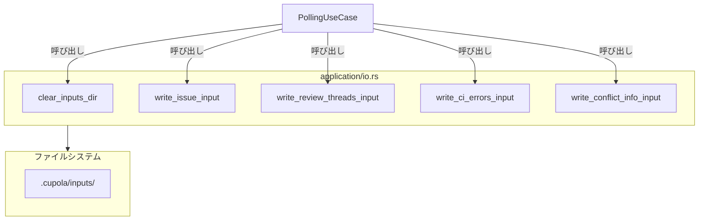
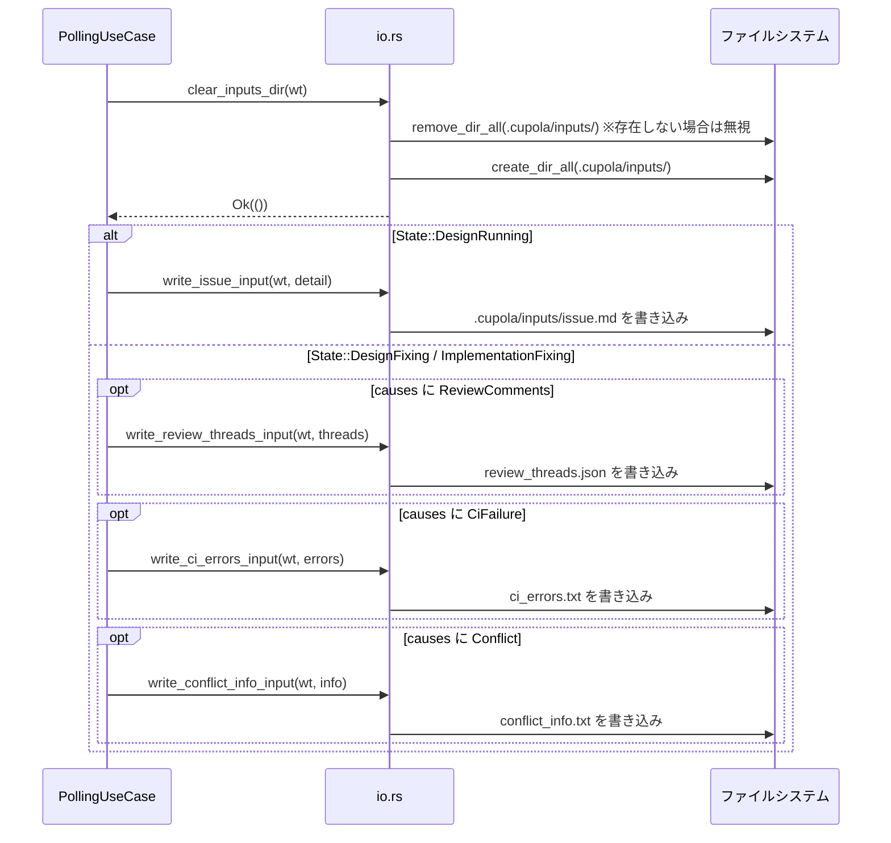

# 設計書: clear-inputs-before-spawn

## Overview

本機能は、`PollingUseCase::prepare_inputs` の冒頭で `.cupola/inputs/` ディレクトリを削除・再作成することで、前回の Fixing フェーズで残留した古い入力ファイルが次の spawn 実行時に Claude Code へ誤読されるバグを修正する。

**Purpose**: 各 spawn 実行前に inputs ディレクトリをクリーンな状態にし、Claude Code が現在のタスクに対応するファイルのみを参照できるようにする。  
**Users**: Cupola 自動化パイプラインの全ステートマシン遷移（`DesignRunning`、`DesignFixing`、`ImplementationFixing`）。  
**Impact**: `prepare_inputs` の先頭に1ステップのクリア処理が追加されるのみで、既存の書き込みロジックおよびエラーハンドリングは変更しない。

### Goals
- `prepare_inputs` 実行後、`.cupola/inputs/` には現在の causes に対応するファイルのみ存在することを保証する
- クリア処理が存在しないディレクトリに対しても正常動作する（べき等性）
- 既存の書き込み関数（`write_issue_input` 等）の動作に影響を与えない

### Non-Goals
- `write_*_input` 関数自体のリファクタリング
- `.cupola/inputs/` 以外のディレクトリのクリア
- ファイル個別のバックアップや差分管理

## Architecture

### Existing Architecture Analysis

`src/application/` レイヤーは以下の構造を持つ：

- `io.rs` — ファイル I/O 専用モジュール。`write_issue_input`、`write_review_threads_input`、`write_ci_errors_input`、`write_conflict_info_input` の4関数を提供。各関数が `create_dir_all` を内部で呼ぶ
- `polling_use_case.rs` — `prepare_inputs` メソッドを持つ use case。`io.rs` の関数を呼び出すことで入力ファイルを生成する

Clean Architecture の方針に従い、ファイル I/O ロジックは `io.rs` に集約する。

### Architecture Pattern & Boundary Map



**Architecture Integration**:
- 選択パターン: 既存の io.rs 集約パターンへの自然な拡張
- 新コンポーネント: `clear_inputs_dir` 関数（io.rs 内）
- 既存パターン維持: application レイヤー内の I/O 関数集約
- Steering 準拠: application レイヤーが domain に依存し、adapter に依存しない原則を維持

### Technology Stack

| Layer | Choice / Version | Role in Feature | Notes |
|-------|------------------|-----------------|-------|
| Backend | Rust (Edition 2024) | クリア処理の実装 | `std::fs` のみ使用、新規依存なし |
| Storage | ローカルファイルシステム | `.cupola/inputs/` の削除・再作成 | `std::fs::remove_dir_all` + `create_dir_all` |

## System Flows



## Requirements Traceability

| 要件 | 概要 | コンポーネント | インターフェース | フロー |
|------|------|--------------|----------------|--------|
| 1.1 | prepare_inputs 呼び出し時に全ファイルを削除してから書き込む | `clear_inputs_dir`, `PollingUseCase::prepare_inputs` | `clear_inputs_dir(worktree_path)` | クリア → 書き込み |
| 1.2 | ディレクトリ不存在時も正常動作 | `clear_inputs_dir` | `remove_dir_all` の NotFound エラーを無視 | — |
| 1.3 | クリア失敗時にエラーを伝播 | `clear_inputs_dir` | `Result<()>` 返却 | — |
| 1.4 | クリア後は causes 対応ファイルのみ存在 | `PollingUseCase::prepare_inputs` + `io.rs` 全体 | — | シーケンス全体 |
| 2.1 | 複数回呼び出しでも毎回クリアして書き込む | `clear_inputs_dir` + `prepare_inputs` | — | — |
| 2.2 | 空ディレクトリに対してエラーなし | `clear_inputs_dir` | — | — |
| 2.3 | クリア対象は inputs/ 直下のみ | `clear_inputs_dir` | パス引数で範囲を限定 | — |
| 3.1–3.5 | 各 State / cause に対応したファイルが引き続き生成される | `PollingUseCase::prepare_inputs` | 既存 `write_*` 関数 | シーケンス |

## Components and Interfaces

| コンポーネント | レイヤー | 目的 | 要件カバレッジ | 主要依存 | コントラクト |
|--------------|---------|------|--------------|---------|------------|
| `clear_inputs_dir` | application/io.rs | inputs ディレクトリの削除・再作成 | 1.1, 1.2, 1.3, 2.1, 2.2, 2.3 | `std::fs` (P0) | Service |
| `PollingUseCase::prepare_inputs` | application | クリア後に inputs ファイルを書き込む | 全要件 | `clear_inputs_dir` (P0), `write_*` 関数 (P0) | Service |

### application/io.rs

#### clear_inputs_dir

| Field | Detail |
|-------|--------|
| Intent | `.cupola/inputs/` ディレクトリを削除してから空の状態で再作成する |
| Requirements | 1.1, 1.2, 1.3, 2.1, 2.2, 2.3 |

**Responsibilities & Constraints**
- `worktree_path.join(".cupola/inputs")` を対象とする
- ディレクトリが存在しない場合（`ErrorKind::NotFound`）は正常として扱う
- それ以外の削除エラーは `Result::Err` として伝播する

**Dependencies**
- External: `std::fs::remove_dir_all` — ディレクトリ再帰削除 (P0)
- External: `std::fs::create_dir_all` — ディレクトリ作成 (P0)

**Contracts**: Service [x]

##### Service Interface

```rust
/// `.cupola/inputs/` ディレクトリを削除してから再作成する。
///
/// # Preconditions
/// - `worktree_path` はワークツリーのルートパスである
///
/// # Postconditions
/// - `worktree_path/.cupola/inputs/` が空のディレクトリとして存在する
///
/// # Errors
/// - `ErrorKind::NotFound` 以外のファイルシステムエラー
pub fn clear_inputs_dir(worktree_path: &Path) -> Result<()>
```

**Implementation Notes**
- Integration: `polling_use_case.rs` の `prepare_inputs` 先頭で `clear_inputs_dir(wt)?` として呼び出す
- Validation: `remove_dir_all` のエラーのうち `io::ErrorKind::NotFound` のみ無視し、それ以外は `with_context` でラップして伝播
- Risks: なし（標準ライブラリの安定 API のみ使用）

### application/polling_use_case.rs

#### PollingUseCase::prepare_inputs（変更箇所）

| Field | Detail |
|-------|--------|
| Intent | inputs ディレクトリをクリアしてから現在の State / causes に応じたファイルを書き込む |
| Requirements | 全要件 |

**Implementation Notes**
- Integration: `match issue.state { ... }` の直前に `clear_inputs_dir(wt)?` を1行追加するのみ
- Validation: `clear_inputs_dir` がエラーを返した場合、既存の `Err(e) → continue` パターンにより当該 Issue の処理をスキップする
- Risks: なし

## Error Handling

### Error Strategy

| エラーケース | 発生箇所 | 対応 |
|------------|---------|------|
| `remove_dir_all` — `NotFound` | `clear_inputs_dir` | 無視して続行（ディレクトリ不存在は正常） |
| `remove_dir_all` — その他 | `clear_inputs_dir` | `with_context` でラップして `Result::Err` を返す |
| `create_dir_all` 失敗 | `clear_inputs_dir` | `with_context` でラップして `Result::Err` を返す |
| `prepare_inputs` 全体失敗 | `polling_use_case.rs` 呼び出し元 | 既存の `tracing::warn!` + `continue` パターンで当該 Issue をスキップ |

### Monitoring

既存の `tracing::warn!(issue_id = issue.id, error = %e, "failed to prepare inputs")` ログが `clear_inputs_dir` のエラーも自動的にカバーする。

## Testing Strategy

### Unit Tests（io.rs）
1. `clear_inputs_dir` — ディレクトリが存在する場合: 全ファイルが削除され空ディレクトリが残ること
2. `clear_inputs_dir` — ディレクトリが存在しない場合: エラーなく完了し空ディレクトリが作成されること
3. `clear_inputs_dir` — 複数回呼び出し: 2回目も正常に完了すること

### Integration Tests（polling_use_case.rs）
1. `prepare_inputs` 呼び出し後の inputs ディレクトリが causes 対応ファイルのみを含むこと（前回ファイル残留なし）
2. `State::DesignRunning` → `State::DesignFixing` の連続実行: `issue.md` が `review_threads.json` のみに置き換わること
3. `State::DesignFixing`（ReviewComments のみ）→ `State::DesignFixing`（CiFailure のみ）: `review_threads.json` が削除され `ci_errors.txt` のみ残ること
