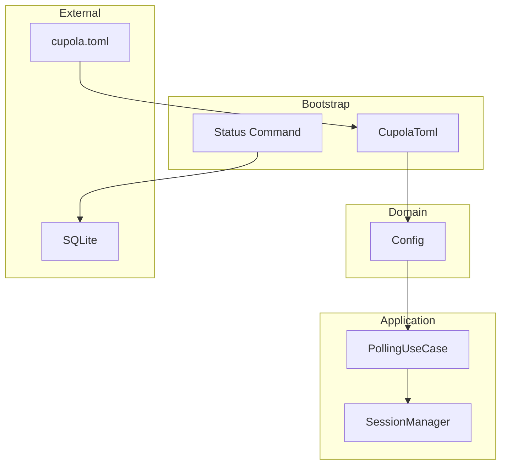
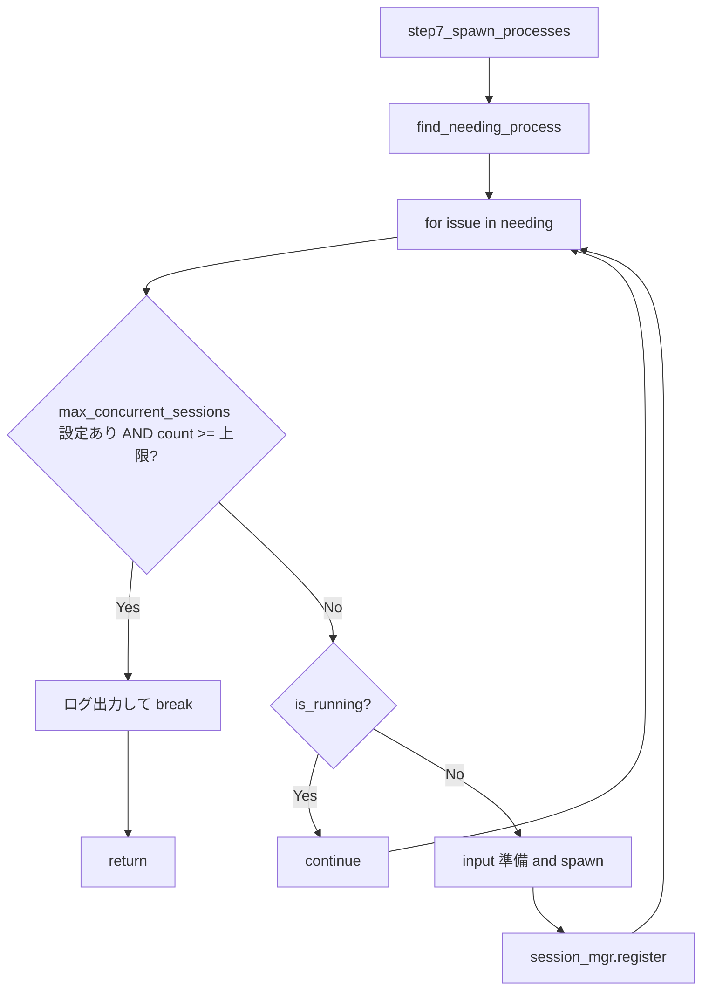

# Design Document

## Overview

**Purpose**: cupola に同時実行セッション数の上限制御を導入し、API rate limit やマシンリソース制約下での安定動作を実現する。
**Users**: cupola の運用者が `cupola.toml` で上限を設定し、`cupola status` で状況を確認する。
**Impact**: PollingUseCase の Step 7 にカウントチェックを追加し、SessionManager にカウント機能を付与する。

### Goals
- `max_concurrent_sessions` 設定による同時実行数の上限制御
- 既存の polling ループを再試行メカニズムとして活用（キューイング不要）
- 設定未指定時は制限なしで動作（後方互換性の維持）
- `cupola status` での実行状態の可視化

### Non-Goals
- 優先度に基づくキューイング
- Issue 単位の実行順序制御
- 別プロセスでの非同期キュー管理
- SessionManager のアーキテクチャ変更

## Architecture

### Existing Architecture Analysis

現在のアーキテクチャは Clean Architecture（domain / application / adapter / bootstrap）に準拠し、以下のコンポーネントが関連する:

- **Config**（domain 層）: `cupola.toml` の設定値を保持する値オブジェクト
- **SessionManager**（application 層）: `HashMap<i64, SessionEntry>` でプロセスを管理
- **PollingUseCase**（application 層）: 7 ステップの polling サイクルを実行
- **Status コマンド**（bootstrap 層）: DB から active issues を取得し表示

既存パターン:
- Optional 設定は `Option<T>` + `#[serde(default)]` で後方互換性を維持
- SessionManager は issue_id をキーとする HashMap で実行中プロセスを追跡
- step7 は for ループで逐次プロセスを起動

### Architecture Pattern & Boundary Map



**Architecture Integration**:
- 選択パターン: 既存の Clean Architecture をそのまま維持
- 各レイヤーの変更範囲は最小限（フィールド追加 + メソッド追加 + 条件分岐追加）
- 新規コンポーネントの追加なし

### Technology Stack

| Layer | Choice / Version | Role in Feature | Notes |
|-------|------------------|-----------------|-------|
| Backend | Rust (Edition 2024) | 全コンポーネントの実装 | 既存 |
| Data / Storage | SQLite (rusqlite) | status コマンドでの状態表示 | 既存 |
| Infrastructure | tokio | polling ループの実行基盤 | 既存 |

新規依存の追加なし。

## System Flows

### Step 7 プロセス起動フロー（変更後）



**Key Decisions**:
- 上限チェックはループ冒頭で毎回実行（`count()` は O(1)）
- 上限到達時は `break` でループを抜ける（残りの Issue は次サイクルで再試行）
- Issue の状態は変更しない（needs_process のまま維持）

## Requirements Traceability

| Requirement | Summary | Components | Interfaces | Flows |
|-------------|---------|------------|------------|-------|
| 1.1 | cupola.toml から max_concurrent_sessions を読み込む | Config, CupolaToml | Config::max_concurrent_sessions | - |
| 1.2 | 未設定時は制限なし | Config, PollingUseCase | - | Step 7 フロー |
| 1.3 | Option<u32> 型で保持 | Config | Config::max_concurrent_sessions | - |
| 2.1 | 上限以上なら起動スキップ | PollingUseCase, SessionManager | SessionManager::count() | Step 7 フロー |
| 2.2 | 上限未満なら通常起動 | PollingUseCase | - | Step 7 フロー |
| 2.3 | 未設定時はチェックスキップ | PollingUseCase | - | Step 7 フロー |
| 3.1 | スキップ時に状態を変更しない | PollingUseCase | - | Step 7 フロー |
| 3.2 | 次サイクルで再試行 | PollingUseCase | - | Step 7 フロー |
| 3.3 | キューイング不要 | - | - | - |
| 4.1 | count() メソッド提供 | SessionManager | SessionManager::count() | - |
| 4.2 | 正確な実行数を返す | SessionManager | SessionManager::count() | - |
| 5.1 | status で実行中プロセス数表示 | StatusCmd | - | - |
| 5.2 | 設定時に上限値も表示 | StatusCmd | - | - |

## Components and Interfaces

| Component | Domain/Layer | Intent | Req Coverage | Key Dependencies | Contracts |
|-----------|--------------|--------|--------------|------------------|-----------|
| Config | domain | 同時実行数上限の設定値を保持 | 1.1, 1.2, 1.3 | なし | State |
| CupolaToml | bootstrap | TOML ファイルから設定を読み込み Config へ変換 | 1.1, 1.2 | Config (P0) | Service |
| SessionManager | application | 実行中セッション数のカウント提供 | 4.1, 4.2 | なし | Service |
| PollingUseCase | application | step7 で上限チェックを実行 | 2.1, 2.2, 2.3, 3.1, 3.2 | SessionManager (P0), Config (P0) | Service |
| StatusCmd | bootstrap | 実行状態の表示 | 5.1, 5.2 | SQLite (P0), Config (P0) | Service |

### Domain Layer

#### Config

| Field | Detail |
|-------|--------|
| Intent | 同時実行数の上限設定値を保持する値オブジェクト |
| Requirements | 1.1, 1.2, 1.3 |

**Responsibilities & Constraints**
- `max_concurrent_sessions` フィールドを `Option<u32>` 型で保持
- `None` は制限なしを意味する
- 純粋な値オブジェクトとして I/O を持たない

**Contracts**: State [x]

##### State Management
- State model: `max_concurrent_sessions: Option<u32>` フィールドを既存 Config struct に追加
- `None` = 制限なし、`Some(n)` = 最大 n 並列実行

### Bootstrap Layer

#### CupolaToml

| Field | Detail |
|-------|--------|
| Intent | cupola.toml の max_concurrent_sessions を読み込み Config に変換 |
| Requirements | 1.1, 1.2 |

**Responsibilities & Constraints**
- TOML ファイルからのデシリアライズ
- `max_concurrent_sessions` 未指定時は `None` にマッピング
- 既存の `into_config()` パターンに従う

**Contracts**: Service [x]

##### Service Interface
```rust
// CupolaToml に追加するフィールド
// max_concurrent_sessions: Option<u32>  (serde default = None)

// into_config() での変換
// config.max_concurrent_sessions = self.max_concurrent_sessions
```
- Preconditions: cupola.toml が存在し読み取り可能
- Postconditions: Config に max_concurrent_sessions が設定される

### Application Layer

#### SessionManager

| Field | Detail |
|-------|--------|
| Intent | 実行中セッション数を返す count() メソッドを提供 |
| Requirements | 4.1, 4.2 |

**Responsibilities & Constraints**
- 既存の HashMap<i64, SessionEntry> の len() を返す
- `collect_exited()` 後は終了済みセッションが除去されているため、常に正確な実行中数を返す

**Contracts**: Service [x]

##### Service Interface
```rust
impl SessionManager {
    /// 現在実行中のセッション数を返す
    pub fn count(&self) -> usize;
}
```
- Preconditions: なし
- Postconditions: 返り値は現在の sessions HashMap のエントリ数と一致
- Invariants: count() は sessions の状態を変更しない（&self）

#### PollingUseCase

| Field | Detail |
|-------|--------|
| Intent | step7 で同時実行数の上限チェックを実行 |
| Requirements | 2.1, 2.2, 2.3, 3.1, 3.2 |

**Dependencies**
- Inbound: なし
- Outbound: SessionManager — count() で実行数を取得 (P0)
- Outbound: Config — max_concurrent_sessions で上限値を取得 (P0)

**Contracts**: Service [x]

##### Service Interface
```rust
// step7_spawn_processes 内の変更箇所（疑似コード）
// for issue in needing {
//     if let Some(max) = self.config.max_concurrent_sessions {
//         if self.session_mgr.count() >= max as usize {
//             tracing::info!(max, "concurrent session limit reached, skipping remaining");
//             break;
//         }
//     }
//     // ... 既存の処理 ...
// }
```
- Preconditions: Step 3（collect_exited）が先に実行され、終了済みセッションが回収済み
- Postconditions: 実行中セッション数が max_concurrent_sessions を超えない
- Invariants: スキップされた Issue の状態は変更されない

### Bootstrap Layer (Status)

#### StatusCmd

| Field | Detail |
|-------|--------|
| Intent | 実行中プロセス数と上限を status コマンドで表示 |
| Requirements | 5.1, 5.2 |

**Dependencies**
- Outbound: SQLite — active issues の取得 (P0)
- Outbound: Config — max_concurrent_sessions の取得 (P0)

**Contracts**: Service [x]

##### Service Interface
```rust
// Status コマンドの出力に追加
// "Running: {running_count}/{max}" (max が設定されている場合)
// "Running: {running_count}" (max が未設定の場合)
```
- running_count は active issues のうち `state.needs_process()` かつ `current_pid.is_some()` のものをカウント

**Implementation Notes**
- Integration: SessionManager は status コマンドからアクセスできないため、DB の current_pid フィールドから推定する
- Validation: Config の読み込みは既存の config_loader を再利用
- Risks: DB ベースのカウントはプロセス異常終了直後にずれる可能性があるが、実用上問題なし

## Data Models

### Domain Model

Config 値オブジェクトへのフィールド追加のみ。新しいエンティティやアグリゲートの追加なし。

```rust
// 既存 Config struct への追加フィールド
pub max_concurrent_sessions: Option<u32>,
```

- `None`: 制限なし（後方互換性）
- `Some(0)`: 制限なしとして扱う（0 は実質的に無意味な値のため）
- `Some(n)` where n > 0: 最大 n 並列実行

### Logical Data Model

cupola.toml のトップレベルに Optional フィールドとして追加:

```toml
# 既存フィールド
owner = "kyuki3rain"
repo = "cupola"
# ...

# 新規フィールド（省略可能）
max_concurrent_sessions = 3
```

DB スキーマの変更なし。

## Error Handling

### Error Strategy
- `max_concurrent_sessions` が TOML でパースできない場合: serde のデシリアライズエラーとして既存のエラーハンドリングで処理
- 上限到達時: エラーではなく正常動作としてログ出力（info レベル）

### Error Categories and Responses
**設定エラー**: 不正な値（負数は u32 で型レベルで排除）→ TOML パースエラーとして報告
**実行時**: 上限到達はエラーではない → info ログ + 次サイクルで再試行

### Monitoring
- 上限到達時に `tracing::info!` でログ出力（現在のカウントと上限値を含む）
- プロセス起動スキップ時にスキップされた Issue 数をログ出力

## Testing Strategy

### Unit Tests
- `SessionManager::count()` が正確な実行中セッション数を返すことを検証
- `count()` が register/collect_exited の前後で正しく更新されることを検証
- Config の `max_concurrent_sessions` が None/Some の両方でデシリアライズされることを検証

### Integration Tests
- `max_concurrent_sessions = 2` の設定で 3 つの needs_process Issue がある場合、2 つだけ起動されることを検証
- `max_concurrent_sessions` 未設定時に全 Issue が起動されることを検証
- 上限到達後、プロセス終了により空きができた次サイクルでスキップ Issue が起動されることを検証
- `max_concurrent_sessions = 0` の場合に制限なしとして動作することを検証

### E2E Tests
- cupola.toml に `max_concurrent_sessions` を設定し、`cupola status` で正しく表示されることを検証
