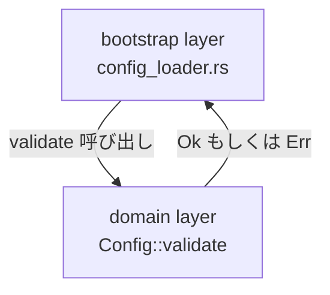
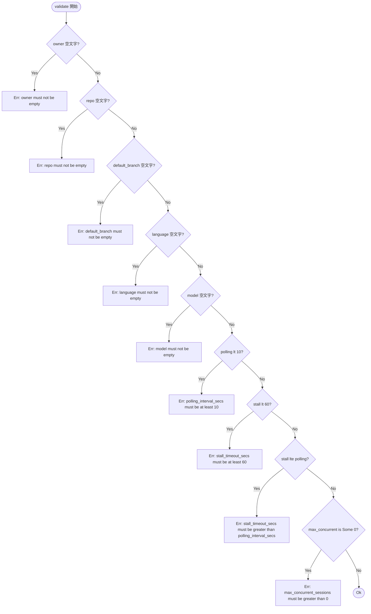

# Design Document: Config::validate() バリデーション強化

## Overview

**Purpose**: 本機能は Cupola の起動時バリデーションを強化し、設定値の不正（空文字列・秒/分の取り違えなど）を早期に検出することで、不正な設定でプロセスが動き続けることを防ぐ。

**Users**: Cupola の運用者（設定ファイルを記述するユーザー）が主な対象。設定ミスを起動直後に明確なエラーメッセージで検知できる。

**Impact**: `src/domain/config.rs` の `Config::validate()` メソッドのみを変更する。既存の `max_concurrent_sessions` チェックは維持し、7 つの新チェックを追加する。

### Goals
- 5 つの文字列フィールド（owner, repo, default_branch, language, model）に対して空文字列禁止を適用する
- `polling_interval_secs` の絶対下限（10 秒）を強制する
- `stall_timeout_secs` の絶対下限（60 秒）と `polling_interval_secs` との大小関係を強制する
- 既存バリデーション（`max_concurrent_sessions`）との共存を保証する

### Non-Goals
- `log_dir` のディレクトリ存在チェック（I/O が必要なため domain 層では扱わない）
- `max_retries` のチェック（`u32` 型で >= 0 は型保証済み）
- `log_level` のチェック（enum で静的保証済み）
- 複数エラーの同時収集（本機能は早期リターン方式を採用）

## Architecture

### Existing Architecture Analysis

`Config` は `src/domain/config.rs` に実装された値オブジェクト（domain 層）。`validate(&self) -> Result<(), String>` は pure な同期関数であり、I/O 依存なし。現在は `max_concurrent_sessions` の 1 チェックのみ。

Clean Architecture の domain 層ルール（no I/O, no external crate dependencies）を完全に維持したまま拡張可能。

### Architecture Pattern & Boundary Map



**Architecture Integration**:
- 対象レイヤー: domain のみ
- 既存パターン: 早期リターン方式（`if ... { return Err(...) }`）を踏襲
- 新規コンポーネント: なし（既存メソッドの拡張のみ）
- Steering 準拠: domain 層に純粋ロジックを集約する原則を維持

### Technology Stack

| Layer | Choice / Version | Role in Feature | Notes |
|-------|------------------|-----------------|-------|
| Backend / Domain | Rust (Edition 2024) | `Config::validate()` 拡張 | 標準ライブラリのみ使用 |

## System Flows

本機能は単一の pure メソッド拡張のため、複雑なフロー図は不要。以下にバリデーション評価順序を示す。



**Key Decision**: `stall_timeout_secs <= polling_interval_secs` の相関チェック（C8）は、両フィールドの絶対下限チェック（C6, C7）を通過した後にのみ評価する（Requirement 4.4）。

## Requirements Traceability

| Requirement | Summary | Components | Interfaces | Flows |
|-------------|---------|------------|------------|-------|
| 1.1 | owner 空文字チェック | Config::validate | validate() | C1 |
| 1.2 | repo 空文字チェック | Config::validate | validate() | C2 |
| 1.3 | 両方空の場合は先に検出したエラーを返す | Config::validate | validate() | C1→C2（早期リターン） |
| 1.4 | 両方非空なら当チェックはエラーなし | Config::validate | validate() | C1→C2→pass |
| 2.1 | polling_interval_secs < 10 でエラー | Config::validate | validate() | C6 |
| 2.2 | 値が 10 のときはエラーなし | Config::validate | validate() | C6 pass |
| 2.3 | 値が 10 超のときはエラーなし | Config::validate | validate() | C6 pass |
| 2.4 | 値が 0 のときエラー（境界値） | Config::validate | validate() | C6 |
| 3.1 | stall_timeout_secs < 60 でエラー | Config::validate | validate() | C7 |
| 3.2 | 値が 60 かつ後続チェック通過なら OK | Config::validate | validate() | C7 pass |
| 3.3 | 値が 60 超かつ後続チェック通過なら OK | Config::validate | validate() | C7 pass |
| 3.4 | 値が 30 のときエラー（典型的誤設定） | Config::validate | validate() | C7 |
| 4.1 | stall <= polling でエラー（絶対下限違反なし前提） | Config::validate | validate() | C8 |
| 4.2 | stall == polling でエラー（境界値） | Config::validate | validate() | C8 |
| 4.3 | stall > polling ならエラーなし | Config::validate | validate() | C8 pass |
| 4.4 | 絶対下限違反時は相関チェックをスキップ | Config::validate | validate() | C6/C7 で早期リターン |
| 5.1 | max_concurrent_sessions Some(0) で既存エラー | Config::validate | validate() | C9 |
| 5.2 | 新旧チェックの共存 | Config::validate | validate() | C1-C9 全体 |
| 5.3 | 全条件満足時 Ok(()) | Config::validate | validate() | OK |
| 6.1 | エラーメッセージにフィールド名を含む | Config::validate | validate() | 全エラーメッセージ |
| 6.2 | 数値系エラーに下限値を含む | Config::validate | validate() | E6, E7 |
| 6.3 | エラーメッセージは英語 | Config::validate | validate() | 全エラーメッセージ |

## Components and Interfaces

| Component | Domain/Layer | Intent | Req Coverage | Key Dependencies | Contracts |
|-----------|--------------|--------|--------------|------------------|-----------|
| Config::validate | domain | 設定値の整合性を一括検証して早期エラーを返す | 1.1–6.3 全件 | なし | Service |

### Domain Layer

#### Config::validate

| Field | Detail |
|-------|--------|
| Intent | 設定値の妥当性を検証し、最初に検出した不正値のエラーを返す |
| Requirements | 1.1, 1.2, 1.3, 1.4, 2.1, 2.2, 2.3, 2.4, 3.1, 3.2, 3.3, 3.4, 4.1, 4.2, 4.3, 4.4, 5.1, 5.2, 5.3, 6.1, 6.2, 6.3 |

**Responsibilities & Constraints**
- 全フィールドのバリデーション責務を単一メソッドで担う
- 純粋関数（I/O なし、副作用なし）を維持
- 早期リターン方式：最初に検出したエラーを返し後続チェックはスキップ
- 絶対下限チェック（Req 2, 3）は相関チェック（Req 4）より先に評価

**Contracts**: Service [x]

##### Service Interface

```rust
impl Config {
    pub fn validate(&self) -> Result<(), String>;
}
```

- Preconditions: なし（self の全フィールドが初期化済みであること）
- Postconditions: 全バリデーションを通過した場合 `Ok(())` を返す。いずれかが失敗した場合は最初に検出したエラーを `Err(String)` で返す
- Invariants: デフォルト値（`Config::default_with_repo` で生成）は常に `Ok(())` を返す

**Implementation Notes**
- 評価順序: owner → repo → default_branch → language → model → polling_interval_secs → stall_timeout_secs → stall vs polling の相関 → max_concurrent_sessions
- 空文字列チェック: `self.owner.is_empty()` パターン（`.trim()` は行わない — 設定ファイルの空白はユーザーの意図とみなす）
- エラーメッセージは英語の小文字スネーク記法（フィールド名はコード上の名前と一致させる）
- Risks: なし（domain 層の pure 関数拡張のみ）

## Error Handling

### Error Strategy

`validate()` は `Result<(), String>` を返す。エラー文字列は起動時ログに出力され、ユーザーが設定ファイルを修正するための情報を提供する。

### Error Categories and Responses

**User Errors（設定ミス）**:

| フィールド | 条件 | エラーメッセージ |
|-----------|------|-----------------|
| owner | 空文字列 | `"owner must not be empty"` |
| repo | 空文字列 | `"repo must not be empty"` |
| default_branch | 空文字列 | `"default_branch must not be empty"` |
| language | 空文字列 | `"language must not be empty"` |
| model | 空文字列 | `"model must not be empty"` |
| polling_interval_secs | < 10 | `"polling_interval_secs must be at least 10"` |
| stall_timeout_secs | < 60 | `"stall_timeout_secs must be at least 60"` |
| stall_timeout_secs | <= polling_interval_secs | `"stall_timeout_secs must be greater than polling_interval_secs"` |
| max_concurrent_sessions | Some(0) | `"max_concurrent_sessions must be greater than 0"` |

## Testing Strategy

### Unit Tests（`#[cfg(test)] mod tests` 内に追加）

**空文字列チェック（各フィールド）**:
- `validate_rejects_empty_owner` — owner が空文字列のとき Err
- `validate_rejects_empty_repo` — repo が空文字列のとき Err
- `validate_rejects_empty_default_branch` — default_branch が空文字列のとき Err
- `validate_rejects_empty_language` — language が空文字列のとき Err
- `validate_rejects_empty_model` — model が空文字列のとき Err

**polling_interval_secs チェック**:
- `validate_rejects_polling_below_minimum` — 9 でエラー
- `validate_accepts_polling_at_minimum` — 10 で OK（stall は適切な値を設定）
- `validate_rejects_polling_zero` — 0 でエラー（境界値）

**stall_timeout_secs 絶対下限チェック**:
- `validate_rejects_stall_below_minimum` — 59 でエラー
- `validate_accepts_stall_at_minimum` — 60 かつ polling=10 未満なら 60 > 10 で OK（相関チェック通過）
- `validate_rejects_stall_typical_misconfig` — 30 でエラー（秒/分取り違えの典型例）

**stall と polling の相関チェック**:
- `validate_rejects_stall_equal_to_polling` — stall == polling でエラー（境界値）
- `validate_rejects_stall_less_than_polling` — stall < polling でエラー
- `validate_accepts_stall_greater_than_polling` — stall > polling で OK
- `validate_skips_correlation_check_when_polling_too_small` — polling=5 のとき correlation ではなく polling の絶対下限エラーが返る

**既存テストのリグレッション確認**:
- 既存 3 テスト（`validate_rejects_zero_max_concurrent_sessions` 等）が引き続きパスすること

**統合確認**:
- `validate_accepts_valid_config` — デフォルト値の Config が Ok(()) を返す
