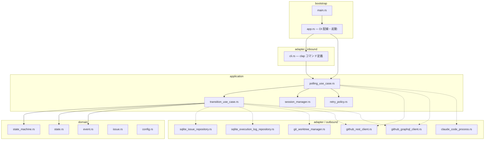
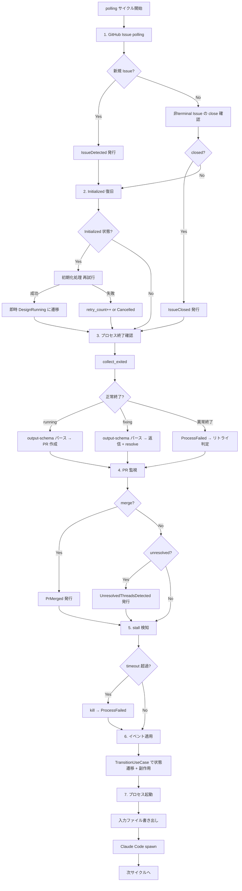
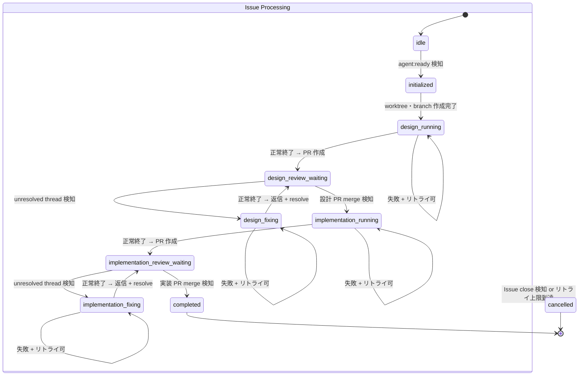
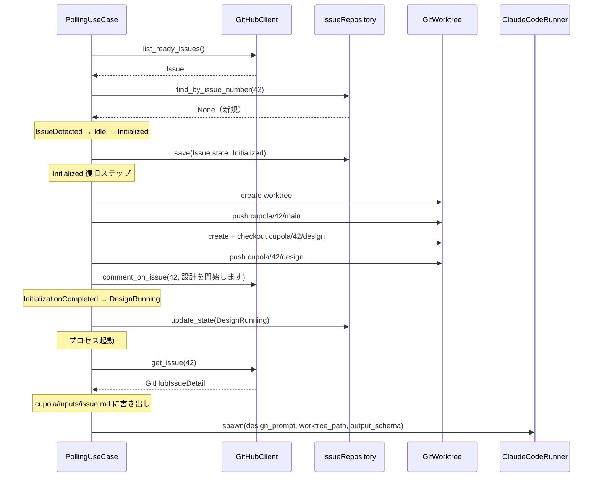
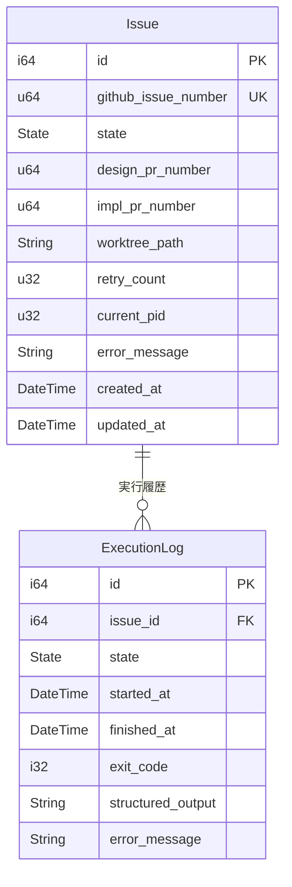

# Cupola 設計書

## Overview

Cupola は GitHub Issue / PR を唯一の操作面とし、Claude Code + cc-sdd を駆動して設計・実装を自動化するローカル常駐エージェントである。Rust で Clean Architecture に基づき、ステートマシン駆動の polling ループで全工程を自動化する。

**Purpose**: Issue 起点の設計・実装ワークフローを完全自動化し、人間のレビュー承認のみで開発を進行可能にする。
**Users**: 開発者（Issue 作成・ラベル付与・レビュー）、レビュアー（PR レビュー・merge）。
**Impact**: 手動の設計ドキュメント作成、実装、PR 作成、レビュー対応の工程を自動化する。

### Goals
- GitHub Issue 検知から設計 PR 作成までの設計フェーズを自動化する
- 設計 PR merge 後の実装フェーズを自動化する
- PR レビュー指摘への修正・返信・resolve を自動化する
- 全工程完了時の cleanup（worktree・branch 削除）を自動化する
- 冪等な再実行と graceful shutdown をサポートする

### Non-Goals
- 同時実行数制限（将来の拡張ポイント）
- Webhook 対応（polling のみで運用）
- 複数リポジトリ対応
- プロンプトの外部ファイル化
- `cupola init` の拡張（steering/settings の初期生成）
- `cupola doctor` コマンド（前提条件チェック）

-----

## Architecture

> 詳細な調査・比較については `research.md` を参照。設計判断の結論は本ドキュメントに記載。

### Architecture Pattern & Boundary Map

Clean Architecture（4 レイヤー）を採用する。ステートマシン駆動のドメインロジックを純粋に保ちつつ、GitHub API・SQLite・Claude Code プロセス等の外部依存をアダプターとして隔離する。



**Architecture Integration**:
- **Selected pattern**: Clean Architecture 4 レイヤー — domain は純粋ロジック、application はユースケース + ポート定義、adapter は外部接続、bootstrap は DI 配線
- **Domain boundaries**: ステートマシン（state + event + transition）が domain に閉じ、GitHub API / SQLite / Claude Code は全て adapter に隔離
- **Existing patterns preserved**: CLAUDE.md の Clean Architecture ルールに準拠（依存方向は内向きのみ）
- **New components rationale**: SessionManager（プロセスライフサイクル管理）、RetryPolicy（リトライ判定）を application 層に配置
- **Steering compliance**: steering ディレクトリが未作成のため、本設計自体がプロジェクトの最初の構造定義となる

### Technology Stack

| Layer | Choice / Version | Role in Feature | Notes |
|-------|------------------|-----------------|-------|
| CLI | `clap` 4.x | CLI 引数パーサ（run / init / status） | adapter/inbound |
| Runtime | `tokio` 1.x | 非同期ランタイム、シグナルハンドリング | bootstrap, adapter |
| GitHub REST | `octocrab` 0.x | Issue / PR の CRUD 操作 | adapter/outbound |
| GitHub GraphQL | `reqwest` 0.x | review thread 取得・返信・resolve | adapter/outbound |
| Storage | `rusqlite` 0.x | SQLite アクセス（WAL モード） | adapter/outbound |
| Serialization | `serde` / `serde_json` 1.x | JSON シリアライズ | 全レイヤー（derive） |
| Config | `toml` 0.x | cupola.toml パース | bootstrap |
| Logging | `tracing` / `tracing-subscriber` / `tracing-appender` 0.x | 構造化ログ、日付別ファイル出力 | 全レイヤー（cross-cutting） |
| Error | `thiserror` 1.x / `anyhow` 1.x | エラー型定義・伝搬 | domain〜bootstrap |
| DateTime | `chrono` 0.x | 日時処理 | 全レイヤー（cross-cutting） |

-----

## System Flows

### Polling サイクル全体フロー



### 状態遷移図



### 初期化フロー（idle → design_running）



-----

## Requirements Traceability

| Requirement | Summary | Components | Interfaces | Flows |
|-------------|---------|------------|------------|-------|
| 1.1 | agent:ready Issue 検知 | PollingUseCase, GitHubClient | GitHubClient::list_ready_issues | Polling サイクル Step1 |
| 1.2 | worktree/branch 初期化 | TransitionUseCase, GitWorktree | GitWorktree::create, create_branch, push | 初期化フロー |
| 1.3 | initialized → design_running 遷移 | StateMachine, TransitionUseCase | StateMachine::transition | 状態遷移図 |
| 1.4 | 初期化失敗時の再試行 | PollingUseCase, RetryPolicy | RetryPolicy::evaluate | Polling サイクル Step2 |
| 1.5 | terminal レコードの上書きリセット | IssueRepository | IssueRepository::reset_for_restart | — |
| 2.1 | Issue 本文取得・入力ファイル書き出し | PollingUseCase, GitHubClient | GitHubClient::get_issue | Polling サイクル Step7 |
| 2.2 | Claude Code 正常終了 → PR 作成 | PollingUseCase, GitHubClient | GitHubClient::create_pr | Polling サイクル Step3 |
| 2.3 | design_review_waiting 遷移 | StateMachine | StateMachine::transition | 状態遷移図 |
| 2.4 | 失敗時リトライ | PollingUseCase, RetryPolicy | RetryPolicy::evaluate | Polling サイクル Step3 |
| 2.5 | リトライ上限 → cancelled | StateMachine, TransitionUseCase | StateMachine::transition | 状態遷移図 |
| 3.1 | 設計 PR merge 監視 | PollingUseCase, GitHubClient | GitHubClient::is_pr_merged | Polling サイクル Step4 |
| 3.2 | merge → implementation_running | StateMachine, TransitionUseCase, GitWorktree | GitWorktree::checkout, pull | 状態遷移図 |
| 3.3 | unresolved thread → design_fixing | PollingUseCase, GitHubClient | GitHubClient::list_unresolved_threads | Polling サイクル Step4 |
| 4.1 | review thread 取得・入力ファイル書き出し | PollingUseCase, GitHubClient | GitHubClient::list_unresolved_threads | Polling サイクル Step7 |
| 4.2 | fixing 正常終了 → 返信 + resolve | PollingUseCase, GitHubClient | GitHubClient::reply_to_thread, resolve_thread | Polling サイクル Step3 |
| 4.3 | fixing → review_waiting 遷移 | StateMachine | StateMachine::transition | 状態遷移図 |
| 4.4 | output-schema パース失敗 → フォールバック | PollingUseCase | — | Polling サイクル Step3 |
| 4.5 | fixing 失敗時リトライ | PollingUseCase, RetryPolicy | RetryPolicy::evaluate | Polling サイクル Step3 |
| 5.1 | 実装フェーズ Claude Code 起動 | PollingUseCase, ClaudeCodeRunner | ClaudeCodeRunner::spawn | Polling サイクル Step7 |
| 5.2 | 実装 PR 作成 | PollingUseCase, GitHubClient | GitHubClient::create_pr | Polling サイクル Step3 |
| 5.3 | implementation_review_waiting 遷移 | StateMachine | StateMachine::transition | 状態遷移図 |
| 5.4 | 実装失敗時リトライ | PollingUseCase, RetryPolicy | RetryPolicy::evaluate | Polling サイクル Step3 |
| 5.5 | リトライ上限 → cancelled | StateMachine, TransitionUseCase | StateMachine::transition | 状態遷移図 |
| 6.1 | 実装 PR merge/thread 監視 | PollingUseCase, GitHubClient | GitHubClient::is_pr_merged, list_unresolved_threads | Polling サイクル Step4 |
| 6.2 | merge → completed | StateMachine, TransitionUseCase | StateMachine::transition | 状態遷移図 |
| 6.3 | unresolved → implementation_fixing | StateMachine | StateMachine::transition | 状態遷移図 |
| 6.4 | completed 時の cleanup | TransitionUseCase, GitWorktree, GitHubClient | GitWorktree::remove, delete_branch; GitHubClient::close_issue | Cleanup フロー |
| 7.1 | Issue close → cancelled | PollingUseCase, StateMachine | GitHubClient::is_issue_open | Polling サイクル Step1 |
| 7.2 | リトライ上限 → cancelled | StateMachine, RetryPolicy | RetryPolicy::evaluate | Polling サイクル Step3 |
| 7.3 | cancelled 時の cleanup | TransitionUseCase, SessionManager, GitWorktree | SessionManager::kill; GitWorktree::remove, delete_branch | Cleanup フロー |
| 7.4 | 冪等 cleanup | GitWorktree | GitWorktree::remove, delete_branch | — |
| 7.5 | Issue close コメント | TransitionUseCase, GitHubClient | GitHubClient::comment_on_issue | — |
| 7.6 | リトライ上限コメント + Issue close | TransitionUseCase, GitHubClient | GitHubClient::comment_on_issue, close_issue | — |
| 8.1 | stall 検知 | SessionManager | SessionManager::find_stalled | Polling サイクル Step5 |
| 8.2 | stall → kill → ProcessFailed | SessionManager, PollingUseCase | SessionManager::kill | Polling サイクル Step5 |
| 8.3 | stall 後のリトライ判定 | RetryPolicy | RetryPolicy::evaluate | Polling サイクル Step5 |
| 9.1 | cupola.toml 読み込み | Config, bootstrap | — | — |
| 9.2 | CLI フラグ上書き | CLI, bootstrap | — | — |
| 9.3 | cupola run | PollingUseCase, bootstrap | — | — |
| 9.4 | cupola init | SQLite スキーマ初期化 | — | — |
| 9.5 | cupola status | IssueRepository | IssueRepository::find_active | — |
| 9.6 | 設定読み込み失敗 → 起動中断 | bootstrap | — | — |
| 10.1 | 再起動時 PID クリア | IssueRepository | IssueRepository::find_active | — |
| 10.2 | needs_process → 再起動 | PollingUseCase, SessionManager | SessionManager::is_running | Polling サイクル Step7 |
| 10.3 | PR 重複防止 | GitHubClient | GitHubClient::find_pr_by_branches | — |
| 10.4 | graceful shutdown | PollingUseCase, SessionManager | SessionManager::kill_all | — |
| 11.1 | GitHub API 全操作は Cupola 担当 | GitHubClient（全メソッド） | — | — |
| 11.2 | 入力ファイル書き出し | PollingUseCase | — | Polling サイクル Step7 |
| 11.3 | output-schema で構造化出力 | ClaudeCodeRunner, PollingUseCase | ClaudeCodeRunner::spawn | — |
| 11.4 | Claude Code 起動フラグ | ClaudeCodeRunner | ClaudeCodeRunner::spawn | — |
| 12.1 | 構造化ログ | tracing（cross-cutting） | — | — |
| 12.2 | 日付別ファイル出力 | tracing-appender, bootstrap | — | — |
| 12.3 | ログポイント記録 | 全コンポーネント | — | — |
| 12.4 | ログレベルフィルタ | bootstrap | — | — |

-----

## Components and Interfaces

### Component Summary

| Component | Domain/Layer | Intent | Req Coverage | Key Dependencies | Contracts |
|-----------|-------------|--------|--------------|------------------|-----------|
| State | domain | 状態 enum 定義 | 1.3, 3.2, 6.2 | — | — |
| Event | domain | イベント enum 定義 | 全状態遷移 | — | — |
| StateMachine | domain | 純粋関数による状態遷移 | 全状態遷移 | State, Event | Service |
| Issue | domain | Issue エンティティ | 全 | — | — |
| Config | domain | 設定値オブジェクト | 9.1, 9.2 | — | — |
| IssueRepository | application (port) | Issue 永続化ポート | 1.1, 1.5, 10.1 | Issue | Service |
| ExecutionLogRepository | application (port) | 実行ログ永続化ポート | 2.4, 4.5 | — | Service |
| GitHubClient | application (port) | GitHub 操作ポート | 1.1, 2.1, 3.1, 4.1, 7.1, 11.1 | — | Service |
| ClaudeCodeRunner | application (port) | Claude Code 起動ポート | 2.2, 5.1, 11.3 | — | Service |
| GitWorktree | application (port) | Git worktree 操作ポート | 1.2, 3.2, 6.4, 7.3 | — | Service |
| PollingUseCase | application | メイン polling ループ | 全 | GitHubClient, IssueRepo, SessionMgr, TransitionUC (P0) | Service |
| TransitionUseCase | application | 状態遷移 + 副作用 | 全状態遷移 | StateMachine, IssueRepo, GitHubClient, GitWorktree (P0) | Service |
| SessionManager | application | プロセスライフサイクル管理 | 8.1, 10.2, 10.4 | — | Service, State |
| RetryPolicy | application | リトライ判定 | 2.4, 4.5, 5.4, 8.3 | — | Service |
| GitHubClientImpl | adapter/outbound | GitHubClient trait の facade 実装（REST + GraphQL を合成） | 11.1 | github_rest_client, github_graphql_client (P0) | — |
| github_rest_client | adapter/outbound | GitHub REST API 実装 | 11.1 | octocrab (P0) | — |
| github_graphql_client | adapter/outbound | GitHub GraphQL API 実装 | 4.1, 4.2, 11.1 | reqwest (P0) | — |
| sqlite_issue_repository | adapter/outbound | IssueRepository 実装 | 1.1, 1.5, 10.1 | rusqlite (P0) | — |
| sqlite_execution_log_repository | adapter/outbound | ExecutionLogRepository 実装 | 2.4 | rusqlite (P0) | — |
| claude_code_process | adapter/outbound | ClaudeCodeRunner 実装 | 2.2, 5.1, 11.3, 11.4 | Claude Code CLI (P0) | — |
| git_worktree_manager | adapter/outbound | GitWorktree 実装 | 1.2, 3.2, 6.4, 7.3 | git CLI (P0) | — |
| cli | adapter/inbound | CLI 定義（clap） | 9.2, 9.3, 9.4, 9.5 | clap (P0) | — |
| bootstrap/app | bootstrap | DI 配線・起動 | 9.1, 9.6 | 全 adapter (P0) | — |

-----

### Domain Layer

#### State

| Field | Detail |
|-------|--------|
| Intent | Issue のライフサイクル状態を表す enum |
| Requirements | 全状態遷移 |

**Responsibilities & Constraints**
- 10 状態の enum 定義（Idle, Initialized, DesignRunning, DesignReviewWaiting, DesignFixing, ImplementationRunning, ImplementationReviewWaiting, ImplementationFixing, Completed, Cancelled）
- ヘルパーメソッド: `needs_process()`, `is_terminal()`, `is_review_waiting()`
- I/O 依存なし、derive macros（Debug, Clone, Copy, PartialEq, Eq）のみ

**Contracts**: State [x]

##### State Management
- State model: 10 状態の有限状態機械
- Persistence: SQLite の TEXT カラムに文字列として永続化
- Concurrency: 単一の polling ループが排他的にアクセス

#### Event

| Field | Detail |
|-------|--------|
| Intent | 状態遷移を引き起こすイベントを表す enum |
| Requirements | 全状態遷移 |

**Responsibilities & Constraints**
- GitHub 起因イベント: IssueDetected, IssueClosed, DesignPrMerged, ImplementationPrMerged, UnresolvedThreadsDetected
- 内部起因イベント: InitializationCompleted, ProcessCompletedWithPr, ProcessCompleted, ProcessFailed, RetryExhausted
- I/O 依存なし

#### StateMachine

| Field | Detail |
|-------|--------|
| Intent | 純粋関数として現在状態 + イベントから次状態を決定する |
| Requirements | 全状態遷移 |

**Contracts**: Service [x]

##### Service Interface
```rust
pub struct StateMachine;

impl StateMachine {
    pub fn transition(current: &State, event: &Event) -> Result<State, TransitionError>;
}
```
- Preconditions: current が有効な State、event が有効な Event
- Postconditions: 有効な遷移なら Ok(次状態)、無効な遷移なら Err(TransitionError)
- Invariants: 純粋関数（副作用なし）、全 (State, Event) の組み合わせが網羅的に処理される

#### Issue

| Field | Detail |
|-------|--------|
| Intent | Issue の状態と関連データを保持するエンティティ |
| Requirements | 全 |

**Responsibilities & Constraints**
- フィールド: id, github_issue_number, state, design_pr_number, impl_pr_number, worktree_path, retry_count, current_pid, error_message, created_at, updated_at
- 全フィールドは pub（domain 内でのみ構築・更新）

#### Config

| Field | Detail |
|-------|--------|
| Intent | cupola.toml の設定値を保持する値オブジェクト |
| Requirements | 9.1, 9.2 |

**Responsibilities & Constraints**
- フィールド: owner, repo, default_branch, language, polling_interval_secs, max_retries, stall_timeout_secs, log_level, log_dir
- `default_with_repo()` ファクトリメソッドでデフォルト値を生成
- I/O 依存なし

-----

### Application Layer — Ports

#### IssueRepository

| Field | Detail |
|-------|--------|
| Intent | Issue の永続化を抽象化するポート |
| Requirements | 1.1, 1.5, 10.1 |

**Contracts**: Service [x]

##### Service Interface
```rust
pub trait IssueRepository: Send + Sync {
    fn find_by_id(&self, id: i64) -> Result<Option<Issue>>;
    fn find_by_issue_number(&self, issue_number: u64) -> Result<Option<Issue>>;
    fn find_active(&self) -> Result<Vec<Issue>>;
    fn find_needing_process(&self) -> Result<Vec<Issue>>;
    fn save(&self, issue: &Issue) -> Result<i64>;
    fn update_state(&self, id: i64, state: State) -> Result<()>;
    fn update(&self, issue: &Issue) -> Result<()>;
    fn reset_for_restart(&self, id: i64) -> Result<()>;
}
```
- `find_active()`: 非 terminal 状態の Issue 一覧を返す
- `find_needing_process()`: `needs_process()` が true の Issue 一覧を返す
- `reset_for_restart()`: cancelled レコードを idle にリセットする（14.2 準拠）

#### ExecutionLogRepository

| Field | Detail |
|-------|--------|
| Intent | Claude Code 実行ログの永続化を抽象化するポート |
| Requirements | 2.4, 4.5 |

**Contracts**: Service [x]

##### Service Interface
```rust
pub trait ExecutionLogRepository: Send + Sync {
    fn record_start(&self, issue_id: i64, state: State) -> Result<i64>;
    fn record_finish(
        &self,
        log_id: i64,
        exit_code: Option<i32>,
        structured_output: Option<&str>,
        error_message: Option<&str>,
    ) -> Result<()>;
    fn find_by_issue(&self, issue_id: i64) -> Result<Vec<ExecutionLog>>;
}
```

#### GitHubClient

| Field | Detail |
|-------|--------|
| Intent | GitHub API 操作を統一的に抽象化するポート（REST/GraphQL の区別はアプリケーション層から隠蔽） |
| Requirements | 1.1, 2.1, 3.1, 3.3, 4.1, 4.2, 7.1, 7.5, 7.6, 11.1 |

**Contracts**: Service [x]

##### Service Interface
```rust
#[async_trait]
pub trait GitHubClient: Send + Sync {
    async fn list_ready_issues(&self) -> Result<Vec<GitHubIssue>>;
    async fn get_issue(&self, issue_number: u64) -> Result<GitHubIssueDetail>;
    async fn is_issue_open(&self, issue_number: u64) -> Result<bool>;
    async fn find_pr_by_branches(&self, head: &str, base: &str) -> Result<Option<GitHubPr>>;
    async fn is_pr_merged(&self, pr_number: u64) -> Result<bool>;
    async fn list_unresolved_threads(&self, pr_number: u64) -> Result<Vec<ReviewThread>>;
    async fn create_pr(&self, head: &str, base: &str, title: &str, body: &str) -> Result<u64>;
    async fn reply_to_thread(&self, thread_id: &str, body: &str) -> Result<()>;
    async fn resolve_thread(&self, thread_id: &str) -> Result<()>;
    async fn comment_on_issue(&self, issue_number: u64, body: &str) -> Result<()>;
    async fn close_issue(&self, issue_number: u64) -> Result<()>;
}
```
- `owner` / `repo` はコンストラクタで受け取り、各メソッドでは暗黙的に使用
- REST API メソッド: list_ready_issues, get_issue, is_issue_open, find_pr_by_branches, is_pr_merged, create_pr, comment_on_issue, close_issue
- GraphQL API メソッド: list_unresolved_threads, reply_to_thread, resolve_thread

**関連データ型**:
```rust
pub struct GitHubIssue { pub number: u64, pub title: String }
pub struct GitHubIssueDetail { pub number: u64, pub title: String, pub body: String, pub labels: Vec<String> }
pub struct GitHubPr { pub number: u64, pub merged: bool }
pub struct ReviewThread { pub id: String, pub path: String, pub line: Option<u32>, pub comments: Vec<ReviewComment> }
pub struct ReviewComment { pub author: String, pub body: String }
```

#### ClaudeCodeRunner

| Field | Detail |
|-------|--------|
| Intent | Claude Code 子プロセスの起動を抽象化するポート |
| Requirements | 2.2, 5.1, 11.3, 11.4 |

**Contracts**: Service [x]

##### Service Interface
```rust
pub trait ClaudeCodeRunner: Send + Sync {
    fn spawn(
        &self,
        prompt: &str,
        working_dir: &Path,
        json_schema: Option<&str>,
    ) -> Result<std::process::Child>;
}
```
- 起動フラグ: `-p`, `--output-format json`, `--dangerously-skip-permissions`, `--json-schema`（オプション）
- stdout/stderr は `Stdio::piped()` で取得

#### GitWorktree

| Field | Detail |
|-------|--------|
| Intent | Git worktree およびブランチ操作を抽象化するポート |
| Requirements | 1.2, 3.2, 6.4, 7.3, 7.4 |

**Contracts**: Service [x]

##### Service Interface
```rust
pub trait GitWorktree: Send + Sync {
    fn create(&self, path: &Path, branch: &str, start_point: &str) -> Result<()>;
    fn remove(&self, path: &Path) -> Result<()>;
    fn create_branch(&self, worktree_path: &Path, branch: &str) -> Result<()>;
    fn checkout(&self, worktree_path: &Path, branch: &str) -> Result<()>;
    fn pull(&self, worktree_path: &Path) -> Result<()>;
    fn push(&self, worktree_path: &Path, branch: &str) -> Result<()>;
    fn delete_branch(&self, branch: &str) -> Result<()>;
}
```
- 全操作は冪等: 対象が存在しない場合はスキップ
- `delete_branch` はローカル + リモートの両方を削除

-----

### Application Layer — Use Cases

#### PollingUseCase

| Field | Detail |
|-------|--------|
| Intent | メイン polling ループの 7 ステップを制御するオーケストレーター |
| Requirements | 全 |

**Dependencies**
- Inbound: bootstrap — 起動・shutdown シグナル (P0)
- Outbound: GitHubClient, IssueRepository, ExecutionLogRepository, ClaudeCodeRunner — 全外部操作 (P0)
- Internal: TransitionUseCase, SessionManager, RetryPolicy (P0)

**Contracts**: Service [x]

**型パラメータの方針**: PollingUseCase は 5 つのポート（GitHubClient, IssueRepository, ExecutionLogRepository, ClaudeCodeRunner, GitWorktree — GitWorktree は TransitionUseCase 経由）に依存する。polling ループは 60 秒間隔で実行されるため、動的ディスパッチのオーバーヘッドは無視できる。実装時に `Arc<dyn Trait>` による動的ディスパッチでジェネリクスを削減するか、静的ディスパッチ（ジェネリクス）のまま進めるかは実装者の判断に委ねる。テスタビリティを優先する場合は trait object が有利。

**Responsibilities & Constraints**
- 7 ステップの順序制御（Issue polling → Initialized 復旧 → プロセス終了確認 → PR 監視 → stall 検知 → イベント適用 → プロセス起動）
- 入力ファイルの書き出し（design_running: issue.md、fixing: review_threads.json）
- output-schema のパースと後処理（PR 作成 / コメント返信 + resolve）
- プロンプト構築（`build_session_config` による状態別プロンプト + output-schema 選択）

##### State Management
- State model: polling ループは `tokio::select!` で interval timer と shutdown signal を待機
- Persistence: 状態は TransitionUseCase 経由で SQLite に永続化
- Concurrency: 単一ループ（同時実行なし）

#### TransitionUseCase

| Field | Detail |
|-------|--------|
| Intent | イベントを受け取り、状態遷移を適用し、遷移に伴う副作用を実行する |
| Requirements | 全状態遷移 |

**Dependencies**
- Outbound: GitHubClient, IssueRepository, ExecutionLogRepository, GitWorktree (P0)

**Contracts**: Service [x]

**副作用テーブル**:

| 遷移 | 副作用 |
|------|--------|
| Idle → Initialized | SQLite にレコード作成（terminal レコードは上書きリセット） |
| Initialized → DesignRunning | worktree 作成、branch 作成・push、Issue コメント、**retry_count = 0** |
| DesignRunning → DesignReviewWaiting | **retry_count = 0** |
| DesignReviewWaiting → DesignFixing | **retry_count = 0** |
| DesignFixing → DesignReviewWaiting | **retry_count = 0** |
| DesignReviewWaiting → ImplementationRunning | checkout issue-main、git pull、Issue コメント、**retry_count = 0** |
| ImplementationRunning → ImplementationReviewWaiting | **retry_count = 0** |
| ImplementationReviewWaiting → ImplementationFixing | **retry_count = 0** |
| ImplementationFixing → ImplementationReviewWaiting | **retry_count = 0** |
| * → Completed | SQLite 先行更新、Issue close、worktree 削除、branch 削除 |
| * → Cancelled | SQLite 先行更新、プロセス停止、Issue close、worktree 削除、branch 削除、Issue コメント |
| ProcessFailed（同状態リトライ） | retry_count++、execution_log 記録 |

> **設計判断**: retry_count は全ての正常な状態遷移でリセットされる（要件 10.5 準拠）。各フェーズは独立して max_retries 回のリトライ機会を持つ。

#### SessionManager

| Field | Detail |
|-------|--------|
| Intent | Claude Code 子プロセスのライフサイクルをメモリ上で管理する |
| Requirements | 8.1, 10.2, 10.4 |

**Contracts**: Service [x] / State [x]

##### Service Interface
```rust
pub struct SessionManager {
    sessions: HashMap<i64, SessionEntry>,
}

impl SessionManager {
    pub fn register(&mut self, issue_id: i64, child: Child);
    pub fn collect_exited(&mut self) -> Vec<ExitedSession>;
    pub fn is_running(&self, issue_id: i64) -> bool;
    pub fn kill(&mut self, issue_id: i64) -> Result<()>;
    pub fn kill_all(&mut self);
    pub fn find_stalled(&self, timeout: Duration) -> Vec<i64>;
}
```

##### State Management
- State model: `HashMap<i64, SessionEntry>`（issue_id → Child + started_at + stdout/stderr JoinHandle）
- Persistence: メモリのみ（再起動時は空で開始）
- Concurrency: 単一 polling ループからのみアクセス

**ExitedSession**:
```rust
pub struct ExitedSession {
    pub issue_id: i64,
    pub exit_status: ExitStatus,
    pub stdout: String,
    pub stderr: String,
}
```

#### RetryPolicy

| Field | Detail |
|-------|--------|
| Intent | リトライ可否を判定する |
| Requirements | 2.4, 4.5, 5.4, 8.3 |

**Contracts**: Service [x]

##### Service Interface
```rust
pub struct RetryPolicy { max_retries: u32 }

impl RetryPolicy {
    pub fn new(max_retries: u32) -> Self;
    pub fn evaluate(&self, current_retry_count: u32) -> RetryDecision;
}

pub enum RetryDecision { Retry, Exhausted }
```

-----

### Application Layer — Prompt & Output Schema

#### SessionConfig

プロンプトと output-schema を状態に応じて構築する。

```rust
pub fn build_session_config(
    state: State, issue_number: u64, config: &Config, pr_number: Option<u64>,
) -> SessionConfig;

pub struct SessionConfig {
    pub prompt: String,
    pub output_schema: OutputSchemaKind,
}

pub enum OutputSchemaKind {
    PrCreation,  // { pr_title: string, pr_body: string }
    Fixing,      // { threads: [{ thread_id: string, response: string, resolved: boolean }] }
}
```

**output-schema JSON（PR 作成用）**:
```json
{
  "type": "object",
  "properties": {
    "pr_title": { "type": "string", "description": "PR のタイトル" },
    "pr_body": { "type": "string", "description": "PR の body（Markdown）" }
  },
  "required": ["pr_title", "pr_body"]
}
```

**output-schema JSON（fixing 用）**:
```json
{
  "type": "object",
  "properties": {
    "threads": {
      "type": "array",
      "items": {
        "type": "object",
        "properties": {
          "thread_id": { "type": "string" },
          "response": { "type": "string" },
          "resolved": { "type": "boolean" }
        },
        "required": ["thread_id", "response", "resolved"]
      }
    }
  },
  "required": ["threads"]
}
```

**フォールバック値（PR 作成失敗時）**:
- design: `"Design: Issue #N"` / `"Related: #N\n\n---\n🤖 Generated by Cupola via cc-sdd"`
- implementation: `"Implement: Issue #N"` / `"Closes #N\n\n---\n🤖 Generated by Cupola via cc-sdd"`

-----

### Adapter Layer — Outbound

#### GitHubClient の合成方式

`GitHubClient` trait は REST API と GraphQL API のメソッドを統合した単一 trait である。adapter 層では facade パターンにより、内部で REST クライアントと GraphQL クライアントに委譲する。

```rust
pub struct GitHubClientImpl {
    rest: OctocrabRestClient,
    graphql: GraphQLClient,
}

#[async_trait]
impl GitHubClient for GitHubClientImpl {
    // REST API に委譲
    async fn list_ready_issues(&self) -> Result<Vec<GitHubIssue>> {
        self.rest.list_ready_issues().await
    }
    // GraphQL API に委譲
    async fn list_unresolved_threads(&self, pr_number: u64) -> Result<Vec<ReviewThread>> {
        self.graphql.list_unresolved_threads(pr_number).await
    }
    // ... 他メソッドも同様
}
```

bootstrap 層での DI 配線: `OctocrabRestClient` と `GraphQLClient` を個別に生成し、`GitHubClientImpl` に注入する。認証トークンは両クライアントで共有する。

#### github_rest_client

| Field | Detail |
|-------|--------|
| Intent | octocrab を使用した GitHub REST API の実装 |
| Requirements | 11.1 |

**Dependencies**
- External: octocrab — GitHub REST API クライアント (P0)
- External: `gh auth token` or `GITHUB_TOKEN` 環境変数 — 認証 (P0)

**REST API 操作一覧**:

| 操作 | API | 用途 |
|------|-----|------|
| Issue 一覧取得 | `GET /repos/{owner}/{repo}/issues?labels=agent:ready&state=open` | 新規 Issue 検知 |
| PR 作成 | `POST /repos/{owner}/{repo}/pulls` | 設計/実装 PR 作成 |
| PR 検索 | `GET /repos/{owner}/{repo}/pulls?head={head}&base={base}&state=open` | 冪等性チェック |
| PR 取得 | `GET /repos/{owner}/{repo}/pulls/{pr_number}` | merge 状態確認 |
| Issue 詳細取得 | `GET /repos/{owner}/{repo}/issues/{issue_number}` | Issue 本文取得 |
| Issue 状態確認 | `GET /repos/{owner}/{repo}/issues/{issue_number}` | close 検知 |
| Issue コメント投稿 | `POST /repos/{owner}/{repo}/issues/{issue_number}/comments` | 状態通知 |
| Issue close | `PATCH /repos/{owner}/{repo}/issues/{issue_number}` | completed/cancelled 時 |

#### github_graphql_client

| Field | Detail |
|-------|--------|
| Intent | reqwest を使用した GitHub GraphQL API の実装（review thread 操作） |
| Requirements | 4.1, 4.2, 11.1 |

**Dependencies**
- External: reqwest — HTTP クライアント (P0)

**GraphQL 操作一覧**:

| 操作 | Mutation/Query | 用途 |
|------|----------------|------|
| unresolved thread 取得 | `query { repository { pullRequest { reviewThreads } } }` | fixing 入力準備 |
| thread に返信 | `mutation { addPullRequestReviewThreadReply }` | fixing 後処理 |
| thread を resolve | `mutation { resolveReviewThread }` | fixing 後処理 |

**Implementation Notes**
- pagination: `first: 100` + cursor-based pagination（reviewThreads と comments の両方）
- octocrab の GraphQL サポートは型安全性が限定的なため、reqwest + serde_json::Value でパース

#### sqlite_issue_repository / sqlite_execution_log_repository

| Field | Detail |
|-------|--------|
| Intent | rusqlite を使用した IssueRepository / ExecutionLogRepository の実装 |
| Requirements | 1.1, 1.5, 2.4, 10.1 |

**Dependencies**
- External: rusqlite — SQLite バインディング (P0)

**Implementation Notes**
- 接続管理: `Arc<Mutex<Connection>>`（std::sync::Mutex）
- 全 DB 操作を `tokio::task::spawn_blocking` でラップ
- 初期化プラグマ: `PRAGMA journal_mode = WAL; PRAGMA busy_timeout = 5000; PRAGMA foreign_keys = ON; PRAGMA journal_size_limit = 67108864;`

#### claude_code_process

| Field | Detail |
|-------|--------|
| Intent | std::process::Command による Claude Code 子プロセス起動の実装 |
| Requirements | 2.2, 5.1, 11.3, 11.4 |

**Dependencies**
- External: Claude Code CLI（`claude` コマンド） (P0)

**Implementation Notes**
- 起動フラグ: `-p`, `--output-format json`, `--dangerously-skip-permissions`, `--json-schema`（オプション）
- stdout/stderr: `Stdio::piped()` で取得、register 時に読み取りスレッドを起動

#### git_worktree_manager

| Field | Detail |
|-------|--------|
| Intent | std::process::Command による git worktree / branch 操作の実装 |
| Requirements | 1.2, 3.2, 6.4, 7.3, 7.4 |

**Dependencies**
- External: git CLI (P0)

**Implementation Notes**
- 初期化: `git worktree add -b ... HEAD` → `git push -u origin ...` → `git checkout -b ...` → `git push -u origin ...`
- Cleanup: `git worktree remove --force` → `git branch -D` → `git push origin --delete`（各コマンドは個別にエラーハンドリング、存在しない場合はスキップ）
- プロセス起動前の `index.lock` 削除（野良プロセス対策）

-----

### Adapter Layer — Inbound

#### cli

| Field | Detail |
|-------|--------|
| Intent | clap による CLI コマンド定義 |
| Requirements | 9.2, 9.3, 9.4, 9.5 |

**Dependencies**
- External: clap 4.x (P0)

**コマンド体系**:
```
cupola <COMMAND>
  run [--polling-interval-secs N] [--log-level LEVEL] [--config PATH]
  init
  status
  help
```

-----

### Bootstrap Layer

#### app

| Field | Detail |
|-------|--------|
| Intent | DI 配線、設定読み込み、ランタイム起動 |
| Requirements | 9.1, 9.6 |

**Responsibilities & Constraints**
- cupola.toml パース（toml クレート）→ Config 構築
- CLI フラグによるオーバーライド適用
- 各 adapter の具象型を生成し、application 層のユースケースに注入
- tracing-subscriber の初期化（log_dir 有無で出力先を分岐）
- tokio ランタイム起動
- SIGINT ハンドラ登録（graceful shutdown）

-----

## Data Models

### Domain Model



**Business Rules & Invariants**:
- Issue の state は StateMachine::transition が許可する遷移のみ可能
- retry_count は状態遷移時にリセット（0 に戻す）
- completed / cancelled 遷移時は SQLite を先に更新してから副作用を実行
- execution_log は削除しない（デバッグ用に蓄積）

### Physical Data Model

**issues テーブル**:
```sql
CREATE TABLE IF NOT EXISTS issues (
    id                  INTEGER PRIMARY KEY,
    github_issue_number INTEGER UNIQUE NOT NULL,
    state               TEXT NOT NULL DEFAULT 'idle',
    design_pr_number    INTEGER,
    impl_pr_number      INTEGER,
    worktree_path       TEXT,
    retry_count         INTEGER NOT NULL DEFAULT 0,
    current_pid         INTEGER,
    created_at          TEXT NOT NULL DEFAULT (datetime('now')),
    updated_at          TEXT NOT NULL DEFAULT (datetime('now')),
    error_message       TEXT
);
```

**execution_log テーブル**:
```sql
CREATE TABLE IF NOT EXISTS execution_log (
    id                INTEGER PRIMARY KEY,
    issue_id          INTEGER NOT NULL REFERENCES issues(id),
    state             TEXT NOT NULL,
    started_at        TEXT NOT NULL DEFAULT (datetime('now')),
    finished_at       TEXT,
    exit_code         INTEGER,
    structured_output TEXT,
    error_message     TEXT
);

CREATE INDEX IF NOT EXISTS idx_execution_log_issue_id
    ON execution_log(issue_id);
```

-----

## Error Handling

### Error Strategy

`thiserror` でドメイン・アプリケーション層のエラー型を定義し、`anyhow` でアダプター・bootstrap 層のエラーを伝搬する。

```rust
#[derive(Debug, thiserror::Error)]
pub enum CupolaError {
    #[error("domain error: {0}")]
    Domain(String),
    #[error("database error: {0}")]
    Database(#[from] rusqlite::Error),
    #[error("github error: {0}")]
    GitHub(String),
    #[error("claude code error: {0}")]
    ClaudeCode(String),
    #[error("git error: {0}")]
    Git(String),
    #[error("config error: {0}")]
    Config(String),
}
```

### Error Categories and Responses

| エラー発生箇所 | 挙動 |
|---------------|------|
| GitHub API 呼び出し失敗 | ログ記録、次サイクルで再試行。状態遷移しない |
| SQLite 書き込み失敗 | ログ記録、次サイクルで再試行。状態遷移しない |
| Claude Code 異常終了 | ProcessFailed → リトライ判定 |
| Claude Code stall | kill → ProcessFailed → リトライ判定 |
| PR 作成失敗（running 時） | ProcessFailed → リトライ判定 |
| コメント返信/resolve 失敗（fixing 時） | ログ記録、ProcessCompleted 発行。次回 polling で再検知 |
| Git 操作失敗 | ログ記録。初期化中は次サイクルで再試行 |
| Cleanup 中のエラー | ログ記録、状態遷移はブロックしない |
| 設定ファイル読み込み失敗 | 起動中断、エラーメッセージ表示 |

### Monitoring

- `tracing` による構造化ログ（issue_number, state フィールドをスパンに含む）
- ログポイント: polling サイクル開始/終了、イベント検知、状態遷移（from → to）、プロセス起動/終了（PID, exit_code）、GitHub API 呼び出し（エンドポイント, ステータス）、エラー発生

-----

## Testing Strategy

### Unit Tests
- **StateMachine::transition**: 全 (State, Event) 組み合わせの遷移テスト（正常遷移 + 不正遷移）
- **RetryPolicy::evaluate**: リトライ可/上限到達の判定テスト
- **State ヘルパーメソッド**: needs_process(), is_terminal(), is_review_waiting() の全状態テスト
- **Config パース**: cupola.toml の正常パース + 必須項目欠損時のエラー
- **output-schema パース**: PR 作成用 / fixing 用の正常パース + フォールバック

### Integration Tests
- **PollingUseCase**: モック adapter を注入し、1 サイクルの全ステップを通したフローテスト
- **TransitionUseCase**: 状態遷移 + 副作用実行の統合テスト（SQLite in-memory + モック GitHub/Git）
- **SQLite Repository**: issues / execution_log の CRUD 操作テスト（in-memory DB）
- **SessionManager**: プロセス登録・collect_exited・kill のライフサイクルテスト

### E2E Tests
- **Happy path**: Issue 検知 → 設計 → レビュー → 実装 → merge → completed の全工程テスト
- **キャンセルフロー**: Issue close → cancelled → cleanup の全工程テスト
- **リトライフロー**: プロセス失敗 → リトライ → 上限到達 → cancelled の全工程テスト

-----

## Security Considerations

- Claude Code は `--dangerously-skip-permissions` フラグ付きで起動する。**信頼されたリポジトリでのみ使用**すること
- Claude Code の実行は Issue 単位の独立した worktree 内に隔離される
- GitHub 認証は `gh auth token` または `GITHUB_TOKEN` 環境変数で取得。トークンはプロセスの環境変数としてのみ保持し、ログに出力しない
- `.cupola/cupola.db`, `.cupola/logs/`, `.cupola/inputs/` は `.gitignore` で git 追跡から除外

-----

## 設定・CLI（原本 Section 7）

### cupola.toml スキーマ

```toml
# .cupola/cupola.toml
owner = "kyuki3rain"
repo = "my-project"
default_branch = "main"
language = "ja"
polling_interval_secs = 60
max_retries = 3
stall_timeout_secs = 1800

[log]
level = "info"
dir = ".cupola/logs"
```

**パース用構造体**:
```rust
#[derive(Debug, Deserialize)]
pub struct CupolaToml {
    pub owner: String,
    pub repo: String,
    pub default_branch: String,
    pub language: Option<String>,
    pub polling_interval_secs: Option<u64>,
    pub max_retries: Option<u32>,
    pub stall_timeout_secs: Option<u64>,
    pub log: Option<LogToml>,
}

#[derive(Debug, Deserialize)]
pub struct LogToml {
    pub level: Option<String>,
    pub dir: Option<String>,
}
```

**優先順位**: CLI フラグ > cupola.toml > デフォルト値

-----

## Claude Code プロンプト設計（原本 Section 6）

プロンプトは Rust コード内に文字列定数として定義する。`format!` マクロによる変数置換で構築。

### design_running プロンプト
- 入力: `.cupola/inputs/issue.md`
- 手順: cc-sdd init → requirements → design → tasks → commit/push
- output-schema: PrCreation（pr_title, pr_body）

### implementation_running プロンプト
- 入力: なし（worktree 内の設計成果物）
- 手順: cc-sdd spec-impl → commit/push
- output-schema: PrCreation（pr_title, pr_body）

### fixing プロンプト（design/implementation 共通）
- 入力: `.cupola/inputs/review_threads.json`
- 手順: 修正 → commit/push
- output-schema: Fixing（threads 配列）

### 入力ファイルフォーマット

**`.cupola/inputs/issue.md`**:
```markdown
# Issue #{issue_number}: {title}

## Labels
{labels}

## Body
{issue_body}
```

**`.cupola/inputs/review_threads.json`**:
```json
[
  {
    "thread_id": "PRRT_abc123",
    "path": ".cupola/specs/feature/design.md",
    "line": 42,
    "comments": [
      { "author": "reviewer", "body": "指摘内容" }
    ]
  }
]
```

-----

## Graceful Shutdown（原本 Section 4.3）

1. Ctrl+C（SIGINT）受信 → polling ループ停止
2. 全プロセスに SIGTERM 送信
3. 最大 10 秒待機（try_wait でポーリング）
4. 生存プロセスに SIGKILL 送信

再起動時: SessionManager は空で開始。DB 上の `current_pid` を NULL にクリア。`needs_process()` な Issue は次サイクルで再起動。
