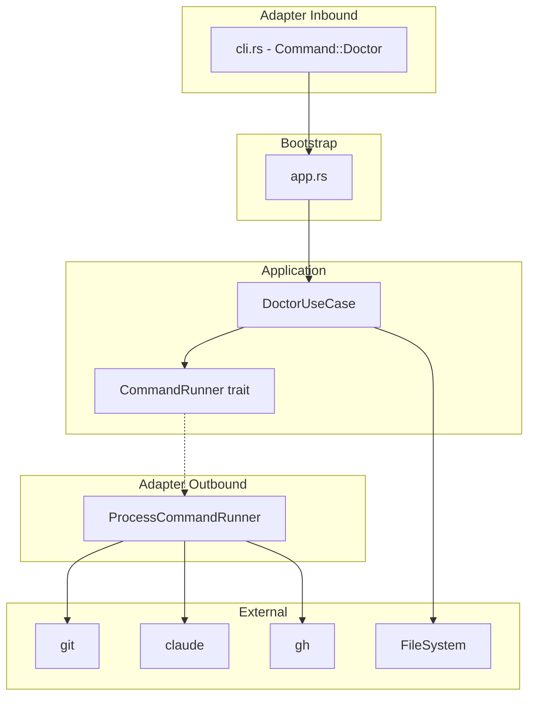
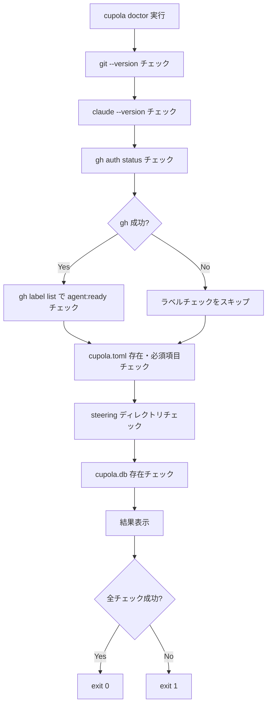

# Design Document: cupola-doctor

## Overview

**Purpose**: `cupola doctor` コマンドは、cupola の実行に必要な前提条件（外部ツール、設定ファイル、プロジェクト構成）を自動的にチェックし、結果を視覚的に表示する診断機能を提供する。

**Users**: cupola を利用する開発者が、初回セットアップ時やトラブルシューティング時に環境の正当性を確認する。

**Impact**: 既存の CLI に `doctor` サブコマンドを追加し、Clean Architecture の各層に最小限のコンポーネントを追加する。

### Goals
- 7 つの前提条件を順番にチェックし、✅/❌ で結果を表示する
- 失敗項目に対して具体的な修正手順を提示する
- 全パス時 exit 0、失敗あり時 exit 1 を返す
- 既存アーキテクチャパターンに従い、テスト可能な設計とする

### Non-Goals
- チェック項目の自動修復（修正手順の表示のみ）
- ネットワーク接続テストやパフォーマンス計測
- 設定ファイルの内容の詳細なバリデーション（必須項目の存在チェックのみ）

## Architecture

### Existing Architecture Analysis

現在の cupola CLI は Clean Architecture に基づき、以下の構成を持つ:
- **Inbound adapter**: `cli.rs` で `Command` enum（`Run`, `Init`, `Status`）を定義
- **Bootstrap**: `app.rs` で `match cli.command` によるディスパッチ
- **Application**: use case + port trait による責務分離

`doctor` コマンドは `Init`/`Status` と同様、引数なしのシンプルなサブコマンドとして追加する。

### Architecture Pattern & Boundary Map



**Architecture Integration**:
- **Selected pattern**: 既存の Clean Architecture を踏襲。application 層に use case、port trait を配置
- **Domain boundary**: `CheckResult` を domain 層に配置し、チェック結果を型安全に表現
- **Existing patterns preserved**: port trait → adapter 実装、bootstrap での DI
- **New components rationale**: `DoctorUseCase`（チェックオーケストレーション）、`CommandRunner`（外部コマンド抽象化）、`ProcessCommandRunner`（実装）
- **Steering compliance**: Clean Architecture の依存方向ルール、命名規約を維持

### Technology Stack

| Layer | Choice / Version | Role in Feature | Notes |
|-------|------------------|-----------------|-------|
| CLI | clap 4 (derive) | `Doctor` サブコマンド定義 | 既存の `Command` enum を拡張 |
| Application | Rust std | use case ロジック、ファイルシステムチェック | 新規クレート不要 |
| External Commands | std::process::Command | git/claude/gh の実行 | 同期実行で十分 |
| Config | toml 0.8 + serde | cupola.toml のパース・検証 | 既存の `config_loader` を再利用 |

## System Flows



**Key Decisions**:
- チェックは順次実行。gh 認証結果に基づきラベルチェックの実行/スキップを判定
- スキップされたチェックは失敗としてカウントしない

## Requirements Traceability

| Requirement | Summary | Components | Interfaces | Flows |
|-------------|---------|------------|------------|-------|
| 1.1 | doctor サブコマンド実行 | Command enum, DoctorUseCase | - | メインフロー全体 |
| 1.2 | ヘルプ出力に含める | Command enum | - | - |
| 2.1 | git チェック | DoctorUseCase, CommandRunner | CommandRunner::run | C1 |
| 2.2 | claude チェック | DoctorUseCase, CommandRunner | CommandRunner::run | C2 |
| 2.3 | gh auth チェック | DoctorUseCase, CommandRunner | CommandRunner::run | C3 |
| 2.4 | コマンド失敗時の記録 | DoctorUseCase | CheckResult | - |
| 3.1 | agent:ready ラベルチェック | DoctorUseCase, CommandRunner | CommandRunner::run | C4 |
| 3.2 | ラベルチェックのスキップ | DoctorUseCase | CheckResult | C4Skip |
| 4.1 | cupola.toml 存在確認 | DoctorUseCase | - | C5 |
| 4.2 | 必須項目検証 | DoctorUseCase, config_loader | load_toml | C5 |
| 4.3 | 設定チェック失敗記録 | DoctorUseCase | CheckResult | - |
| 5.1 | steering ディレクトリチェック | DoctorUseCase | - | C6 |
| 5.2 | cupola.db 存在確認 | DoctorUseCase | - | C7 |
| 5.3 | steering チェック失敗記録 | DoctorUseCase | CheckResult | - |
| 6.1 | 成功時 ✅ 表示 | DoctorUseCase | CheckResult | Display |
| 6.2 | 失敗時 ❌ 表示 | DoctorUseCase | CheckResult | Display |
| 6.3 | 修正手順表示 | DoctorUseCase | CheckResult | Display |
| 7.1 | exit 0 | app.rs | - | Exit0 |
| 7.2 | exit 1 | app.rs | - | Exit1 |

## Components and Interfaces

| Component | Domain/Layer | Intent | Req Coverage | Key Dependencies | Contracts |
|-----------|--------------|--------|--------------|------------------|-----------|
| CheckResult | domain | チェック結果の型表現 | 2.4, 3.2, 6.1-6.3 | なし | - |
| CommandRunner | application/port | 外部コマンド実行の抽象化 | 2.1-2.3, 3.1 | なし | Service |
| DoctorUseCase | application | チェック実行のオーケストレーション | 1.1, 2.1-5.3, 6.1-6.3 | CommandRunner (P0), config_loader (P1) | Service |
| ProcessCommandRunner | adapter/outbound | CommandRunner の実装 | 2.1-2.3, 3.1 | std::process::Command (P0) | Service |
| Command::Doctor | adapter/inbound | CLI サブコマンド定義 | 1.1, 1.2 | clap (P0) | - |

### Domain Layer

#### CheckResult

| Field | Detail |
|-------|--------|
| Intent | 個々のチェック項目の結果を型安全に表現する |
| Requirements | 2.4, 3.2, 6.1, 6.2, 6.3 |

**Responsibilities & Constraints**
- チェック名、結果ステータス（成功/失敗/スキップ）、修正手順を保持
- 純粋なデータ構造。I/O 依存なし

**Contracts**: State [x]

##### State Management

```rust
pub enum CheckStatus {
    Pass,
    Fail,
    Skipped,
}

pub struct CheckResult {
    pub name: String,
    pub status: CheckStatus,
    pub remedy: Option<String>,
}
```

- `Pass`: チェック成功（✅ 表示）
- `Fail`: チェック失敗（❌ 表示、`remedy` に修正手順を格納）
- `Skipped`: 前提条件未達によりスキップ（失敗としてカウントしない）

### Application Layer

#### CommandRunner (Port)

| Field | Detail |
|-------|--------|
| Intent | 外部コマンド実行を抽象化し、テスタビリティを確保する |
| Requirements | 2.1, 2.2, 2.3, 3.1 |

**Responsibilities & Constraints**
- コマンド名と引数を受け取り、実行結果（成功/失敗、stdout）を返す
- 実行の詳細はアダプター層に委譲

**Contracts**: Service [x]

##### Service Interface

```rust
pub struct CommandOutput {
    pub success: bool,
    pub stdout: String,
    pub stderr: String,
}

pub trait CommandRunner: Send + Sync {
    fn run(&self, program: &str, args: &[&str]) -> Result<CommandOutput>;
}
```

- Preconditions: `program` は空文字列でないこと
- Postconditions: コマンドが存在しない場合も `CommandOutput { success: false, ... }` を返す（パニックしない）
- Invariants: 同期実行。タイムアウトは設けない（doctor のチェックは短時間で完了するため）

#### DoctorUseCase

| Field | Detail |
|-------|--------|
| Intent | 全チェック項目を順番に実行し、結果リストを返す |
| Requirements | 1.1, 2.1-5.3, 6.1-6.3 |

**Responsibilities & Constraints**
- 7 つのチェック項目を定められた順序で実行
- gh 認証チェックの結果に基づき、ラベルチェックの実行/スキップを判定
- 設定ファイルのチェックには既存の `config_loader::load_toml()` を再利用
- 結果の表示（stdout 出力）も本 use case 内で行う

**Dependencies**
- Inbound: app.rs — コマンドディスパッチ (P0)
- Outbound: CommandRunner — 外部コマンド実行 (P0)
- External: config_loader::load_toml — TOML パース (P1)
- External: std::fs — ファイル/ディレクトリ存在確認 (P1)

**Contracts**: Service [x]

##### Service Interface

```rust
impl DoctorUseCase {
    pub fn new(command_runner: Box<dyn CommandRunner>) -> Self;
    pub fn run(&self) -> Vec<CheckResult>;
}
```

- Preconditions: なし（どの環境でも実行可能）
- Postconditions: 全チェック項目の `CheckResult` を含む `Vec` を返す
- Invariants: チェック順序は固定（git → claude → gh → label → toml → steering → db）

**Implementation Notes**
- Integration: `app.rs` の match 分岐から直接呼び出し。結果に基づき exit code を設定
- Validation: `cupola.toml` の必須項目チェックは `load_toml()` のエラーで判定
- Risks: `gh label list --json name` の出力フォーマット依存。`--json` フラグで安定化

### Adapter Layer

#### ProcessCommandRunner

| Field | Detail |
|-------|--------|
| Intent | `std::process::Command` を使用して外部コマンドを実行する |
| Requirements | 2.1, 2.2, 2.3, 3.1 |

**Responsibilities & Constraints**
- `CommandRunner` trait の実装
- `std::process::Command::output()` で同期的にコマンドを実行
- コマンドが見つからない場合も `CommandOutput { success: false }` として処理

**Dependencies**
- External: std::process::Command — OS コマンド実行 (P0)

**Contracts**: Service [x]

##### Service Interface

`CommandRunner` trait を実装。追加の公開インターフェースなし。

```rust
pub struct ProcessCommandRunner;

impl CommandRunner for ProcessCommandRunner {
    fn run(&self, program: &str, args: &[&str]) -> Result<CommandOutput> {
        // std::process::Command::new(program).args(args).output()
        // を使用し、結果を CommandOutput に変換
    }
}
```

**Implementation Notes**
- Integration: `app.rs` でインスタンス化し、`DoctorUseCase` に注入
- Risks: パスにコマンドが存在しない場合、`output()` は `Err` を返す。これを `success: false` に変換

## Data Models

### Domain Model

本機能は永続化を行わないため、データモデルは `CheckResult` と `CheckStatus` のみ。上記 Components セクションで定義済み。

## Error Handling

### Error Strategy

`doctor` コマンドはエラーを「チェック失敗」として表現するため、Rust の `Result`/`anyhow` による通常のエラーハンドリングとは異なるアプローチを取る。

### Error Categories and Responses

**外部コマンドエラー**: コマンド未発見・実行失敗 → `CheckResult { status: Fail, remedy: "インストール手順" }`
**設定ファイルエラー**: ファイル未存在・パースエラー → `CheckResult { status: Fail, remedy: "設定手順" }`
**ファイルシステムエラー**: ディレクトリ/ファイル未存在 → `CheckResult { status: Fail, remedy: "初期化手順" }`

各チェックの修正手順:

| チェック項目 | 修正手順メッセージ |
|---|---|
| git | `git をインストールしてください: https://git-scm.com/` |
| claude | `Claude Code CLI をインストールしてください: npm install -g @anthropic-ai/claude-code` |
| gh auth | `gh auth login を実行して認証してください` |
| agent:ready label | `gh label create agent:ready を実行してラベルを作成してください` |
| cupola.toml | `.cupola/cupola.toml を作成し、owner, repo, default_branch を設定してください` |
| steering | `.cupola/steering/ にステアリングファイルを配置してください` |
| cupola.db | `cupola init を実行してデータベースを初期化してください` |

## Testing Strategy

### Unit Tests
- `DoctorUseCase::run()`: モック `CommandRunner` を注入し、各チェックの成功/失敗パターンを検証
- `CheckResult` の表示フォーマット: ✅/❌ アイコンと修正手順の出力を検証
- gh 認証失敗時のラベルチェックスキップ動作を検証
- `cupola.toml` 必須項目欠落時のチェック失敗を検証

### Integration Tests
- `ProcessCommandRunner` の実際のコマンド実行テスト（`git --version` など）
- 全チェック成功時の exit code 0 を検証
- 一部チェック失敗時の exit code 1 を検証
- tempdir を使用したファイルシステムチェックの検証
