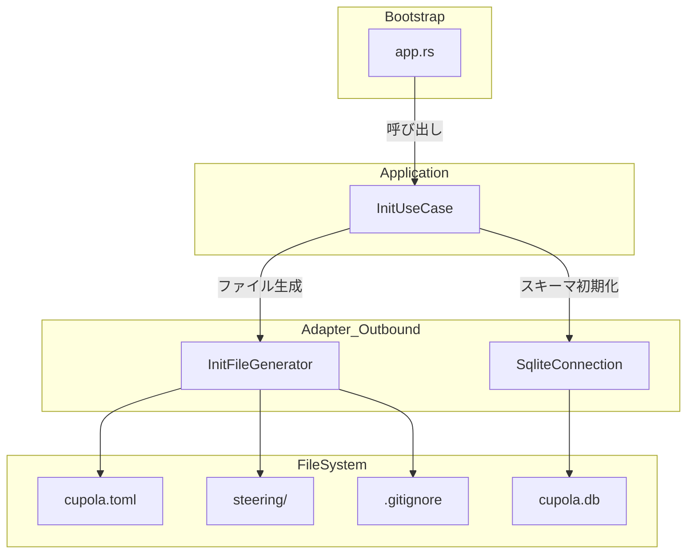
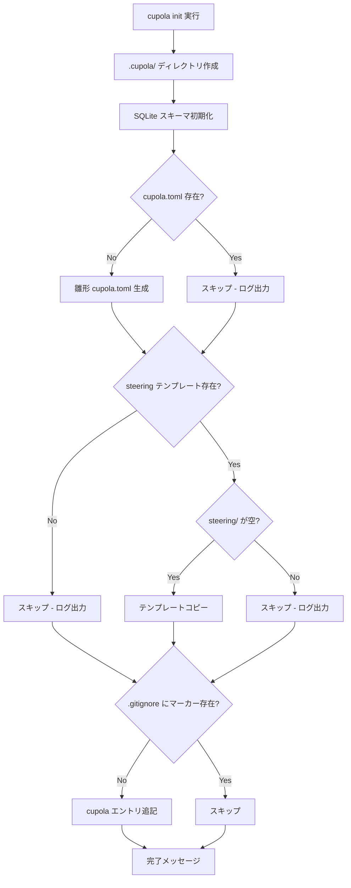

# Design Document: cupola-init-extension

## Overview

**Purpose**: `cupola init` コマンドを拡張し、SQLite スキーマ初期化に加えて cupola.toml 雛形生成、steering テンプレートコピー、.gitignore エントリ追記を自動実行する。開発者は単一コマンドで cupola の初期セットアップを完了できる。

**Users**: cupola を新規リポジトリにセットアップする開発者が、手動ファイル作成なしに初期化を完了するために使用する。

**Impact**: 現在の `app.rs` 内インライン SQLite 初期化を `InitUseCase` に抽出し、4つの初期化ステップを追加する。

### Goals
- 単一コマンドでプロジェクト初期セットアップを完了
- 既存の SQLite 初期化機能を維持
- 冪等な設計で安全に繰り返し実行可能
- Clean Architecture に準拠した実装

### Non-Goals
- 対話的な入力プロンプト
- cc-sdd のインストール処理
- GitHub ラベルの自動作成
- cupola.toml のバリデーションや自動入力

## Architecture

### Existing Architecture Analysis

現在の `cupola init` は `src/bootstrap/app.rs` の `Command::Init` match 式内にインライン実装されている:
- `.cupola/` ディレクトリ作成
- `SqliteConnection::open()` → `init_schema()`
- 成功メッセージ出力

拡張にあたり、以下の制約を維持する:
- adapter 層の `SqliteConnection` インターフェースは変更しない
- `config_loader.rs` の既存パースロジックには影響しない
- CLI 定義（`Command::Init`）は引数追加なし

### Architecture Pattern & Boundary Map



**Architecture Integration**:
- **Selected pattern**: Clean Architecture — 既存パターンを踏襲し application 層に use case を追加
- **Domain boundaries**: init 処理は application 層の `InitUseCase` が統括し、ファイル操作は adapter 層の `InitFileGenerator` に委譲
- **Existing patterns preserved**: `SqliteConnection::init_schema()` は変更なし。bootstrap 層は DI とルーティングのみ
- **New components rationale**: `InitUseCase` は初期化ロジックの統括、`InitFileGenerator` はファイルシステム操作の責務分離のため
- **Steering compliance**: structure.md の Clean Architecture 方針、tech.md の Rust 技術スタックに準拠

### Technology Stack

| Layer | Choice / Version | Role in Feature | Notes |
|-------|------------------|-----------------|-------|
| CLI | clap 4 (derive) | `Command::Init` サブコマンド定義 | 変更なし |
| Application | Rust std | InitUseCase 実装 | 新規追加 |
| Storage | rusqlite 0.35 | SQLite スキーマ初期化 | 既存維持 |
| File I/O | std::fs | ファイル生成・コピー・追記 | 新規使用 |
| Logging | tracing | スキップ・エラーのログ出力 | 既存活用 |

## System Flows

### init コマンド実行フロー



**Key Decisions**:
- 各ステップは論理的に独立しており、スキップ条件や冪等チェックの結果は他ステップに影響しないが、致命的エラー（特にファイル操作エラー）発生時はその時点で処理を中断し、`cupola init` を失敗させる（fail-fast）
- SQLite 初期化を最初に実行（既存動作の維持を最優先）
- 全ステップでスキップ理由や非致命的な注意事項をログ出力し、致命的エラー時はエラーメッセージを出力して即時終了する

## Requirements Traceability

| Requirement | Summary | Components | Interfaces | Flows |
|-------------|---------|------------|------------|-------|
| 1.1 | SQLite スキーマ初期化 | SqliteConnection | init_schema() | init フロー Step 2 |
| 1.2 | 初期化済み DB の冪等処理 | SqliteConnection | init_schema() | init フロー Step 2 |
| 2.1 | cupola.toml 雛形生成 | InitFileGenerator | generate_toml_template() | init フロー Step 3 |
| 2.2 | 既存 cupola.toml スキップ | InitFileGenerator | generate_toml_template() | init フロー Step 3 |
| 3.1 | steering テンプレートコピー | InitFileGenerator | copy_steering_templates() | init フロー Step 4 |
| 3.2 | 既存 steering スキップ | InitFileGenerator | copy_steering_templates() | init フロー Step 4 |
| 3.3 | テンプレート不在時スキップ | InitFileGenerator | copy_steering_templates() | init フロー Step 4 |
| 4.1 | .gitignore エントリ追記 | InitFileGenerator | append_gitignore_entries() | init フロー Step 5 |
| 4.2 | .gitignore 重複追記防止 | InitFileGenerator | append_gitignore_entries() | init フロー Step 5 |
| 4.3 | .gitignore 新規作成 | InitFileGenerator | append_gitignore_entries() | init フロー Step 5 |
| 5.1 | 全体冪等性 | InitUseCase | run() | 全フロー |
| 5.2 | 2回実行時の全スキップ | InitUseCase | run() | 全フロー |
| 6.1 | 対話入力なし | InitUseCase | — | — |
| 6.2 | cc-sdd インストールなし | InitUseCase | — | — |
| 6.3 | GitHub ラベル作成なし | InitUseCase | — | — |

## Components and Interfaces

| Component | Domain/Layer | Intent | Req Coverage | Key Dependencies | Contracts |
|-----------|--------------|--------|--------------|-----------------|-----------|
| InitUseCase | Application | init 処理全体の統括 | 1.1-6.3 | SqliteConnection (P0), InitFileGenerator (P0) | Service |
| InitFileGenerator | Adapter/Outbound | ファイル生成・コピー操作 | 2.1-4.3 | std::fs (P0) | Service |
| SqliteConnection | Adapter/Outbound | SQLite スキーマ初期化 | 1.1, 1.2 | rusqlite (P0) | Service |

### Application Layer

#### InitUseCase

| Field | Detail |
|-------|--------|
| Intent | init コマンドの全初期化ステップを統括し、順次実行する |
| Requirements | 1.1, 1.2, 2.1, 2.2, 3.1, 3.2, 3.3, 4.1, 4.2, 4.3, 5.1, 5.2, 6.1, 6.2, 6.3 |

**Responsibilities & Constraints**
- 5つの初期化ステップ（ディレクトリ作成、SQLite、cupola.toml、steering、.gitignore）を順次実行
- 各ステップの成否をログ出力
- ステップ間の依存なし（各ステップは独立して冪等）

**Dependencies**
- Outbound: SqliteConnection — スキーマ初期化 (P0)
- Outbound: InitFileGenerator — ファイル生成操作 (P0)

**Contracts**: Service [x]

##### Service Interface
```rust
pub struct InitUseCase {
    base_dir: PathBuf,
}

impl InitUseCase {
    pub fn new(base_dir: PathBuf) -> Self;
    pub fn run(&self) -> Result<InitReport>;
}

pub struct InitReport {
    pub db_initialized: bool,
    pub toml_created: bool,
    pub steering_copied: bool,
    pub gitignore_updated: bool,
}
```
- Preconditions: なし（空のリポジトリでも動作）
- Postconditions: `.cupola/` 配下に必要ファイルが生成されている
- Invariants: 既存ファイルを上書き・削除しない。ただし `.gitignore` への cupola 管理ブロックの初回追記（append-only）は許可される

### Adapter Layer (Outbound)

#### InitFileGenerator

| Field | Detail |
|-------|--------|
| Intent | ファイルシステム操作（生成・コピー・追記）を担当 |
| Requirements | 2.1, 2.2, 3.1, 3.2, 3.3, 4.1, 4.2, 4.3 |

**Responsibilities & Constraints**
- cupola.toml 雛形の生成（存在チェック付き）
- steering テンプレートのコピー（空チェック付き）
- .gitignore エントリの追記（マーカー検出付き）
- 全操作で既存ファイルを上書きしない

**Dependencies**
- External: std::fs — ファイルシステム操作 (P0)

**Contracts**: Service [x]

##### Service Interface
```rust
pub struct InitFileGenerator {
    base_dir: PathBuf,
}

impl InitFileGenerator {
    pub fn new(base_dir: PathBuf) -> Self;

    /// cupola.toml 雛形を生成する。既に存在する場合はスキップ
    pub fn generate_toml_template(&self) -> Result<bool>;

    /// steering テンプレートをコピーする。
    /// テンプレート不在時・既にファイルがある場合はスキップ
    pub fn copy_steering_templates(&self) -> Result<bool>;

    /// .gitignore に cupola 用エントリを追記する。
    /// マーカーが既に存在する場合はスキップ
    pub fn append_gitignore_entries(&self) -> Result<bool>;
}
```
- Preconditions: `base_dir` が有効なパス
- Postconditions: 戻り値 `true` = 実際にファイル操作を実行、`false` = スキップ
- Invariants: 既存ファイルを上書きしない。ただし `.gitignore` への cupola 管理ブロックの追記（マーカー未存在時の append-only）は許可される

**Implementation Notes**
- Integration: `InitUseCase` から呼び出され、各操作の結果を `InitReport` に集約
- Validation: ファイル存在チェックは `Path::exists()` で実施。steering の空チェックは `read_dir()` でエントリ数を確認
- Risks: テンプレートディレクトリのパスがハードコードされるため、将来の変更に注意

## Data Models

### cupola.toml 雛形テンプレート

生成される雛形の内容:

```toml
owner = ""
repo = ""
default_branch = ""

# language = "ja"
# polling_interval_secs = 60
# max_retries = 3
# stall_timeout_secs = 1800
# max_concurrent_sessions = 3

# [log]
# level = "info"
# dir = ".cupola/logs"
```

- 必須フィールド（`owner`, `repo`, `default_branch`）は空欄
- オプションフィールドはコメントアウトでデフォルト値を示す
- ユーザーが後から手動で編集する前提

### .gitignore エントリ

追記されるエントリ:

```gitignore
# cupola
.cupola/cupola.db
.cupola/cupola.db-wal
.cupola/cupola.db-shm
.cupola/logs/
.cupola/worktrees/
.cupola/inputs/
```

- `# cupola` マーカーコメントで重複検出
- WAL モード関連ファイル（`-wal`, `-shm`）も含む

## Error Handling

### Error Strategy
各初期化ステップは独立して実行され、エラーは `anyhow::Result` で伝播する。ファイル操作のエラーは致命的とし、即座にコマンドを終了する（部分的な初期化状態は再実行で回復可能なため）。

### Error Categories and Responses

**User Errors**: 
- ファイル権限不足 → エラーメッセージにパスと権限情報を含める

**System Errors**:
- ディスク容量不足 → std::io::Error として伝播
- SQLite 初期化失敗 → 既存のエラーハンドリングを維持

**Business Logic Errors**:
- テンプレートディレクトリ不在 → `tracing::info!` でログ出力し処理続行（エラーではない）
- ファイル既存でスキップ → `tracing::info!` でログ出力し処理続行（正常動作）

### Monitoring
- 各ステップの実行結果を `tracing::info!` で出力
- スキップ時はスキップ理由を明記
- エラー時は `tracing::error!` でパスと原因を出力

## Testing Strategy

### Unit Tests
- `InitFileGenerator::generate_toml_template()` — 新規生成と既存スキップ
- `InitFileGenerator::copy_steering_templates()` — コピー成功、既存スキップ、テンプレート不在スキップ
- `InitFileGenerator::append_gitignore_entries()` — 新規追記、重複スキップ、ファイル新規作成
- `InitReport` — 各フラグの正しい設定

### Integration Tests
- 空ディレクトリで `InitUseCase::run()` → 全ファイル生成確認
- 既にファイルが存在する状態で `InitUseCase::run()` → 全スキップ確認
- 2回連続実行 → 2回目で全スキップ、ファイル内容不変確認
- テンプレートディレクトリ不在で `InitUseCase::run()` → steering スキップ、他は正常
