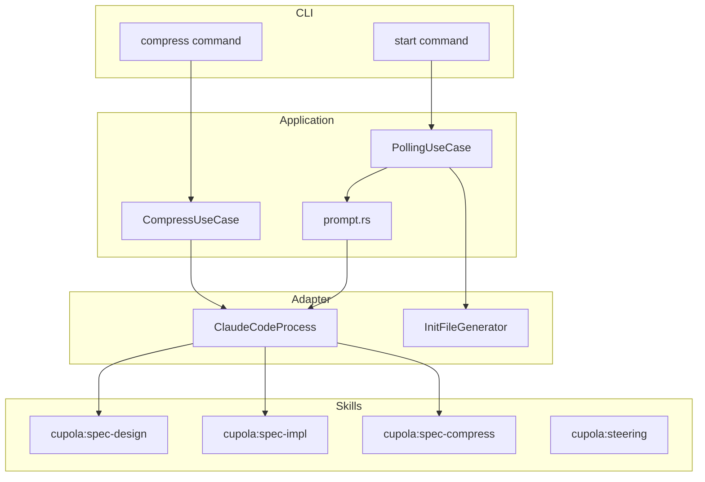
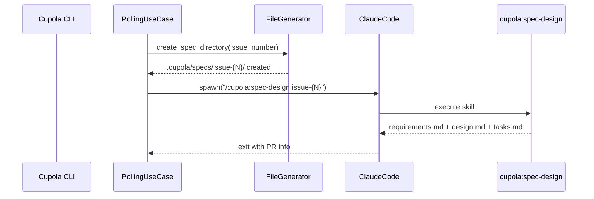
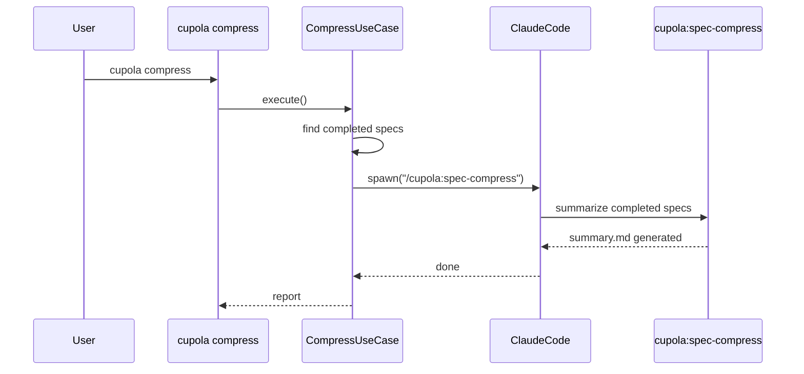

# Design Document: cupola-namespace-migration

## Overview

**Purpose**: `/kiro:*` namespace の11 skill を `/cupola:*` の4 skill に再構成し、spec id の決定論的命名、prompt の簡素化、compress サブコマンドの追加を行う。

**Users**: Cupola を利用する開発者と、Cupola の自動化ループ（polling_use_case）。

**Impact**: skill ファイル、prompt 構築ロジック、domain エンティティ、CLI サブコマンドに変更が及ぶ。既存の自動化フローの動作が変わるが、ユーザー向けインターフェース（Issue + PR）は不変。

### Goals
- `/cupola:*` namespace の4 skill（spec-design, spec-impl, spec-compress, steering）を提供する
- spec id を `issue-{number}` で CLI が決定的に生成する
- prompt.rs を1コマンド委譲に簡素化する
- `cupola compress` サブコマンドを追加する
- コードベース内の全 `/kiro:*` 参照を排除する

### Non-Goals
- log 圧縮（別 issue）
- ADR 自動抽出（別 issue）
- steering への知見自動反映（impl 時に自然に行う）
- init/doctor の全面再設計（別 issue、本 feature では kiro 参照の更新のみ）

## Architecture

### Existing Architecture Analysis

現在の Clean Architecture 4層構成は維持する。変更は各層に跨るが、層間の依存方向は不変:

- **domain**: `Issue.feature_name` の型変更（`Option<String>` → `String`）
- **application**: `prompt.rs` の簡素化、`polling_use_case.rs` での spec 初期化追加
- **adapter/inbound**: `cli.rs` に `Compress` サブコマンド追加
- **adapter/outbound**: `init_file_generator.rs` に spec ディレクトリ生成メソッド追加
- **bootstrap**: compress 用の wiring 追加
- **skill ファイル**: `.claude/commands/kiro/` → `.claude/commands/cupola/` 全面書き換え

### Architecture Pattern & Boundary Map



**Architecture Integration**:
- 既存の Clean Architecture パターンを維持
- `CompressUseCase` を新規追加（application 層）
- `FileGenerator` trait に spec 初期化メソッドを追加（port 拡張）
- skill ファイルは外部リソースとして扱い、Rust コードからは参照しない

### Technology Stack

| Layer | Choice / Version | Role in Feature | Notes |
|-------|------------------|-----------------|-------|
| CLI | clap (derive) | `Compress` サブコマンド追加 | 既存パターンに準拠 |
| Skill | Claude Code skill (.md) | spec-design, spec-impl, spec-compress, steering | `.claude/commands/cupola/` 配下 |
| Storage | SQLite (rusqlite) | feature_name カラムの NOT NULL 化 | マイグレーション必要 |

## System Flows

### Design フェーズ（変更後）



### Compress フロー



## Requirements Traceability

| Requirement | Summary | Components | Interfaces | Flows |
|-------------|---------|------------|------------|-------|
| 1.1 | skill ファイル4つ提供 | skill files | — | — |
| 1.2 | spec-design 一気通貫生成 | spec-design.md, prompt.rs | — | Design フェーズ |
| 1.3 | spec-impl TDD 実装 | spec-impl.md, prompt.rs | — | — |
| 1.4 | spec-compress 要約 | spec-compress.md, CompressUseCase | ClaudeCodeRunner | Compress フロー |
| 1.5 | steering 生成更新 | steering.md | — | — |
| 1.6 | cc-sdd ルール・テンプレート参照 | spec-design.md | — | — |
| 2.1 | spec ディレクトリ自動作成 | polling_use_case.rs, FileGenerator | FileGenerator trait | Design フェーズ |
| 2.2 | spec.json 生成 | FileGenerator | FileGenerator trait | Design フェーズ |
| 2.3 | issue 本文埋め込み | polling_use_case.rs, FileGenerator | FileGenerator trait | Design フェーズ |
| 2.4 | feature_name String 化 | Issue entity, IssueRepository | — | — |
| 3.1 | design prompt 簡素化 | prompt.rs | — | Design フェーズ |
| 3.2 | impl prompt 簡素化 | prompt.rs | — | — |
| 3.3 | kiro 参照削除 | prompt.rs | — | — |
| 3.4 | fixing prompt 維持 | prompt.rs | — | — |
| 4.1 | compress サブコマンド | cli.rs, CompressUseCase | — | Compress フロー |
| 4.2 | Claude Code 経由 skill 実行 | CompressUseCase | ClaudeCodeRunner | Compress フロー |
| 4.3 | 完了 spec なし時の正常終了 | CompressUseCase | — | — |
| 5.1 | kiro ディレクトリ削除 | .claude/commands/kiro/ | — | — |
| 5.2 | 全 kiro 参照更新 | prompt.rs, doctor_use_case.rs, CLAUDE.md, settings.local.json | — | — |
| 5.3 | settings ファイル維持 | — | — | — |

## Components and Interfaces

| Component | Domain/Layer | Intent | Req Coverage | Key Dependencies | Contracts |
|-----------|-------------|--------|--------------|-----------------|-----------|
| spec-design.md | Skill | requirements + design + tasks 一気通貫生成 | 1.1, 1.2, 1.6 | cc-sdd ルール・テンプレート | — |
| spec-impl.md | Skill | TDD 実装 | 1.1, 1.3 | spec artifacts | — |
| spec-compress.md | Skill | 完了 spec 要約アーカイブ | 1.1, 1.4 | spec artifacts | — |
| steering.md | Skill | steering ファイル生成・更新 | 1.1, 1.5 | — | — |
| prompt.rs | Application | prompt 構築の簡素化 | 3.1, 3.2, 3.3, 3.4 | — | Service |
| Issue entity | Domain | feature_name 型変更 | 2.4 | — | — |
| FileGenerator | Application/Port | spec ディレクトリ初期化 | 2.1, 2.2, 2.3 | — | Service |
| CompressUseCase | Application | compress オーケストレーション | 4.1, 4.2, 4.3 | ClaudeCodeRunner (P0) | Service |
| cli.rs | Adapter/Inbound | Compress サブコマンド | 4.1 | CompressUseCase (P0) | — |

### Skill Layer

#### spec-design.md

| Field | Detail |
|-------|--------|
| Intent | requirements + research + design + tasks を一気通貫で生成する |
| Requirements | 1.1, 1.2, 1.6 |

**Responsibilities & Constraints**
- 引数として spec id（`issue-{number}`）を受け取る
- `.cupola/specs/issue-{number}/` 配下の spec.json と requirements.md を読み込む
- steering コンテキストと cc-sdd ルール・テンプレートを参照して requirements.md、research.md、design.md、tasks.md を生成
- spec.json の phase を `tasks-generated` に更新
- 中間承認なし、一気通貫実行

**Implementation Notes**
- cc-sdd の spec-requirements + spec-design + spec-tasks のプロンプトロジックを1ファイルに統合
- EARS format、design principles、tasks generation、parallel analysis のルールファイルをそのまま参照

#### spec-impl.md

| Field | Detail |
|-------|--------|
| Intent | TDD サイクルに従ってタスクを実装する |
| Requirements | 1.1, 1.3 |

**Responsibilities & Constraints**
- 引数として spec id（`issue-{number}`）とオプションでタスク番号を受け取る
- TDD サイクル（RED → GREEN → REFACTOR → VERIFY → MARK）に従う
- tasks.md のチェックボックスを更新

**Implementation Notes**
- cc-sdd の spec-impl.md をベースに namespace 参照を変更

#### spec-compress.md

| Field | Detail |
|-------|--------|
| Intent | 完了済み spec を要約して summary.md に集約、元ファイルを削除する |
| Requirements | 1.1, 1.4 |

**Responsibilities & Constraints**
- `.cupola/specs/` 配下の全 spec を走査し、phase が完了状態のものを特定
- requirements/design/tasks の要点を summary.md に集約
- 元の requirements.md、design.md、tasks.md、research.md を削除
- spec.json は phase を `archived` に更新して残す

**Implementation Notes**
- オリジナル skill。compress 対象の判定ロジックを明確にする

#### steering.md

| Field | Detail |
|-------|--------|
| Intent | steering ファイル（product.md, tech.md, structure.md）を生成または更新する |
| Requirements | 1.1, 1.5 |

**Responsibilities & Constraints**
- コードベースを分析して steering ファイルを生成
- 既存ファイルがある場合は内容を踏まえて更新

**Implementation Notes**
- cc-sdd の steering.md をベースに namespace 参照を変更

### Application Layer

#### prompt.rs（変更）

| Field | Detail |
|-------|--------|
| Intent | Claude Code セッション用 prompt の構築を簡素化する |
| Requirements | 3.1, 3.2, 3.3, 3.4 |

**Responsibilities & Constraints**
- `build_design_prompt`: `/cupola:spec-design issue-{number}` を含む簡潔な指示を生成
- `build_implementation_prompt`: `/cupola:spec-impl issue-{number}` を含む簡潔な指示を生成。`feature_name` パラメータを `&str`（非 Option）に変更
- `build_fixing_prompt`: 変更なし
- `PR_CREATION_SCHEMA` から `feature_name` フィールドを削除
- `build_session_config` の `feature_name` パラメータを `&str`（非 Option）に変更

**Contracts**: Service [x]

##### Service Interface
```rust
// 変更後のシグネチャ
fn build_session_config(
    state: State,
    issue_number: u64,
    config: &Config,
    pr_number: Option<u64>,
    feature_name: &str,          // Option<&str> → &str
    fixing_causes: &[FixingProblemKind],
    has_merge_conflict: bool,
) -> anyhow::Result<SessionConfig>;

fn build_design_prompt(issue_number: u64, language: &str) -> String;
// feature_name 引数を追加（issue-{number}）
fn build_implementation_prompt(issue_number: u64, language: &str, feature_name: &str) -> String;
// feature_name: Option<&str> → &str
```

#### CompressUseCase（新規）

| Field | Detail |
|-------|--------|
| Intent | compress コマンドのオーケストレーション |
| Requirements | 4.1, 4.2, 4.3 |

**Responsibilities & Constraints**
- `.cupola/specs/` 配下の完了 spec の存在確認
- 完了 spec がなければメッセージ表示して正常終了
- 完了 spec があれば Claude Code セッションを起動し `/cupola:spec-compress` を実行

**Dependencies**
- Outbound: ClaudeCodeRunner — Claude Code 呼び出し (P0)

**Contracts**: Service [x]

##### Service Interface
```rust
pub struct CompressUseCase<R: ClaudeCodeRunner> {
    claude_runner: R,
    model: String,
}

impl<R: ClaudeCodeRunner> CompressUseCase<R> {
    pub fn execute(&self) -> Result<CompressReport>;
}

pub struct CompressReport {
    pub compressed_count: usize,
    pub skipped_reason: Option<String>,
}
```

#### FileGenerator（拡張）

| Field | Detail |
|-------|--------|
| Intent | spec ディレクトリの初期化を追加 |
| Requirements | 2.1, 2.2, 2.3 |

**Contracts**: Service [x]

##### Service Interface
```rust
// FileGenerator trait に追加
fn generate_spec_directory(
    &self,
    issue_number: u64,
    issue_body: &str,
    language: &str,
) -> Result<bool>;
// .cupola/specs/issue-{number}/ を作成し、spec.json と requirements.md を生成
// 既に存在する場合は false を返す
```

### Domain Layer

#### Issue entity（変更）

| Field | Detail |
|-------|--------|
| Intent | feature_name の型を決定論的に変更 |
| Requirements | 2.4 |

**Responsibilities & Constraints**
- `feature_name: Option<String>` → `feature_name: String`
- 初期化時に `issue-{number}` を設定
- DB カラムの NOT NULL 化（マイグレーション）

**Implementation Notes**
- 既存レコードの `feature_name` が NULL の場合、マイグレーションで `issue-{github_issue_number}` をデフォルト値として設定

## Data Models

### Domain Model

`Issue` エンティティの `feature_name` フィールド変更:

```
Before: feature_name: Option<String>  // LLM が命名、NULL 許容
After:  feature_name: String           // issue-{number} 固定、NOT NULL
```

### Physical Data Model

**SQLite マイグレーション**:
- `issues` テーブルの `feature_name` カラムを NOT NULL 化
- 既存の NULL レコードに `'issue-' || github_issue_number` をデフォルト値として適用

## Error Handling

### Error Categories and Responses

**compress 固有のエラー**:
- 完了 spec なし → 正常メッセージ表示して exit 0（エラーではない）
- Claude Code 未インストール → `CompressError::ClaudeCodeNotFound` でユーザーにインストール案内
- Claude Code セッション失敗 → エラーログ + exit 1

**spec 初期化エラー**:
- テンプレートファイル不在 → `InitError` として doctor チェック対象（既存パターン）
- ディレクトリ作成失敗 → リトライポリシーに委譲（既存パターン）

## Testing Strategy

### Unit Tests
- `prompt.rs`: design/impl prompt が `/cupola:spec-design issue-{N}` / `/cupola:spec-impl issue-{N}` を含むことの検証。既存テスト20件超の書き換え
- `CompressUseCase`: mock ClaudeCodeRunner で正常系・完了 spec なし・エラー系をテスト
- `FileGenerator::generate_spec_directory`: テンプレート置換の正確性、冪等性の検証
- `Issue` entity: `feature_name` が `String` であることの型レベル保証

### Integration Tests
- `polling_use_case`: 初期化フェーズで spec ディレクトリが作成されることの検証
- `compress`: CLI → CompressUseCase → mock ClaudeCodeRunner の結合テスト
- DB マイグレーション: 既存 NULL レコードの自動補完
