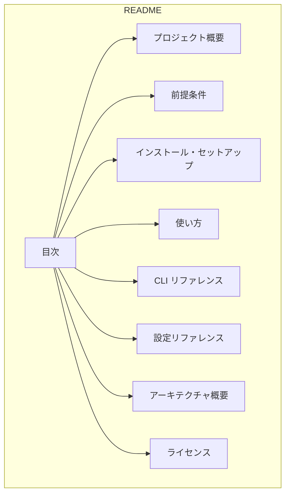

# Design Document: cupola-readme

## Overview
**Purpose**: Cupola の OSS 公開に向けて、リポジトリルートに README.md を作成する。初訪問者がプロジェクトの目的を把握し、セットアップから `cupola run` の実行まで再現可能な手順で到達できるドキュメントを提供する。

**Users**: Cupola の導入を検討する開発者、既存ユーザー、コントリビューター。

**Impact**: リポジトリに README.md が存在しない現状を解消し、OSS としての最低限の情報提供基盤を整備する。

### Goals
- 初訪問者が 3 文以内でプロジェクトの目的を理解できる
- ゼロから `cupola run` まで再現可能な手順を提供する
- CLI コマンドと `cupola.toml` の全項目を網羅したリファレンスを提供する
- Clean Architecture 4 レイヤーの構成を簡潔に説明する

### Non-Goals
- 詳細な API ドキュメント（rustdoc レベル）の提供
- コントリビューションガイドライン（CONTRIBUTING.md）の作成
- チュートリアル形式のウォークスルー
- ドキュメントの多言語化

## Architecture

### Architecture Pattern & Boundary Map

本フィーチャーは単一の Markdown ファイル（`README.md`）の作成であり、ソフトウェアアーキテクチャの変更は伴わない。設計の焦点はドキュメント構造とコンテンツ設計にある。



**Architecture Integration**:
- 新規ファイル: `README.md`（リポジトリルート）
- 既存コードへの影響: なし
- steering 準拠: product.md / tech.md / structure.md の情報を正確に反映

### Technology Stack

| Layer | Choice / Version | Role in Feature | Notes |
|-------|------------------|-----------------|-------|
| ドキュメント | Markdown (GitHub Flavored) | README 記述形式 | GitHub 上で自動レンダリング |

## Requirements Traceability

| Requirement | Summary | Components | Interfaces | Flows |
|-------------|---------|------------|------------|-------|
| 1.1, 1.2, 1.3 | プロジェクト概要 | OverviewSection | — | — |
| 2.1, 2.2, 2.3 | 前提条件 | PrerequisitesSection | — | — |
| 3.1, 3.2, 3.3, 3.4, 3.5 | インストール・セットアップ | InstallSection | — | — |
| 4.1, 4.2, 4.3, 4.4 | 使い方 | UsageSection | — | — |
| 5.1, 5.2, 5.3, 5.4 | CLI リファレンス | CLIRefSection | — | — |
| 6.1, 6.2, 6.3 | 設定リファレンス | ConfigRefSection | — | — |
| 7.1, 7.2, 7.3 | アーキテクチャ概要 | ArchSection | — | — |
| 8.1, 8.2 | ライセンス | LicenseSection | — | — |

## Components and Interfaces

README.md は 8 つの論理セクションで構成される。各セクションが独立した要件領域に対応し、目次による内部リンクでナビゲーションを提供する。

| Component | Domain | Intent | Req Coverage | Key Dependencies | Contracts |
|-----------|--------|--------|--------------|------------------|-----------|
| OverviewSection | ドキュメント | プロジェクト概要を 3 文以内で記述 | 1.1, 1.2, 1.3 | product.md (P1) | — |
| PrerequisitesSection | ドキュメント | 前提ツール一覧と cc-sdd 説明 | 2.1, 2.2, 2.3 | tech.md (P1) | — |
| InstallSection | ドキュメント | ビルド〜初期化の手順 | 3.1, 3.2, 3.3, 3.4, 3.5 | config.rs (P0), cli.rs (P0) | — |
| UsageSection | ドキュメント | ワークフロー全体の手順 | 4.1, 4.2, 4.3, 4.4 | product.md (P0) | — |
| CLIRefSection | ドキュメント | 全サブコマンドのリファレンス | 5.1, 5.2, 5.3, 5.4 | cli.rs (P0) | — |
| ConfigRefSection | ドキュメント | cupola.toml 全項目のリファレンス | 6.1, 6.2, 6.3 | config.rs (P0) | — |
| ArchSection | ドキュメント | Clean Architecture 4 レイヤーの説明 | 7.1, 7.2, 7.3 | structure.md (P0) | — |
| LicenseSection | ドキュメント | ライセンス情報 | 8.1, 8.2 | LICENSE ファイル (P2) | — |

### ドキュメント

#### OverviewSection

| Field | Detail |
|-------|--------|
| Intent | プロジェクトの目的と価値提案を 3 文以内で伝える |
| Requirements | 1.1, 1.2, 1.3 |

**Responsibilities & Constraints**
- Cupola が「GitHub Issue を起点に設計・実装を自動化するローカル常駐エージェント」であることを明記する
- 人間の役割（Issue 作成・ラベル付与・PR レビュー）と自動化範囲を区別する
- 3 文以内の簡潔な記述に収める

**Implementation Notes**
- product.md の Core Capabilities と Value Proposition を情報源とする

#### PrerequisitesSection

| Field | Detail |
|-------|--------|
| Intent | 必要なツールと環境情報を一覧で提示する |
| Requirements | 2.1, 2.2, 2.3 |

**Responsibilities & Constraints**
- 必須ツール: Rust stable、Claude Code CLI、gh CLI、Git、devbox
- cc-sdd の概要を 1-2 文で説明し、Cupola が cc-sdd を内部で駆動することを記述する
- devbox 利用時の一括セットアップ手順を案内する

**コンテンツ仕様**

前提条件テーブル:

| ツール | 用途 | 備考 |
|--------|------|------|
| Rust stable | ビルド | devbox 経由で管理 |
| Claude Code CLI | AI コード生成 | Anthropic 提供 |
| gh CLI | GitHub API 操作 | GitHub 公式 |
| Git | バージョン管理 | — |
| devbox | 開発環境管理 | Nix ベース |

#### InstallSection

| Field | Detail |
|-------|--------|
| Intent | ゼロから `cupola run` 可能な状態までの手順を提供する |
| Requirements | 3.1, 3.2, 3.3, 3.4, 3.5 |

**Responsibilities & Constraints**
- 手順は番号付きリストで記述し、再現可能であること
- `cupola.toml` の設定例は実際の設定項目を正確に反映する
- `cupola init` → `agent:ready` ラベル作成 → `cupola run` の順序を明記する

**コンテンツ仕様**

手順:
1. リポジトリのクローン
2. `devbox shell` で開発環境に入る（または手動で Rust をインストール）
3. `cargo build --release` でビルド
4. `.cupola/cupola.toml` を作成・設定
5. `cupola init` で SQLite スキーマを初期化
6. GitHub リポジトリに `agent:ready` ラベルを作成
7. `cupola run` で polling 開始

`cupola.toml` の設定例は ConfigRefSection の完全例を参照する形で、最小限の必須設定のみ記述する。

#### UsageSection

| Field | Detail |
|-------|--------|
| Intent | 日常のワークフロー全体をステップバイステップで説明する |
| Requirements | 4.1, 4.2, 4.3, 4.4 |

**Responsibilities & Constraints**
- 人間の操作と Cupola の自動処理を視覚的に区別する（絵文字やラベルで）
- `agent:ready` ラベルがトリガーであることを明記する
- 設計 PR → 実装 PR の 2 段階レビューフローを説明する

**コンテンツ仕様**

ワークフローのステップ:
1. **人間**: GitHub Issue を作成し、要求事項を記述する
2. **人間**: `agent:ready` ラベルを付与する
3. **Cupola**: Issue を検知し、cc-sdd で設計ドキュメント（requirements / design / tasks）を自動生成する
4. **Cupola**: 設計 PR を作成する
5. **人間**: 設計 PR をレビューし、approve する
6. **Cupola**: タスクに基づき実装を自動生成する
7. **Cupola**: 実装 PR を作成する
8. **人間**: 実装 PR をレビューし、approve → merge する
9. **Cupola**: cleanup 処理（ラベル除去等）を実行する

#### CLIRefSection

| Field | Detail |
|-------|--------|
| Intent | 全 CLI サブコマンドの用途・オプション・実行例を提供する |
| Requirements | 5.1, 5.2, 5.3, 5.4 |

**Responsibilities & Constraints**
- `src/adapter/inbound/cli.rs` の定義を正確に反映する
- 各コマンドにコードブロックの実行例を含める

**コンテンツ仕様**

`run` サブコマンド:
- 説明: polling ループを開始する
- オプション:
  - `--polling-interval-secs <秒>`: polling 間隔の上書き（デフォルト: cupola.toml の値）
  - `--log-level <レベル>`: ログレベルの上書き（trace / debug / info / warn / error）
  - `--config <パス>`: 設定ファイルパス（デフォルト: `.cupola/cupola.toml`）
- 実行例: `cupola run`、`cupola run --polling-interval-secs 30 --log-level debug`

`init` サブコマンド:
- 説明: SQLite スキーマを初期化する
- オプション: なし
- 実行例: `cupola init`

`status` サブコマンド:
- 説明: 全 Issue の処理状態を一覧表示する
- オプション: なし
- 実行例: `cupola status`

#### ConfigRefSection

| Field | Detail |
|-------|--------|
| Intent | `cupola.toml` の全設定項目を型・デフォルト値・説明付きで網羅する |
| Requirements | 6.1, 6.2, 6.3 |

**Responsibilities & Constraints**
- `src/domain/config.rs` の Config 構造体を信頼できる情報源とする
- 型、デフォルト値、説明を全項目に記述する

**コンテンツ仕様**

設定項目テーブル:

| 項目 | 型 | デフォルト値 | 説明 |
|------|----|-------------|------|
| `owner` | String | — (必須) | GitHub リポジトリオーナー |
| `repo` | String | — (必須) | GitHub リポジトリ名 |
| `default_branch` | String | — (必須) | デフォルトブランチ名 |
| `language` | String | `"ja"` | 生成ドキュメントの言語 |
| `polling_interval_secs` | u64 | `60` | polling 間隔（秒） |
| `max_retries` | u32 | `3` | 最大リトライ回数 |
| `stall_timeout_secs` | u64 | `1800` | stall 判定タイムアウト（秒） |
| `[log] level` | String | `"info"` | ログレベル |
| `[log] dir` | String | — (optional) | ログ出力ディレクトリ |

完全な設定例:
```toml
owner = "your-github-username"
repo = "your-repo-name"
default_branch = "main"
language = "ja"
polling_interval_secs = 60
max_retries = 3
stall_timeout_secs = 1800

[log]
level = "info"
dir = ".cupola/logs"
```

#### ArchSection

| Field | Detail |
|-------|--------|
| Intent | Clean Architecture 4 レイヤーの構成と依存方向を説明する |
| Requirements | 7.1, 7.2, 7.3 |

**Responsibilities & Constraints**
- structure.md の内容を簡潔に要約する
- `src/` 配下のディレクトリ構造をツリー形式で示す
- 各レイヤーの責務を 1-2 文で説明する

**コンテンツ仕様**

レイヤー説明:

| レイヤー | ディレクトリ | 責務 |
|---------|-------------|------|
| domain | `src/domain/` | 純粋ビジネスロジック。State, Event, StateMachine, Issue, Config |
| application | `src/application/` | ユースケースとポート（trait）定義。外部依存を抽象化 |
| adapter | `src/adapter/` | 外部接続の実装。inbound（CLI）/ outbound（GitHub, SQLite, Claude Code, Git） |
| bootstrap | `src/bootstrap/` | DI 配線、設定読み込み、ランタイム起動 |

依存方向: domain ← application ← adapter ← bootstrap（内向きのみ）

ディレクトリツリー: `src/` 配下の主要ファイルを 2 階層まで表示する。

#### LicenseSection

| Field | Detail |
|-------|--------|
| Intent | ライセンス情報を記述する |
| Requirements | 8.1, 8.2 |

**Responsibilities & Constraints**
- LICENSE ファイルが未作成のため、プレースホルダーとして記述する
- LICENSE ファイル作成後にリンクを追加する旨を注記する

**Implementation Notes**
- LICENSE ファイルの作成は本フィーチャーのスコープ外

## Testing Strategy

### コンテンツ検証
- README.md がリポジトリルートに存在すること
- プロジェクト概要が 3 文以内であること
- 全 CLI サブコマンド（run, init, status）が記述されていること
- `cupola.toml` の全設定項目（9 項目）が記述されていること
- Clean Architecture 4 レイヤーが説明されていること

### 手順再現性検証
- セットアップ手順に従い、ゼロから `cupola run` が起動できること
- コードブロックの各コマンドが実行可能であること
