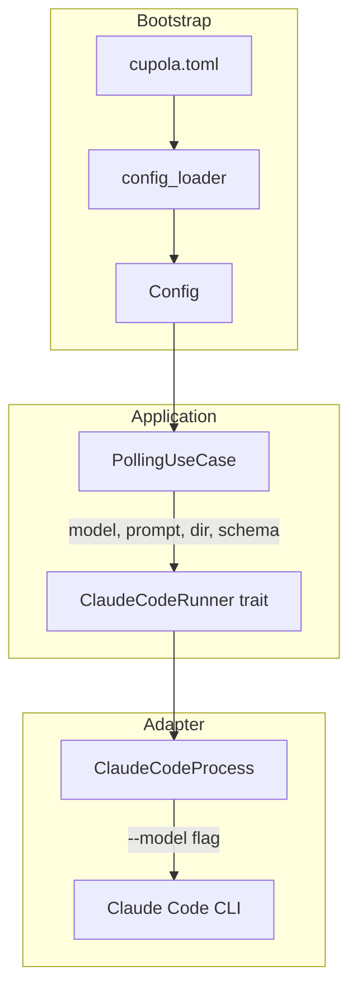

# Design Document: default-claude-model

## Overview

**Purpose**: cupola.toml に `model` 設定を追加し、Claude Code 起動時に `--model` フラグとして渡す機能を提供する。
**Users**: cupola の利用者が、プロジェクト単位でコストや速度の要件に応じた Claude モデルを指定する。
**Impact**: Config 値オブジェクト、CupolaToml パーサー、ClaudeCodeRunner trait、ClaudeCodeProcess アダプターに model フィールドおよびパラメータを追加する。

### Goals
- cupola.toml で `model` を指定し、Claude Code が `--model` フラグ付きで起動される
- 未指定時は "sonnet" がデフォルトとして使用される
- 既存機能との後方互換性を維持する

### Non-Goals
- モデル名のバリデーション（Claude Code CLI 側に委任）
- CLI オーバーライドによるモデル指定（将来検討）
- Issue ごとのモデル指定

## Architecture

### Existing Architecture Analysis

現在のシステムは Clean Architecture に基づき、以下のレイヤーで構成される：

- **domain**: `Config` 値オブジェクト（`config.rs`）
- **bootstrap**: `CupolaToml` パーサーと `into_config` 変換（`config_loader.rs`）
- **application**: `ClaudeCodeRunner` trait（`port/claude_code_runner.rs`）、`PollingUseCase`（`polling_use_case.rs`）
- **adapter**: `ClaudeCodeProcess` 実装（`claude_code_process.rs`）

既存の設定追加パターン（`max_concurrent_sessions` の追加実績）に従い、同様の方法で `model` フィールドを追加する。

### Architecture Pattern & Boundary Map



**Architecture Integration**:
- Selected pattern: 既存の Clean Architecture レイヤーをそのまま活用
- Existing patterns preserved: `Option<T>` → デフォルト値適用パターン（CupolaToml → Config）
- New components rationale: 新規コンポーネントなし。既存コンポーネントへのフィールド・パラメータ追加のみ

### Technology Stack

| Layer | Choice / Version | Role in Feature | Notes |
|-------|------------------|-----------------|-------|
| Backend | Rust (Edition 2024) | 全レイヤーの実装 | 既存 |
| Config | toml + serde | cupola.toml パース | 既存の Deserialize で対応 |
| Process | std::process::Command | Claude Code CLI 起動 | --model 引数追加 |

## Requirements Traceability

| Requirement | Summary | Components | Interfaces | Flows |
|-------------|---------|------------|------------|-------|
| 1.1 | model 指定時に Config へ格納 | CupolaToml, Config | CupolaToml::into_config | TOML → Config |
| 1.2 | model 未指定時にデフォルト "sonnet" | CupolaToml, Config | CupolaToml::into_config, Config::default_with_repo | TOML → Config |
| 1.3 | CupolaToml に Option<String> | CupolaToml | — | — |
| 2.1 | Config に model: String | Config | — | — |
| 2.2 | default_with_repo でデフォルト "sonnet" | Config | Config::default_with_repo | — |
| 2.3 | into_config で model 反映 | CupolaToml | CupolaToml::into_config | TOML → Config |
| 3.1 | spawn に model 引数追加 | ClaudeCodeRunner | ClaudeCodeRunner::spawn | — |
| 3.2 | 全実装が新シグネチャに準拠 | ClaudeCodeProcess | ClaudeCodeRunner::spawn | — |
| 4.1 | --model フラグ付与 | ClaudeCodeProcess | build_command | spawn flow |
| 4.2 | --model sonnet | ClaudeCodeProcess | build_command | spawn flow |
| 4.3 | --model opus | ClaudeCodeProcess | build_command | spawn flow |
| 5.1 | 未指定時の後方互換 | CupolaToml, Config | into_config | TOML → Config |
| 5.2 | 既存テストのパス | 全コンポーネント | — | — |

## Components and Interfaces

| Component | Domain/Layer | Intent | Req Coverage | Key Dependencies | Contracts |
|-----------|-------------|--------|--------------|------------------|-----------|
| Config | domain | model フィールドを保持する値オブジェクト | 2.1, 2.2 | なし | — |
| CupolaToml | bootstrap | TOML から model を読み取り Config に変換 | 1.1, 1.2, 1.3, 2.3, 5.1 | Config (P0) | — |
| ClaudeCodeRunner | application/port | spawn に model パラメータを追加した trait | 3.1, 3.2 | なし | Service |
| ClaudeCodeProcess | adapter/outbound | --model フラグ付きでプロセスを起動 | 4.1, 4.2, 4.3 | ClaudeCodeRunner (P0) | Service |
| PollingUseCase | application | Config から model を取得し spawn に渡す | 5.1, 5.2 | ClaudeCodeRunner (P0), Config (P0) | — |

### Domain Layer

#### Config

| Field | Detail |
|-------|--------|
| Intent | model フィールドを含む設定値オブジェクト |
| Requirements | 2.1, 2.2 |

**Responsibilities & Constraints**
- `model: String` フィールドを追加（`language` や `polling_interval_secs` と同列）
- `default_with_repo` でデフォルト値 `"sonnet".to_string()` を設定

**Contracts**: なし（値オブジェクト）

##### フィールド定義

```rust
pub struct Config {
    // ...existing fields...
    pub model: String,  // 追加: デフォルト "sonnet"
}
```

### Bootstrap Layer

#### CupolaToml

| Field | Detail |
|-------|--------|
| Intent | cupola.toml から model を読み取り Config に変換 |
| Requirements | 1.1, 1.2, 1.3, 2.3, 5.1 |

**Responsibilities & Constraints**
- `model: Option<String>` フィールドを追加
- `into_config` で `self.model.unwrap_or_else(|| "sonnet".to_string())` を適用

**Contracts**: なし

##### フィールド定義

```rust
pub struct CupolaToml {
    // ...existing fields...
    pub model: Option<String>,  // 追加
}
```

### Application Layer (Port)

#### ClaudeCodeRunner

| Field | Detail |
|-------|--------|
| Intent | spawn メソッドに model パラメータを追加した trait 定義 |
| Requirements | 3.1, 3.2 |

**Responsibilities & Constraints**
- spawn の引数に `model: &str` を追加
- 全実装がコンパイル時に新シグネチャへの準拠を強制される

**Contracts**: Service [x]

##### Service Interface

```rust
pub trait ClaudeCodeRunner: Send + Sync {
    fn spawn(
        &self,
        prompt: &str,
        working_dir: &Path,
        json_schema: Option<&str>,
        model: &str,           // 追加
    ) -> Result<Child>;
}
```

- Preconditions: model は空でない文字列
- Postconditions: 子プロセスが `--model {model}` 引数付きで起動される
- Invariants: なし

### Adapter Layer (Outbound)

#### ClaudeCodeProcess

| Field | Detail |
|-------|--------|
| Intent | --model フラグ付きで Claude Code プロセスを起動 |
| Requirements | 4.1, 4.2, 4.3 |

**Responsibilities & Constraints**
- `build_command` に `model: &str` パラメータを追加
- `--model` フラグと model 値をコマンド引数に追加
- spawn 実装で build_command に model を渡す

**Dependencies**
- Inbound: PollingUseCase — spawn 呼び出し (P0)

**Contracts**: Service [x]

##### Service Interface

```rust
impl ClaudeCodeProcess {
    pub fn build_command(
        &self,
        prompt: &str,
        working_dir: &Path,
        json_schema: Option<&str>,
        model: &str,            // 追加
    ) -> Command;
}
```

**Implementation Notes**
- `cmd.arg("--model").arg(model)` を既存引数の後に追加
- 引数順序: `-p`, `--output-format json`, `--dangerously-skip-permissions`, `--model {model}`, オプションで `--json-schema`

### Application Layer (Use Case)

#### PollingUseCase

| Field | Detail |
|-------|--------|
| Intent | Config から model を取得し spawn 呼び出しに渡す |
| Requirements | 5.1, 5.2 |

**Responsibilities & Constraints**
- `self.config.model` を参照し、`self.claude_runner.spawn()` に渡す
- 変更箇所は spawn 呼び出しの1箇所のみ（polling_use_case.rs:527）

**Implementation Notes**
- `self.claude_runner.spawn(&session_config.prompt, wt, schema, &self.config.model)` に変更

## Data Models

### Domain Model

Config 値オブジェクトへのフィールド追加のみ。新規エンティティやアグリゲートの追加はなし。

**変更対象**:
- `Config.model: String` — Claude Code のデフォルトモデル名（デフォルト: "sonnet"）

## Error Handling

### Error Strategy

model に関する新規エラーハンドリングは追加しない。理由：
- model の値バリデーションは Claude Code CLI 側で行われる
- 空文字列や無効なモデル名は Claude Code プロセスの起動エラーとして既存のエラーハンドリングでカバーされる

## Testing Strategy

### Unit Tests
- **Config::default_with_repo**: model フィールドが "sonnet" であることを検証
- **CupolaToml パース（model 指定あり）**: `model = "opus"` を含む TOML が正しくパースされることを検証
- **CupolaToml パース（model 未指定）**: model 未指定時に `None` となることを検証
- **CupolaToml::into_config（model 指定あり）**: Config.model に指定値が反映されることを検証
- **CupolaToml::into_config（model 未指定）**: Config.model が "sonnet" になることを検証
- **ClaudeCodeProcess::build_command**: 生成されるコマンドに `--model` フラグが含まれることを検証
- **ClaudeCodeProcess::build_command（model 指定）**: `--model opus` が引数に含まれることを検証

### Integration Tests
- 既存の統合テスト内の mock ClaudeCodeRunner 実装を新シグネチャに更新
- 既存テストが全てパスすることを確認
