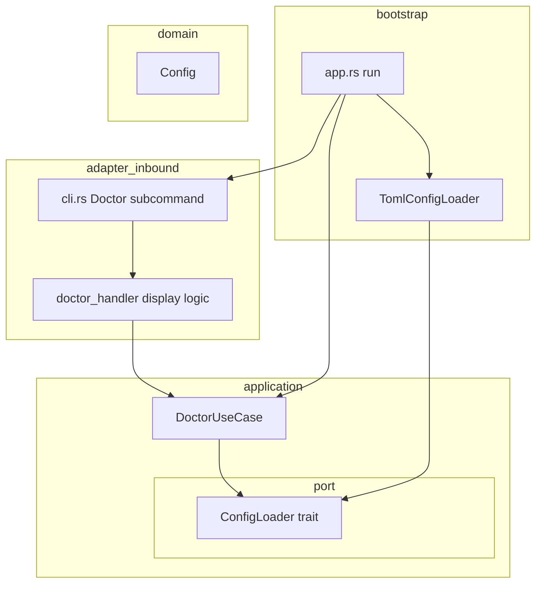
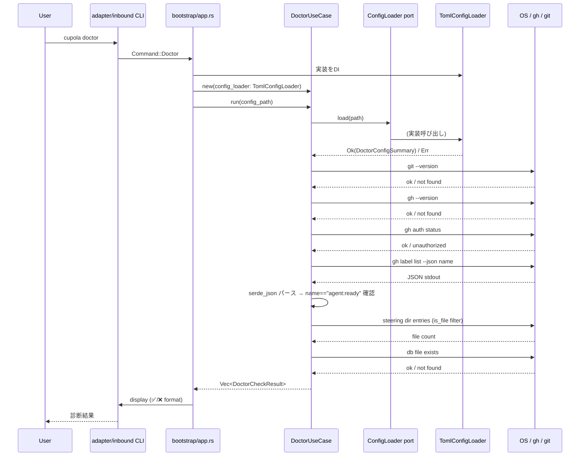

# 設計書: doctor-quality-improvement

## Overview

本機能は、PR #46 で実装された `cupola doctor` コマンドに対して Copilot レビューで指摘された 7 件の品質問題を修正する。対象は Clean Architecture 違反（DoctorUseCase の bootstrap 層依存）、テスト不足（git/toml/steering/db チェックのユニットテスト）、エラーハンドリングの改善（gh 区別、JSON パース、process::exit 廃止）の 3 領域にわたる。

**Purpose**: 開発者が `cupola doctor` を実行したとき、環境の問題を正確かつ安全に診断できるようにする。
**Users**: cupola を運用する開発者が `cupola doctor` コマンドで環境診断を行うワークフロー。
**Impact**: `DoctorUseCase` を Clean Architecture に準拠させ、application → bootstrap の禁止依存を解消する。また、テストカバレッジを向上させ、エラーメッセージの精度を改善する。

### Goals

- `DoctorUseCase` の bootstrap 層依存を排除し、`ConfigLoader` port trait 経由に変更する
- git/toml/steering/db チェックのユニットテストを tempdir ベースで追加する
- gh 未インストールと認証失敗を個別に検出してそれぞれのガイダンスを表示する
- `agent:ready` ラベルチェックを `serde_json` で厳密に行う
- steering チェックを `is_file()` フィルタで正確に行う
- `std::process::exit(1)` を `Err(anyhow!(...))` 返却に変更してログを確実にフラッシュする

### Non-Goals

- doctor コマンドで行うチェック項目の追加（7 件の改善のみ）
- doctor コマンドの出力フォーマットの大幅な変更
- gh CLI 以外の GitHub 認証方式への対応

## Architecture

### Existing Architecture Analysis

現在の codebase は Clean Architecture 4 層構成（domain / application / adapter / bootstrap）を採用している。`adapter/inbound/cli.rs` には `Run`, `Init`, `Status` の 3 サブコマンドのみ存在し、`Doctor` サブコマンドは未追加（PR #46 の内容はこの worktree ブランチに未マージ）。

**修正すべき依存違反**（PR #46 の実装を参照）:
- `DoctorUseCase` が `bootstrap::config_loader::load_toml` を直接呼び出している
- 表示ロジック（✅/❌ フォーマット）が `DoctorUseCase` 内に存在する

### Architecture Pattern & Boundary Map



**Architecture Integration**:
- 選択パターン: Ports & Adapters（Hexagonal） — 既存の Clean Architecture パターンを踏襲
- 新規境界: `application/port/config_loader.rs` に `ConfigLoader` trait を追加
- 禁止依存の解消: `DoctorUseCase` は `bootstrap` を参照せず `ConfigLoader` trait のみを参照
- 表示ロジック移動先: `adapter/inbound/` 側のハンドラ（`app.rs` の Doctor match arm または専用ハンドラ関数）
- Steering 準拠: application → bootstrap の依存禁止ルールを遵守

### Technology Stack

| Layer | Choice / Version | Role | Notes |
|-------|-----------------|------|-------|
| adapter/inbound | clap (derive) | `Doctor` サブコマンド追加 | 既存 CLI 構造を拡張 |
| application | Rust std + serde_json + thiserror | DoctorUseCase, ConfigLoader port | `serde_json` で JSON パース |
| bootstrap | toml | TomlConfigLoader 実装 | 既存 config_loader.rs を拡張 |
| test | tempfile crate | tempdir ベーステスト | `TempDir` でクリーンな環境を生成 |

## System Flows



## Requirements Traceability

| Requirement | Summary | Components | Interfaces |
|-------------|---------|------------|------------|
| 1.1–1.3 | git テスト環境依存解消 | DoctorUseCase (git check) | git check テスト内条件分岐 |
| 2.1–2.4 | toml/steering/db ユニットテスト | DoctorUseCase テスト | tempfile::TempDir |
| 3.1–3.3 | gh 未インストール vs 認証失敗区別 | DoctorUseCase (gh checks) | GhCheckResult enum |
| 4.1–4.4 | DoctorUseCase bootstrap 依存解消 | ConfigLoader port, TomlConfigLoader | ConfigLoader trait |
| 5.1–5.3 | agent:ready JSON パース | DoctorUseCase (label check) | LabelItem struct, serde_json |
| 6.1–6.3 | steering ファイル限定カウント | DoctorUseCase (steering check) | is_file() フィルタ |
| 7.1–7.3 | process::exit → Err 返却 | bootstrap/app.rs Doctor arm | anyhow::Result |

## Components and Interfaces

### Components Summary

| Component | Layer | Intent | Requirements | Key Dependencies |
|-----------|-------|--------|--------------|-----------------|
| ConfigLoader trait | application/port | 設定読み込みの抽象化 | 4.1–4.4 | — |
| TomlConfigLoader | bootstrap | ConfigLoader の TOML 実装 | 4.1–4.2 | config_loader.rs (P0) |
| DoctorUseCase | application | 診断チェックのオーケストレーション | 1–7 全件 | ConfigLoader (P0) |
| DoctorCheckResult / CheckStatus | application | チェック結果の型 | 3.3, 7.1 | — |
| Doctor CLI handler (display) | adapter/inbound | ✅/❌ 表示ロジック | 4.3 | DoctorUseCase (P0) |
| cli.rs Doctor subcommand | adapter/inbound | サブコマンド定義 | 7.1 | clap (P0) |

---

### application/port

#### ConfigLoader

| Field | Detail |
|-------|--------|
| Intent | 設定ファイルの読み込みと検証結果を application 層に提供する port |
| Requirements | 4.1, 4.2, 4.4 |

**Responsibilities & Constraints**
- path を受け取り、設定が正常に読み込める場合は `DoctorConfigSummary` を返す
- bootstrap 型（`CupolaToml`）を application 層に露出しない

**Dependencies**
- Inbound: DoctorUseCase — 設定検証（P0）
- Outbound: なし（trait 定義のみ）

**Contracts**: Service [x]

##### Service Interface

```rust
/// doctor チェックに必要な最小設定情報
pub struct DoctorConfigSummary {
    pub owner: String,
    pub repo: String,
    pub default_branch: String,
}

pub trait ConfigLoader: Send + Sync {
    fn load(&self, path: &std::path::Path) -> Result<DoctorConfigSummary, ConfigLoadError>;
}

#[derive(Debug, thiserror::Error)]
pub enum ConfigLoadError {
    #[error("設定ファイルが見つかりません: {path}")]
    NotFound { path: String },
    #[error("設定ファイルのパースに失敗しました: {path}: {reason}")]
    ParseFailed { path: String, reason: String },
    #[error("必須フィールドが不足しています: {field}")]
    MissingField { field: String },
}
```

- Preconditions: path は絶対パスまたはカレントディレクトリからの相対パス
- Postconditions: Ok の場合は owner/repo/default_branch が非空文字列
- Invariants: trait は Send + Sync を要求（非同期コンテキストでの共有を許可）

---

### application

#### DoctorUseCase

| Field | Detail |
|-------|--------|
| Intent | doctor サブコマンドの全チェックロジックをオーケストレーションし、結果リストを返す |
| Requirements | 1.1–7.3 全件 |

**Responsibilities & Constraints**
- `ConfigLoader` port を通じて設定を検証する（bootstrap への直接依存禁止）
- git/gh/steering/db/label の各チェックを実行し `Vec<DoctorCheckResult>` を返す
- 表示フォーマット（✅/❌文字列生成）を含まない — これはハンドラ側の責務

**Dependencies**
- Inbound: Doctor CLI handler — run() 呼び出し（P0）
- Outbound: ConfigLoader port — 設定検証（P0）
- External: std::process::Command — git/gh コマンド実行（P1）

**Contracts**: Service [x]

##### Service Interface

```rust
/// 個別チェックのステータス
pub enum CheckStatus {
    Ok(String),   // 成功メッセージ
    Fail(String), // 失敗メッセージ（修正手順を含む）
    Warn(String), // 警告（オプション）
}

/// 1 件のチェック結果
pub struct DoctorCheckResult {
    pub name: String,
    pub status: CheckStatus,
}

pub struct DoctorUseCase<C: ConfigLoader> {
    config_loader: C,
}

impl<C: ConfigLoader> DoctorUseCase<C> {
    pub fn new(config_loader: C) -> Self;
    pub fn run(&self, config_path: &std::path::Path) -> Vec<DoctorCheckResult>;
}
```

##### 内部チェック関数（設計上の責務区分）

```rust
// application/doctor_use_case.rs 内部

fn check_toml(config_loader: &dyn ConfigLoader, path: &Path) -> DoctorCheckResult;
fn check_git() -> DoctorCheckResult;
fn check_gh() -> DoctorCheckResult;       // 未インストール vs 認証失敗を区別
fn check_gh_label() -> DoctorCheckResult; // serde_json でパース
fn check_steering(steering_path: &Path) -> DoctorCheckResult; // is_file() フィルタ
fn check_db(db_path: &Path) -> DoctorCheckResult;
```

**Implementation Notes**
- Integration: `bootstrap/app.rs` の `Doctor` match arm で `TomlConfigLoader` を注入して `DoctorUseCase` を構築する
- Validation: `check_gh()` は `gh --version` で存在確認 → `gh auth status` で認証確認の 2 段階
- Risks: gh コマンドの出力形式変更リスク — stderr 判定ではなく exit code を優先

#### GhCheckResult（内部型）

gh チェックのロジック分岐を明確にするための内部 enum:

```rust
enum GhPresence {
    NotInstalled,
    InstalledButUnauthorized,
    Ready,
}
```

#### LabelItem（JSON パース用）

```rust
#[derive(serde::Deserialize)]
struct LabelItem {
    name: String,
}
```

`gh label list --json name` の stdout を `Vec<LabelItem>` にデシリアライズし、`item.name == "agent:ready"` を検索する。

---

### bootstrap

#### TomlConfigLoader

| Field | Detail |
|-------|--------|
| Intent | `ConfigLoader` trait の TOML ファイルベース実装 |
| Requirements | 4.1, 4.2 |

**Responsibilities & Constraints**
- `bootstrap::config_loader::load_toml` を内部で呼び出し、`DoctorConfigSummary` に変換して返す
- `CupolaToml` → `DoctorConfigSummary` の変換は bootstrap 層内で完結させる

**Contracts**: Service [x]

```rust
pub struct TomlConfigLoader;

impl ConfigLoader for TomlConfigLoader {
    fn load(&self, path: &Path) -> Result<DoctorConfigSummary, ConfigLoadError> {
        // load_toml(path) を呼び出し、CupolaToml から DoctorConfigSummary を生成
    }
}
```

---

### adapter/inbound

#### Doctor サブコマンド & 表示ハンドラ

| Field | Detail |
|-------|--------|
| Intent | `cupola doctor` サブコマンドの定義と診断結果の表示フォーマット（✅/❌） |
| Requirements | 4.3, 7.1–7.3 |

**Responsibilities & Constraints**
- `cli.rs` に `Command::Doctor` を追加（config path パラメータをオプションで受け付け）
- `bootstrap/app.rs` の `Doctor` arm で `DoctorUseCase` を構築・実行し、結果を表示
- `CheckStatus::Ok` → `✅ {message}`、`CheckStatus::Warn` → `⚠️ {message}`、`CheckStatus::Fail` → `❌ {message}` でフォーマット
- `std::process::exit(1)` を使用せず、いずれかのチェックが Fail の場合は `Err(anyhow!("doctor checks failed"))` を返す

**Contracts**: Service [x]

```rust
// cli.rs
#[derive(Subcommand, Debug)]
pub enum Command {
    // ... 既存
    /// Run environment diagnostics
    Doctor {
        #[arg(long, default_value = ".cupola/cupola.toml")]
        config: PathBuf,
    },
}

// bootstrap/app.rs の Doctor arm（疑似コード）
Command::Doctor { config } => {
    let loader = TomlConfigLoader;
    let use_case = DoctorUseCase::new(loader);
    let results = use_case.run(&config);
    let has_failure = display_results(&results); // ✅/❌ 表示
    if has_failure {
        return Err(anyhow::anyhow!("doctor checks failed"));
    }
    Ok(())
}
```

## Error Handling

### Error Strategy

各チェックは内部でエラーを吸収し `CheckStatus::Fail(message)` として返す。`DoctorUseCase::run` は panic せず常に `Vec<DoctorCheckResult>` を返す。呼び出し元（bootstrap/app.rs）が Fail の有無に応じて `Err` を返す。

### Error Categories and Responses

| エラー種別 | 原因 | DoctorUseCase の応答 | ハンドラの応答 |
|----------|------|---------------------|-------------|
| ConfigLoadError::NotFound | cupola.toml 不在 | `CheckStatus::Fail("cupola.toml が見つかりません")` | ❌ 表示 |
| ConfigLoadError::MissingField | 必須フィールド欠如 | `CheckStatus::Fail("必須フィールド {field} が不足")` | ❌ 表示 |
| gh NotInstalled | PATH に gh なし | `CheckStatus::Fail("gh をインストールしてください: ...")` | ❌ 表示 |
| gh Unauthorized | 認証未完了 | `CheckStatus::Fail("gh auth login を実行してください")` | ❌ 表示 |
| JSON パースエラー | gh stdout が不正 | `CheckStatus::Fail("ラベル一覧の取得に失敗しました")` | ❌ 表示 |
| steering ファイルなし | ディレクトリ空または非ファイルのみ | `CheckStatus::Fail("steering ファイルが見つかりません")` | ❌ 表示 |
| DB ファイル不在 | init 未実行 | `CheckStatus::Fail("cupola init を実行してください")` | ❌ 表示 |

### Monitoring

- doctor コマンドは診断専用であり、ロギング（tracing）は最小限（`tracing::debug!` レベル）にとどめる
- `std::process::exit(1)` 廃止により `_guard` の drop が保証され、他コマンドでのログフラッシュ漏れも防止

## Testing Strategy

### Unit Tests（`#[cfg(test)]` blocks）

1. **`check_toml` — toml 存在・必須フィールドあり**: `TempDir` に有効な `cupola.toml` を作成し `Ok` を返すことを検証
2. **`check_toml` — toml 不在**: `TempDir` にファイルなし、`ConfigLoadError::NotFound` を検証
3. **`check_toml` — 必須フィールド欠如**: `default_branch` なし TOML を作成し `ConfigLoadError::MissingField` を検証
4. **`check_steering` — ファイルあり**: `TempDir` に `.md` ファイルを 1 件作成し `Ok` を返すことを検証
5. **`check_steering` — ディレクトリのみ**: `TempDir` にサブディレクトリのみ作成し `Fail` を検証
6. **`check_steering` — 空ディレクトリ**: エントリなし `TempDir` で `Fail` を検証
7. **`check_db` — db あり**: `TempDir` にダミー db ファイルを作成し `Ok` を検証
8. **`check_db` — db なし**: ファイルなし `TempDir` で `Fail` を検証
9. **`check_git` — 環境依存スキップ**: `git --version` の実行可否を確認し、存在しない場合はランタイムスキップ
10. **`check_gh` — 未インストール検出**: `which::which("gh")` 失敗時に `GhPresence::NotInstalled` を返すことを検証（モック or 条件スキップ）
11. **`label_check` — JSON パース成功**: `[{"name":"agent:ready"}]` を入力に `Ok` を返すことを検証
12. **`label_check` — 文字列マッチ誤検知なし**: `[{"name":"not-agent:ready"}]` で `Fail` を返すことを検証
13. **`label_check` — 不正 JSON**: JSON パースエラー時に `Fail` を返すことを検証

### Integration Tests

1. **`DoctorUseCase::run` — モック ConfigLoader**: `ConfigLoader` のモック実装を注入し、全チェック結果の `Vec<DoctorCheckResult>` が期待通りであることを検証
2. **`TomlConfigLoader` — 実ファイル読み込み**: `TempDir` に有効な TOML を作成し `DoctorConfigSummary` が返ることを検証

### E2E / CLI Tests

1. **`cupola doctor` — 正常環境**: 全チェック `Ok` の環境で exit code 0 を確認（CI 環境で実行可能な場合）
2. **`cupola doctor` — 失敗あり**: いずれかのチェック `Fail` 時に exit code 1 かつ `Err` が返ることを確認
