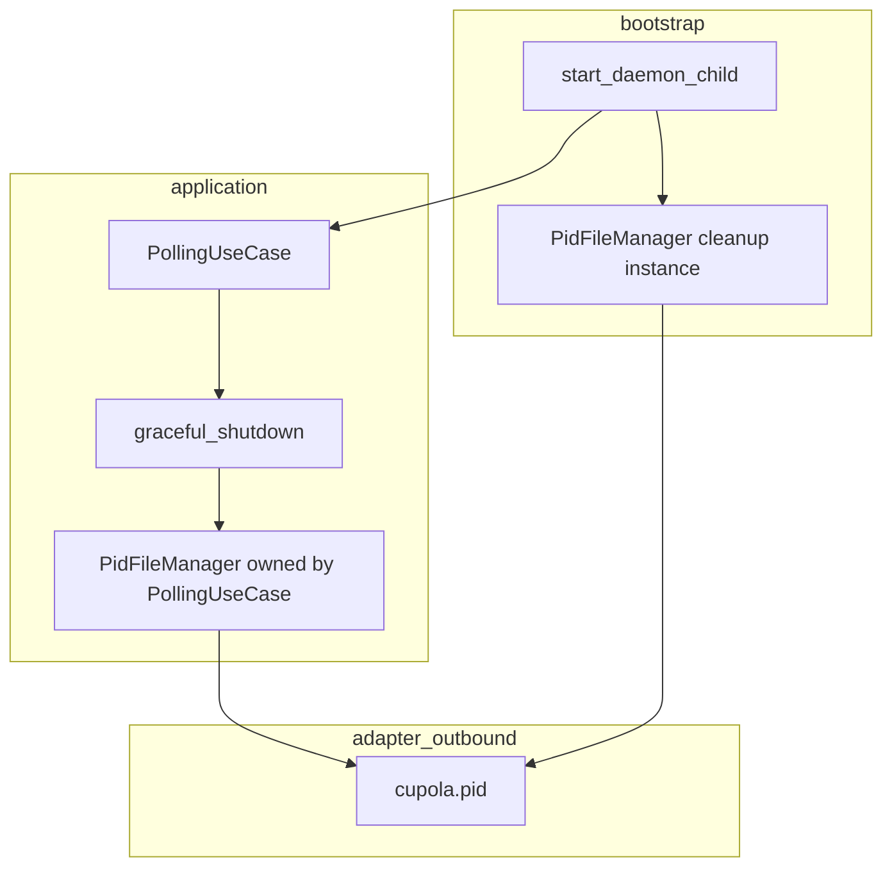
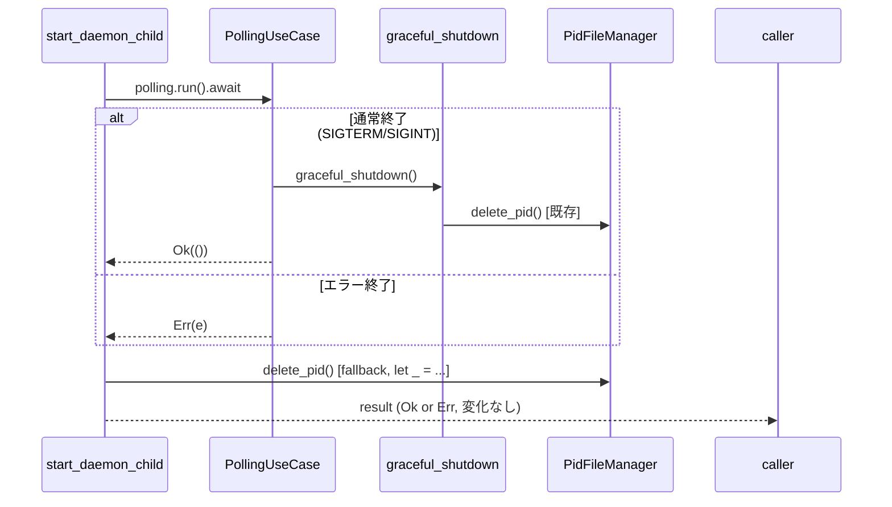

# Design Document

## Overview

**Purpose**: daemon の正常終了時（およびエラー終了時）に PID ファイルを確実に削除する。これにより、次回起動時の stale PID 検出ステップと紛らわしいログメッセージを排除する。

**Users**: cupola 運用者が `cupola stop` または SIGTERM で daemon を停止した後、次回の `cupola start` でクリーンな起動ログを得られるようになる。

**Impact**: `src/bootstrap/app.rs` の `start_daemon_child` 関数に 1 行追加するだけの最小変更。application 層以下への影響はない。

### Goals

- `polling.run().await` 完了後（正常・エラー問わず）に PID ファイルを削除する
- PID ファイル削除の失敗がポーリングループの終了結果（`Result`）を変えない
- 変更範囲を bootstrap 層のみに限定し、Clean Architecture を維持する

### Non-Goals

- `graceful_shutdown()` 内の既存 PID 削除コードの変更
- application 層（`PollingUseCase`）のリファクタリング
- PID ファイル管理の責務の大規模な再設計

## Architecture

### Existing Architecture Analysis

`start_daemon_child`（`src/bootstrap/app.rs`）は bootstrap 層の関数であり、以下の順序で処理を行う：

1. `PidFileManager::new(path)` でインスタンスを生成
2. `pid_file_manager.write_pid(pid)` で PID ファイルを書き込む
3. `polling.with_pid_file(Box::new(pid_file_manager))` で所有権を `PollingUseCase` に移す
4. `polling.run().await` でポーリングループを実行

通常の SIGTERM/SIGINT パスでは `PollingUseCase::graceful_shutdown()` が PID ファイルを削除するが、`run()` がエラーで早期リターンした場合はこのパスが通らず、PID ファイルが残存する。

### Architecture Pattern & Boundary Map



**Architecture Integration**:
- 選択パターン: bootstrap 層内での fallback クリーンアップ（オプション A）
- 変更範囲: `src/bootstrap/app.rs` のみ
- 既存パターン保持: `PollingUseCase` の PID ファイル管理ロジックは変更なし
- 新コンポーネント: 同一パスを指す2つ目の `PidFileManager` インスタンス（cleanup 専用）
- Steering 準拠: bootstrap 層が全具体型を知る唯一の場所という原則を維持

### Technology Stack

| Layer | Choice / Version | Role in Feature | Notes |
|-------|-----------------|-----------------|-------|
| bootstrap | Rust / app.rs | fallback PID 削除の追加箇所 | 1行追加のみ |
| adapter/outbound | PidFileManager | PID ファイル I/O | 既存実装を再利用 |

## Requirements Traceability

| Requirement | Summary | Components | Interfaces | Flows |
|-------------|---------|------------|------------|-------|
| 1.1 | run() 正常完了後に PID ファイル削除 | start_daemon_child | PidFilePort::delete_pid | ポーリングループ終了フロー |
| 1.2 | run() エラー終了後も PID ファイル削除を試みる | start_daemon_child | PidFilePort::delete_pid | エラーパス |
| 1.3 | PID ファイル削除失敗はエラー無視 | start_daemon_child | — | let _ = ... パターン |
| 1.4 | 削除試行が run() 結果に影響しない | start_daemon_child | — | result 変数で先取りしてから削除 |
| 2.1 | 正常終了後の次回起動で stale PID ログなし | PidFileManager cleanup | PidFilePort::read_pid | start フロー |
| 2.2 | 次回起動時の read_pid が Ok(None) を返す | PidFileManager cleanup | PidFilePort::read_pid | — |

## System Flows



フロー上の重要決定: `result = polling.run().await` で結果を先取り保存し、削除後に返すことで 1.4 の要件を保証する。

## Components and Interfaces

| Component | Domain/Layer | Intent | Req Coverage | Key Dependencies | Contracts |
|-----------|-------------|--------|--------------|-----------------|-----------|
| start_daemon_child (修正箇所) | bootstrap | daemon child プロセスの初期化とポーリングループ実行 | 1.1, 1.2, 1.3, 1.4, 2.1, 2.2 | PidFileManager (P0), PollingUseCase (P0) | Service |

### Bootstrap Layer

#### start_daemon_child

| Field | Detail |
|-------|--------|
| Intent | ポーリングループ実行後に PID ファイルの fallback クリーンアップを保証する |
| Requirements | 1.1, 1.2, 1.3, 1.4, 2.1, 2.2 |

**Responsibilities & Constraints**

- `polling.run().await` の戻り値を変数に保存する
- cleanup 専用の `PidFileManager` インスタンスで `delete_pid()` を呼ぶ
- 削除結果は `let _ = ...` で無視する（1.3）
- 保存した `result` を返す（1.4）

**Dependencies**

- Outbound: `PidFileManager::new(path)` — cleanup 用インスタンス生成（P0）
- Outbound: `PidFilePort::delete_pid()` — PID ファイル削除（P0）

**Contracts**: Service [x]

##### Service Interface

```rust
// 変更後の start_daemon_child 内の処理パターン（設計レベル）
// PidFilePort トレイトは既存定義を変更しない
trait PidFilePort {
    fn delete_pid(&self) -> Result<(), PidFileError>;
    // 他メソッドは変更なし
}
```

- Preconditions: `config_dir` が有効なパスであること
- Postconditions: `polling.run().await` の `Result` が変更されずに返される。PID ファイルは可能な限り削除される
- Invariants: `delete_pid()` は冪等（ファイル不在時も `Ok(())` を返す）

**Implementation Notes**

- Integration: `config_dir.join("cupola.pid")` を使用して cleanup 専用 `PidFileManager` を生成する。`with_pid_file` で move された既存インスタンスとは別オブジェクト
- Validation: `PidFileManager::new()` は I/O を行わないため、インスタンス生成自体は常に成功する
- Risks: なし（`delete_pid()` の冪等性により二重削除は安全）

## Error Handling

### Error Strategy

PID ファイル削除エラーはサイレントに無視する（`let _ = ...`）。ポーリングループの `Result` を汚染しないことが最優先。

### Error Categories and Responses

| エラー種別 | 発生箇所 | 対応 |
|-----------|---------|------|
| PID ファイル削除失敗（権限エラー等） | `PidFileManager::delete_pid()` | `let _ = ...` で無視 |
| PID ファイル不在（既に削除済み） | `PidFileManager::delete_pid()` | `Ok(())` を返す（冪等）、無視 |

### Monitoring

既存のログ設定を変更しない。必要に応じて `tracing::debug!` レベルで削除試行をログに残してもよいが、必須ではない。

## Testing Strategy

### Unit Tests

1. `polling.run()` が `Ok(())` を返した後、PID ファイルが削除されること
2. `polling.run()` が `Err(e)` を返した後、PID ファイルが削除されること
3. PID ファイル削除が失敗した場合でも、`polling.run()` の `Result` がそのまま返されること
4. PID ファイルが既に存在しない状態で `delete_pid()` を呼んでも `Ok(())` が返されること

### Integration Tests

1. daemon 正常終了後の次回起動で stale PID ログが出力されないこと（`tests/` ディレクトリ）
2. `start_daemon_child` のエラーパスで PID ファイルが残存しないこと
