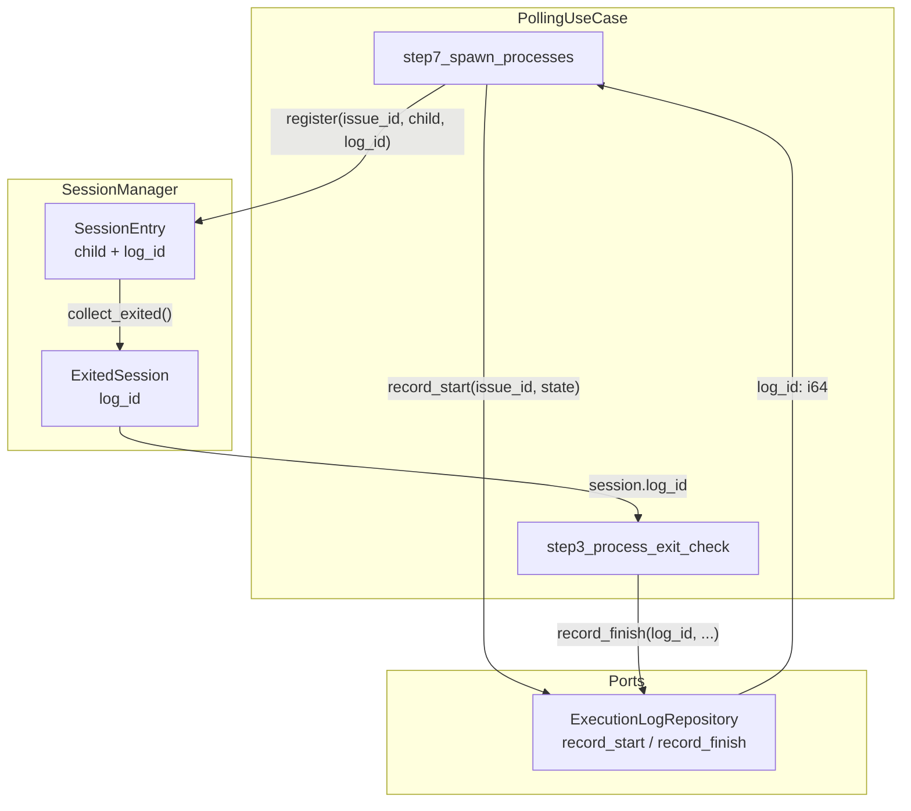
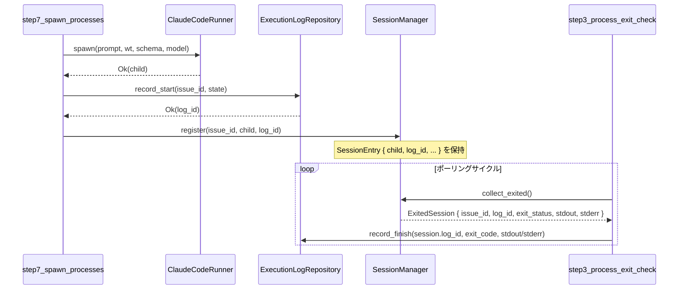

# Design Document: fix-execution-log-started-at

## Overview

`PollingUseCase` は Claude Code プロセスの生成（step7）と終了検知（step3）を担う。現在、`step3_process_exit_check` でプロセス終了後に `exec_log_repo.record_start()` を呼んでいるため、`execution_log.started_at` が実際の開始時刻ではなく終了検知時刻で記録されるバグがある。

本修正では `record_start()` の呼び出しを `step7_spawn_processes`（spawn 成功直後）へ移動し、返された `log_id` を `SessionManager` に保持させる。`step3` では保持していた `log_id` を使って `record_finish()` のみを呼ぶように変更することで、プロセスの実際の実行時間を正確に記録する。

ドメイン層・DB schema の変更は不要。変更対象は `polling_use_case.rs` と `session_manager.rs` の application 層のみ。

### Goals

- `execution_log.started_at` にプロセス spawn 時刻を正確に記録する
- `finished_at - started_at` でプロセス実際の実行時間が算出できるようにする
- 既存の `SessionManager` の責務範囲（セッションライフサイクル管理）を維持する

### Non-Goals

- DB schema の変更
- `ExecutionLogRepository` トレイトのシグネチャ変更
- ドメイン層への影響
- `started_at` の精度向上（DB の `datetime('now')` 精度はそのまま）

## Architecture

### Existing Architecture Analysis

本修正は既存 Clean Architecture の application 層内の変更のみ。

- **SessionManager**: プロセスのライフサイクル（register → collect_exited）を管理する application 層の構造体
- **PollingUseCase**: step3〜step7 のポーリングサイクルを実行するユースケース
- **ExecutionLogRepository**: application 層で定義されたアウトバウンドポート（トレイト）

現在の誤ったデータフロー:
```
step7: spawn → register(issue_id, child)   // log_id を取得しない
step3: record_start() → log_id             // ← 終了後に呼んでいる (バグ)
step3: record_finish(log_id, ...)
```

修正後の正しいデータフロー:
```
step7: spawn → record_start() → log_id
step7: register(issue_id, child, log_id)   // log_id を SessionEntry に保存
step3: collect_exited() → ExitedSession { log_id, ... }
step3: record_finish(session.log_id, ...)  // record_start は呼ばない
```

### Architecture Pattern & Boundary Map



**Key Decisions**:
- `log_id` は `SessionEntry`（private）に保持し、`ExitedSession`（public）経由で step3 へ受け渡す
- `record_start` の失敗時は `unwrap_or(0)` でフォールバック（既存パターン踏襲）
- `step3` から `record_start` 呼び出しを完全に削除する

### Technology Stack

| Layer | Choice / Version | Role in Feature | Notes |
|-------|-----------------|-----------------|-------|
| Application | Rust (Edition 2024) | PollingUseCase / SessionManager の変更 | 既存スタック継続 |
| Port | ExecutionLogRepository trait | record_start / record_finish インターフェース | シグネチャ変更なし |
| Storage | SQLite (rusqlite) | execution_log テーブルへの書き込み | schema 変更なし |

## System Flows

### 修正後の実行ログ記録フロー



**Key Decisions**:
- `record_start` は spawn 成功直後に呼ぶ。失敗時は `log_id = 0` でフォールバックし spawn 自体は中断しない。
- `record_finish` は step3 での終了検知時のみ呼ぶ。`record_start` は step3 から削除される。

## Requirements Traceability

| Requirement | Summary | Components | Interfaces | Flows |
|-------------|---------|------------|------------|-------|
| 1.1 | step7 で record_start を呼び log_id を取得 | PollingUseCase.step7 | ExecutionLogRepository.record_start | 修正後フロー: P7→EL |
| 1.2 | log_id を SessionManager に登録 | SessionManager.register | register(issue_id, child, log_id) | 修正後フロー: P7→SM |
| 1.3 | record_start 失敗時は log_id=0 でフォールバック | PollingUseCase.step7 | unwrap_or(0) | — |
| 1.4 | step3 から record_start を削除 | PollingUseCase.step3 | — | 修正後フロー |
| 2.1 | step3 で ExitedSession.log_id を使い record_finish | PollingUseCase.step3 | ExecutionLogRepository.record_finish | 修正後フロー: P3→EL |
| 2.2 | 正常終了時の record_finish | PollingUseCase.handle_successful_exit | record_finish(log_id, code, stdout, None) | — |
| 2.3 | 異常終了時の record_finish | PollingUseCase.step3 | record_finish(log_id, code, None, stderr) | — |
| 2.4 | step3 で record_start を呼ばない | PollingUseCase.step3 | — | — |
| 3.1 | register に log_id を受け取り SessionEntry に保存 | SessionManager | register(issue_id, child, log_id) | — |
| 3.2 | collect_exited が ExitedSession に log_id を含める | SessionManager | ExitedSession.log_id: i64 | — |
| 3.3 | 変更影響の最小化（呼び出し元1箇所） | SessionManager | — | — |
| 3.4 | log_id は不変保持 | SessionManager.SessionEntry | log_id: i64 (immutable) | — |
| 4.1 | finished_at - started_at > 0 | 全体 | — | 修正後フロー全体 |
| 4.2 | started_at <= finished_at | PollingUseCase | — | — |
| 4.3 | 実行ごとに独立したログレコード | PollingUseCase / ExecutionLogRepository | record_start per spawn | — |

## Components and Interfaces

### Component Summary

| Component | Layer | Intent | Req Coverage | Key Dependencies | Contracts |
|-----------|-------|--------|--------------|-----------------|-----------|
| PollingUseCase.step7 | Application | spawn 成功後に record_start を呼び log_id を取得して register | 1.1, 1.2, 1.3 | ExecutionLogRepository (P0), SessionManager (P0) | Service |
| PollingUseCase.step3 | Application | session.log_id で record_finish のみ呼ぶ（record_start 削除） | 1.4, 2.1, 2.2, 2.3, 2.4, 4.1, 4.2 | SessionManager (P0), ExecutionLogRepository (P0) | Service |
| SessionManager | Application | log_id を SessionEntry に保持し ExitedSession で返す | 3.1, 3.2, 3.3, 3.4 | なし | Service, State |
| ExitedSession | Application | log_id フィールドを追加 | 3.2 | — | State |

### Application Layer

#### PollingUseCase.step7_spawn_processes（変更箇所）

| Field | Detail |
|-------|--------|
| Intent | Claude Code プロセス spawn 成功後に record_start を呼び、log_id を SessionManager に登録する |
| Requirements | 1.1, 1.2, 1.3 |

**Responsibilities & Constraints**

- spawn 成功後・`register()` 呼び出し前に `exec_log_repo.record_start(issue.id, issue.state).await.unwrap_or(0)` を呼ぶ
- 取得した `log_id` を `session_mgr.register(issue.id, child, log_id)` に渡す
- `record_start` が失敗しても spawn フロー自体を中断しない（`unwrap_or(0)` でフォールバック）

**Dependencies**

- Outbound: `ExecutionLogRepository.record_start` — 開始時刻を DB に記録し log_id を返す (P0)
- Outbound: `SessionManager.register` — log_id を含めてセッションを登録する (P0)

**Contracts**: Service [x]

##### Service Interface

```rust
// step7_spawn_processes 内の変更箇所（擬似コード）
match self.claude_runner.spawn(...) {
    Ok(child) => {
        let log_id = self.exec_log_repo
            .record_start(issue.id, issue.state)
            .await
            .unwrap_or(0);
        self.session_mgr.register(issue.id, child, log_id);
        // ... PID 永続化
    }
    Err(e) => { /* エラー処理は変更なし */ }
}
```

**Implementation Notes**

- Integration: `record_start` の呼び出しは `spawn()` 成功後・`register()` 前に挿入する
- Validation: `log_id = 0` のケースは「ログ未記録」として許容し、`record_finish(0, ...)` が呼ばれても DB 側で無視される（既存動作）
- Risks: `record_start` の呼び出しが非同期のため、`step7_spawn_processes` の `async fn` スコープ内で `await` 可能（既存構造と変わらない）

---

#### PollingUseCase.step3_process_exit_check（変更箇所）

| Field | Detail |
|-------|--------|
| Intent | ExitedSession.log_id を使って record_finish のみ呼ぶ（record_start 呼び出しを削除） |
| Requirements | 1.4, 2.1, 2.2, 2.3, 2.4, 4.1, 4.2 |

**Responsibilities & Constraints**

- `session.log_id` を `record_start` の代わりに直接使用する
- `record_start` の呼び出し（行320-324）を削除する
- `record_finish` を呼ぶ際のインターフェースは変更なし

**Dependencies**

- Inbound: `SessionManager.collect_exited` — `ExitedSession { log_id, ... }` を受け取る (P0)
- Outbound: `ExecutionLogRepository.record_finish` — 終了情報を DB に記録する (P0)

**Contracts**: Service [x]

##### Service Interface

```rust
// step3_process_exit_check の変更箇所（擬似コード）
for session in exited {
    // ... PID クリア処理は変更なし

    // 削除: record_start 呼び出し（旧行320-324）
    // 追加: session.log_id をそのまま使用
    let log_id = session.log_id;

    if session.exit_status.success() {
        self.handle_successful_exit(&issue, &session, log_id, events).await;
    } else {
        let _ = self.exec_log_repo
            .record_finish(log_id, session.exit_status.code(), None, Some(&session.stderr))
            .await;
        self.handle_failed_exit(&issue, events);
    }
}
```

**Implementation Notes**

- Integration: `record_start` 呼び出し4行を削除し、`let log_id = session.log_id;` に置き換えるだけ
- Risks: `handle_successful_exit` の引数 `log_id` は変更なし（呼び出し元が変わるだけ）

---

#### SessionManager（変更箇所）

| Field | Detail |
|-------|--------|
| Intent | log_id を SessionEntry に保持し、ExitedSession 経由で step3 に受け渡す |
| Requirements | 3.1, 3.2, 3.3, 3.4 |

**Responsibilities & Constraints**

- `SessionEntry` に `log_id: i64` フィールドを追加（private struct）
- `register(&mut self, issue_id: i64, child: Child, log_id: i64)` にシグネチャ変更
- `ExitedSession` に `pub log_id: i64` フィールドを追加
- `collect_exited()` で `ExitedSession` を生成する際に `entry.log_id` を含める
- `log_id` は登録後に変更されない（不変）

**Dependencies**

- Inbound: `PollingUseCase.step7` — `register(issue_id, child, log_id)` で登録 (P0)
- Outbound: `PollingUseCase.step3` — `collect_exited()` が `ExitedSession { log_id }` を返す (P0)

**Contracts**: Service [x], State [x]

##### Service Interface

```rust
// SessionEntry（private）への追加
struct SessionEntry {
    child: Child,
    started_at: Instant,
    stdout_handle: Option<JoinHandle<String>>,
    stderr_handle: Option<JoinHandle<String>>,
    log_id: i64,  // 追加
}

// ExitedSession（public）への追加
pub struct ExitedSession {
    pub issue_id: i64,
    pub exit_status: ExitStatus,
    pub stdout: String,
    pub stderr: String,
    pub log_id: i64,  // 追加
}

// register() シグネチャ変更
pub fn register(&mut self, issue_id: i64, child: Child, log_id: i64);

// collect_exited() の戻り値構造体に log_id を含める
// results.push(ExitedSession { issue_id, exit_status, stdout, stderr, log_id: entry.log_id });
```

- Preconditions: `issue_id` が既に登録されていないこと（重複登録は上書き）
- Postconditions: `collect_exited()` が返す `ExitedSession.log_id` は `register()` に渡した値と同一
- Invariants: `log_id` は `SessionEntry` の存続期間中変更されない

**Implementation Notes**

- Integration: `register()` の呼び出し元は `polling_use_case.rs` の1箇所のみ（影響範囲最小）
- Validation: `log_id = 0` は `record_start` 失敗時のフォールバック値として許容される
- Risks: `SessionManager` のユニットテストで `register()` の引数を更新する必要あり

## Data Models

### Domain Model

変更なし。`execution_log` エンティティおよび DB schema に変更は不要。

### Logical Data Model

`execution_log` テーブルの `started_at` カラムは spawn 時に `datetime('now')` で記録される。修正後は `started_at` が spawn 時刻、`finished_at` が終了検知時刻となり、`finished_at - started_at` が実際の実行時間を表す。

```
execution_log:
  id          INTEGER PRIMARY KEY
  issue_id    INTEGER
  state       TEXT
  started_at  DATETIME  ← spawn 時に record_start() で記録（修正後）
  finished_at DATETIME  ← 終了検知時に record_finish() で記録
  exit_code   INTEGER
  stdout      TEXT
  stderr      TEXT
```

## Error Handling

### Error Strategy

`record_start` の失敗は spawn フローを中断しない（`unwrap_or(0)` でフォールバック）。これにより、DB 障害時もプロセス実行は継続される。

### Error Categories and Responses

| エラーケース | 対応 |
|------------|------|
| `record_start` 失敗 | `log_id = 0` でフォールバック。プロセス spawn は継続。ログに警告なし（既存パターン） |
| `record_finish(0, ...)` | DB 側で `id = 0` のレコードが存在しない場合は UPDATE が0行になるだけ（既存動作） |
| spawn 失敗 | `record_start` は呼ばない（spawn 後に呼ぶため）。変更前後で動作は同一 |

### Monitoring

既存の `tracing::info!` / `tracing::warn!` による構造化ログは変更なし。

## Testing Strategy

### Unit Tests

- `SessionManager::register` に `log_id` 引数を渡し、`collect_exited()` の戻り値 `ExitedSession.log_id` が一致することを確認
- `step7_spawn_processes` のモックテストで `record_start` が spawn 後に呼ばれることを確認
- `step3_process_exit_check` のモックテストで `record_start` が呼ばれず、`record_finish` のみが呼ばれることを確認

### Integration Tests

- `MockExecutionLogRepository` で `record_start` の呼び出し順序・引数を検証
- 正常終了・異常終了の両パスで `started_at < finished_at` になることを検証（`record_start` と `record_finish` の呼び出し時刻比較）
