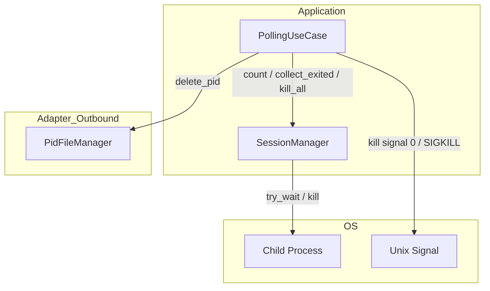
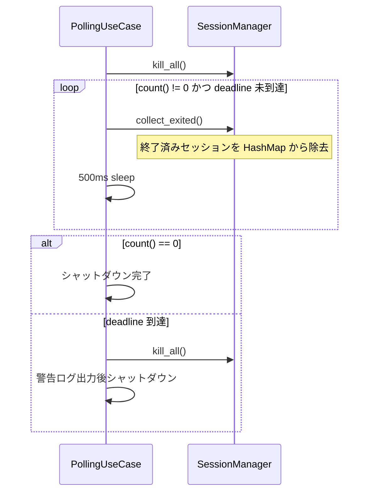
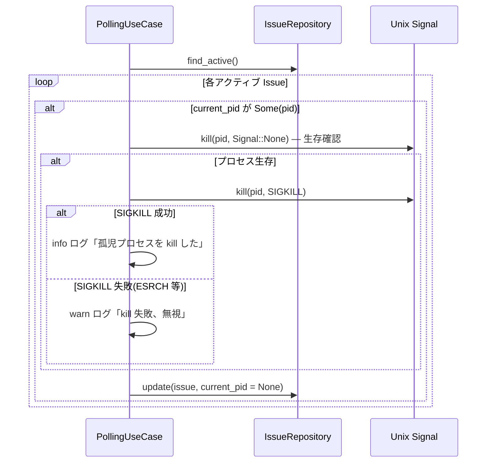

# 設計書: fix-process-leak

## Overview

本フィーチャーは `polling_use_case.rs` に存在する2つのプロセス管理バグを修正し、シャットダウン時のゾンビプロセスと起動時の孤児プロセスによる API コスト漏洩を解消する。

**Purpose**: Cupola デーモンのプロセスライフサイクル管理の正確性を向上させ、不要なプロセスが残留しないことを保証する。

**Users**: Cupola デーモンの運用者（デーモン実行中の停止・再起動操作を行う全ユーザー）。

**Impact**: `PollingUseCase` 内の `graceful_shutdown` と `recover_on_startup` の2メソッドを変更する。外部インターフェースへの変更はなく、既存の状態機械・ポート定義は維持される。

### Goals

- `graceful_shutdown` において全子プロセスが確実に回収されてからシャットダウンを完了する
- `recover_on_startup` において前回クラッシュ時の孤児プロセスを SIGKILL で終了する
- 両修正に対するユニットテストを追加し、リグレッションを防ぐ

### Non-Goals

- `SessionManager` のインターフェース変更
- Windows / macOS 固有のシグナル実装（Unix 環境のみ対象）
- シャットダウンタイムアウト値（10秒）の変更
- その他の use case への影響

## Architecture

### Existing Architecture Analysis

`PollingUseCase` は application 層（`src/application/polling_use_case.rs`）に存在し、`SessionManager` を介して子プロセス（Claude Code セッション）を管理する。プロセスシグナルには `nix` クレート（v0.29）が `stop_use_case.rs` および `pid_file_manager.rs` で既に使用されており、同パターンを踏襲する。

```
src/application/
  polling_use_case.rs   ← graceful_shutdown / recover_on_startup を修正
  session_manager.rs    ← count() / collect_exited() / kill_all() は変更なし
```

### Architecture Pattern & Boundary Map

本修正はロジック変更のみで、コンポーネント境界・レイヤー構造への影響はない。



**Key Decisions**:
- `is_process_alive` は `polling_use_case.rs` 内のモジュールレベル自由関数として実装（`stop_use_case.rs` の nix 使用パターンに準拠）
- `SessionManager` への変更なし（責務境界を維持）
- 詳細な調査・選択根拠は `research.md` を参照

### Technology Stack

| Layer | Choice / Version | Role | Notes |
|-------|-----------------|------|-------|
| Application | Rust Edition 2024 | `graceful_shutdown` / `recover_on_startup` ロジック修正 | 変更なし |
| OS Signal | nix 0.29 (process, signal) | `kill(Pid, None)` でプロセス生存確認、`kill(Pid, SIGKILL)` で強制終了 | 既存依存、追加不要 |

## System Flows

### graceful_shutdown 修正後のフロー



**変更点**: ループ継続条件が `!exited.is_empty()` から `self.session_mgr.count() != 0` に変更。`collect_exited()` はセッション回収の副作用目的で呼び続ける。

### recover_on_startup 修正後のフロー



## Requirements Traceability

| Requirement | Summary | Components | Interfaces | Flows |
|-------------|---------|------------|------------|-------|
| 1.1 | ループ終了判定を `count() == 0` で行う | PollingUseCase | SessionManager::count() | graceful_shutdown フロー |
| 1.2 | `collect_exited()` 空でもループ継続 | PollingUseCase | SessionManager::collect_exited() | graceful_shutdown フロー |
| 1.3 | deadline 未到達中は 500ms ごとに collect_exited() | PollingUseCase | SessionManager::collect_exited() | graceful_shutdown フロー |
| 1.4 | deadline 到達時は強制 kill + 警告ログ | PollingUseCase | SessionManager::kill_all() | graceful_shutdown フロー |
| 1.5 | PID ファイル削除は既存動作を維持 | PollingUseCase | PidFileManager::delete_pid() | graceful_shutdown フロー |
| 2.1 | current_pid が Some のときプロセス生存確認 | PollingUseCase (is_process_alive) | nix::sys::signal::kill(pid, None) | recover_on_startup フロー |
| 2.2 | 生存プロセスに SIGKILL を送信 | PollingUseCase (is_process_alive) | nix::sys::signal::kill(pid, SIGKILL) | recover_on_startup フロー |
| 2.3 | 死亡済みプロセスは kill せずクリア | PollingUseCase | IssueRepository::update() | recover_on_startup フロー |
| 2.4 | kill 失敗時は警告ログ、クリアは継続 | PollingUseCase | tracing::warn! | recover_on_startup フロー |
| 2.5 | シグナル 0 による生存確認ロジック | is_process_alive (自由関数) | nix::sys::signal::kill | recover_on_startup フロー |
| 3.1–3.5 | テストカバレッジ | テストモジュール | SessionManager mock / 自由関数 | 各ユニットテスト |

## Components and Interfaces

### コンポーネント一覧

| Component | Layer | Intent | Req Coverage | Key Dependencies | Contracts |
|-----------|-------|--------|--------------|-----------------|-----------|
| PollingUseCase::graceful_shutdown | Application | シャットダウンループ判定修正 | 1.1–1.5 | SessionManager (P0), PidFileManager (P1) | State |
| PollingUseCase::recover_on_startup | Application | 孤児プロセス kill 処理追加 | 2.1–2.5 | IssueRepository (P0), is_process_alive (P0) | State |
| is_process_alive | Application (自由関数) | Unix シグナル 0 によるプロセス生存確認 | 2.1, 2.5 | nix::sys::signal (P0) | Service |

---

### Application Layer

#### PollingUseCase::graceful_shutdown

| Field | Detail |
|-------|--------|
| Intent | `count() == 0` をループ終了条件とし、全子プロセス回収を保証する |
| Requirements | 1.1, 1.2, 1.3, 1.4, 1.5 |

**Responsibilities & Constraints**
- ループ終了条件を `self.session_mgr.count() == 0` に変更する
- `collect_exited()` の呼び出しは副作用（セッション回収）目的で維持する
- デッドライン・PID ファイル削除の既存ロジックは変更しない

**Dependencies**
- Inbound: シグナルハンドラ（SIGTERM/SIGINT） — 呼び出しトリガー (P0)
- Outbound: SessionManager::count() — ループ終了判定 (P0)
- Outbound: SessionManager::collect_exited() — セッション回収 (P0)
- Outbound: SessionManager::kill_all() — 強制終了 (P1)
- Outbound: PidFileManager::delete_pid() — 後処理 (P1)

**Contracts**: State [x]

##### State Management
- State model: `session_mgr` の sessions HashMap のサイズが 0 になることでシャットダウン完了を判定
- Concurrency strategy: `graceful_shutdown` は tokio の async context で呼ばれるが、SessionManager は `&mut self` で排他的にアクセスするため競合なし

**Implementation Notes**
- Integration: `if exited.is_empty() { break; }` を `if self.session_mgr.count() == 0 { break; }` に置換するのみ
- Validation: `let _ = self.session_mgr.collect_exited();` として戻り値を明示的に無視することを示す
- Risks: 変更箇所が1行のため影響範囲は極めて限定的

---

#### PollingUseCase::recover_on_startup

| Field | Detail |
|-------|--------|
| Intent | current_pid が Some の場合、プロセス生存確認と SIGKILL を実施してから DB をクリアする |
| Requirements | 2.1, 2.2, 2.3, 2.4 |

**Responsibilities & Constraints**
- `current_pid` が `Some(pid)` の場合、`is_process_alive(pid)` で確認する
- 生存確認 OK の場合、SIGKILL を送信してから `current_pid = None` にクリアする
- kill 失敗は警告ログのみで処理を継続し、クリアは実行する（起動を妨げない）

**Dependencies**
- Inbound: PollingUseCase::run() — 起動時に呼ばれる (P0)
- Outbound: IssueRepository::find_active() — アクティブ Issue の取得 (P0)
- Outbound: IssueRepository::update() — current_pid のクリア (P0)
- Outbound: is_process_alive() — プロセス生存確認 (P0)
- External: nix::sys::signal::kill — SIGKILL 送信 (P0)

**Contracts**: State [x]

##### State Management
- State model: Issue エンティティの `current_pid` フィールドを None にする
- Persistence: `IssueRepository::update()` 経由で SQLite に反映
- Concurrency strategy: 起動時（ポーリングループ開始前）に単一スレッドで実行するため競合なし

**Implementation Notes**
- Integration: `is_process_alive` 自由関数を呼び出す形に変更。nix の import を追加（既存の `stop_use_case.rs` と同パターン）
- Risks: PID 再利用（同一 PID が別プロセスに割り当てられる）のリスクは低いが、`research.md` に記録済み

---

#### is_process_alive（自由関数）

| Field | Detail |
|-------|--------|
| Intent | Unix シグナル 0 を使用してプロセスが生存しているかを確認する |
| Requirements | 2.1, 2.5 |

**Responsibilities & Constraints**
- `nix::sys::signal::kill(Pid::from_raw(pid as i32), None)` を呼び出す
- `Ok(())` → 生存（`true`）、`Err(Errno::ESRCH)` → 不在（`false`）
- その他エラー（`EPERM` 等）は保守的に `true` を返す（kill を試みさせる）

**Dependencies**
- External: nix::sys::signal::kill — シグナル 0 送信 (P0)
- External: nix::unistd::Pid — PID 型変換 (P0)

**Contracts**: Service [x]

##### Service Interface

```rust
/// 指定 PID のプロセスが現在実行中かどうかを確認する。
/// Unix シグナル 0 (kill(pid, 0)) を使用する。
///
/// Returns:
///   true  - プロセスが存在する（または確認不能）
///   false - プロセスが存在しない (ESRCH)
fn is_process_alive(pid: u32) -> bool
```

- Preconditions: `pid > 0`
- Postconditions: ESRCH エラー以外は `true` を返す（保守的）
- Invariants: 副作用なし（シグナル 0 はプロセスに影響を与えない）

**Implementation Notes**
- Integration: `#[cfg(unix)]` で Unix 専用実装にする。`polling_use_case.rs` の先頭 `use` 節に nix import を追加。
- Risks: テスト時に実際の OS プロセスへの依存が生じるが、ユニットテストでは PID として存在しない値（例: 999999）を使う回避策が可能

## Error Handling

### Error Strategy

| エラー種別 | 発生箇所 | 対応 |
|-----------|---------|------|
| `collect_exited()` 内の `try_wait` 失敗 | graceful_shutdown loop | 既存の warn ログ（変更なし） |
| deadline 到達でも `count() > 0` | graceful_shutdown | `kill_all()` + warn ログ（既存動作を維持） |
| `is_process_alive` の EPERM | recover_on_startup | `true` を返し SIGKILL を試みる |
| SIGKILL 失敗 (ESRCH 等) | recover_on_startup | warn ログ、`current_pid` クリアは継続 |
| `find_active()` 失敗 | recover_on_startup | warn ログ（既存の動作を維持） |

### Monitoring

- `tracing::info!` / `tracing::warn!` を用いた構造化ログを出力する（既存パターンを維持）
- 孤児プロセスへの SIGKILL 送信時は `info` ログで PID と issue_id を記録する

## Testing Strategy

### Unit Tests

1. **graceful_shutdown ループ終了条件**（`polling_use_case.rs` のテストモジュール）
   - `collect_exited()` が最初に空を返し、2回目に count が 0 になるケースでループが正常終了することを確認
   - `SessionManager` をモックし、呼び出し回数と最終状態を検証

2. **recover_on_startup — 生存プロセスの kill**
   - `current_pid = Some(pid)` かつ `is_process_alive` が `true` を返す場合、SIGKILL が呼ばれることを確認
   - `current_pid` が `None` にクリアされることを確認

3. **recover_on_startup — 死亡済みプロセスのクリア**
   - `current_pid = Some(pid)` かつ `is_process_alive` が `false` を返す場合、SIGKILL が呼ばれないことを確認
   - `current_pid` が `None` にクリアされることを確認

4. **is_process_alive — シグナル 0 の結果マッピング**
   - 存在しない PID（999999 等）に対して `false` が返ることを確認
   - `kill` が `Ok(())` を返す場合に `true` が返ることを確認（nix をモックまたは依存注入で置換）

5. **recover_on_startup — kill 失敗時のフォールスルー**
   - SIGKILL 失敗時でも `current_pid` のクリアが実行されることを確認
   - 警告ログが出力されることを確認（tracing-test 等を使用）

### Integration Tests

1. **graceful_shutdown デッドライン動作**: デッドライン到達時に `kill_all()` が呼ばれ、ループが終了することを確認
2. **recover_on_startup + graceful_shutdown の連携**: 起動 → ポーリング → シャットダウンの一連フローで孤児チェックが適切に動作することを確認

## Security Considerations

- SIGKILL は対象プロセスが同一ユーザー所有の場合のみ成功する。Cupola デーモンが起動した Claude Code プロセスは同一UID のため問題なし。
- PID 再利用によって意図しないプロセスを kill するリスクは低いが、ログで PID を記録し監査可能にする。
