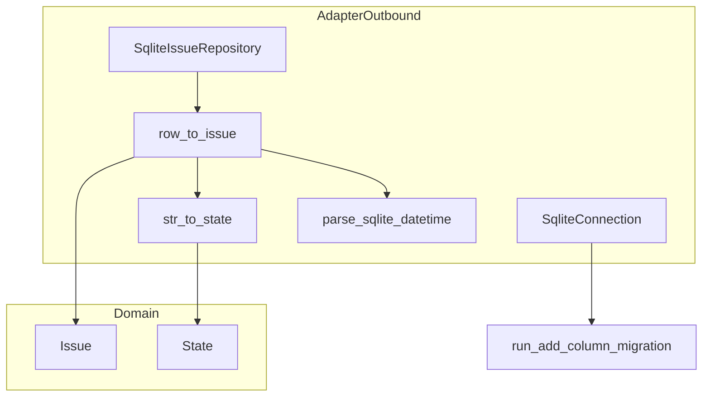
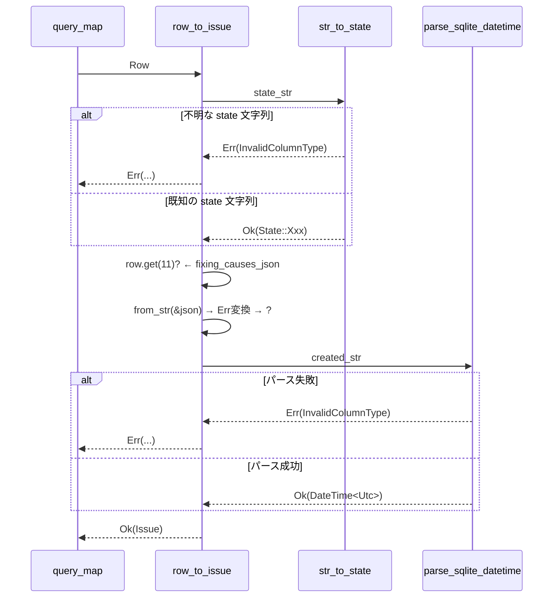

# Design Document: fix-silent-fallback-to-result

## Overview

本機能は `sqlite_issue_repository.rs` および `sqlite_connection.rs` に存在するサイレントフォールバックを `Result` エラー伝播に変換し、DBデータ異常時の予期しない動作を防止する。

**Purpose**: DBデータが破損・不整合な場合、`SqliteIssueRepository` がサイレントにデフォルト値を返すことで引き起こされる再処理・タイムアウト誤判定を排除し、エラーログによる明示的な検出に変える。

**Users**: Cupola エージェントの開発・運用者。破損データを持つ Issue が `Idle` として再処理されたり、stall timeout が誤計算されるリスクから保護される。

**Impact**: `row_to_issue` の内部実装が変更されるが、戻り型 `rusqlite::Result<Issue>` は変わらないため呼び出し元への影響はない。マイグレーション処理は他のカラムと統一される。

### Goals

- 6か所のサイレントフォールバックをすべてエラー伝播に変換する
- `rusqlite::Error` のみを使用し、新たな型・依存を追加しない
- 修正後も既存のテストが通過する（+ 新規テストで動作を保証する）

### Non-Goals

- `IssueRepository` トレイトのインターフェース変更
- `row_to_issue` の呼び出し元（`find_active`, `find_needing_process`, `find_by_state` 等）の変更
- 破損データのリカバリ機能
- カスタムエラー型の導入

## Architecture

### Existing Architecture Analysis

本修正は `adapter/outbound` 層の2ファイルに完全に閉じており、`domain`・`application` 層への影響はない。

```
adapter/outbound/
├── sqlite_connection.rs        ← Migration コード修正
└── sqlite_issue_repository.rs  ← row_to_issue 関連修正
```

`row_to_issue` は `rusqlite::Result<Issue>` を既に返しているため、内部でのエラー伝播方式を変更しても関数シグネチャに変更はなく、`query_map` で使用している既存の呼び出しパターンも変更不要。

### Architecture Pattern & Boundary Map



**Key Decisions**:
- 変更は `adapter/outbound` 層のみに限定
- `rusqlite::Error` を統一エラー型として使用（新規型不要）
- `str_to_state` の可視性を `pub(crate)` に縮小（テストで直接呼ばれていない場合）

### Technology Stack

| Layer | Choice / Version | Role in Feature | Notes |
|-------|------------------|-----------------|-------|
| Data / Storage | rusqlite (既存) | `rusqlite::Error` を伝播型として使用 | 新規依存なし |
| Backend | serde_json (既存) | JSON パースエラーを `rusqlite::Error` に変換 | `FromSqlConversionFailure` を使用 |

## System Flows

### row_to_issue の修正後フロー



## Requirements Traceability

| Requirement | Summary | Components | Interfaces |
|-------------|---------|------------|------------|
| 1.1〜1.4 | str_to_state エラー伝播 | str_to_state, row_to_issue | str_to_state の戻り型変更 |
| 2.1〜2.2 | fixing_causes_json カラム取得 | row_to_issue | `row.get(11)?` |
| 3.1〜3.3 | fixing_causes JSON パース | row_to_issue | `FromSqlConversionFailure` 変換 |
| 4.1〜4.4 | parse_sqlite_datetime | parse_sqlite_datetime, row_to_issue | 戻り型を Result に |
| 5.1〜5.3 | マイグレーション統一 | SqliteConnection | run_add_column_migration 使用 |
| 6.1〜6.3 | reset_for_restart 修正 | SqliteIssueRepository | UPDATE SQL に fixing_causes 追加 |

## Components and Interfaces

### コンポーネント一覧

| Component | Layer | Intent | Req Coverage | 変更種別 |
|-----------|-------|--------|--------------|---------|
| str_to_state | adapter/outbound | state 文字列 → State 変換 | 1.1〜1.4 | 戻り型変更 |
| row_to_issue | adapter/outbound | Row → Issue 変換 | 1.1〜4.4 | 内部処理変更 |
| parse_sqlite_datetime | adapter/outbound | 日時文字列 → DateTime 変換 | 4.1〜4.4 | 戻り型変更 |
| SqliteConnection::init_schema | adapter/outbound | スキーマ初期化・マイグレーション | 5.1〜5.3 | マイグレーション統一 |
| reset_for_restart | adapter/outbound | Issue の再起動リセット | 6.1〜6.3 | SQL 修正 |

### adapter/outbound

#### str_to_state

| Field | Detail |
|-------|--------|
| Intent | state 文字列を `State` 列挙子に変換し、未知文字列はエラーを返す |
| Requirements | 1.1, 1.2, 1.3, 1.4 |

**Responsibilities & Constraints**

- 全既知 state 文字列を `Ok(State::Xxx)` で返す
- 未知文字列は `Err(rusqlite::Error::InvalidColumnType(...))` を返す（`Idle` フォールバック廃止）
- 関数は `row_to_issue` からのみ呼ばれるため、可視性は `fn`（非公開）に縮小可能

**Contracts**: Service [x]

##### Service Interface

```rust
fn str_to_state(col_idx: usize, s: &str) -> rusqlite::Result<State>;
```

- Preconditions: `s` は SQLite から読み出した state カラムの文字列
- Postconditions: 既知文字列 → `Ok(State)`, 未知文字列 → `Err(InvalidColumnType(col_idx, s.to_owned(), Type::Text))`
- Invariants: 既存の全 `State` バリアントに対応するマッチアームを網羅する

**Implementation Notes**

- `col_idx` は `row_to_issue` 内で state カラムのインデックス（2）を渡す
- `rusqlite::Error::InvalidColumnType(col_idx, value.to_string(), rusqlite::types::Type::Text)` を構築する

#### row_to_issue

| Field | Detail |
|-------|--------|
| Intent | SQLite の Row を `Issue` エンティティに変換する（エラーは全て伝播） |
| Requirements | 1.2, 2.1, 2.2, 3.1, 3.2, 3.3, 4.4 |

**Responsibilities & Constraints**

- `str_to_state` を呼び出し、`?` でエラーを伝播する
- `row.get(11)?` で `fixing_causes_json` を取得（フォールバックなし）
- `serde_json::from_str` の失敗を `rusqlite::Error::FromSqlConversionFailure` に変換して `?` で伝播
- `parse_sqlite_datetime` を呼び出し、`?` でエラーを伝播する

**Contracts**: Service [x]

##### Service Interface

```rust
fn row_to_issue(row: &rusqlite::Row) -> rusqlite::Result<Issue>;
```

- Preconditions: `row` は issues テーブルの全カラムを含む（カラム順: id, github_issue_number, state, design_pr_number, impl_pr_number, worktree_path, retry_count, current_pid, error_message, feature_name, model, fixing_causes, created_at, updated_at）
- Postconditions: 全カラムが正常 → `Ok(Issue)`, いずれかのカラムが異常 → `Err(rusqlite::Error)`
- Invariants: 戻り型は変わらず `rusqlite::Result<Issue>`

**Implementation Notes**

- `fixing_causes` の変換: `serde_json::from_str::<Vec<FixingProblemKind>>(&fixing_causes_json).map_err(|e| rusqlite::Error::FromSqlConversionFailure(11, rusqlite::types::Type::Text, Box::new(e)))?`
- 既存の `tracing::warn!` は削除する（エラーが呼び出し元でログされるため）

#### parse_sqlite_datetime

| Field | Detail |
|-------|--------|
| Intent | SQLite の日時文字列を `DateTime<Utc>` に変換し、失敗はエラーを返す |
| Requirements | 4.1, 4.2, 4.3 |

**Responsibilities & Constraints**

- `"%Y-%m-%d %H:%M:%S"` 形式の文字列をパースする
- パース失敗時は `rusqlite::Error::InvalidColumnType` を返す（epoch フォールバック廃止）

**Contracts**: Service [x]

##### Service Interface

```rust
fn parse_sqlite_datetime(col_idx: usize, s: &str) -> rusqlite::Result<DateTime<Utc>>;
```

- Preconditions: `s` は SQLite の `datetime('now')` で生成された文字列
- Postconditions: パース成功 → `Ok(DateTime<Utc>)`, 失敗 → `Err(InvalidColumnType(col_idx, s.to_owned(), Type::Text))`

#### SqliteConnection::init_schema（マイグレーション部分）

| Field | Detail |
|-------|--------|
| Intent | `fixing_causes` カラムのマイグレーションを他カラムと統一する |
| Requirements | 5.1, 5.2, 5.3 |

**Responsibilities & Constraints**

- `let _ = conn.execute_batch(...)` を `Self::run_add_column_migration(&conn, "fixing_causes TEXT NOT NULL DEFAULT '[]'")?` に置き換える

**Contracts**: Service [x]

##### Service Interface

変更なし（既存の `run_add_column_migration` を呼ぶだけ）

```rust
// Before:
let _ = conn.execute_batch("ALTER TABLE issues ADD COLUMN fixing_causes TEXT NOT NULL DEFAULT '[]';");

// After:
Self::run_add_column_migration(&conn, "fixing_causes TEXT NOT NULL DEFAULT '[]'")?;
```

#### reset_for_restart（SQL 修正）

| Field | Detail |
|-------|--------|
| Intent | Issue の再起動リセット時に `fixing_causes` も空配列にリセットする |
| Requirements | 6.1, 6.2, 6.3 |

**Contracts**: State [x]

##### State Management

UPDATE 文への追加:

```sql
-- Before（抜粋）:
SET state = 'idle',
    retry_count = 0,
    current_pid = NULL,
    error_message = NULL,
    model = NULL,
    updated_at = datetime('now')

-- After:
SET state = 'idle',
    retry_count = 0,
    current_pid = NULL,
    error_message = NULL,
    model = NULL,
    fixing_causes = '[]',
    updated_at = datetime('now')
```

## Error Handling

### Error Strategy

DBデータ異常を `rusqlite::Error` として伝播し、呼び出し元（`query_map` → `collect::<Result<Vec<_>, _>>` → `.context("...")`）でエラーメッセージをログに記録する。`collect::<Result<Vec<_>, _>>()` を用いるため、個別の Issue が読み取れない場合はその行だけをスキップせず、そのクエリ呼び出し全体が `Err` になる。

### Error Categories and Responses

| エラー種別 | rusqlite::Error バリアント | 発生箇所 |
|-----------|--------------------------|---------|
| 未知の state 文字列 | `InvalidColumnType(2, value, Type::Text)` | str_to_state |
| fixing_causes カラム取得失敗 | `rusqlite::Error`（get が返すエラーそのまま） | row_to_issue |
| fixing_causes JSON パース失敗 | `FromSqlConversionFailure(11, Type::Text, serde_json::Error)` | row_to_issue |
| 日時文字列パース失敗 | `InvalidColumnType(col_idx, value, Type::Text)` | parse_sqlite_datetime |

### Monitoring

既存の `tracing::warn!` を削除し、代わりに呼び出しスタック上で `anyhow::Context` によるエラーメッセージが構造化ログに記録される。

## Testing Strategy

### Unit Tests（`#[cfg(test)] mod tests` in sqlite_issue_repository.rs）

1. `str_to_state` — 全既知文字列で `Ok(State::Xxx)` を返す
2. `str_to_state` — 未知文字列で `Err(InvalidColumnType)` を返す
3. `parse_sqlite_datetime` — 正しい形式で `Ok(DateTime)` を返す
4. `parse_sqlite_datetime` — 不正形式で `Err(InvalidColumnType)` を返す
5. `row_to_issue` 相当 — 破損 JSON を持つ Row の `find_active`/`find_needing_process`/`find_by_state` がエラーを返す（in-memory DB 使用）

### Integration Tests（既存 in-memory DB テスト）

1. 正常 Issue の `save` → `find_active` ラウンドトリップ（既存テストの継続通過を確認）
2. `reset_for_restart` 後の `fixing_causes` が `[]` であることを確認

### Unit Tests（sqlite_connection.rs）

1. `init_schema` — `fixing_causes` カラムが重複追加時にエラーにならない（冪等性確認）

## Migration Strategy

本修正はスキーマ変更を伴わない。`fixing_causes` カラムのマイグレーション方式を `run_add_column_migration` に統一するが、冪等性はそのまま維持される。

ロールバックが必要な場合は元の `let _ = conn.execute_batch(...)` に戻すだけであり、DBへの影響はない。
