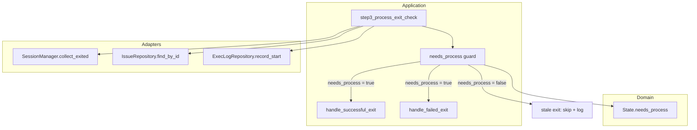

# Design Document: fix-stale-process-exit

## Overview

`step3_process_exit_check` は、終了したプロセスのセッションを検知してポーリングイベントを生成する。現在の実装では、issue が PR マージや Issue クローズなどの別イベントにより既に遷移済みであっても、失敗終了時に `ProcessFailed` / `RetryExhausted` イベントを無条件に発行してしまう。

本修正は `step3_process_exit_check` のループ内に `needs_process()` ガードを追加することで stale な process exit を安全に無視し、`retry_count` の不正インクリメントおよびノイズログを排除する。変更は `src/application/polling_use_case.rs` の数行に限定される。

### Goals

- stale な process exit が `ProcessFailed` / `RetryExhausted` イベントを発行しないことを保証する
- `retry_count` が実際に失敗した試行にのみインクリメントされることを保証する
- PR マージ・Issue クローズ・stall kill の競合シナリオに対して正確なイベント処理を実現する

### Non-Goals

- `SessionManager` の根本的な改善（kill 済みセッションの明示的なキャンセルマーク付け）
- `exec_log_repo.record_start` が stale exit で空振りする問題の解消（別 Issue で対応）
- ポーリングループの他ステップへの変更

## Architecture

### Existing Architecture Analysis

Cupola はクリーンアーキテクチャ 4 層構成（domain / application / adapter / bootstrap）を採用している。

- **domain**: `State` enum と `needs_process()` メソッドを定義（`src/domain/state.rs`）
- **application**: `PollingUseCase` が `step3_process_exit_check` を保持（`src/application/polling_use_case.rs`）
- `needs_process()` は既存の純粋ドメイン関数であり、新たな実装は不要

### Architecture Pattern & Boundary Map



**Architecture Integration**:
- 選択パターン: 既存のガードパターンを `step3_process_exit_check` ループ内に追加（`handle_successful_exit` の L373 と対称）
- 既存パターン保持: Clean Architecture の依存方向を維持。`needs_process()` はドメイン層に存在し、アプリケーション層から呼び出す
- 新規コンポーネント: なし（既存関数の再利用のみ）

### Technology Stack

| Layer | Choice / Version | Role in Feature | Notes |
|-------|------------------|-----------------|-------|
| Backend / Services | Rust Edition 2024 | ガード条件式の実装 | 既存スタックと同一 |
| Messaging / Events | 内部 `Vec<(i64, Event)>` | イベント発行の制御 | 既存機構を利用 |
| Infrastructure / Runtime | tokio async | 非同期ループ | 変更なし |

## System Flows

### stale exit の判定フロー

```mermaid
sequenceDiagram
    participant Loop as polling_cycle
    participant Step3 as step3_process_exit_check
    participant Repo as IssueRepository
    participant Domain as State.needs_process
    participant Handler as handle_failed_exit

    Loop->>Step3: collect_exited sessions
    Step3->>Repo: find_by_id(session.issue_id)
    Repo-->>Step3: issue (最新状態)
    Step3->>Domain: issue.state.needs_process()
    alt needs_process = false (stale)
        Domain-->>Step3: false
        Step3->>Step3: tracing::info "ignoring stale process exit"
        Step3->>Step3: continue (skip)
    else needs_process = true (active)
        Domain-->>Step3: true
        Step3->>Handler: handle_failed_exit / handle_successful_exit
    end
```

**フロー上の設計決定**: ガードは `exec_log_repo.record_start` の後、ハンドラ呼び出しの前に置く。これにより PID クリアと実行ログ開始は stale exit でも実行されるが、`ProcessFailed` イベントは発行されない。`record_start` が空振りする問題は軽微であり、別 Issue で対応する（`research.md` 参照）。

## Requirements Traceability

| Requirement | Summary | Components | Interfaces | Flows |
|-------------|---------|------------|------------|-------|
| 1.1 | 最新状態取得後にハンドラを呼び出す | step3_process_exit_check | IssueRepository.find_by_id | stale exit 判定フロー |
| 1.2 | needs_process = false なら skip | step3_process_exit_check + needs_process guard | State.needs_process | stale exit 判定フロー |
| 1.3 | stale skip 時に INFO ログを出力 | step3_process_exit_check | tracing::info | stale exit 判定フロー |
| 1.4 | needs_process = true なら従来通り処理 | handle_successful_exit / handle_failed_exit | Event Vec | stale exit 判定フロー |
| 2.1 | stale exit では retry_count をインクリメントしない | handle_failed_exit（呼び出さない） | RetryPolicy | stale exit 判定フロー |
| 2.2 | ProcessFailed は needs_process 時のみ | handle_failed_exit | Event::ProcessFailed | stale exit 判定フロー |
| 2.3 | RetryExhausted は needs_process 時のみ | handle_failed_exit | Event::RetryExhausted | stale exit 判定フロー |
| 3.1 | PR merge 後の stale exit を無視 | step3_process_exit_check + registered_state guard | SessionManager.registered_state, State.needs_process | 競合シナリオ |
| 3.2 | Issue close 後の stale exit をスキップ | step3_process_exit_check + guard | State.needs_process | 競合シナリオ |
| 3.3 | 複数 stale exit を個別に評価 | step3_process_exit_check ループ | 各 session ごとにチェック | 競合シナリオ |

## Components and Interfaces

| Component | Domain/Layer | Intent | Req Coverage | Key Dependencies | Contracts |
|-----------|--------------|--------|--------------|------------------|-----------|
| step3_process_exit_check | Application | プロセス終了の検知とイベント生成 | 1.1-1.4, 2.1-2.3, 3.1-3.3 | IssueRepository (P0), SessionManager.registered_state (P0), State.needs_process (P0) | State |
| State.needs_process | Domain | プロセスが必要な状態かどうかを判定 | 1.2, 2.1-2.3 | なし | Service |
| SessionManager.registered_state | Application | セッション登録時の issue 状態を保持 | 3.1 | なし | State |

### Application Layer

#### step3_process_exit_check（修正対象）

| Field | Detail |
|-------|--------|
| Intent | 終了したセッションを処理し、issue 状態に基づいてイベントを生成する |
| Requirements | 1.1, 1.2, 1.3, 1.4, 2.1, 2.2, 2.3, 3.1, 3.2, 3.3 |

**Responsibilities & Constraints**

- 終了セッション一覧を `SessionManager` から取得し、各 issue の最新状態に基づいてイベントを生成する
- セッション登録時の状態（`registered_state`）と現在の DB 状態が異なる場合、またはいずれかが `needs_process() == false` の場合は stale と判定してスキップする
- stale exit をスキップした場合は INFO ログを出力する
- stale ガードは `record_start`（実行ログ記録）より前に評価し、不完全なログレコードが残らないようにする

**Stale 判定の詳細**

`needs_process() == false` のみでガードすると、以下のケースで stale exit が見逃される：

- `DesignRunning` でセッション登録 → PR merge により `ImplementationRunning` へ遷移 → プロセス終了
- この時点で issue の `needs_process()` は `true` のまま → 旧ガードではスキップされない

このため、`ExitedSession` にセッション登録時の状態（`registered_state`）を保持し、現在の issue 状態と比較することで stale を正確に判定する。

```
stale := (session.registered_state != issue.state) || !issue.state.needs_process()
```

**Dependencies**

- Inbound: PollingUseCase.run_cycle — ポーリングサイクルからの呼び出し (P0)
- Outbound: IssueRepository.find_by_id — 最新 issue 状態の取得 (P0)
- Outbound: ExecLogRepository.record_start — 実行ログ記録（stale ガード後にのみ呼び出す） (P2)
- Outbound: SessionManager.registered_state — セッション登録時の状態 (P0)
- Outbound: State.needs_process — stale exit 補完判定 (P0)

**Contracts**: State [x]

##### State Management

- 状態モデル: `State` enum の `needs_process()` メソッドと `SessionManager` が保持する `registered_state` の組み合わせによる判定
- ガード条件: `session.registered_state != issue.state || !issue.state.needs_process()` が true の場合、そのセッションの処理を `continue` でスキップ
- ガード位置: `record_start` の呼び出し前。これにより stale セッションに対して不完全な実行ログレコードが生成されない。
- ログ: `tracing::info!(issue_id, registered_state, current_state, "ignoring stale process exit")`

**Implementation Notes**

- Integration: `issue.state` は `find_by_id` で取得した最新の DB 状態。`registered_state` は `SessionManager.register()` 呼び出し時に渡した state で、スポーン直前の状態を反映する。
- Validation: `needs_process()` は既存の純粋関数。外部入力の検証は不要。
- Risks: `registered_state` と現在の state が一致しているにもかかわらず stale と誤判定されるケースはない。同一状態内で複数プロセスが連続起動される場合（リトライなど）は、各スポーン時に `registered_state` が更新されるため、常に最新のスポーンのみが有効となる。

## Error Handling

### Error Strategy

stale exit 検知はエラーではなく正常系のスキップ処理として扱う。ログレベルは INFO（WARN ではない）。

### Error Categories and Responses

- **stale exit 検知**: INFO ログを出力し `continue`。エラーイベントは発行しない
- **IssueRepository 取得失敗**: 既存の `_ => continue` ハンドリングで対応済み（変更なし）

### Monitoring

- `tracing::info!(issue_id = ..., state = ..., "ignoring stale process exit")` により stale exit の発生を可観測化する
- 既存の WARN ログ（PID クリア失敗）は変更なし

## Testing Strategy

### Unit Tests

1. **stale exit スキップテスト**: `ImplementationRunning` 以外の状態（例: `DesignReviewWaiting`, `Completed`, `Cancelled`）の issue に対して、失敗終了セッションが `ProcessFailed` イベントを発行しないことを検証
2. **PR merge 競合テスト**: step3 実行時に issue が `ImplementationRunning` に遷移済みの場合、stale な失敗終了が無視されることを検証
3. **Issue close 競合テスト**: issue が `Cancelled` 状態の場合、stale な終了が無視されることを検証
4. **正常系への影響なし**: `needs_process()` が true の issue に対して、既存の成功・失敗処理が正常に動作することを確認

### Integration Tests

1. **エンドツーエンド競合シナリオ**: モック IssueRepository を使用し、PR マージ後に stale exit が発生するシナリオで `retry_count` が変化しないことを検証
2. **複数 stale exit**: 複数セッションが同時に stale 状態で終了した場合に、すべてスキップされることを検証
