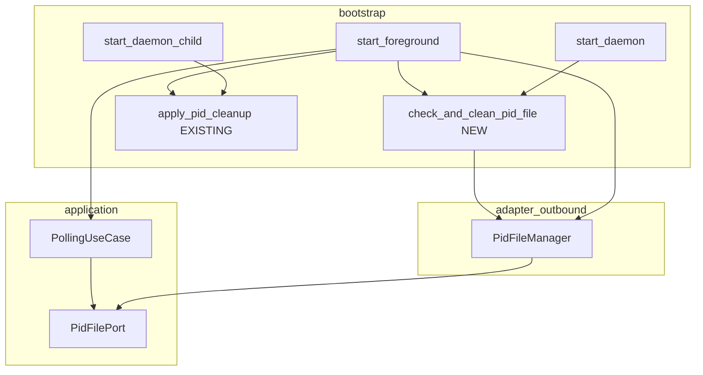
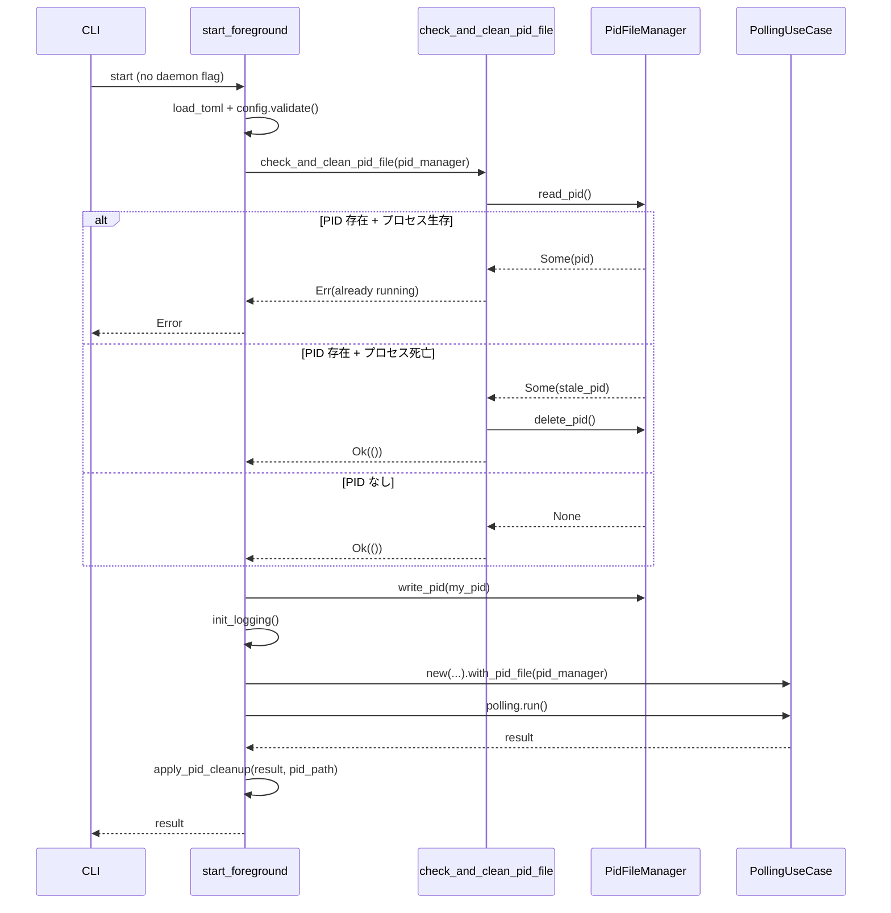

# 設計ドキュメント: foreground-pid-lock

## Overview

Cupola の `foreground` 起動モードに PID ファイルによる二重起動防止を追加する。現状、`daemon` モードは `start_daemon` で PID チェックを行い `start_daemon_child` で PID 書き込み・削除を行っているが、`start_foreground` にはこの機構が存在しない。本フィーチャーにより、`foreground` 同士、`foreground` と `daemon` のあらゆる組み合わせで二重起動を防止し、SQLite DB への複数プロセス同時アクセスによる Issue 二重処理を根絶する。

変更範囲は `src/bootstrap/app.rs` 単一ファイルに限定される。`PidFileManager`・`PidFilePort`・`apply_pid_cleanup` などの既存コンポーネントをそのまま再利用し、新規コンポーネントの追加は最小限（共有ヘルパー関数 1 つ）にとどめる。

### Goals
- `start_foreground` に PID チェック・書き込み・削除を追加する
- `start_daemon` と `start_foreground` で同一のチェックロジックを共有する
- foreground/daemon の全組み合わせで相互排他を保証する

### Non-Goals
- TOCTOU 競合状態の完全排除（ポーリング間隔の特性上、実用リスクは許容範囲）
- PID ファイルのアトミック書き込み機構の導入
- 他の起動サブコマンド（`init`、`doctor` など）への PID 保護拡張

## Architecture

### Existing Architecture Analysis

- **現状**: `start_daemon` に PID 存在確認とゾンビ PID 削除のインラインロジックがある。`start_daemon_child` に PID 書き込みと `apply_pid_cleanup` を用いたクリーンアップがある。`start_foreground` にはこれらが一切ない
- **制約**: bootstrap 層で完結すべき変更。`PidFilePort` トレイトと `PidFileManager` の既存インターフェースを変更しない
- **技術的負債**: `start_daemon` のチェックロジックがインライン実装されており、今回の共有ヘルパー化でこれを解消する

### Architecture Pattern & Boundary Map



**Architecture Integration**:
- 選択パターン: bootstrap 層内プライベートヘルパー関数による共有ロジック
- ドメイン境界: bootstrap 層で完結、他層への変更なし
- 保持される既存パターン: `apply_pid_cleanup`、`PidFilePort` トレイト、`with_pid_file` ビルダー
- 新規コンポーネント: `check_and_clean_pid_file` ヘルパー関数（`start_daemon` からのリファクタリング）
- Steering 準拠: bootstrap 層のみが全具象型を知るという Clean Architecture 原則を維持

### Technology Stack

| Layer | Choice / Version | Role in Feature | Notes |
|-------|------------------|-----------------|-------|
| Bootstrap | Rust / `src/bootstrap/app.rs` | PID チェック・書き込み・クリーンアップ制御 | 変更対象ファイル |
| Adapter (outbound) | `PidFileManager` (既存) | PID ファイル読み書き削除の実装 | 変更なし |
| Application (port) | `PidFilePort` トレイト (既存) | 抽象インターフェース | 変更なし |

## System Flows

### foreground 起動フロー（変更後）



フロー上の主要決定事項:
- PID チェックは設定ロード直後、ロギング初期化前に行う（daemon_child との一貫性）
- `with_pid_file` は SIGTERM/SIGINT 経由のグレースフル終了パスで PID 削除を担当
- `apply_pid_cleanup` は `run()` の返値（Ok/Err）に関わらず best-effort で削除（二重保護）

## Requirements Traceability

| Requirement | Summary | Components | Interfaces | Flows |
|-------------|---------|------------|------------|-------|
| 1.1 | 起動時 PID 生存確認 → エラー | `check_and_clean_pid_file` | `PidFilePort::read_pid`, `is_process_alive` | 起動フロー: PID 存在+生存 分岐 |
| 1.2 | ゾンビ PID 削除して継続 | `check_and_clean_pid_file` | `PidFilePort::delete_pid` | 起動フロー: PID 存在+死亡 分岐 |
| 1.3 | PID なし → 正常継続 | `check_and_clean_pid_file` | `PidFilePort::read_pid` | 起動フロー: PID なし 分岐 |
| 1.4 | PID 読み込み IO エラー → 起動中断 | `check_and_clean_pid_file` | `PidFilePort::read_pid` | 起動フロー: Err 分岐 |
| 2.1 | PID 書き込み | `start_foreground` | `PidFilePort::write_pid` | 起動フロー: write_pid ステップ |
| 2.2 | PID 書き込み失敗 → 起動中断 | `start_foreground` | `PidFilePort::write_pid` | 起動フロー: write_pid エラー分岐 |
| 2.3 | daemon と同一 PID ファイルパス使用 | `start_foreground` | `PidFileManager::new` | — |
| 3.1 | 正常終了時の PID 削除 | `apply_pid_cleanup` (既存), `PollingUseCase::with_pid_file` (既存) | `PidFilePort::delete_pid` | 起動フロー: apply_pid_cleanup |
| 3.2 | エラー終了時の PID 削除 | `apply_pid_cleanup` (既存) | `PidFilePort::delete_pid` | 起動フロー: apply_pid_cleanup |
| 3.3 | PID 削除失敗時の元結果保持 | `apply_pid_cleanup` (既存) | — | — |
| 4.1 | daemon 動作中の foreground 起動拒否 | `check_and_clean_pid_file` | `PidFilePort::read_pid`, `is_process_alive` | 1.1 と同経路 |
| 4.2 | foreground 動作中の daemon 起動拒否 | `start_daemon` (既存チェック + 共有ヘルパー利用後) | `PidFilePort::read_pid`, `is_process_alive` | `start_daemon` の既存経路 |
| 4.3 | 共通 PID ファイルによる相互排他 | `start_foreground`, `start_daemon` | `PidFileManager` (同一パス) | — |

## Components and Interfaces

### コンポーネント一覧

| Component | Domain/Layer | Intent | Req Coverage | Key Dependencies | Contracts |
|-----------|--------------|--------|--------------|------------------|-----------|
| `check_and_clean_pid_file` | bootstrap | PID 生存確認とゾンビ削除の共有ヘルパー | 1.1, 1.2, 1.3, 1.4, 4.1, 4.2 | PidFileManager (P0) | Service |
| `start_foreground` (変更) | bootstrap | foreground 起動エントリポイント | 2.1, 2.2, 2.3, 3.1, 3.2, 3.3, 4.3 | check_and_clean_pid_file (P0), PidFileManager (P0), apply_pid_cleanup (P0) | — |

### bootstrap

#### `check_and_clean_pid_file`

| Field | Detail |
|-------|--------|
| Intent | PID ファイルを読み取り、生存プロセスがあればエラー、ゾンビ PID があれば削除して Ok を返す |
| Requirements | 1.1, 1.2, 1.3, 1.4, 4.1, 4.2 |

**Responsibilities & Constraints**
- `start_daemon` のインライン PID チェックロジックを抽出した共有ヘルパー
- PID ファイルの書き込みは行わない（呼び出し元の責務）
- `src/bootstrap/app.rs` 内プライベート関数として定義

**Dependencies**
- Outbound: `PidFileManager` — `read_pid`、`is_process_alive`、`delete_pid` 呼び出し (P0)

**Contracts**: Service [x]

##### Service Interface

```rust
fn check_and_clean_pid_file(pid_file_manager: &PidFileManager) -> Result<()>
```

- 前提条件: `pid_file_manager` は有効なパスで初期化済み
- 後置条件: Ok(()) 返却時、PID ファイルが存在しないか、存在するがプロセスが生存していないことを保証
- 不変条件: 既存の生存プロセス PID ファイルが存在する場合は必ずエラーを返す

**Implementation Notes**
- `start_daemon` (L420-436) の match ブロックを抽出する形で実装
- `start_daemon` 側も本ヘルパーを呼ぶよう置き換え、ロジックを一元化する

#### `start_foreground`（変更）

| Field | Detail |
|-------|--------|
| Intent | PID ファイル保護付きで foreground ポーリングを起動する |
| Requirements | 2.1, 2.2, 2.3, 3.1, 3.2, 3.3, 4.3 |

**Responsibilities & Constraints**
- PID ファイルパスを `<config_dir>/cupola.pid` として構築（daemon と同一）
- チェック → 書き込み → ポーリング → クリーンアップの順序を保証
- `start_daemon_child` と同じ二重保護パターン（`with_pid_file` + `apply_pid_cleanup`）を採用

**Dependencies**
- Outbound: `check_and_clean_pid_file` — 起動前チェック (P0)
- Outbound: `PidFileManager::write_pid` — PID 書き込み (P0)
- Outbound: `PollingUseCase::with_pid_file` — グレースフルシャットダウン時削除 (P0)
- Outbound: `apply_pid_cleanup` — best-effort 終了時削除 (P0)

**Contracts**: Service [x]

##### Service Interface

変更後の `start_foreground` 擬似インターフェース（追加ステップのみ記載）:

```rust
// 追加: config_dir および PidFileManager の構築
let config_dir = config.parent().unwrap_or_else(|| Path::new(".")).to_path_buf();
let pid_file_path = config_dir.join("cupola.pid");
let pid_file_manager = PidFileManager::new(pid_file_path.clone());

// 追加: PID チェック (要件 1.x, 4.x)
check_and_clean_pid_file(&pid_file_manager)?;

// 追加: PID 書き込み (要件 2.1, 2.2)
let my_pid = std::process::id();
pid_file_manager.write_pid(my_pid)
    .map_err(|e| anyhow::anyhow!("failed to write PID file: {e}"))?;

// 変更: with_pid_file を追加 (要件 3.1)
let mut polling = PollingUseCase::new(...)
    .with_pid_file(Box::new(pid_file_manager));

// 変更: apply_pid_cleanup でラップ (要件 3.2, 3.3)
let result = polling.run().await;
apply_pid_cleanup(result, pid_file_path)
```

**Implementation Notes**
- PID 書き込みはロギング初期化前に行う（`start_daemon_child` との一貫性）
- `with_pid_file` に `PidFileManager` を渡した後、`apply_pid_cleanup` にはパスのみ渡す（所有権の都合）
- `apply_pid_cleanup` はすでにテスト済みの関数。foreground 向け追加テストは本関数の foreground 経路をカバーするものを追加

## Error Handling

### Error Strategy

PID ファイル操作に関するエラーを Fast-Fail で処理する。

### Error Categories and Responses

| エラー | 発生箇所 | 対応 |
|--------|----------|------|
| PID ファイル読み取り失敗 | `check_and_clean_pid_file` | `Err` を即時返却、起動中断 |
| プロセス生存確認（二重起動検出） | `check_and_clean_pid_file` | `already running` と PID（`pid=<N>`）を含むエラーを返却。既存の daemon 経路の `"cupola daemon is already running (pid=<N>)"` と foreground 向けの `"cupola is already running (pid=<N>)"` のいずれも許容する |
| PID ファイル書き込み失敗 | `start_foreground` | `"failed to write PID file: <e>"` エラー返却 |
| PID ファイル削除失敗 | `apply_pid_cleanup` (既存) | エラー握り潰し、元の結果を返す |

### Monitoring

- `tracing::info!` でロギング（daemon_child パターンに合わせる、ただし最小限）
- PID 書き込み成功・二重起動検出のログは `start_daemon_child` の既存ログ水準に揃える

## Testing Strategy

### Unit Tests

`src/bootstrap/app.rs` の `#[cfg(test)] mod tests` ブロックに追加:

1. **`check_and_clean_pid_file_returns_err_when_process_alive`**: 自プロセスの PID を書き込んだ PID ファイルを用意し、`check_and_clean_pid_file` がエラーを返すことを確認
2. **`check_and_clean_pid_file_removes_stale_pid_and_returns_ok`**: 存在しない PID を書き込んだ PID ファイルを用意し、削除されて `Ok(())` が返ることを確認
3. **`check_and_clean_pid_file_returns_ok_when_no_pid_file`**: PID ファイルが存在しない場合に `Ok(())` が返ることを確認
4. **`start_foreground_pid_check_rejects_running_process`**: `apply_pid_cleanup` の既存テストパターンを参考に、二重起動検出のエンド・ツー・エンドを確認（統合テスト）
5. **`check_and_clean_pid_file_returns_err_on_read_failure`**: PID ファイルの内容が不正な場合（parse エラー）に `Err` を返すことを確認

### Integration Tests

- `start_daemon` のチェックロジックが `check_and_clean_pid_file` 経由に変わった後も既存テストが通ることを `cargo test` で確認
