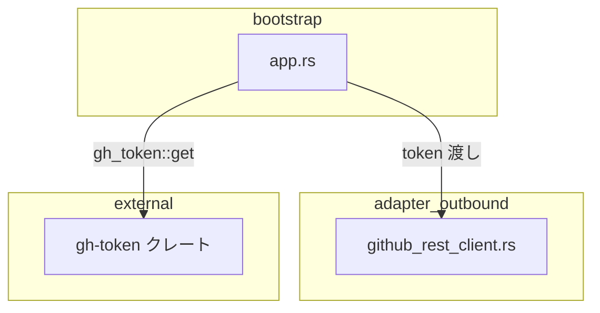
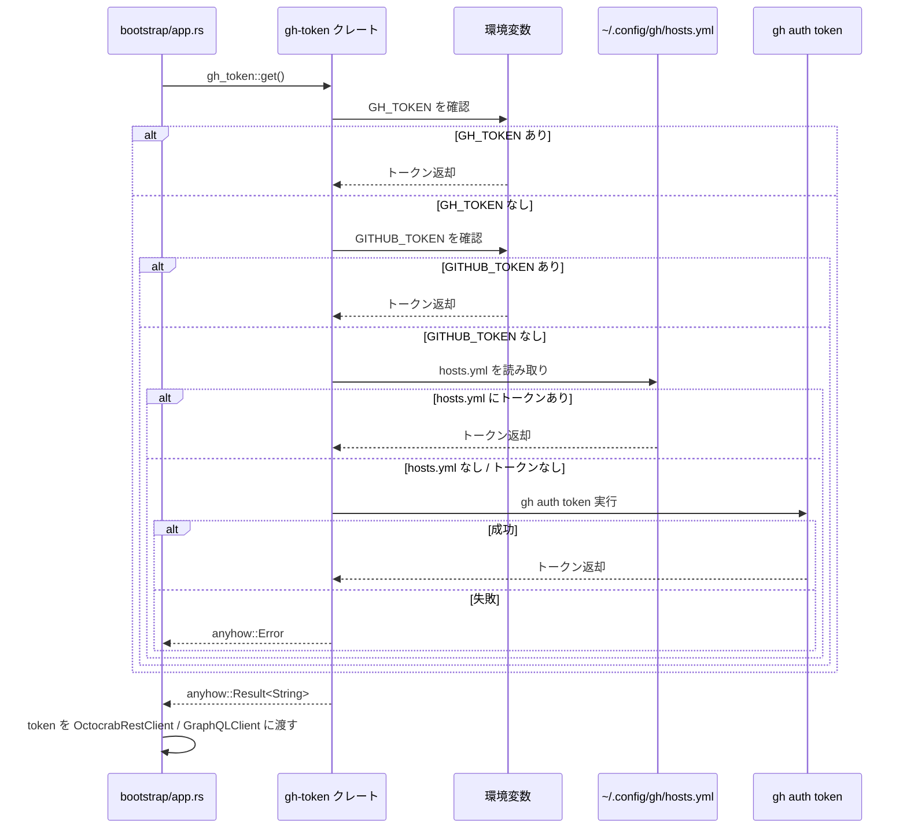

# 技術設計書: gh-token-integration

## Overview

本フィーチャーは、`src/adapter/outbound/github_rest_client.rs` に存在する自前実装の `resolve_github_token()` を `gh-token` クレート (v0.1, dtolnay作) に置き換えることで、GitHub トークン取得ロジックを簡素化する。変更対象は adapter 層の1ファイルと bootstrap 層の呼び出し箇所のみであり、アーキテクチャへの影響は最小限にとどまる。

現在の実装は `GITHUB_TOKEN` 環境変数と `gh auth token` CLI コマンドの2段階フォールバックのみをサポートしているが、`gh-token` クレートは `GH_TOKEN` → `GITHUB_TOKEN` → `~/.config/gh/hosts.yml` → `gh auth token` の4段階フォールバックを提供する。`gh_token::get()` は既存の `anyhow::Result<String>` と同一のシグネチャを持つため、移行コストは極めて低い。

### Goals
- `resolve_github_token()` を削除し、`gh_token::get()` で代替する
- トークン取得の4段階フォールバックを実現する
- 既存の `anyhow` ベースエラーハンドリングとの互換性を維持する

### Non-Goals
- GitHub クライアント (octocrab / reqwest) の変更
- GraphQL / REST クライアントのリファクタリング
- トークンキャッシュや再試行ロジックの追加

## Requirements Traceability

| 要件 | 概要 | コンポーネント | インターフェース |
|------|------|----------------|-----------------|
| 1.1, 1.2, 1.3 | gh-token クレートの依存追加 | Cargo.toml | — |
| 2.1, 2.2, 2.3, 2.4 | resolve_github_token() の置き換え | OctocrabRestClient, Bootstrap | `gh_token::get()` |
| 3.1, 3.2, 3.3, 3.4, 3.5 | 4段階フォールバック | gh-token クレート内部 | `gh_token::get()` |
| 4.1, 4.2, 4.3 | エラーハンドリングの維持 | Bootstrap | `anyhow::Result<String>` |
| 5.1, 5.2, 5.3 | 既存テストの維持 | テストモジュール | — |

## Architecture

### Existing Architecture Analysis

現在の `resolve_github_token()` は adapter/outbound 層の `github_rest_client.rs` にパブリック関数として実装されている。呼び出しは bootstrap 層の `app.rs` のみである。この関数は Clean Architecture の依存方向に従い、adapter 層内に留まるべき関心事である。

変更後も同じ構造を維持し、`gh_token::get()` を adapter 層ではなく bootstrap 層から直接呼び出す形に変更する（`gh-token` クレートはインフラ寄りのユーティリティのため bootstrap 層での使用が適切）。

### Architecture Pattern & Boundary Map



**Key Decisions**:
- `resolve_github_token()` を削除し、`bootstrap/app.rs` が `gh_token::get()` を直接呼び出す
- `gh-token` クレートはインフラユーティリティとして bootstrap 層のみが依存する
- adapter 層への依存は追加しない（Clean Architecture の依存方向を維持）

### Technology Stack

| Layer | Choice / Version | Role | Notes |
|-------|-----------------|------|-------|
| Bootstrap | `gh-token` v0.1 | GitHub トークン取得 | dtolnay作, MIT/Apache-2.0 |
| Bootstrap | `anyhow` 1.x (既存) | エラー伝搬 | `gh_token::get()` の戻り値と互換 |

## System Flows

### トークン取得フロー（変更後）



## Components and Interfaces

### コンポーネント概要

| Component | Layer | Intent | 要件カバレッジ | 主要依存 |
|-----------|-------|--------|--------------|---------|
| Cargo.toml | — | gh-token 依存追加 | 1.1, 1.2, 1.3 | — |
| bootstrap/app.rs | bootstrap | gh_token::get() 呼び出し | 2.1–2.4, 4.1–4.3 | gh-token (P0) |
| github_rest_client.rs | adapter/outbound | resolve_github_token() 削除 | 2.2, 5.2 | — |
| テストモジュール | — | 既存テストの修正 | 5.1, 5.2, 5.3 | — |

### adapter/outbound

#### github_rest_client.rs（変更）

| Field | Detail |
|-------|--------|
| Intent | `resolve_github_token()` 関数を削除する |
| Requirements | 2.2, 5.2 |

**変更内容**
- `pub fn resolve_github_token()` を削除
- テスト `resolve_token_from_env` を削除

**Contracts**: なし（関数削除のみ）

**Implementation Notes**
- `resolve_github_token()` を参照するすべての `use` 文も合わせて削除する
- テストモジュールが空になる場合は `#[cfg(test)] mod tests` ブロックごと削除する

### bootstrap

#### app.rs（変更）

| Field | Detail |
|-------|--------|
| Intent | `resolve_github_token()` の呼び出しを `gh_token::get()` に変更する |
| Requirements | 2.1, 2.3, 2.4, 4.1, 4.2, 4.3 |

**変更内容**

変更前:
```
use crate::adapter::outbound::github_rest_client::resolve_github_token;
...
let token = resolve_github_token()?;
```

変更後:
```
let token = gh_token::get()?;
```

**Dependencies**
- Outbound: `gh-token` クレート — トークン取得（P0）

**Contracts**: Service [x]

##### Service Interface
```rust
// gh_token クレートの公開 API
pub fn get() -> anyhow::Result<String>;
```

- Preconditions: なし（環境変数・ファイル・CLIのいずれかが利用可能であること）
- Postconditions: GitHub Personal Access Token を含む `String` を返す
- Invariants: エラー時は `anyhow::Error` を返し、プロセスは上位で終了する

**Implementation Notes**
- `resolve_github_token` の `use` 文を削除し、`gh_token` クレートを直接使用する
- エラーメッセージは `gh-token` クレートが提供するものをそのまま使用する（`?` で伝搬）
- `anyhow::Result<String>` を返すため、`.context()` による追加コンテキストは任意

## Error Handling

### Error Strategy

`gh_token::get()` が返す `anyhow::Error` を `?` 演算子でそのまま伝搬する。追加のエラーラッピングは不要。

### Error Categories and Responses

| エラーケース | `gh-token` の挙動 | ユーザーへのメッセージ |
|------------|-------------------|----------------------|
| すべてのフォールバックが失敗 | `anyhow::Error` を返す | `gh-token` が提供するエラーメッセージ（`GH_TOKEN` / `GITHUB_TOKEN` 未設定かつ `gh auth login` 未実行であることを示す） |
| `gh auth token` コマンド未発見 | `anyhow::Error` を返す | gh CLI のインストールを促すメッセージ |

### Monitoring

既存の `tracing` ベースのログはそのまま維持する。トークン取得の失敗は bootstrap 起動時にアプリケーションを終了させるため、追加のモニタリングは不要。

## Testing Strategy

### Unit Tests

現在の `resolve_token_from_env` テスト（`github_rest_client.rs` 内）は `resolve_github_token()` 削除に伴い削除する。`gh_token::get()` 自体のユニットテストは `gh-token` クレート側で提供される。

### Integration Tests

- `GITHUB_TOKEN` 環境変数を設定した状態での起動テスト（既存の統合テストで間接的にカバー）
- `GH_TOKEN` 環境変数によるトークン取得の動作確認（手動またはCI環境での検証）

### 受け入れ基準の検証

| 受け入れ基準 | 検証方法 |
|------------|---------|
| `GITHUB_TOKEN` でトークン取得 | 環境変数設定後に `cargo run -- run` を実行 |
| `~/.config/gh/hosts.yml` からトークン取得 | `gh auth login` 済み環境で実行 |
| `gh auth token` 経由でトークン取得 | `gh auth login` 済み・環境変数未設定で実行 |
| トークン未設定時のエラーメッセージ | 環境変数未設定・gh 未認証状態で実行 |
| 既存統合テストが通る | `cargo test` |

## Security Considerations

`gh_token::get()` はトークンをメモリ上のみで扱い、ファイルへの書き込みは行わない。既存のセキュリティ特性は維持される。`serde_yaml` 0.9 (archived) への間接依存があるが、`gh-token` は141行の小さなクレートであり、監査容易性は高い。
