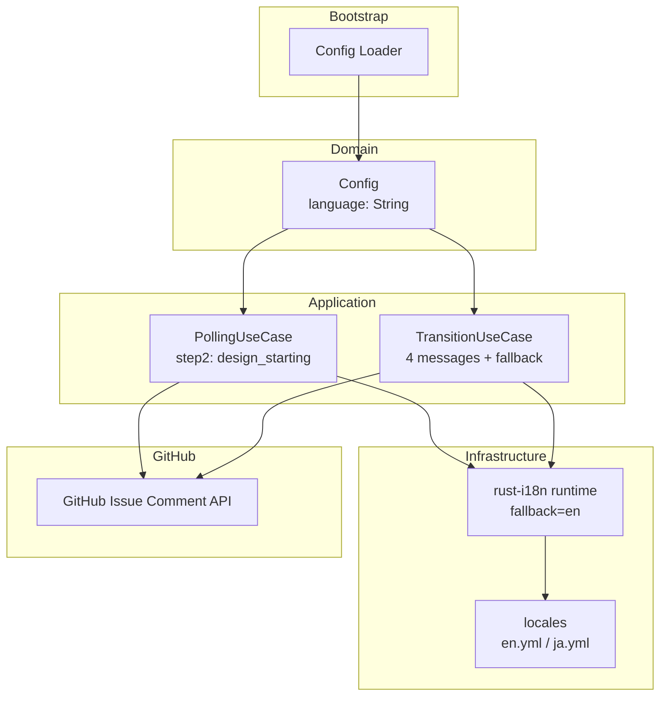
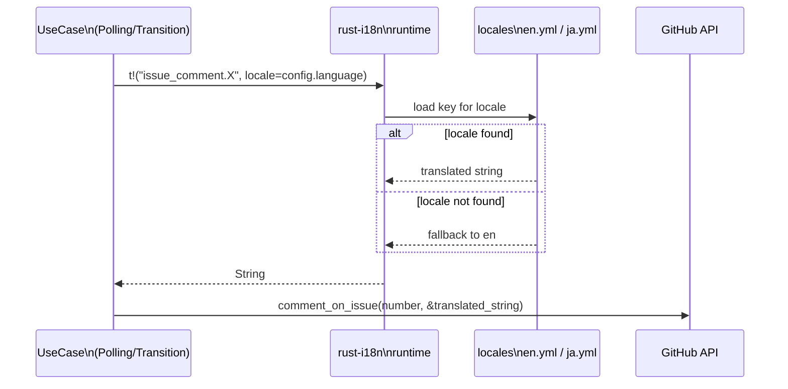

# 技術設計書: i18n-github-comments

## Overview

`rust-i18n` クレートを導入し、Cupola が GitHub Issue に投稿するコメントを `cupola.toml` の `language` 設定に従って多言語出力できるようにする。現在は日本語でハードコードされているコメント5件とフォールバック文字列1件を `t!()` マクロによる翻訳呼び出しに置き換える。

変更の影響範囲は `application` 層の2つのユースケース（`PollingUseCase`、`TransitionUseCase`）と設定ファイル群（`Cargo.toml`、`src/lib.rs`、新規 `locales/` ディレクトリ）に限定される。Clean Architecture のレイヤ境界と依存方向は変更しない。

### Goals

- `language = "en"` 設定時に英語、`language = "ja"` 設定時に日本語のコメントを投稿する
- 将来の言語追加が `locales/<lang>.yml` ファイル追加のみで完結する構造を確立する
- 未知 locale 指定時は英語（`en`）にフォールバックし、エラーを発生させない

### Non-Goals

- Doctor 出力（28メッセージ）の多言語化
- CLI 出力（Stop/Init/Status メッセージ）の多言語化
- `ConfigLoadError` エラーメッセージの多言語化
- 英語・日本語以外の言語の実装

---

## Requirements Traceability

| 要件 | サマリー | コンポーネント | インターフェース | フロー |
|------|---------|--------------|----------------|-------|
| 1.1 | Cargo.toml に rust-i18n 追加 | Cargo.toml | — | — |
| 1.2 | lib.rs に i18n! マクロ配置 | src/lib.rs | — | — |
| 1.3 | cargo build 成功 | — | — | — |
| 2.1 | locales/en.yml 作成（6キー） | LocaleFiles | — | — |
| 2.2 | locales/ja.yml 作成（6キー） | LocaleFiles | — | — |
| 2.3 | retry_exhausted のパラメータ補間 | LocaleFiles | — | — |
| 2.4 | 新 locale ファイル追加で拡張可能 | LocaleFiles | — | — |
| 3.1 | design_starting の i18n 化 | PollingUseCase | t! macro | — |
| 3.2–3.6 | その他5件の i18n 化 | TransitionUseCase | t! macro | — |
| 3.7 | per-call locale（グローバル変更なし） | PollingUseCase, TransitionUseCase | t! macro | — |
| 4.1–4.4 | language 設定と未知 locale フォールバック | rust-i18n runtime | — | — |
| 5.1–5.3 | テスト・Clippy の継続的通過 | テスト群 | — | — |

---

## Architecture

### Existing Architecture Analysis

本機能は既存の Clean Architecture（4層）を維持したまま、`application` 層の2つのユースケースに翻訳呼び出しを追加する拡張である。

- **変更なし**: `domain` 層（`Config` の `language: String` フィールドは既存）、`adapter` 層、`bootstrap` 層
- **変更あり**: `application` 層の `PollingUseCase`・`TransitionUseCase`（翻訳呼び出し追加）
- **新規追加**: `locales/` ディレクトリ（クレートルート）、`src/lib.rs` への `i18n!` マクロ

### Architecture Pattern & Boundary Map



**Architecture Integration**:
- 採用パターン: per-call locale（グローバル state 非変更）
- 既存パターン維持: Clean Architecture の依存方向（domain ← application）
- `Config.language` は domain 層で定義済みのフィールドを流用
- 新規コンポーネント: `locales/` ディレクトリ（クレートルートのリソース）

### Technology Stack

| Layer | Choice / Version | Feature の役割 | Notes |
|-------|------------------|---------------|-------|
| 翻訳ランタイム | rust-i18n 3.x | per-call locale 翻訳 | `t!(key, locale=lang)` API |
| 翻訳データ | YAML (locales/en.yml, ja.yml) | 翻訳文字列の管理 | ネスト構造、パラメータ補間サポート |
| アプリケーション | Rust (既存) | ユースケースでの t!() 呼び出し | 既存の Config.language を利用 |

---

## System Flows



---

## Components and Interfaces

| Component | Layer | Intent | 要件カバレッジ | Key Dependencies | Contracts |
|-----------|-------|--------|--------------|-----------------|-----------|
| Cargo.toml | Build | rust-i18n 依存追加 | 1.1 | — | — |
| src/lib.rs | Crate Root | i18n! マクロ初期化 | 1.2, 1.3 | rust-i18n | — |
| locales/en.yml | Resource | 英語翻訳文字列 | 2.1, 2.3, 2.4 | — | — |
| locales/ja.yml | Resource | 日本語翻訳文字列 | 2.2, 2.3, 2.4 | — | — |
| PollingUseCase | Application | design_starting の i18n 化 | 3.1, 3.7 | Config, rust-i18n | Service |
| TransitionUseCase | Application | 4件のコメント + fallback の i18n 化 | 3.2–3.6, 3.7, 4.1–4.4 | Config, rust-i18n | Service |

### Application 層

#### PollingUseCase（変更箇所）

| Field | Detail |
|-------|--------|
| Intent | 設計開始コメント投稿を i18n 化する |
| Requirements | 3.1, 3.7 |

**Responsibilities & Constraints**
- `step2_initialize_design` 内の `comment_on_issue` 呼び出し1箇所のみ変更
- `Config.language` を locale パラメータとして `t!()` に渡す
- グローバルな locale state を変更しない

**Dependencies**
- Inbound: `PollingUseCase::run()` からの呼び出し（P0）
- Outbound: `GitHubClient::comment_on_issue` — Issue へのコメント投稿（P0）
- External: `rust-i18n` — `t!()` マクロによる翻訳（P0）

**Contracts**: Service [x]

##### Service Interface

```rust
// 変更前
self.github.comment_on_issue(n, "設計を開始します").await?;

// 変更後
self.github
    .comment_on_issue(n, &t!("issue_comment.design_starting", locale = &self.config.language))
    .await?;
```

**Implementation Notes**
- `t!()` は `String` を返すため、`&` で参照を取って `&str` として渡す
- `comment_on_issue` シグネチャ変更は不要

---

#### TransitionUseCase（変更箇所）

| Field | Detail |
|-------|--------|
| Intent | 4件のコメントと1件のフォールバック文字列を i18n 化する |
| Requirements | 3.2, 3.3, 3.4, 3.5, 3.6, 3.7, 4.1, 4.2, 4.3, 4.4 |

**Responsibilities & Constraints**
- `execute_side_effects` 内の5箇所の文字列をすべて `t!()` マクロに置換
- パラメータ付き `retry_exhausted` は `format!()` を使わず `t!()` の named parameter で対応
- `unwrap_or` の `"不明"` フォールバックは変数への事前バインドが必要

**Dependencies**
- Inbound: `TransitionUseCase::apply()` からの呼び出し（P0）
- Outbound: `GitHubClient::comment_on_issue` — Issue へのコメント投稿（P0）
- External: `rust-i18n` — `t!()` マクロ（P0）

**Contracts**: Service [x]

##### Service Interface

```rust
// implementation_starting（変更後）
self.github
    .comment_on_issue(
        issue.github_issue_number,
        &t!("issue_comment.implementation_starting", locale = &self.config.language),
    )
    .await?;

// all_completed（変更後）
self.github
    .comment_on_issue(
        issue.github_issue_number,
        &t!("issue_comment.all_completed", locale = &self.config.language),
    )
    .await?;

// cleanup_done（変更後）
let _ = self
    .github
    .comment_on_issue(
        issue.github_issue_number,
        &t!("issue_comment.cleanup_done", locale = &self.config.language),
    )
    .await;

// retry_exhausted（変更後）
let msg = t!(
    "issue_comment.retry_exhausted",
    locale = &self.config.language,
    count = issue.retry_count,
    error = {
        let unknown = t!("issue_comment.unknown_error", locale = &self.config.language);
        issue.error_message.as_deref().unwrap_or(&unknown).to_string()
    }
);
let _ = self.github.comment_on_issue(issue.github_issue_number, &msg).await;
```

**Implementation Notes**
- `retry_exhausted` の `error` パラメータ: `t!()` が `String` を返すため、`unwrap_or(&unknown)` のパターンを使用する（`research.md` の型不整合セクション参照）
- `format!()` による手動フォーマットは廃止し、`t!()` の named parameter 補間に統一する

---

### リソース層

#### locales/en.yml（新規作成）

| Field | Detail |
|-------|--------|
| Intent | 英語翻訳文字列を定義する |
| Requirements | 2.1, 2.3, 2.4 |

**Contracts**: — （ファイルリソース）

##### データ構造

```yaml
issue_comment:
  design_starting: "Starting design"
  implementation_starting: "Starting implementation"
  all_completed: "All processes completed"
  cleanup_done: "Cleanup executed"
  retry_exhausted: "Retry limit reached (%{count} times). Cleanup executed.\n\nError: %{error}"
  unknown_error: "unknown"
```

---

#### locales/ja.yml（新規作成）

| Field | Detail |
|-------|--------|
| Intent | 日本語翻訳文字列を定義する |
| Requirements | 2.2, 2.3, 2.4 |

**Contracts**: — （ファイルリソース）

##### データ構造

```yaml
issue_comment:
  design_starting: "設計を開始します"
  implementation_starting: "実装を開始します"
  all_completed: "全工程が完了しました"
  cleanup_done: "cleanup を実行しました"
  retry_exhausted: "リトライ上限に到達しました（%{count} 回）。cleanup を実行しました。\n\nエラー: %{error}"
  unknown_error: "不明"
```

---

## Data Models

### Domain Model

本フィーチャーでドメインモデルの変更はない。`Config.language: String`（既存フィールド）が翻訳 locale の入力として使用される。

### Data Contracts & Integration

**翻訳データ（YAML → rust-i18n runtime）**

- `%{param_name}` 記法によるパラメータ補間（rust-i18n v3 標準）
- キー構造: `issue_comment.<message_key>`（ネスト YAML）
- フォールバック: 未定義 locale は `en` にフォールバック（`i18n!` マクロの `fallback = "en"` 指定）

---

## Error Handling

### Error Strategy

翻訳失敗はランタイムエラーを発生させない。rust-i18n は未定義キーや未知 locale に対して fallback 文字列を返すため、`t!()` 呼び出し自体が `Result` を返さない。

### Error Categories and Responses

- **未知 locale**: `fallback = "en"` により英語文字列を返す（要件 4.3、4.4）
- **未定義キー**: rust-i18n が fallback locale のキーを返す（設定ミスは開発時に発覚）
- **型不整合（`unwrap_or` パターン）**: `unknown_error` キーを変数に先にバインドすることで解決

### Monitoring

既存の `tracing` による構造化ログを変更しない。翻訳に関する追加ログは不要（翻訳失敗が発生しない設計のため）。

---

## Testing Strategy

### Unit Tests

1. `t!("issue_comment.design_starting", locale = "en")` → `"Starting design"` を返すことの検証
2. `t!("issue_comment.design_starting", locale = "ja")` → `"設計を開始します"` を返すことの検証
3. `t!("issue_comment.retry_exhausted", locale = "en", count = 3, error = "timeout")` → 補間結果の検証
4. `t!("issue_comment.unknown_error", locale = "unknown_lang")` → `fallback = "en"` で `"unknown"` を返すことの検証

### Integration Tests

1. `tests/integration_test.rs` の既存テスト（L370）: `ja.yml` の `retry_exhausted` が `"リトライ上限"` を含む文字列を定義するため、アサーション変更不要で通過することを確認
2. `language = "en"` 設定時の統合テスト: `GitHubClient` モックへのコメントが英語文字列であることを検証

### Performance

翻訳ファイルはビルド時にコンパイルに組み込まれるため（rust-i18n v3 のマクロ展開）、ランタイムのファイル I/O は発生しない。パフォーマンスへの影響はなし。
