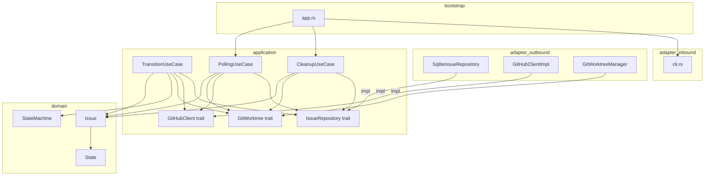
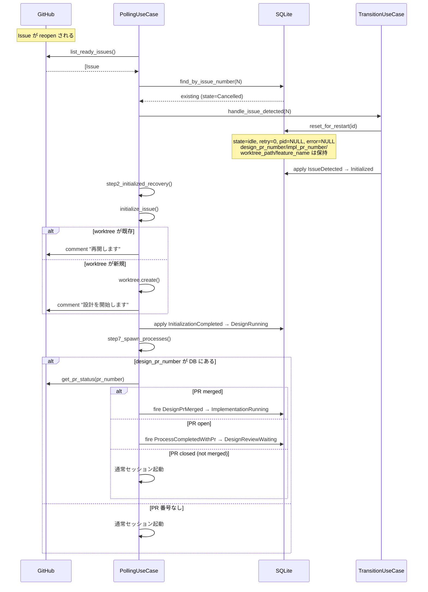
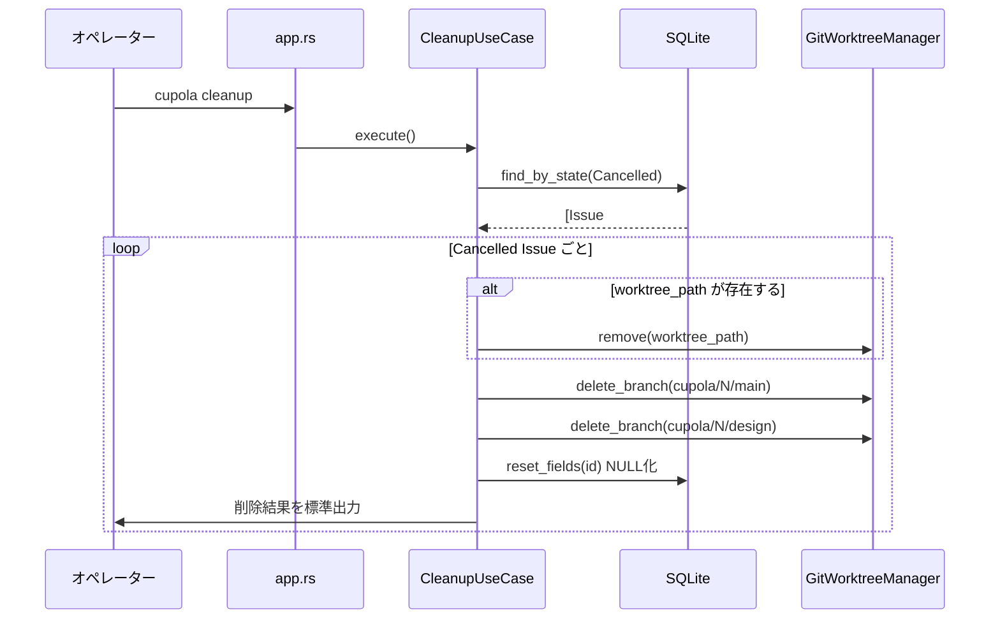

# 設計書: idempotent-restart

## Overview

**Purpose**: Cancelled 状態からの Issue reopen 時に完了済みフェーズ（設計・実装）をスキップして効率的に再開できるよう、各工程を冪等化する。また、Cancelled 状態に紐づく worktree とブランチを手動削除する `cupola cleanup` コマンドを追加する。

**Users**: Cupola を運用するオペレーターが対象。Issue の reopen 時のセッションコスト削減と、不要リソースの手動クリーンアップが主なユースケースとなる。

**Impact**: ステートマシン自体は変更しない。`reset_for_restart` のリセット範囲を最小化し、`initialize_issue` および `step7_spawn_processes` を冪等化することで、既存のフロー全体が再利用効率化される。

### Goals

- Cancelled 後の reopen 時に worktree・PR・feature_name を保持してフェーズをスキップ
- `cupola cleanup` コマンドで Cancelled 状態リソースを手動削除できる
- i18n 対応の「再開」メッセージで再開フローを明示

### Non-Goals

- ステートマシン（State/Event/StateMachine）の変更
- `model` フィールドの保持（reopen 時に config から再設定されるため NULL リセット継続）
- daemon 動作中の cleanup 実行の安全保証（ドキュメントで daemon 停止後実行を推奨）

## Architecture

### Existing Architecture Analysis

Cupola は Clean Architecture（4 層）を採用しており、本フィーチャーは以下の既存構造に変更を加える:

- **application/port/**: `IssueRepository` トレイトと `GitHubClient` トレイトを拡張
- **application/**: `TransitionUseCase`・`PollingUseCase` を修正、`CleanupUseCase` を新規追加
- **adapter/outbound/**: `SqliteIssueRepository` の SQL 修正と新メソッド実装、`GitHubClientImpl` への新メソッド実装
- **adapter/inbound/**: CLI に `Cleanup` サブコマンド追加
- **bootstrap/**: `app.rs` に cleanup コマンドのワイヤリング追加

ステートマシン（domain 層）には一切変更しない。

### Architecture Pattern & Boundary Map



**Architecture Integration**:
- 選択パターン: 既存の Clean Architecture（4 層）をそのまま維持
- 新コンポーネント: `CleanupUseCase`（application 層）のみ追加
- ポート拡張: `IssueRepository::find_by_state`、`GitHubClient::get_pr_status` を追加
- Steering 準拠: 依存方向（外→内のみ）・命名規約を遵守

### Technology Stack

| Layer | Choice / Version | Role in Feature | Notes |
|-------|-----------------|-----------------|-------|
| CLI | clap (derive) | `Cleanup` サブコマンド追加 | 既存パターン踏襲 |
| Application | Rust / tokio | CleanupUseCase 新規、既存 UC 修正 | 既存 |
| Data | SQLite (rusqlite) | `reset_for_restart` SQL 修正、`find_by_state` 追加 | 既存 |
| GitHub API | octocrab REST | `get_pr_status` で PR の state を取得 | 既存クライアント拡張 |
| i18n | rust-i18n | 再開メッセージキー追加 | 既存 |

## System Flows

### Cancelled → Reopen フロー（冪等リスタート）



### cupola cleanup フロー



## Requirements Traceability

| Requirement | Summary | Components | Interfaces | Flows |
|-------------|---------|------------|------------|-------|
| 1.1, 1.2 | reset_for_restart の部分リセット | SqliteIssueRepository | IssueRepository::reset_for_restart | Reopen フロー |
| 2.1, 2.2, 2.3 | RetryExhausted で worktree 保持 | TransitionUseCase | — | — |
| 3.1, 3.2, 3.3, 3.4 | initialize_issue の冪等化 | PollingUseCase | GitWorktree::create, GitHubClient::comment_on_issue | Reopen フロー |
| 4.1〜4.6 | スポーン前 PR チェック | PollingUseCase, GitHubClientImpl | GitHubClient::get_pr_status | Reopen フロー |
| 5.1〜5.6 | cupola cleanup コマンド | CleanupUseCase, SqliteIssueRepository, CLI, app.rs | IssueRepository::find_by_state, GitWorktree | cleanup フロー |
| 6.1〜6.6 | i18n 再開メッセージ | locales/en.yml, locales/ja.yml | — | Reopen フロー |

## Components and Interfaces

### コンポーネント一覧

| Component | Domain/Layer | Intent | Req Coverage | Key Dependencies | Contracts |
|-----------|--------------|--------|--------------|-----------------|-----------|
| SqliteIssueRepository | adapter/outbound | SQL の部分リセット・find_by_state 実装 | 1.1, 1.2, 5.1〜5.4 | SQLite | Service |
| TransitionUseCase | application | RetryExhausted から cleanup 削除 | 2.1, 2.2, 2.3 | IssueRepository, GitHubClient, GitWorktree | Service |
| PollingUseCase | application | initialize_issue 冪等化・step7 PR チェック | 3.1〜3.4, 4.1〜4.6 | IssueRepository, GitHubClient, GitWorktree | Service |
| CleanupUseCase | application | cleanup コマンドのユースケース | 5.1〜5.6 | IssueRepository, GitWorktree | Service |
| GitHubClientImpl | adapter/outbound | get_pr_status 実装 | 4.1〜4.6 | octocrab REST | Service |
| CLI (cli.rs) | adapter/inbound | Cleanup サブコマンド追加 | 5.1 | clap | — |
| app.rs | bootstrap | cleanup コマンドのワイヤリング | 5.1 | CleanupUseCase | — |
| locales/*.yml | — | 再開メッセージ i18n | 6.1〜6.6 | rust-i18n | — |

---

### application 層

#### CleanupUseCase

| Field | Detail |
|-------|--------|
| Intent | Cancelled 状態の Issue に紐づく worktree・ブランチを削除し DB をリセットする |
| Requirements | 5.1, 5.2, 5.3, 5.4, 5.5, 5.6 |

**Responsibilities & Constraints**
- Cancelled 状態の Issue を全件取得してリソースを削除する
- 削除順: worktree → ブランチ → DB リセット（失敗しても次の Issue を継続処理）
- 標準出力に削除結果を表示する
- daemon 動作中の同時実行は保証しない（ドキュメントで注意を促す）

**Dependencies**
- Outbound: `IssueRepository` — Cancelled Issue 取得・DB リセット (P0)
- Outbound: `GitWorktree` — worktree 削除・ブランチ削除 (P0)

**Contracts**: Service [x]

##### Service Interface

```rust
pub struct CleanupUseCase<I: IssueRepository, W: GitWorktree> {
    pub issue_repo: I,
    pub worktree: W,
}

impl<I: IssueRepository, W: GitWorktree> CleanupUseCase<I, W> {
    pub async fn execute(&self) -> Result<CleanupResult>;
}

pub struct CleanupResult {
    pub cleaned: Vec<CleanedIssue>,
}

pub struct CleanedIssue {
    pub issue_number: u64,
    pub worktree_removed: bool,
    pub branches_removed: Vec<String>,
}
```

- Preconditions: なし（Cancelled Issue が 0 件でも正常終了）
- Postconditions: 処理した Issue の worktree_path, design_pr_number, impl_pr_number, feature_name が NULL にリセットされている
- Invariants: エラーが発生しても次の Issue の処理を継続する（フェイルソフト）

**Implementation Notes**
- Integration: `IssueRepository::find_by_state(State::Cancelled)` で取得、`GitWorktree::remove` / `delete_branch` で削除
- Validation: worktree パスの存在確認は `Path::exists()` で実施（存在しない場合はスキップ）
- Risks: daemon 動作中の同時実行でリソース競合が起きる可能性があるため、実行前に daemon が停止していることをユーザーに確認を促す（コマンド出力で警告）

---

#### TransitionUseCase（修正）

| Field | Detail |
|-------|--------|
| Intent | `(Cancelled, RetryExhausted)` アームから cleanup 呼び出しを削除する |
| Requirements | 2.1, 2.2, 2.3 |

**修正内容**

```
// Before:
(State::Cancelled, Event::RetryExhausted) => {
    ...
    let _ = self.github.close_issue(...).await;
    self.cleanup(issue).await;  // ← 削除
    ...
}

// After:
(State::Cancelled, Event::RetryExhausted) => {
    ...
    let _ = self.github.close_issue(...).await;
    // cleanup しない（worktree・ブランチを保持）
    ...
}
```

**Implementation Notes**
- `(Cancelled, IssueClosed)` アームの cleanup は引き続き実行（人間が意図的に close した場合）
- Risks: なし（削除するだけ）

---

#### PollingUseCase（修正）

| Field | Detail |
|-------|--------|
| Intent | initialize_issue を冪等化し、step7 でスポーン前に PR 状態を確認する |
| Requirements | 3.1, 3.2, 3.3, 3.4, 4.1, 4.2, 4.3, 4.4, 4.5, 4.6 |

**initialize_issue 修正内容**

```
// Before: worktree を無条件に作成
self.worktree.create(wt, &main_branch, &start_point)?;
...

// After: 存在確認で分岐
if !wt.exists() {
    // 新規作成フロー（従来通り）
    self.worktree.create(wt, &main_branch, &start_point)?;
    ...
    // comment: design_starting
} else {
    // 再利用フロー（worktree_path は DB に既存のため update は不要）
    // comment: resuming_design or resuming_implementation（状態に応じて）
}
```

**step7 PR チェック修正内容**

スポーンループ内で、PR 番号が DB にある場合に GitHub API で状態確認する:

```
// DesignRunning / ImplementationRunning の場合、スポーン前に PR チェック
if let Some(pr_number) = issue の PR 番号 {
    match github.get_pr_status(pr_number).await {
        Ok(PrStatus::Merged) => {
            // DesignPrMerged or ImplementationPrMerged を発火してスキップ
            events.push((issue.id, merge_event));
            continue;
        }
        Ok(PrStatus::Open) => {
            // ProcessCompletedWithPr を発火してスキップ
            events.push((issue.id, Event::ProcessCompletedWithPr));
            continue;
        }
        Ok(PrStatus::Closed) | Err(_) => {
            // 通常通りスポーン（フェイルセーフ含む）
        }
    }
}
```

**Dependencies**
- Outbound: `GitHubClient::get_pr_status` — PR 状態取得 (P1)
- Outbound: `IssueRepository` — 各種 CRUD (P0)
- Outbound: `GitWorktree` — worktree 存在確認・作成 (P0)

**Implementation Notes**
- step7 の PR チェックで生成した events は `step6_apply_events` で処理される設計だが、step7 はその後のステップであるため、**同一サイクル内では即座に適用できない**。次のサイクルで適用される。これは許容範囲内（1 ポーリング間隔のラグ）
- 代替案として step7 内で直接 `transition_uc().apply()` を呼ぶ方法もあるが、既存の events バッファパターンとの一貫性を保つため events.push を使用する
- Risks: GitHub API エラー時はフェイルセーフ（通常スポーン）で対応

---

### adapter/outbound 層

#### SqliteIssueRepository（修正）

| Field | Detail |
|-------|--------|
| Intent | reset_for_restart SQL の最小化と find_by_state の実装 |
| Requirements | 1.1, 1.2, 5.1〜5.4 |

**reset_for_restart 修正**

```sql
-- Before:
UPDATE issues SET state='idle', design_pr_number=NULL, impl_pr_number=NULL,
  worktree_path=NULL, retry_count=0, current_pid=NULL, error_message=NULL,
  feature_name=NULL, model=NULL, updated_at=datetime('now') WHERE id=?1

-- After:
UPDATE issues SET state='idle', retry_count=0, current_pid=NULL,
  error_message=NULL, updated_at=datetime('now') WHERE id=?1
```

**find_by_state 追加**

```sql
SELECT * FROM issues WHERE state = ?1
```

**Implementation Notes**
- `find_by_state` の `state` パラメータは `State` enum を文字列にシリアライズして渡す（既存の `update_state` と同じパターン）
- Risks: なし

---

#### GitHubClientImpl（修正）

| Field | Detail |
|-------|--------|
| Intent | get_pr_status を実装して PR の三状態（Open/Closed/Merged）を返す |
| Requirements | 4.1, 4.2, 4.3, 4.4, 4.5, 4.6 |

**Dependencies**
- External: GitHub REST API — GET /repos/{owner}/{repo}/pulls/{pull_number} (P0)

**Implementation Notes**
- `merged` フィールド（bool）と `state` フィールド（"open"/"closed"）を組み合わせて `PrStatus` を判定する
- `merged == true` → `PrStatus::Merged`
- `state == "open"` → `PrStatus::Open`
- それ以外 → `PrStatus::Closed`
- Risks: API エラー時はフェイルセーフ（呼び出し元が `Err(_)` を通常スポーンとして扱う）

---

### adapter/inbound 層

#### CLI (cli.rs)（修正）

`Command` enum に以下を追加:

```rust
/// Cancelled 状態の worktree とブランチを削除する
Cleanup {
    /// Config file path (default: .cupola/cupola.toml)
    #[arg(long, default_value = ".cupola/cupola.toml")]
    config: PathBuf,
},
```

## Data Models

### Domain Model

本フィーチャーで `Issue` エンティティの構造変更はない。`reset_for_restart` の SQL 変更のみで、保持フィールドは以下:

| フィールド | リセット前 | 変更後 |
|-----------|-----------|--------|
| state | 'idle' にリセット | 変更なし（リセット継続） |
| retry_count | 0 にリセット | 変更なし（リセット継続） |
| current_pid | NULL にリセット | 変更なし（リセット継続） |
| error_message | NULL にリセット | 変更なし（リセット継続） |
| model | NULL にリセット | 変更なし（リセット継続） |
| design_pr_number | NULL にリセット → **保持** | NULL にしない |
| impl_pr_number | NULL にリセット → **保持** | NULL にしない |
| worktree_path | NULL にリセット → **保持** | NULL にしない |
| feature_name | NULL にリセット → **保持** | NULL にしない |

### Logical Data Model

`IssueRepository` トレイトに追加するメソッド:

```rust
fn find_by_state(
    &self,
    state: State,
) -> impl std::future::Future<Output = Result<Vec<Issue>>> + Send;
```

`GitHubClient` トレイトに追加するメソッドと型:

```rust
pub enum PrStatus {
    Open,
    Closed,
    Merged,
}

fn get_pr_status(
    &self,
    pr_number: u64,
) -> impl std::future::Future<Output = Result<PrStatus>> + Send;
```

## Error Handling

### Error Strategy

**フェイルソフト原則**: cleanup コマンドは個別 Issue のリソース削除が失敗しても、次の Issue の処理を継続する。

**フェイルセーフ原則**: step7 の PR チェックで GitHub API エラーが発生した場合、通常のセッション起動にフォールバックする（セッションが重複して起動されるケースより、スキップされるケースの方がリスクが低い）。

### Error Categories and Responses

| カテゴリ | 原因 | 対応 |
|---------|------|------|
| System Error | GitHub API エラー（get_pr_status） | ログ記録後フォールバック（通常スポーン） |
| System Error | worktree 削除失敗（cleanup） | ログ記録後次の Issue を継続処理 |
| System Error | ブランチ削除失敗（cleanup） | ログ記録後 DB リセットを継続 |
| Business Logic | PR が half-created 状態（open でも merged でもない） | Closed として扱い通常スポーン |

### Monitoring

- `tracing::info!` で cleanup 結果（削除 worktree 数・ブランチ数）を記録
- `tracing::warn!` で API エラー・削除失敗を記録
- step7 PR チェックのスキップ判断もログ記録

## Testing Strategy

### Unit Tests

1. `reset_for_restart` の SQL 変更 — 変更後もリセットされるフィールドとされないフィールドの検証（in-memory SQLite）
2. `find_by_state` の実装 — Cancelled 状態の Issue のみ返されることを検証
3. `CleanupUseCase::execute` — モックアダプターで削除フローと DB リセットを検証
4. `initialize_issue` の冪等化 — worktree が存在する場合・しない場合でのコメントメッセージ分岐
5. `get_pr_status` — merged/open/closed の各状態へのマッピングロジック

### Integration Tests

1. Cancelled Issue reopen フロー全体 — `reset_for_restart` → `initialize_issue`（冪等）→ `step7` PR チェック の一連の動作
2. `cupola cleanup` の end-to-end — モック worktree・モック DB で Cancelled Issue のリソースが削除・NULL 化されることを確認
3. `(Cancelled, RetryExhausted)` → worktree 保持の確認 — cleanup が呼ばれないことをモックで検証
4. `(Cancelled, IssueClosed)` → cleanup が呼ばれることの確認（既存テストの維持）

## Migration Strategy

スキーマ変更は不要。`reset_for_restart` の SQL 変更のみであり、DB マイグレーションは不要。既存の DB が存在する場合も Cancelled 状態の Issue に対して次回の `reset_for_restart` 呼び出し時から自動的に新しい動作になる。
