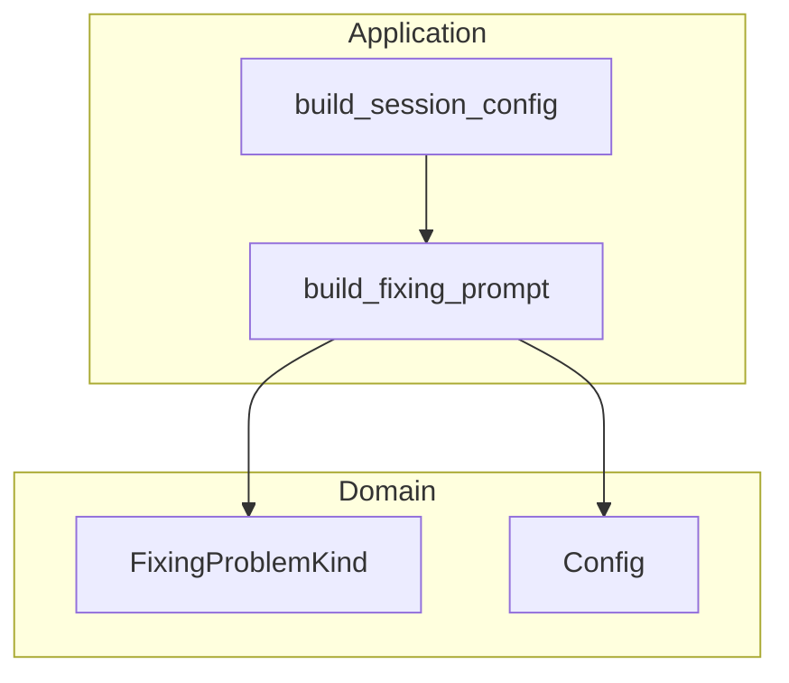

# Design Document: improve-build-fixing-prompt

## Overview

`src/application/prompt.rs` の `build_fixing_prompt` 関数に存在する3つの品質問題を修正する。対象関数はClean Architectureのapplicationレイヤーに属し、純粋な文字列生成のみを行う。ドメイン層・DBアダプタへの影響はなく、変更スコープは `prompt.rs` とその単体テストに限定される。

**Purpose**: Claude Code エージェントへ渡す修正プロンプトの正確性・安全性・一貫性を向上させる。
**Users**: Cupolaの自動ワークフロー（`DesignFixing` / `ImplementationFixing` 状態）を通じてプロンプトを受け取るClaude Codeエージェント。
**Impact**: プロンプト文字列の内容変更のみ。APIシグネチャ・スキーマ・状態機械への変更なし。

### Goals
- `issue_number` / `pr_number` をプロンプト本文に埋め込み、コンテキストを提供する
- `causes` に `ReviewComments` が含まれない場合はスレッドoutput指示を省略し `{"threads": []}` を明示する
- `git add -A` を廃止し、ファイルを個別指定するよう誘導する
- 既存テストを更新し、上記3点をすべて検証する

### Non-Goals
- `FIXING_SCHEMA` の変更（`threads` 必須フィールドはそのまま）
- `build_session_config` のシグネチャ変更
- 他プロンプト関数（design/implementation）の変更
- ドメイン層・アダプタ層・DBへの変更

## Architecture

### Existing Architecture Analysis

`build_fixing_prompt` はapplicationレイヤーの純粋関数（`fn`、副作用なし）であり、`format!` マクロによる文字列テンプレート合成を行う。`DesignFixing` と `ImplementationFixing` の両状態から `build_session_config` 経由で呼び出される。

既存の `instructions` 構築ロジックは `causes.contains(...)` による条件分岐を既に採用しており、今回の変更は同パターンの拡張となる。

### Architecture Pattern & Boundary Map



- **選択パターン**: 純粋関数内でのテンプレート文字列条件分岐（既存パターンの踏襲）
- **境界**: applicationレイヤー内に閉じた変更。domainへの依存は既存通り
- **新規コンポーネント**: なし（既存関数の修正のみ）

### Technology Stack

| Layer | Choice / Version | Role in Feature | Notes |
|-------|------------------|-----------------|-------|
| Application | Rust (Edition 2024) | `build_fixing_prompt` 関数修正 | 標準ライブラリのみ使用 |

## Requirements Traceability

| Requirement | Summary | Components | Interfaces | Flows |
|-------------|---------|------------|------------|-------|
| 1.1, 1.2, 1.3 | issue/PR番号のコンテキスト追加 | `build_fixing_prompt` | プロンプト文字列 | — |
| 2.1, 2.2, 2.3 | output指示の条件分岐 | `build_fixing_prompt` | プロンプト文字列 | — |
| 3.1, 3.2, 3.3 | git add スコープ限定 | `build_fixing_prompt` | プロンプト文字列 | — |
| 4.1, 4.2, 4.3, 4.4 | テスト更新 | `prompt.rs` テストブロック | — | — |

## Components and Interfaces

| Component | Layer | Intent | Req Coverage | Key Dependencies | Contracts |
|-----------|-------|--------|--------------|------------------|-----------|
| `build_fixing_prompt` | Application | 修正プロンプト文字列生成 | 1.1–1.3, 2.1–2.3, 3.1–3.3 | `FixingProblemKind` (P0) | Service |
| `prompt.rs` テストブロック | Application (test) | 変更の回帰検証 | 4.1–4.4 | `build_session_config` (P0) | — |

### Application Layer

#### `build_fixing_prompt`

| Field | Detail |
|-------|--------|
| Intent | issue番号・PR番号・causes・言語を受け取り、修正プロンプト文字列を生成する |
| Requirements | 1.1, 1.2, 1.3, 2.1, 2.2, 2.3, 3.1, 3.2, 3.3 |

**Responsibilities & Constraints**
- `issue_number` と `pr_number` をプロンプトヘッダーに `PR #<pr_number> (Issue #<issue_number>)` の形式で埋め込む
- `causes.contains(&FixingProblemKind::ReviewComments)` の真偽でoutputセクションを分岐する
  - `true`: スレッドごとの `thread_id` / `response` / `resolved` output指示を含める
  - `false`: `{"threads": []}` を返すよう明示し、スレッドoutput指示を省略する
- コミットステップにおいて `git add -A` を廃止し、`git diff --name-only` による確認と個別ファイルのステージングを案内する
- applicationレイヤーの純粋関数として副作用を持たない

**Dependencies**
- Inbound: `build_session_config` — プロンプト生成の起点 (P0)
- Outbound: なし
- External: `FixingProblemKind` (domain) — causes判定 (P0)

**Contracts**: Service [x]

##### Service Interface

```rust
fn build_fixing_prompt(
    issue_number: u64,   // アンダースコア除去（要件1.1）
    pr_number: u64,      // アンダースコア除去（要件1.1）
    language: &str,
    causes: &[FixingProblemKind],
) -> String
```

- 前提条件: `language` は空文字列でない。`causes` は空配列も許容
- 事後条件: 返却文字列が `issue_number` / `pr_number` を含む。`causes` に `ReviewComments` を含む場合はスレッドoutput指示を含む。`git add -A` を含まない
- 不変条件: 外部状態を変更しない（純粋関数）

**Implementation Notes**
- Integration: `build_session_config` のシグネチャ変更不要。呼び出し箇所も変更不要（引数名アンダースコア除去はローカルのみ）
- Validation: `git add -A` がプロンプト文字列に含まれないことを `assert!(!prompt.contains("git add -A"))` で検証
- Risks: `FIXING_SCHEMA` は `threads` を必須フィールドとして定義しているため、`ReviewComments` 非含有時は `{"threads": []}` を返すよう明示することでスキーマ適合性を維持する

#### `prompt.rs` テストブロック

| Field | Detail |
|-------|--------|
| Intent | `build_fixing_prompt` の3点修正を網羅的に検証し回帰を防ぐ |
| Requirements | 4.1, 4.2, 4.3, 4.4 |

**Responsibilities & Constraints**
- 既存テスト (`fixing_prompt_review_comments_only` 等) にissue/PR番号のアサーションを追加する
- CI/コンフリクト専用ケースで `{"threads": []}` の記述が含まれ、スレッドoutput指示が含まれないことを検証する
- `git add -A` がいずれのケースでもプロンプトに含まれないことを検証するテストを追加する

**Implementation Notes**
- `fixing_prompt_review_comments_only`: `assert!(session.prompt.contains("PR #85"))` / `assert!(session.prompt.contains("Issue #42"))` を追加
- `fixing_prompt_ci_failure_only` / `fixing_prompt_conflict_only`: `assert!(session.prompt.contains("{\"threads\": []}"))` / `assert!(!session.prompt.contains("thread_id"))` を追加
- `git add -A` の非存在を検証する新規テスト `fixing_prompt_no_git_add_all` を追加

## Error Handling

### Error Strategy
本機能は純粋な文字列生成であり、実行時エラーは発生しない。`build_session_config` での `pr_number` の `None` チェックは既存実装で対応済み（変更なし）。

## Testing Strategy

### Unit Tests

- **fixing_prompt_review_comments_only**: プロンプトにPR番号・Issue番号が含まれることを検証（要件4.1）
- **fixing_prompt_ci_failure_only**: `{"threads": []}` が含まれ、スレッドoutput指示が含まれないことを検証（要件4.2）
- **fixing_prompt_conflict_only**: 同上（要件4.2）
- **fixing_prompt_all_causes**: スレッドoutput指示が含まれ、PR番号・Issue番号も含まれることを検証（要件4.3）
- **fixing_prompt_no_git_add_all**: `git add -A` がいずれのケースでも含まれないことを検証（要件4.4）
