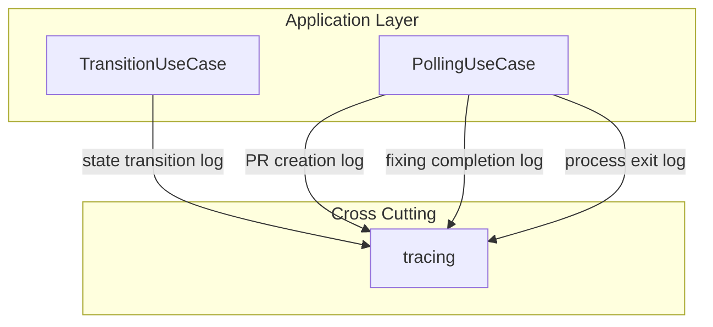

# Design Document

## Overview

**Purpose**: cupola の INFO レベルログを改善し、運用時の監視・デバッグに必要な重要イベント（状態遷移、PR 作成、fixing 後処理完了、プロセス終了）を構造化ログとして記録する。

**Users**: cupola の運用者・開発者が、ログ出力を通じて Issue 処理の進行状況を追跡する。

**Impact**: 既存の `TransitionUseCase` と `PollingUseCase` に `tracing::info!` 呼び出しを追加する。アーキテクチャの変更はない。

### Goals
- 状態遷移・PR 作成・fixing 完了・プロセス終了を INFO ログで記録する
- 既存の構造化ログパターン（tracing + フィールド）に準拠する
- 最小限の変更で全要件をカバーする

### Non-Goals
- ログフォーマットの変更やカスタムフォーマッターの導入
- DEBUG/TRACE レベルのログ追加
- 外部ログ集約サービスとの連携
- ログローテーションや保存期間の変更

## Architecture

### Existing Architecture Analysis

既存のログ基盤:
- `tracing` + `tracing-subscriber` + `tracing-appender` による構造化ログ
- `bootstrap/logging.rs` で初期化、日次ローテーションファイル出力対応
- 既存 INFO ログ: プロセス起動、SIGINT 受信、stale PID クリア、graceful shutdown

変更対象:
- `src/application/transition_use_case.rs` — 状態遷移ログ（Requirement 1）
- `src/application/polling_use_case.rs` — PR 作成、fixing 完了、プロセス終了ログ（Requirement 2, 3, 4）

### Architecture Pattern & Boundary Map

既存アーキテクチャ（Clean Architecture 4 レイヤー）を変更しない。application レイヤー内の既存メソッドに `tracing::info!` を追加するのみ。



**Architecture Integration**:
- Selected pattern: 既存コードへの直接 `tracing::info!` 追加
- 新規コンポーネント: なし
- Steering compliance: Clean Architecture のレイヤー構造を維持、tracing はクロスカッティング関心事として全レイヤーで使用可

### Technology Stack

| Layer | Choice / Version | Role in Feature | Notes |
|-------|------------------|-----------------|-------|
| Backend / Services | Rust (Edition 2024) | ログ追加対象コード | 変更なし |
| Infrastructure / Runtime | tracing + tracing-appender | 構造化ログ出力 | 既存依存、追加なし |

## Requirements Traceability

| Requirement | Summary | Components | Interfaces | Flows |
|-------------|---------|------------|------------|-------|
| 1.1 | 状態遷移 INFO ログ（from, to, issue_number） | TransitionUseCase | apply() | 状態遷移フロー |
| 1.2 | 構造化フィールド（from, to） | TransitionUseCase | apply() | 状態遷移フロー |
| 1.3 | IssueClosed → Cancelled 時も同様にログ | TransitionUseCase | apply() | 状態遷移フロー |
| 2.1 | PR 作成成功ログ（pr_number, head, base） | PollingUseCase | create_pr_from_output() | PR 作成フロー |
| 2.2 | 既存 PR スキップログ | PollingUseCase | create_pr_from_output() | PR 作成フロー |
| 3.1 | fixing 完了サマリーログ | PollingUseCase | process_fixing_output() | fixing フロー |
| 3.2 | スレッド返信成功ログ | PollingUseCase | process_fixing_output() | fixing フロー |
| 3.3 | スレッド resolve 成功ログ | PollingUseCase | process_fixing_output() | fixing フロー |
| 4.1 | プロセス正常終了ログ（exit_code） | PollingUseCase | step3_process_exit_check() | プロセス終了フロー |
| 4.2 | プロセス異常終了ログ（exit_code） | PollingUseCase | step3_process_exit_check() | プロセス終了フロー |

## Components and Interfaces

| Component | Domain/Layer | Intent | Req Coverage | Key Dependencies | Contracts |
|-----------|-------------|--------|--------------|------------------|-----------|
| TransitionUseCase | application | 状態遷移の実行と INFO ログ出力 | 1.1, 1.2, 1.3 | tracing (Cross-cutting) | Service |
| PollingUseCase | application | PR作成・fixing・プロセス終了の INFO ログ出力 | 2.1, 2.2, 3.1, 3.2, 3.3, 4.1, 4.2 | tracing (Cross-cutting) | Service |

### Application Layer

#### TransitionUseCase

| Field | Detail |
|-------|--------|
| Intent | 状態遷移時に from/to/issue_number を INFO ログに出力する |
| Requirements | 1.1, 1.2, 1.3 |

**Responsibilities & Constraints**
- `apply()` メソッド内で `StateMachine::transition()` 成功後に INFO ログを出力
- 全ての状態遷移（IssueClosed → Cancelled 含む）が同一パスを通るため、1 箇所の追加で全要件をカバー

**Dependencies**
- Outbound: tracing — 構造化ログ出力 (Cross-cutting)

**Contracts**: Service [x]

##### Service Interface

```rust
// 既存の apply() メソッド内に以下のログを追加
// 挿入位置: update_state() 成功後（DB 更新が永続化された直後）
tracing::info!(
    issue_number = issue.github_issue_number,
    from = ?old_state,
    to = ?new_state,
    "state transition"
);
```
- Preconditions: `StateMachine::transition()` が成功（Ok を返却）し、`update_state()` による DB 更新が完了
- Postconditions: INFO ログが 1 行出力される
- Invariants: 遷移が発生しない場合（エラー時）や DB 更新に失敗した場合はログを出力しない

**Implementation Notes**
- 現状 `State` enum は `Debug` 派生のみ想定するため、ログ出力には `Debug`（`?`）フォーマットを使用する（例: `from = ?old_state, to = ?new_state`）。将来 `Display` trait を実装した場合は `%` フォーマットへの切り替えを検討する
- `old_state` と `new_state` は `apply()` 内の既存ローカル変数をそのまま使用

#### PollingUseCase — PR 作成ログ

| Field | Detail |
|-------|--------|
| Intent | PR 作成成功・既存 PR スキップ時に INFO ログを出力する |
| Requirements | 2.1, 2.2 |

**Responsibilities & Constraints**
- `create_pr_from_output()` 内の 3 つのパスでログを出力:
  1. DB に既存 PR 番号がある場合 → スキップログ
  2. GitHub に既存 PR がある場合 → スキップログ
  3. 新規 PR 作成成功 → 作成成功ログ

**Contracts**: Service [x]

##### Service Interface

```rust
// パス 1: DB に既存 PR 番号あり（L557-558 付近）
tracing::info!(
    issue_number = n,
    pr_number = pr_num,
    "PR already exists in DB, skipping creation"
);

// パス 2: GitHub に既存 PR あり（L562-571 付近）
tracing::info!(
    issue_number = n,
    pr_number = pr.number,
    head = %head,
    base = %base,
    "PR already exists on GitHub, skipping creation"
);

// パス 3: 新規 PR 作成成功（L587 の後）
tracing::info!(
    issue_number = n,
    pr_number = pr_number,
    head = %head,
    base = %base,
    "PR created successfully"
);
```

#### PollingUseCase — fixing 後処理ログ

| Field | Detail |
|-------|--------|
| Intent | スレッド返信・resolve 成功と処理完了サマリーを INFO ログで出力する |
| Requirements | 3.1, 3.2, 3.3 |

**Responsibilities & Constraints**
- `process_fixing_output()` 内のループで個別成功ログを出力
- ループ完了後にサマリーログを出力

**Contracts**: Service [x]

##### Service Interface

```rust
// スレッド返信成功（reply_to_thread の Ok パス後）
tracing::info!(
    thread_id = %resp.thread_id,
    "replied to review thread"
);

// スレッド resolve 成功（resolve_thread の Ok パス後）
tracing::info!(
    thread_id = %resp.thread_id,
    "resolved review thread"
);

// 処理完了サマリー（ループ終了後）
tracing::info!(
    issue_number = _issue.github_issue_number,
    thread_count = output.threads.len(),
    "fixing post-processing completed"
);
```

#### PollingUseCase — プロセス終了ログ

| Field | Detail |
|-------|--------|
| Intent | Claude Code プロセスの正常/異常終了を INFO ログで出力する |
| Requirements | 4.1, 4.2 |

**Responsibilities & Constraints**
- `step3_process_exit_check()` 内の成功/失敗分岐でログを出力

**Contracts**: Service [x]

##### Service Interface

```rust
// 正常終了（L269 の後）
tracing::info!(
    issue_number = issue.github_issue_number,
    exit_code = session.exit_status.code().unwrap_or(0),
    "Claude Code process exited successfully"
);

// 異常終了（L272 の後）
tracing::info!(
    issue_number = issue.github_issue_number,
    exit_code = session.exit_status.code().unwrap_or(-1),
    "Claude Code process exited with failure"
);
```

## Error Handling

### Error Strategy
本機能はログ追加のみであり、ログ出力自体が失敗しても既存のフローに影響を与えない。`tracing::info!` はパニックせず、バッファフルの場合はドロップされる。

### Error Categories and Responses
- ログ出力の失敗: tracing の内部で処理される。アプリケーション側での明示的なエラーハンドリングは不要

## Testing Strategy

### Unit Tests
- `TransitionUseCase::apply()` で状態遷移後に INFO ログが出力されることを、`tracing_subscriber::fmt::TestWriter` など既存のテスト用ユーティリティを用いて検証
- `State` enum の `Display` 実装（または `Debug`）が期待する文字列を返すことを検証

### Integration Tests
- `PollingUseCase` の既存テストに対し、`tracing_subscriber::fmt::TestWriter` でログ出力を確認
- 各イベント（PR 作成、fixing 完了、プロセス終了）のフローで、`tracing_subscriber::fmt::TestWriter` で取得したログに期待するフィールドが含まれることを検証

### E2E Tests
- `cupola run` を INFO ログレベルで実行し、状態遷移・PR 作成・fixing 完了・プロセス終了の全ログが出力されることを目視確認
