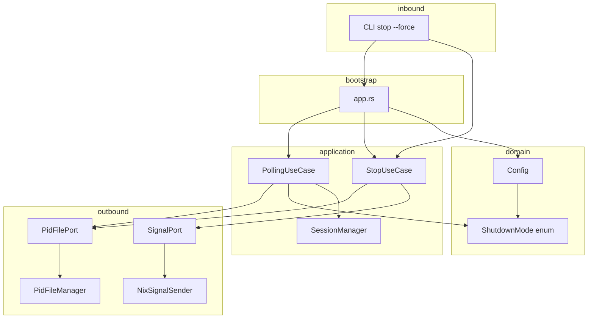
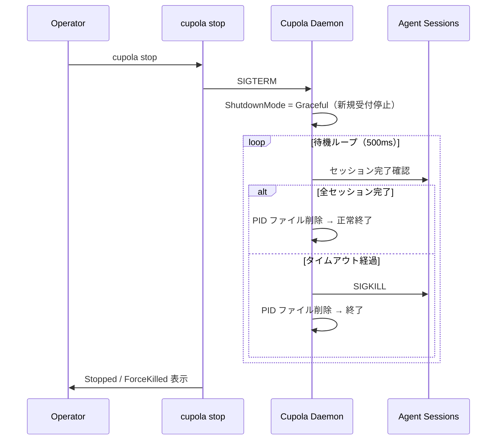
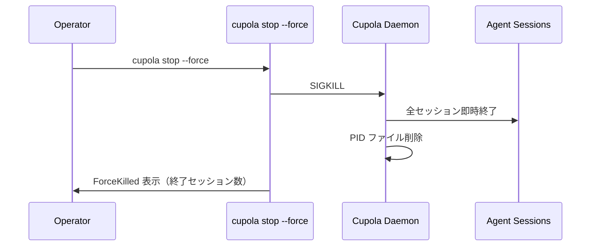
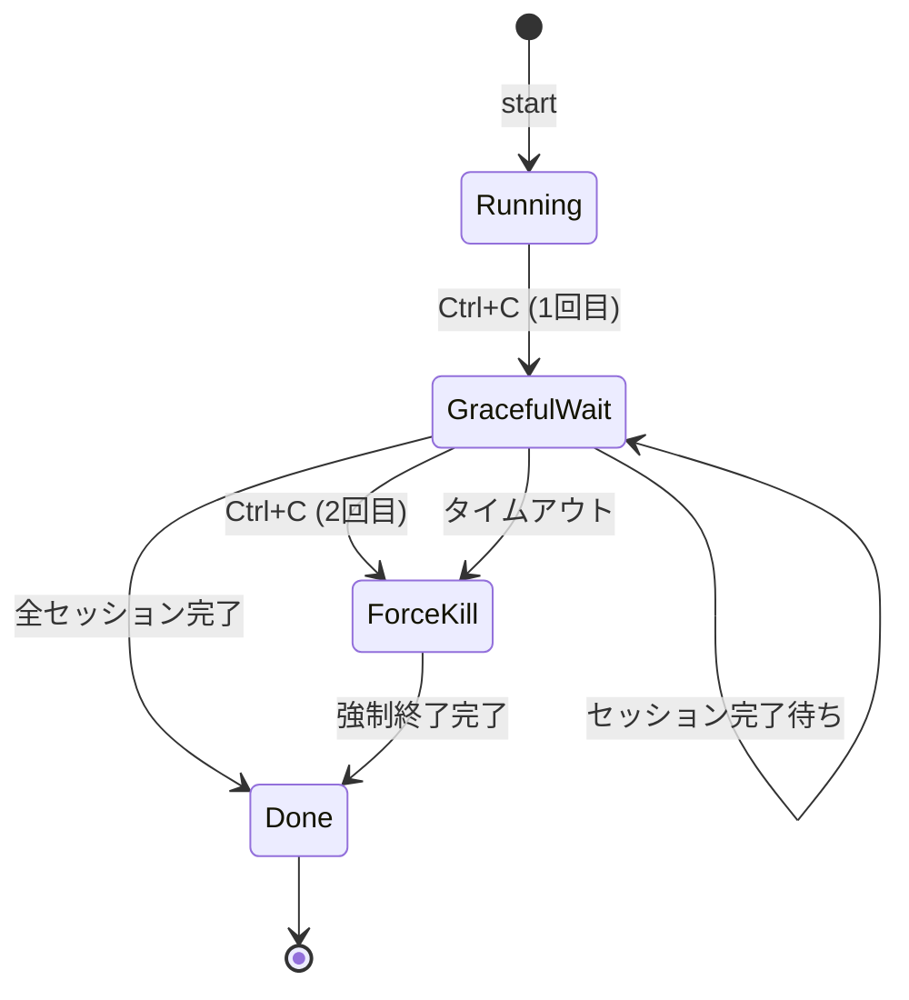

# Design Document: エージェントプロセスの完了を待つ Graceful Shutdown モード

## Overview

本機能は Cupola デーモンに graceful shutdown モードを追加する。現状は SIGTERM 受信後に即座にセッションを kill するが、本機能導入後は実行中エージェントセッションの完了を待ってからプロセスを終了する。これにより API コストの無駄遣いを防ぎ、実行中タスクの中断リスクを低減する。

`stop` コマンドに `--force` フラグを追加して即時終了と graceful 終了を明示的に選択できるようにする。また `shutdown_timeout_secs` を `cupola.toml` で設定可能にし、`0` 設定時は全セッション完了まで無限待機できる。

### Goals

- 実行中セッションの完了を待つ graceful shutdown を実装する
- `cupola stop --force` で即時 SIGKILL による強制終了を提供する
- フォアグラウンド実行中の 2 回 Ctrl+C による緊急強制終了を実装する
- `shutdown_timeout_secs` を `cupola.toml` で設定可能にする（`0` = 無限待機）

### Non-Goals

- Windows 環境のサポート（シグナル処理は Unix 前提）
- セッション個別の timeout 設定（全体タイムアウトのみ）
- `SIGHUP` を shutdown トリガーとして保持する変更（既存動作を維持）
- ブロッキング git サブプロセスの強制中断（init タスク）

---

## Requirements Traceability

| Requirement | Summary | Components | Interfaces | Flows |
|-------------|---------|------------|------------|-------|
| 1.1 | SIGTERM 受信後 graceful wait | PollingUseCase, SessionManager | ShutdownMode | Graceful Shutdown Flow |
| 1.2 | shutdown 中は新規受け付け停止 | PollingUseCase | ShutdownMode | Graceful Shutdown Flow |
| 1.3 | タイムアウト後 SIGKILL | PollingUseCase | Config.shutdown_timeout | Graceful Shutdown Flow |
| 1.4 | 全セッション完了後に正常終了 | PollingUseCase, SessionManager | — | Graceful Shutdown Flow |
| 1.5 | 待機状況ログ出力 | PollingUseCase | — | Graceful Shutdown Flow |
| 2.1 | `stop --force` で即時 SIGKILL | StopUseCase, CLI | StopUseCase::execute(force) | Force Stop Flow |
| 2.2 | 2回 Ctrl+C で即時強制終了 | PollingUseCase | ShutdownMode | Force Stop Flow |
| 2.3 | 強制終了時はセッション完了待ちなし | PollingUseCase, SessionManager | — | Force Stop Flow |
| 2.4 | 強制終了時にセッション数表示 | StopUseCase | StopResult | Force Stop Flow |
| 3.1 | cupola.toml から timeout 読み込み | Config, CupolaToml | Config.shutdown_timeout | — |
| 3.2 | `0` = 無限待機 | Config | Config.shutdown_timeout | — |
| 3.3 | 正の整数 = 秒数タイムアウト | Config | Config.shutdown_timeout | — |
| 3.4 | 未設定時デフォルト 300 秒 | Config | Config.shutdown_timeout | — |
| 3.5 | 次回起動時に反映 | Config, Bootstrap | — | — |
| 4.1 | `stop` に `--force` フラグ追加 | CLI (clap) | Cli::Stop.force | — |
| 4.2 | `stop`（デフォルト）は graceful | StopUseCase | StopUseCase::execute(false) | — |
| 4.3 | `stop --force` は強制終了 | StopUseCase | StopUseCase::execute(true) | — |
| 4.4 | timeout 設定値を尊重した待機 | StopUseCase | Config.shutdown_timeout | — |
| 5.1 | stop 呼び出し元へ進捗表示 | StopUseCase | StopResult | — |
| 5.2 | タイムアウト強制終了をログ記録 | PollingUseCase | — | — |
| 5.3 | 正常完了時にセッション数ログ | PollingUseCase | — | — |
| 5.4 | 二重 SIGTERM は無視してログ | PollingUseCase | ShutdownMode | — |

---

## Architecture

### Existing Architecture Analysis

現在の shutdown 関連コンポーネントは以下のように動作している：

- **StopUseCase** (`src/application/stop_use_case.rs`): SIGTERM 送信 → 500ms ポーリング → 30 秒タイムアウト後 SIGKILL。タイムアウト 30 秒はハードコード。
- **PollingUseCase::graceful_shutdown** (`src/application/polling_use_case.rs:306-334`): `session_mgr.kill_all()` 後に最大 10 秒待機。10 秒もハードコード。
- **Config** (`src/domain/config.rs`): `shutdown_timeout_secs` フィールドなし。
- **CLI** (`src/adapter/inbound/`): `stop` サブコマンドに `--force` フラグなし。

### Architecture Pattern & Boundary Map



**Architecture Integration**:
- Clean Architecture の層構造を維持。新規追加は domain と application 層に集中
- `ShutdownMode` を domain 層の enum として定義し、graceful / force の状態を型で表現
- `Config.shutdown_timeout` は `Option<Duration>` として保持（`None` = 無限待機）
- `StopUseCase::execute` に `force: bool` 引数を追加（既存シグネチャの最小限変更）
- `PollingUseCase` は `shutdown_timeout: Option<Duration>` をコンストラクタで受け取る

### Technology Stack

| Layer | Choice / Version | Role in Feature | Notes |
|-------|------------------|-----------------|-------|
| Signal | nix crate（既存） | SIGTERM / SIGKILL 送信 | 変更なし |
| Signal (Unix) | tokio::signal::unix | SIGINT 複数回受信 | 既存 `ctrl_c()` から変更 |
| Runtime | tokio（既存） | 非同期待機ループ | 変更なし |
| Config | serde / toml（既存） | `shutdown_timeout_secs` 読み込み | フィールド追加のみ |
| CLI | clap derive（既存） | `--force` フラグ追加 | フィールド追加のみ |

---

## System Flows

### Graceful Shutdown Flow（SIGTERM 受信時）



### Force Stop Flow（`--force` または 2回 Ctrl+C）



### 2回 Ctrl+C Flow（フォアグラウンドモード）



---

## Components and Interfaces

### Components Summary

| Component | Domain/Layer | Intent | Req Coverage | Key Dependencies | Contracts |
|-----------|--------------|--------|--------------|------------------|-----------|
| ShutdownMode | domain | shutdown 状態の型表現 | 1.1, 1.2, 2.2, 2.3, 5.4 | — | State |
| Config (拡張) | domain | shutdown_timeout 追加 | 3.1–3.5 | — | State |
| StopUseCase (拡張) | application | force フラグ対応・進捗表示 | 2.1, 2.3, 2.4, 4.2–4.4, 5.1 | SignalPort, PidFilePort | Service |
| PollingUseCase (拡張) | application | graceful wait ループ改修 | 1.1–1.5, 2.2, 5.2–5.4 | SessionManager, PidFilePort | Service |
| CLI Cli::Stop (拡張) | adapter/inbound | `--force` フラグ追加 | 4.1, 2.1 | StopUseCase | — |
| CupolaToml (拡張) | bootstrap | shutdown_timeout_secs 追加 | 3.1, 3.4 | — | — |
| PidFilePort (拡張) | application | セッション状態ファイル読み書き | 2.4, 5.1 | — | Port |

---

### Domain Layer

#### ShutdownMode

| Field | Detail |
|-------|--------|
| Intent | graceful / force の shutdown モードを型で表現する |
| Requirements | 1.1, 1.2, 2.2, 2.3, 5.4 |

**Responsibilities & Constraints**

- ポーリングループの状態遷移を型安全に制御する
- ビジネスロジック（graceful か force か）をドメイン型として定義する

**Contracts**: State [x]

##### State Management

```rust
pub enum ShutdownMode {
    /// 通常動作中（shutdown 未要求）
    None,
    /// Graceful shutdown 待機中（タイムアウトあり）
    Graceful { deadline: Option<Instant> },
    /// 強制終了（即時 kill）
    Force,
}
```

- `ShutdownMode::None` — 通常ポーリング継続
- `ShutdownMode::Graceful { deadline: None }` — タイムアウトなし（shutdown_timeout_secs = 0）
- `ShutdownMode::Graceful { deadline: Some(t) }` — 指定時刻までに完了しなければ SIGKILL
- `ShutdownMode::Force` — 即時 SIGKILL

---

### Application Layer

#### StopUseCase（拡張）

| Field | Detail |
|-------|--------|
| Intent | `force` フラグに応じた 2 モードの stop を提供する |
| Requirements | 2.1, 2.3, 4.2, 4.3, 4.4, 5.1 |

**Responsibilities & Constraints**

- `force = false` のとき: SIGTERM → ポーリング → タイムアウト後 SIGKILL
- `force = true` のとき: SIGKILL を即送信して完了確認のみ
- タイムアウトは `Config.shutdown_timeout` を参照する（`None` = 無限待機）

**Contracts**: Service [x]

##### Service Interface

```rust
impl<P: PidFilePort, S: SignalPort> StopUseCase<P, S> {
    pub fn new(pid_file: P, signal: S, shutdown_timeout: Option<Duration>) -> Self;
    pub async fn execute(&self, force: bool) -> Result<StopResult, StopError>;
}

pub enum StopResult {
    NotRunning,
    StalePidCleaned,
    Stopped { pid: u32 },
    ForceKilled { pid: u32, sessions_killed: u32 },
}
```

- Preconditions: PID ファイルパスが設定済みであること
- Postconditions: プロセス終了後に PID ファイルが削除されていること
- Invariants: `force = true` のとき `shutdown_timeout` を無視する

**Implementation Notes**

- `sessions_killed` カウントはデーモン側のみ知るため、**セッション状態ファイル**（PID ファイルと同ディレクトリの `<pid_stem>.sessions`）を介してデーモン→CLI へ伝達する:
  1. デーモン（PollingUseCase）は graceful shutdown 中および通常稼働中に、アクティブセッション数をセッション状態ファイルへ定期的に書き込む
  2. `StopUseCase` は SIGKILL 送信**前**にセッション状態ファイルを読み取り、`ForceKilled.sessions_killed` を設定する（AC 2.4 を満たす）
  3. graceful shutdown 中、`StopUseCase` はデーモン死活確認ループ内でセッション状態ファイルをポーリングし、残セッション数と経過秒数を端末へ定期出力する（AC 5.1 を満たす）
  4. デーモン終了後はセッション状態ファイルも削除する
- `PidFilePort` を拡張し、セッション状態ファイルの読み書きメソッドを追加する（`write_session_count(n: u32)` / `read_session_count() -> Option<u32>`）
- 既存テストの `execute()` 呼び出しを `execute(false)` に更新する

---

#### PollingUseCase（拡張）

| Field | Detail |
|-------|--------|
| Intent | シグナル受信時に ShutdownMode を設定し graceful/force の分岐処理を行う |
| Requirements | 1.1–1.5, 2.2, 2.3, 5.2–5.4 |

**Responsibilities & Constraints**

- SIGTERM 受信: `ShutdownMode::Graceful` に遷移（`deadline` を `shutdown_timeout` から算出）
- 2 回目 SIGINT 受信: `ShutdownMode::Force` に遷移
- `ShutdownMode::Graceful` 中はポーリングループを抜けてセッション完了待ちに入る
- `ShutdownMode::Force` 中は即 `session_mgr.kill_all()` を呼び出してプロセス終了

**Contracts**: Service [x]

##### Service Interface

```rust
impl PollingUseCase {
    pub fn new(
        // 既存引数に追加
        shutdown_timeout: Option<Duration>,
        // ...他の既存引数
    ) -> Self;

    pub async fn run(&self) -> Result<(), ApplicationError>;
    async fn graceful_shutdown(&self, mode: ShutdownMode) -> Result<(), ApplicationError>;
}
```

**graceful_shutdown の動作**

```
ShutdownMode::Graceful { deadline } の場合:
  shutdown_start = 現在時刻
  ループ (100ms インターバル):
    - セッション完了を回収 (collect_exited)
    - アクティブセッション数をセッション状態ファイルへ書き込む
    - 残セッション数 = 0 → 正常終了ログ → break
    - deadline が Some(t) かつ現在時刻 >= t → SIGKILL → ログ → break
    - 5 秒ごとに「完了待ち中 (残 N セッション、shutdown 開始から M 秒経過)」ログ

ShutdownMode::Force の場合:
  - session_mgr.kill_all()
  - 最大 5 秒待機して回収
  - セッション状態ファイル削除
  - PID ファイル削除 → 終了
```

**Implementation Notes**

- SIGINT の多重受信には `tokio::signal::unix::signal(SignalKind::interrupt())` を使い、`sigint_count` カウンタで 2 回目を検出する
- 既存の `ctrl_c()` 使用箇所を `signal(SignalKind::interrupt())` に移行する
- `shutdown_timeout: Option<Duration>` はコンストラクタで受け取り、bootstrap から `Config.shutdown_timeout` を渡す

---

### Adapter Layer

#### CLI Cli::Stop（拡張）

| Field | Detail |
|-------|--------|
| Intent | `--force` フラグを stop サブコマンドに追加する |
| Requirements | 4.1, 2.1 |

**Contracts**: — （clap derive による自動生成）

##### 変更点

```rust
#[derive(Subcommand)]
pub enum Commands {
    Stop {
        /// 実行中セッションを待たずに即座に強制終了する
        #[arg(long, default_value_t = false)]
        force: bool,
    },
    // ...他のサブコマンドは変更なし
}
```

---

### Bootstrap Layer

#### CupolaToml / Config（拡張）

**shutdown_timeout_secs の追加**

```rust
// CupolaToml（src/bootstrap/config_loader.rs）
pub struct CupolaToml {
    // 既存フィールドに追加:
    pub shutdown_timeout_secs: Option<u64>,  // None = 未設定（デフォルト 300 秒）
    // ...
}

// Config（src/domain/config.rs）
pub struct Config {
    // 既存フィールドに追加:
    pub shutdown_timeout: Option<Duration>,  // None = 無限待機
    // ...
}
```

**変換ロジック**

```
CupolaToml.shutdown_timeout_secs の変換:
  None        → Config.shutdown_timeout = Some(Duration::from_secs(300))  // デフォルト
  Some(0)     → Config.shutdown_timeout = None                            // 無限待機
  Some(n > 0) → Config.shutdown_timeout = Some(Duration::from_secs(n))   // n 秒タイムアウト
```

---

## Data Models

### Domain Model

`ShutdownMode` は `PollingUseCase` の実行時状態として保持される。永続化は不要。

```
ShutdownMode (値オブジェクト)
  ├── None
  ├── Graceful { deadline: Option<Instant> }
  └── Force
```

`Config.shutdown_timeout: Option<Duration>` は起動時にロードされた設定値。不変。

---

## Error Handling

### Error Strategy

- **タイムアウト経過**: `ShutdownMode::Graceful` でタイムアウトになった場合はエラーではなく正常な `ForceKilled` 結果として扱う
- **SIGKILL 失敗**: `NixSignalSender::send_sigkill` が ESRCH を返した場合はプロセスが既に死んでいるとみなし成功扱い
- **無限待機中の stop コマンド**: `shutdown_timeout = None` 時の `StopUseCase` 待機はプロセス終了まで継続する。呼び出し元で Ctrl+C によりキャンセル可能

### Error Categories

- **設定エラー**: `shutdown_timeout_secs` に負の値（型上不可、u64 なので問題なし）
- **プロセス死活エラー**: PID ファイルにある PID のプロセスが存在しない → `StalePidCleaned` として正常処理

---

## Testing Strategy

### Unit Tests

- `Config::from_toml()` — `shutdown_timeout_secs = 0` → `None`, 未設定 → `Some(300s)`, 正数 → `Some(n s)`
- `StopUseCase::execute(force = true)` — SIGTERM をスキップして SIGKILL を呼ぶことを確認
- `StopUseCase::execute(force = false)` — 既存の graceful フロー（timeout 付き）を確認
- `ShutdownMode` の状態遷移ロジック（`deadline` 判定）

### Integration Tests

- `PollingUseCase` に mock SessionManager を注入し、SIGTERM 受信後に新規セッション起動が停止することを確認
- `PollingUseCase` で graceful_shutdown がタイムアウト後に `kill_all` を呼ぶことを確認
- `PollingUseCase` で 2 回目の SIGINT 受信後に即 `kill_all` を呼ぶことを確認（`sigint_count` カウンタ）
- `StopUseCase` のタイムアウト設定（`Option<Duration>` 対応）が既存テストと整合することを確認
