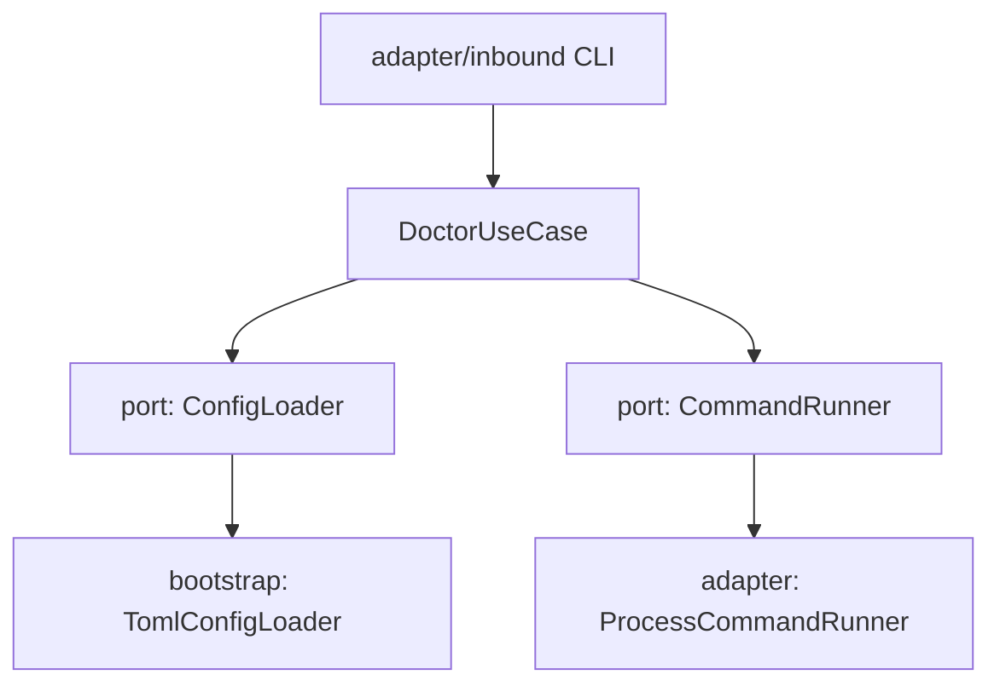
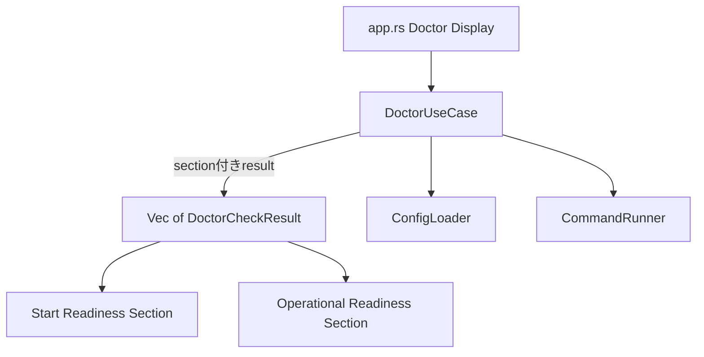
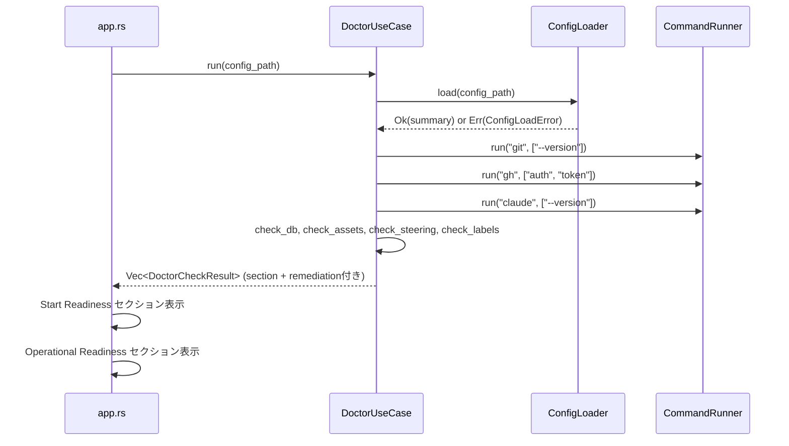

# 設計: doctor の再設計

## Overview

`cupola doctor` を `cupola start` の readiness 基準で再設計する。診断結果を **Start Readiness**（起動可否に直結する項目）と **Operational Readiness**（起動後の運用品質に影響する項目）の2セクションに分類し、各チェック結果に **remediation**（修復方法）を付加する。

**Users**: cupola を運用する開発者が `doctor` を実行して、現在の環境で `cupola start` できるかどうかと、その修復方法を即座に把握できるようにする。

**Impact**: 現行の `doctor_use_case.rs` のチェック構造・severity・表示ロジックを再設計する。新規チェック（claude CLI、GitHub token readiness、assets 確認）を追加し、既存チェックの severity を修正する。

### Goals

- `cupola start` の起動可否を Start Readiness で一意に判定できる
- 各チェック結果に remediation を付加し、次アクションを明示する
- 既存チェックの severity（steering: FAIL→WARN、agent:ready: FAIL→WARN）を修正する

### Non-Goals

- `cupola init` 自体の追加改修
- `doctor --fix` による自動修復の実装
- `cupola start` 本体の起動シーケンス変更
- Codex 用 bootstrap の実装

## Requirements Traceability

| 要件 | 概要 | コンポーネント | インターフェース |
|------|------|----------------|-----------------|
| 1.1–1.4 | セクション分類と表示 | DoctorUseCase, Doctor CLI Display | DoctorSection, DoctorCheckResult |
| 2.1–2.6 | Start Readiness チェック | DoctorUseCase | ConfigLoader, CommandRunner |
| 3.1–3.4 | Operational Readiness チェック | DoctorUseCase | CommandRunner |
| 4.1–4.5 | Remediation 表示 | DoctorCheckResult, Doctor CLI Display | remediation: Option<String> |
| 5.1–5.4 | テストカバレッジ | DoctorUseCase テスト | MockCommandRunner, MockConfigLoader |

## Architecture

### Existing Architecture Analysis

現行の `doctor_use_case.rs` は Clean Architecture の application layer に位置する。`ConfigLoader` と `CommandRunner` の2つのポートを通じて外部依存を抽象化している。`DoctorCheckResult` は `name` と `status` (Ok/Warn/Fail) のみを持ち、section と remediation の概念がない。



### Architecture Pattern & Boundary Map

**Architecture Integration**:
- 既存の Clean Architecture 境界を維持する
- application layer の `DoctorUseCase` に新チェック関数を追加する
- `ConfigLoader` ポート（application/port）に `ValidationFailed` エラーバリアントを追加する
- bootstrap の `app.rs` で section 別表示ロジックを更新する



### Technology Stack

| レイヤー | 技術 | 役割 |
|----------|------|------|
| application | Rust (doctor_use_case.rs) | チェックロジック、セクション分類 |
| application/port | ConfigLoader trait | config parse + validate の抽象化 |
| adapter/outbound | ProcessCommandRunner | CLIコマンド実行 |
| bootstrap | app.rs | セクション別・remediation 付き表示 |

## System Flows



## Components and Interfaces

| コンポーネント | レイヤー | 役割 | 要件カバレッジ | 主要依存 |
|----------------|----------|------|----------------|----------|
| DoctorSection | application | セクション分類の enum | 1.1 | なし |
| DoctorCheckResult | application | チェック結果の構造体 | 1.1–4.5 | DoctorSection |
| DoctorUseCase | application | 全チェックの実行と結果収集 | 1–5 | ConfigLoader, CommandRunner |
| ConfigLoader (port) | application/port | config 読み込み + validate | 2.1, 2.2 | - |
| Doctor CLI Display | bootstrap | セクション別・remediation 付き表示 | 1.1–1.4, 4.1 | DoctorUseCase |

### Application Layer

#### DoctorSection

| フィールド | 詳細 |
|--------|--------|
| Intent | Start Readiness と Operational Readiness の2分類を表す enum |
| Requirements | 1.1, 1.3 |

**Contracts**: State [x]

##### State Interface
```rust
pub enum DoctorSection {
    StartReadiness,
    OperationalReadiness,
}
```

#### DoctorCheckResult

| フィールド | 詳細 |
|--------|--------|
| Intent | 1件のチェック結果（セクション・名前・ステータス・remediation）を保持する |
| Requirements | 1.1, 4.1 |

**Contracts**: State [x]

##### State Interface
```rust
pub struct DoctorCheckResult {
    pub section: DoctorSection,
    pub name: String,
    pub status: CheckStatus,
    pub remediation: Option<String>,
}
```

**Implementation Notes**:
- `remediation` は `None`（修復不要）または `Some(message)`（修復手順テキスト）
- `CheckStatus` は既存の `Ok(String)` / `Warn(String)` / `Fail(String)` を維持する

#### DoctorUseCase

| フィールド | 詳細 |
|--------|--------|
| Intent | 全チェックを実行し、セクション分類・remediation 付きの結果リストを返す |
| Requirements | 1–5 |

**Dependencies**:
- Inbound: `app.rs` — doctor コマンド実行 (P0)
- Outbound: `ConfigLoader` — config 読み込み + validate (P0)
- Outbound: `CommandRunner` — CLI コマンド実行 (P0)

**Contracts**: Service [x]

##### Service Interface
```rust
impl<C: ConfigLoader, R: CommandRunner> DoctorUseCase<C, R> {
    pub fn run(&self, config_path: &Path) -> Vec<DoctorCheckResult>;
}
```

**Start Readiness チェック関数**（全て `DoctorSection::StartReadiness` を返す）:

| 関数 | チェック内容 | FAIL 条件 | remediation |
|------|------------|-----------|-------------|
| `check_config` | TOML parse + into_config + validate | 不存在/parse失敗/validate失敗 | `cupola init` または設定修正 |
| `check_git` | `git --version` | コマンド失敗 | git インストール手順 |
| `check_github_token` | `gh auth token` | コマンド失敗 | `gh auth login` |
| `check_claude` | `claude --version` | コマンド失敗 | claude インストール手順 |
| `check_db` | `.cupola/cupola.db` 存在確認 | ファイル不存在 | `cupola init` |

**Operational Readiness チェック関数**（全て `DoctorSection::OperationalReadiness` を返す）:

| 関数 | チェック内容 | WARN 条件 | remediation |
|------|------------|-----------|-------------|
| `check_assets` | `.claude/commands/cupola/` と `.cupola/settings/` 存在確認 | ディレクトリ不存在 | `cupola init` |
| `check_steering` | `.cupola/steering/` にファイルあり | ファイルなし | `cupola init` または `/cupola:steering` |
| `check_gh_label` | `agent:ready` ラベル存在確認 | ラベル不存在 | `gh label create agent:ready` |
| `check_weight_labels` | `weight:light` / `weight:heavy` ラベル存在確認 | ラベル不存在 | `gh label create weight:*` |

**Implementation Notes**:
- `check_config` は既存の `check_toml` を置き換える。`ConfigLoadError::ValidationFailed` バリアントを新設して validate 失敗を表現する
- `check_github_token` は `gh auth token` コマンドを `CommandRunner` 経由で実行する。`gh auth status` の結果に依存しない
- `check_claude` は `claude --version` を実行する。副作用がなく最小限の確認

### Application/Port Layer

#### ConfigLoader（更新）

| フィールド | 詳細 |
|--------|--------|
| Intent | 設定ファイルの読み込み・パース・バリデーションを抽象化するポート |
| Requirements | 2.1, 2.2 |

**Contracts**: Service [x]

##### Service Interface
```rust
// ConfigLoadError に ValidationFailed を追加
#[derive(Debug, thiserror::Error)]
pub enum ConfigLoadError {
    #[error("設定ファイルが見つかりません: {path}")]
    NotFound { path: String },
    #[error("設定ファイルの読み込みに失敗しました: {path}: {reason}")]
    ReadFailed { path: String, reason: String },
    #[error("設定ファイルのパースに失敗しました: {path}: {reason}")]
    ParseFailed { path: String, reason: String },
    #[error("必須フィールドが不足しています: {field}")]
    MissingField { field: String },
    #[error("設定のバリデーションに失敗しました: {reason}")]
    ValidationFailed { reason: String },  // 新規追加
}
```

**Implementation Notes**:
- `TomlConfigLoader` は `load_toml + into_config + validate` を全て実行し、`ValidationFailed` を返すよう更新する
- `into_config` の `ConfigError` も `ConfigLoadError` にマッピングする

### Bootstrap Layer

#### Doctor CLI Display（更新）

| フィールド | 詳細 |
|--------|--------|
| Intent | `app.rs` の `Command::Doctor` ブランチで、セクション別・remediation 付き表示を行う |
| Requirements | 1.1–1.4, 4.1–4.5 |

**Contracts**: Service [x]

**表示フォーマット**:
```text
=== Start Readiness ===
✅ config: cupola.toml が正常に読み込まれました
✅ git: git がインストールされています
❌ claude: claude CLI が見つかりません
   fix: `brew install claude` または https://claude.ai/code

=== Operational Readiness ===
⚠️  assets: Cupola assets が不足しています
   fix: `cupola init`
✅ steering: steering ディレクトリに 3 件のファイルが見つかりました
```

**Implementation Notes**:
- `has_failure` の判定は Start Readiness セクションの FAIL のみで行う（Operational の FAIL は存在しないが将来の拡張に備える）
- remediation は `fix: ` プレフィックスでインデント表示する
- セクションヘッダーを `=== Section Name ===` 形式で表示する

## Error Handling

### エラー戦略

`DoctorUseCase` はチェック失敗を例外ではなく `CheckStatus::Fail` として通常値として返す。外部コマンドの実行エラー（`CommandRunner` の `Err`）はチェック失敗として扱い、ユーザーに原因を伝える。

### エラー分類

- **設定エラー**: `ConfigLoadError` の各バリアントを `CheckStatus::Fail` のメッセージとして表示
- **コマンド未検出**: `command not found` を含む stderr / `Err` を CLI 未インストールとして扱う
- **認証失敗**: `gh auth token` のコマンド失敗を token readiness 失敗として扱う

## Testing Strategy

### Unit Tests

- `check_config`: MockConfigLoader を使用して ValidationFailed バリアントを含む全エラーケースをテスト
- `check_github_token`: MockCommandRunner で `gh auth token` の成功/失敗をテスト
- `check_claude`: MockCommandRunner で `claude --version` の成功/失敗をテスト
- `check_assets`: TempDir を使用してディレクトリの存在/不存在をテスト
- `check_steering`: 既存テストを WARN に変更
- `check_gh_label`: 既存テストを WARN に変更

### Integration Tests

- `DoctorUseCase::run()` が Start Readiness と Operational Readiness の両セクションを含む結果を返すことを検証
- 全チェック正常時の結果件数（新規チェック追加後）を検証
