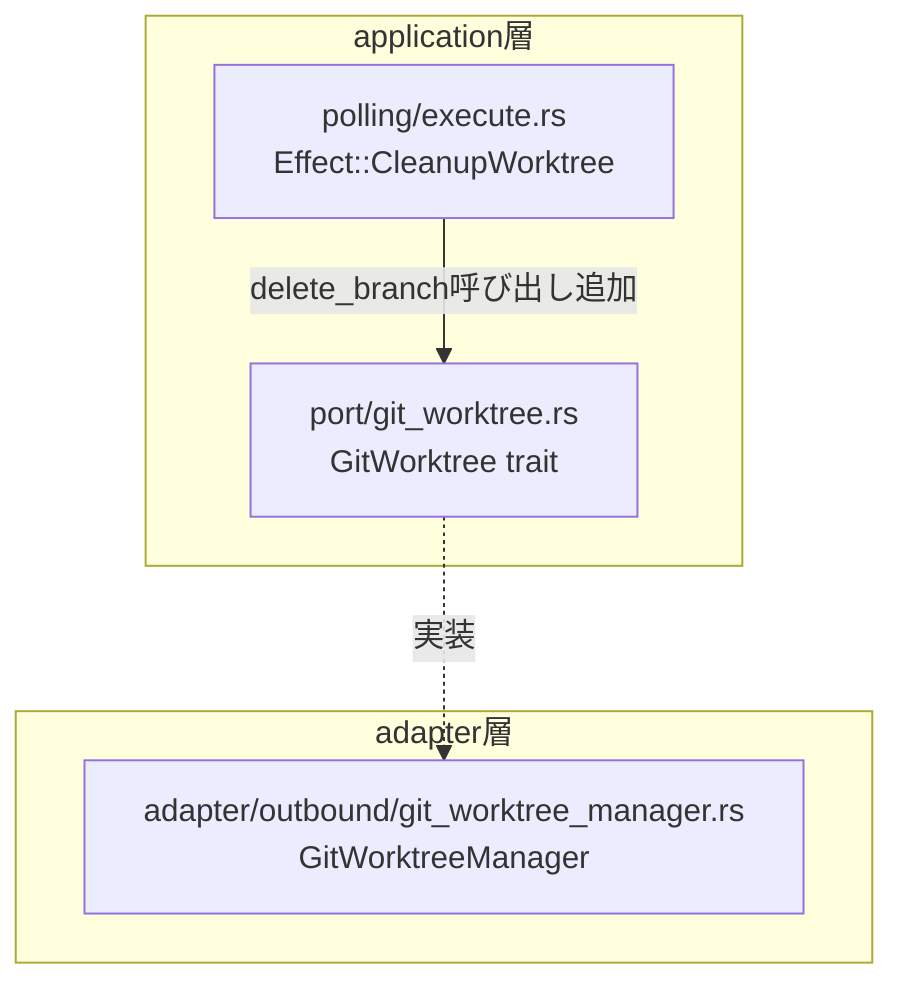
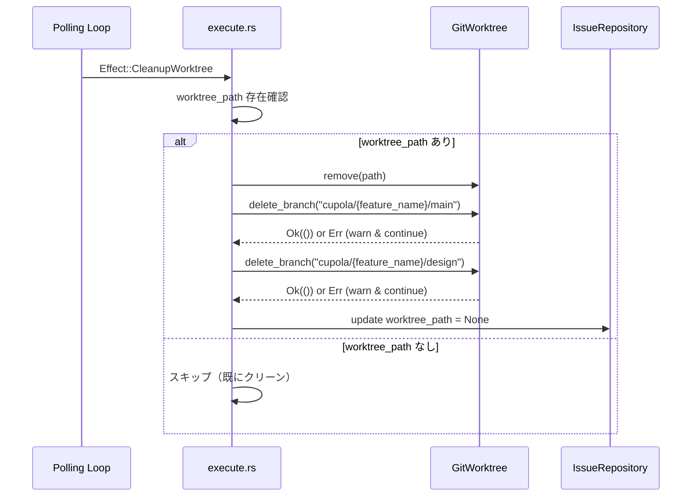

# Design Document: ポーリング完了時のブランチクリーンアップ修正

## Overview

本機能は、ポーリングループで `Completed` イシューに適用される `Effect::CleanupWorktree` の動作を修正し、ワークツリー削除に加えてブランチ削除も実行するようにする。これにより CLI `cleanup` コマンドとの非対称性を解消し、マージ済みブランチがローカルリポジトリに残留する問題を防ぐ。

対象ユーザーは Cupola 運用者であり、`cupola start` によるポーリングループを利用して issue の自動完了クリーンアップを行っている。現状では `Completed` 後に `cupola/{n}/main` と `cupola/{n}/design` ブランチが残留し、手動での削除が必要になっている。

### Goals

- `Effect::CleanupWorktree` の実行時にブランチ削除を追加し、CLI の動作と一致させる
- ブランチ削除は冪等・ベストエフォートで実行し、既存のワークツリークリーンアップフローを妨げない
- `Cancelled` 状態のブランチ保持動作を維持する

### Non-Goals

- 新規エフェクトの定義（既存 `Effect::CleanupWorktree` の拡張のみ）
- リモートブランチの自動削除設定の変更
- `Cancelled` → `Completed` 遷移後のブランチ削除動作の変更

## Architecture

### Existing Architecture Analysis

本変更は `application` 層の `src/application/polling/execute.rs` 内の `Effect::CleanupWorktree` ブロックのみを対象とする。

現在の実装フロー:
1. `issue.worktree_path` が存在する場合、`worktree.remove(path)` を呼ぶ
2. `MetadataUpdates { worktree_path: Some(None), .. }` で DB の `worktree_path` をクリア

CLI の `CleanupUseCase` で既に確立されているパターン:
1. ワークツリーを削除（失敗は warn ログ）
2. `cupola/{n}/main`、`cupola/{n}/design` を `delete_branch` で削除（失敗は warn ログ）
3. `worktree_path` クリアの可否を判定して DB 更新

### Architecture Pattern & Boundary Map

**Architecture Integration**:
- 選択パターン: 既存の `application` 層内ロジックへのベストエフォート操作追加
- 既存パターン保持: `GitWorktree` トレイト、`MetadataUpdates` パターンを維持
- 新規コンポーネントなし: `delete_branch` は既存トレイトメソッドを利用
- Steering 準拠: クリーンアーキテクチャ規則に違反しない（`application` → `port` の依存方向）

### Technology Stack

| Layer | Choice / Version | Role in Feature | Notes |
|-------|------------------|-----------------|-------|
| Application | Rust / polling/execute.rs | CleanupWorktree ロジック拡張 | 既存ファイルの修正のみ |
| Port | GitWorktree trait | delete_branch インターフェース | 変更なし |
| Adapter | GitWorktreeManager | delete_branch 冪等実装 | 変更なし |

## System Flows

> ブランチ削除はベストエフォートで、失敗しても `worktree_path` のクリアは継続される。

## Requirements Traceability

| Requirement | Summary | Components | Flows |
|-------------|---------|------------|-------|
| 1.1 | CleanupWorktree でブランチ削除実行 | polling/execute.rs | CleanupWorktree フロー |
| 1.2 | 削除成功時のログ記録 | polling/execute.rs | CleanupWorktree フロー |
| 1.3 | ブランチ不在での正常継続（冪等性） | GitWorktreeManager | delete_branch 冪等実装 |
| 1.4 | ブランチ削除結果に関わらず worktree_path クリア | polling/execute.rs | CleanupWorktree フロー |
| 1.5 | worktree_path なしの場合スキップ | polling/execute.rs | CleanupWorktree フロー |
| 2.1 | Cancelled 状態でのブランチ保持 | 状態機械（変更なし） | — |
| 2.2 | Cancelled に CleanupWorktree 非適用 | 状態機械（変更なし） | — |
| 3.1 | delete_branch 呼び出しの検証 | テストモジュール | ユニットテスト |
| 3.2 | delete_branch 失敗でもエフェクト継続の検証 | テストモジュール | ユニットテスト |
| 3.3 | Cancelled のリグレッションテスト | テストモジュール | ユニットテスト |

## Components and Interfaces

| Component | Domain/Layer | Intent | Req Coverage | Key Dependencies |
|-----------|--------------|--------|--------------|-----------------|
| CleanupWorktree ブロック (polling/execute.rs) | Application | ワークツリーとブランチのクリーンアップ | 1.1–1.5 | GitWorktree, IssueRepository |
| GitWorktreeManager.delete_branch | Adapter | 冪等なブランチ削除 | 1.3 | git コマンド |
| MockGitWorktree (テスト用) | Test | delete_branch の呼び出し検証 | 3.1, 3.2 | — |

### Application Layer

#### CleanupWorktree エフェクト処理 (polling/execute.rs)

| Field | Detail |
|-------|--------|
| Intent | ワークツリー削除に加えてブランチ削除を実行し、CLI との動作一致を実現する |
| Requirements | 1.1, 1.2, 1.3, 1.4, 1.5 |

**Responsibilities & Constraints**
- `issue.worktree_path` が `Some(path)` の場合のみブランチ削除を実行する
- ブランチ削除の成否に関わらず `worktree_path` のメタデータクリアを継続する
- ブランチ名は `format!("cupola/{feature_name}/main")` および `format!("cupola/{feature_name}/design")` で生成する（`feature_name` は `issue.feature_name` フィールドの値、例: `issue-190`）
- ブランチ削除失敗時は `tracing::warn!` でログ記録して継続する（ベストエフォート）

**Dependencies**
- Inbound: PollingUseCase — エフェクトのディスパッチ (P0)
- Outbound: `GitWorktree::delete_branch` — ブランチ削除 (P0)
- Outbound: `IssueRepository::update_state_and_metadata` — `worktree_path` クリア (P0)

**Contracts**: State [✓]

##### State Management

- State model: `issue.worktree_path` が `Some` → 処理実行、`None` → スキップ
- Persistence: `worktree_path = None` を DB に書き込み後、`issue.worktree_path = None` を更新
- Concurrency strategy: ポーリングループは 1 イシューにつき逐次実行のため競合なし

**Implementation Notes**
- Integration: CLI の `CleanupUseCase`（`src/application/cleanup_use_case.rs` lines 81–94）と同一パターンを踏襲する
- Validation: ブランチ名は `format!()` マクロで生成（バリデーション不要）
- Risks: `delete_branch` が既に冪等実装のため実質的リスクなし

## Error Handling

### Error Strategy

ブランチ削除はベストエフォートで扱う。エラーはログに記録するが、エフェクトの続行を妨げない。

### Error Categories and Responses

| エラー種別 | 発生条件 | 対応 |
|-----------|---------|------|
| ブランチ不在 | GitHub の自動削除等で既に削除済み | `delete_branch` が `Ok(())` を返すため透過的（冪等） |
| git コマンド失敗 | git が利用できない等の極端なケース | `warn` ログを出力して `worktree_path` クリアを継続 |
| ワークツリー削除失敗 | パーミッション等 | 既存の動作維持（ブランチ削除も実行しない） |

### Monitoring

- 成功時: `tracing::info!` で削除ブランチ名とイシュー番号を記録
- 失敗時: `tracing::warn!` でエラー内容・ブランチ名・イシュー番号を記録

## Testing Strategy

### Unit Tests (polling/execute.rs)

1. `CleanupWorktree` エフェクト実行時に `delete_branch` が `main` と `design` の両ブランチに対して呼ばれることを検証
2. `delete_branch` が `Err` を返した場合もエフェクトが `Ok` を返すことを検証（ベストエフォート動作）
3. `worktree_path` が `None` の場合、`delete_branch` が呼ばれないことを検証

### Regression Tests

4. `Effect::CleanupWorktree` が `Cancelled` 状態のイシューに対して発火しないことを既存テストで確認（状態機械のテスト）
