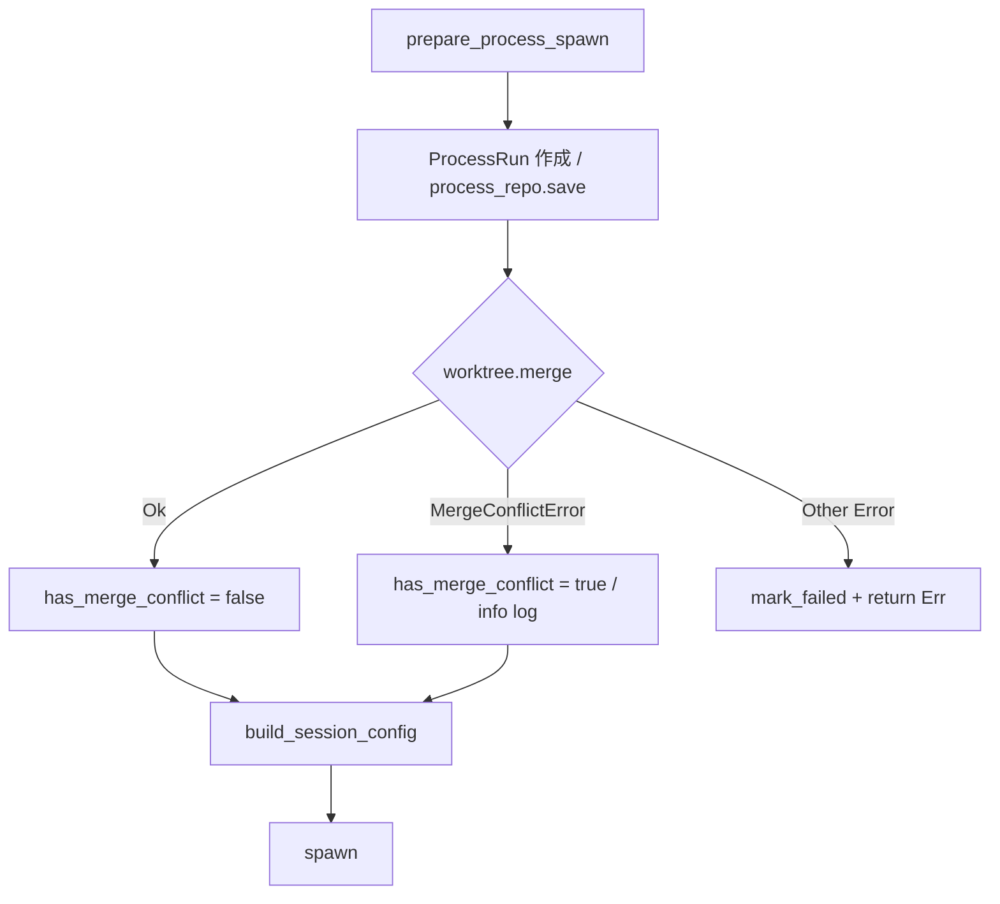
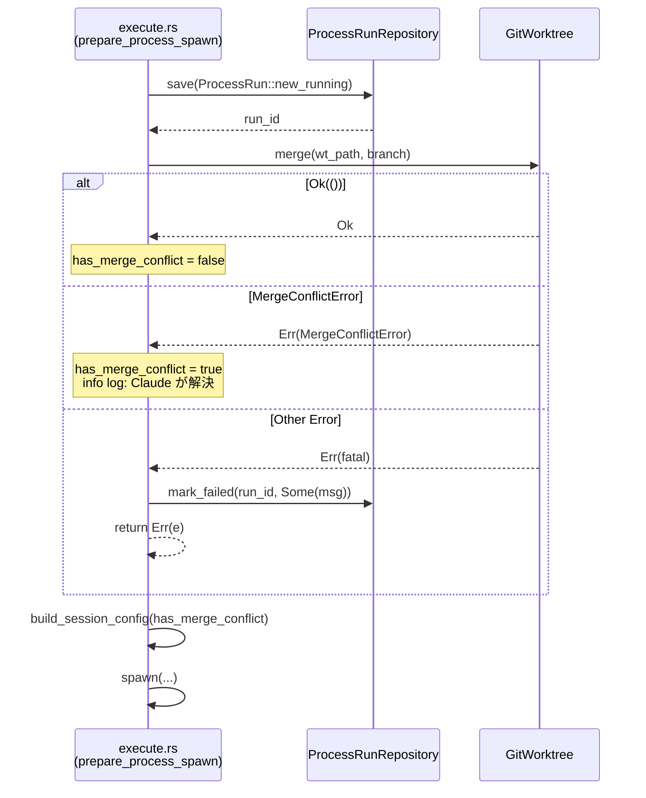

# Design Document

## Overview

本機能は、Fixing フェーズ（DesignFix / ImplFix）スポーン前の `worktree.merge()` 呼び出しにおいて、エラー種別の区別と適切な処理分岐を実装する。

**Purpose**: すべてのマージエラーを握りつぶす現状のバグを修正し、マージコンフリクト（Claude が解決すべき意図的状態）と致命的エラー（ネットワーク障害・権限エラー等）を適切に区別して処理する。

**Users**: Cupola を運用するオペレーターが障害調査しやすくなり、Claude Code セッションが正しいコンテキストでスポーンされることを保証する。

**Impact**: `src/application/polling/execute.rs` の `prepare_process_spawn` 関数を修正する。既存のポート定義・ドメインモデルへの変更はない。

### Goals

- マージコンフリクト時は Claude Code に解決させてスポーン継続
- 致命的マージエラー時は `ProcessRun.error_message` に記録しスポーン中断
- `has_merge_conflict = true` を session config に正しく伝達（TODO 解消）

### Non-Goals

- `ProcessRun` ドメインへの `has_merge_conflict` フィールド追加
- `GitWorktree` ポートのインターフェース変更
- DB スキーマ変更

## Architecture

### Existing Architecture Analysis

修正対象は `src/application/polling/execute.rs` の `prepare_process_spawn` 関数（application 層）。

現在の処理順序：
1. merge（line 539）
2. review threads 書き込み
3. `build_session_config`（`has_merge_conflict = false` ハードコード）
4. `ProcessRun::new_running()` + `process_repo.save()` で run_id 取得
5. spawn

問題は「4. ProcessRun 作成」が「1. merge」より後にある点。致命的マージエラー時に `mark_failed(run_id, ...)` を呼ぶには run_id が必要であり、ProcessRun を先に作成する必要がある。

### Architecture Pattern & Boundary Map



**Architecture Integration**:
- 既存の application 層パターンを維持。ポート・ドメインへの変更なし
- `SpawnableGitWorktree` トレイトはそのまま使用
- `ProcessRunRepository::mark_failed` は既存の同パターン（spawn 失敗時 line 601）と同一

### Technology Stack

| Layer | Choice | Role |
|-------|--------|------|
| application | Rust / anyhow | `e.is::<MergeConflictError>()` による型判別 |
| application | `ProcessRunRepository` port | `mark_failed` で監査記録 |
| adapter | `GitWorktreeManager` | 変更なし |

## System Flows



## Requirements Traceability

| 要件 | 概要 | コンポーネント | フロー |
|------|------|----------------|--------|
| 1.1 | コンフリクト時はスポーン継続 | prepare_process_spawn | MergeConflictError 分岐 |
| 1.2 | 致命的エラー時はスポーン中断 | prepare_process_spawn | Other Error 分岐 |
| 1.3 | コンフリクト時 info ログ | prepare_process_spawn | MergeConflictError 分岐 |
| 1.4 | 致命的エラー時 error ログ | prepare_process_spawn | Other Error 分岐 |
| 2.1 | 致命的エラー時に mark_failed | prepare_process_spawn + ProcessRunRepository | Other Error 分岐 |
| 2.2 | ProcessRun をマージ前に作成 | prepare_process_spawn | ProcessRun 作成順序変更 |
| 2.3 | mark_failed は best-effort | prepare_process_spawn | `let _ = process_repo.mark_failed(...)` |
| 3.1 | コンフリクト時 has_merge_conflict = true | prepare_process_spawn | MergeConflictError 分岐 |
| 3.2 | 成功時 has_merge_conflict = false | prepare_process_spawn | Ok 分岐 |
| 3.3 | ローカル変数で管理 | prepare_process_spawn | — |
| 4.1 | MergeConflictError モックテスト | execute.rs テストモジュール | — |
| 4.2 | 非コンフリクトエラーモックテスト | execute.rs テストモジュール | — |

## Components and Interfaces

| Component | Layer | Intent | Req Coverage | Key Dependencies |
|-----------|-------|--------|--------------|-----------------|
| prepare_process_spawn | application | マージエラー種別判定と ProcessRun 監査 | 1.1–3.3 | GitWorktree, ProcessRunRepository |
| ProcessRunRepository::mark_failed | application port | 失敗 ProcessRun の監査記録 | 2.1, 2.2, 2.3 | — |

### application

#### prepare_process_spawn（修正箇所）

| Field | Detail |
|-------|--------|
| Intent | Fixing スポーン前処理でマージエラーを種別判定し、監査またはコンフリクト情報を伝達する |
| Requirements | 1.1, 1.2, 1.3, 1.4, 2.1, 2.2, 2.3, 3.1, 3.2, 3.3 |

**Responsibilities & Constraints**

- `ProcessRun` をマージ前に作成し `run_id` を確保する
- `worktree.merge()` の結果を `match` でパターンマッチする
- `MergeConflictError` 時: `has_merge_conflict = true`、info ログ、処理継続
- その他エラー時: error ログ、`mark_failed` (best-effort)、`return Err(e)`
- 成功時: `has_merge_conflict = false`

**Dependencies**
- Inbound: `spawn_process` → `prepare_process_spawn` 呼び出し
- Outbound: `GitWorktree::merge` — マージ実行（P0）
- Outbound: `ProcessRunRepository::mark_failed` — 致命的エラーの監査記録（P0）
- Outbound: `build_session_config` — `has_merge_conflict` フラグ伝達（P0）

**Contracts**: Service [x]

##### Service Interface（変更後の疑似コード）

```rust
// ProcessRun をマージ前に作成
let run = ProcessRun::new_running(issue.id, type_, index, causes.to_vec());
let run_id = process_repo.save(&run).await?;

// マージエラーの種別判定
let has_merge_conflict = if matches!(type_, ProcessRunType::DesignFix | ProcessRunType::ImplFix) {
    match worktree.merge(wt_path, &format!("origin/{}", config.default_branch)) {
        Ok(()) => false,
        Err(e) if e.is::<MergeConflictError>() => {
            // 意図的なマージコンフリクト — Claude Code が解決する
            tracing::info!("merge conflict detected before fixing spawn; Claude will resolve");
            true
        }
        Err(e) => {
            // 致命的エラー（ネットワーク障害・権限エラーなど）— スポーン中断
            tracing::error!(error = %e, "merge failed before fixing spawn");
            let _ = process_repo.mark_failed(run_id, Some(e.to_string())).await;
            return Err(e);
        }
    }
} else {
    false
};
```

- Preconditions: `run_id` が確保されている
- Postconditions: `has_merge_conflict` は `MergeConflictError` の場合のみ `true`
- Invariants: 致命的エラー時は `mark_failed` が呼ばれた後 `Err` が返る

**Implementation Notes**

- `e.is::<MergeConflictError>()`: anyhow の型タグ機能による判別。`MergeConflictError` は `thiserror::Error` derive により `std::error::Error` を実装済み
- `mark_failed` の呼び出しは `let _ = ...` で best-effort（mark_failed 自体の失敗でエラーを上書きしない）
- 既存の `update_pid` 失敗時の `mark_failed` パターン（line 593）と同じ設計方針に従う
- `process_repo.save()` の移動に伴い、その後の変数スコープ（run_id の参照箇所）を確認すること

## Error Handling

### Error Strategy

| エラー種別 | 発生元 | 処理方針 |
|------------|--------|----------|
| MergeConflictError | worktree.merge | info ログ、has_merge_conflict = true でスポーン継続 |
| 致命的マージエラー | worktree.merge | error ログ、mark_failed（best-effort）、Err 返却 |
| mark_failed 失敗 | process_repo | 無視（`let _ =`）、元の merge エラーを Err で伝播 |

### Monitoring

- マージコンフリクト: `tracing::info!("merge conflict detected before fixing spawn; Claude will resolve")`
- 致命的マージエラー: `tracing::error!(error = %e, "merge failed before fixing spawn")`
- 既存の `ProcessRun.error_message` フィールドで障害調査可能

## Testing Strategy

### Unit Tests（`#[cfg(test)] mod tests` in `execute.rs`）

1. **MergeConflictError 時のスポーン継続**
   - `SpawnableGitWorktree` モックが `MergeConflictError` を返す
   - `mark_failed` が呼ばれないことを検証
   - has_merge_conflict = true でスポーンが実行されることを検証（`build_session_config` の引数確認）

2. **非コンフリクトエラー時のスポーン中断**
   - モックが ネットワークエラー相当の `anyhow::Error` を返す
   - `mark_failed` が呼ばれることを検証
   - スポーンが実行されないことを検証

3. **正常マージ時のフラグ false**
   - モックが `Ok(())` を返す
   - `has_merge_conflict = false` でスポーンされることを検証
