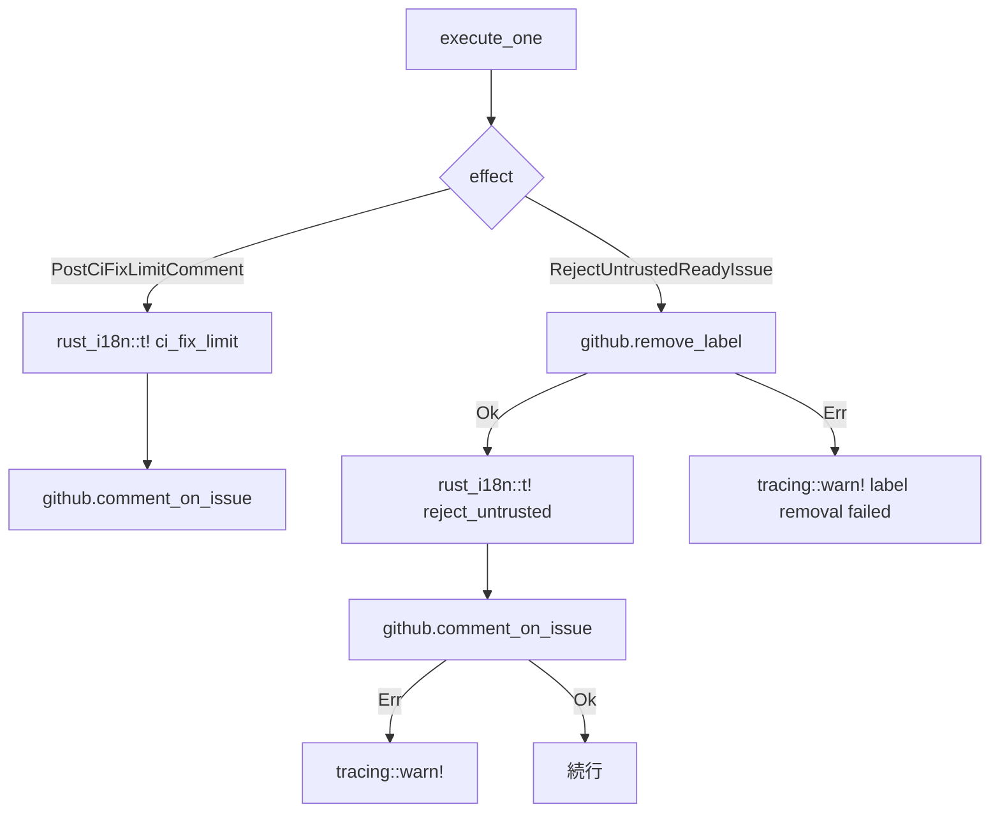

# 設計書

## 概要

本機能は `src/application/polling/execute.rs` に存在する2つの i18n バグを修正し、既存の `rust_i18n` パターンおよびベストエフォートエラーログ規約への準拠を達成します。

**対象ユーザー:** Cupola を非英語環境（特に日本語）で使用するユーザー。GitHub Issue コメントが設定言語で正しく表示されるようになります。

**変更範囲:** `locales/en.yml`、`locales/ja.yml`、`src/application/polling/execute.rs` の3ファイルのみ。新規トレイト・新規コンポーネントは導入しません。

### Goals

- `PostCiFixLimitComment` を `rust_i18n::t!()` に移行し、`config.language` を尊重する
- `RejectUntrustedReadyIssue` を `rust_i18n::t!()` に移行する
- `RejectUntrustedReadyIssue` のコメント投稿エラーを `tracing::warn!()` でログする
- 既存テストを壊さない

### Non-Goals

- 他のエフェクトハンドラの修正
- ロケール追加（en/ja 以外）
- エラーハンドリング全般のリファクタリング

## 要件トレーサビリティ

| 要件 | 概要 | コンポーネント | インターフェース |
|------|------|--------------|----------------|
| 1.1, 1.2 | ロケールキー追加（ci_fix_limit） | locales files | — |
| 1.3, 1.4, 1.5, 1.6 | PostCiFixLimitComment 修正 | execute_one() | rust_i18n::t! |
| 2.1, 2.2, 2.3 | ロケールキー追加（reject_untrusted）+ 修正 | execute_one() / locales files | rust_i18n::t! |
| 3.1, 3.2, 3.3 | RejectUntrustedReadyIssue エラーログ修正 | execute_one() | tracing::warn! |
| 4.1, 4.2, 4.3, 4.4 | テストカバレッジ | execute.rs #[cfg(test)] | MockGitHubClient |

## アーキテクチャ

### 既存アーキテクチャ分析

本修正はアプリケーション層の `execute.rs` 内部の実装詳細にのみ関わります。クリーンアーキテクチャの層構造・ポート定義・依存方向はいずれも変更しません。

- `execute_one()` 関数の `Effect::PostCiFixLimitComment` ブロックと `Effect::RejectUntrustedReadyIssue` ブロックを修正
- `locales/` ディレクトリのロケールファイルにキーを追加

### 変更フロー



### テクノロジースタック

| レイヤー | ライブラリ | 役割 |
|---------|-----------|------|
| i18n | rust-i18n | コメント本文の多言語生成 |
| ログ | tracing | ベストエフォートエラーログ |

## コンポーネントとインターフェース

### サマリー

| コンポーネント | レイヤー | 意図 | 要件カバレッジ | 主要依存 |
|--------------|---------|------|--------------|---------|
| locales/en.yml | インフラ | 英語 i18n キー定義 | 1.1, 2.1 | — |
| locales/ja.yml | インフラ | 日本語 i18n キー定義 | 1.2, 2.2 | — |
| execute_one() | Application | エフェクト実行ロジック | 1.3-1.6, 2.3, 3.1-3.3 | rust_i18n, tracing, GitHubClient |

### Application Layer

#### execute_one() — PostCiFixLimitComment ブロック

| フィールド | 詳細 |
|----------|------|
| Intent | CI 修正上限コメントを i18n メッセージで投稿する |
| Requirements | 1.3, 1.4, 1.5, 1.6 |

**変更前:**
```rust
Effect::PostCiFixLimitComment => {
    let msg = format!(
        "CI fix limit reached ({} cycles). Automatic fixing has stopped.",
        config.max_ci_fix_cycles
    );
    github.comment_on_issue(n, &msg).await?;
}
```

**変更後の設計:**
- `rust_i18n::t!("issue_comment.ci_fix_limit", locale = lang, max_cycles = config.max_ci_fix_cycles)` でメッセージを生成
- `github.comment_on_issue(n, &msg).await?` でコメント投稿（非ベストエフォート呼び出し — `execute_effects` が上位でラップ）

**Contracts**: Service [x]

#### execute_one() — RejectUntrustedReadyIssue ブロック

| フィールド | 詳細 |
|----------|------|
| Intent | 信頼されていないアクターによるラベルを削除し、i18n コメントを投稿。失敗時は warn ログ |
| Requirements | 2.3, 3.1, 3.2, 3.3 |

**変更前:**
```rust
Effect::RejectUntrustedReadyIssue => {
    match github.remove_label(n, "agent:ready").await {
        Ok(()) => {
            let msg = "This issue was labeled `agent:ready` by an untrusted actor. ...".to_string();
            let _ = github.comment_on_issue(n, &msg).await;
        }
        Err(e) => {
            tracing::warn!(issue_number = n, error = %e, "failed to remove agent:ready label");
        }
    }
}
```

**変更後の設計:**
- ラベル削除成功後、`rust_i18n::t!("issue_comment.reject_untrusted", locale = lang)` でメッセージ生成
- コメント投稿は `if let Err(e) = github.comment_on_issue(n, &msg).await { tracing::warn!(...) }` パターン
- `tracing::warn!` のフィールド: `issue_number = n`, `error = %e`, メッセージ文字列

**Contracts**: Service [x]

**Implementation Notes**:
- `let _ = ...` パターンを完全に排除する
- `tracing::warn!` のフィールド構造は `execute_effects()` の既存警告ログと一貫させる

#### locales/en.yml — 追加キー

```yaml
issue_comment:
  ci_fix_limit: "CI fix limit reached (%{max_cycles} cycles). Automatic fixing has stopped."
  reject_untrusted: "This issue was labeled `agent:ready` by an untrusted actor. Only trusted collaborators may trigger automatic processing."
```

#### locales/ja.yml — 追加キー

```yaml
issue_comment:
  ci_fix_limit: "CI修正上限に到達しました（%{max_cycles} サイクル）。自動修正が停止しました。"
  reject_untrusted: "このissueは信頼できないアクターによって `agent:ready` ラベルが付けられました。自動処理をトリガーできるのは信頼できるコラボレーターのみです。"
```

## エラーハンドリング

### エラー戦略

| エラー | 対応 |
|-------|------|
| `github.comment_on_issue()` 失敗（PostCiFixLimitComment） | `?` で伝播 → `execute_effects()` のベストエフォートラッパーが `tracing::warn!` でログ |
| `github.remove_label()` 失敗（RejectUntrustedReadyIssue） | 既存の `tracing::warn!` を維持 |
| `github.comment_on_issue()` 失敗（RejectUntrustedReadyIssue） | エフェクト内で `if let Err(e)` + `tracing::warn!` でログ、処理継続 |

### モニタリング

エラーは `tracing::warn!` 構造化ログとして記録され、既存のログファイル出力基盤（`tracing-appender`）に乗る。

## テスト戦略

### ユニットテスト

1. `PostCiFixLimitComment` — 日本語ロケール時に日本語メッセージが投稿されること
2. `PostCiFixLimitComment` — `%{max_cycles}` が `config.max_ci_fix_cycles` の値に置換されること
3. `RejectUntrustedReadyIssue` — ラベル削除成功後に i18n コメントが投稿されること
4. `RejectUntrustedReadyIssue` — コメント投稿失敗時に `tracing::warn!` が呼ばれること（`let _` が使われないこと）
5. 既存テスト全件がパスすること

### 統合テスト

新規統合テストは不要。既存 `#[cfg(test)] mod tests` ブロック内のユニットテストで十分。

## セキュリティ考慮事項

対象外（コメント本文の言語変更のみ）。

## 移行戦略

ロケールキーの追加と Rust コードの変更は同一コミットで実施。デプロイ後の動作変化は、コメント言語が `config.language` に準拠するようになること。ロールバックが必要な場合は当該コミットを revert する。
