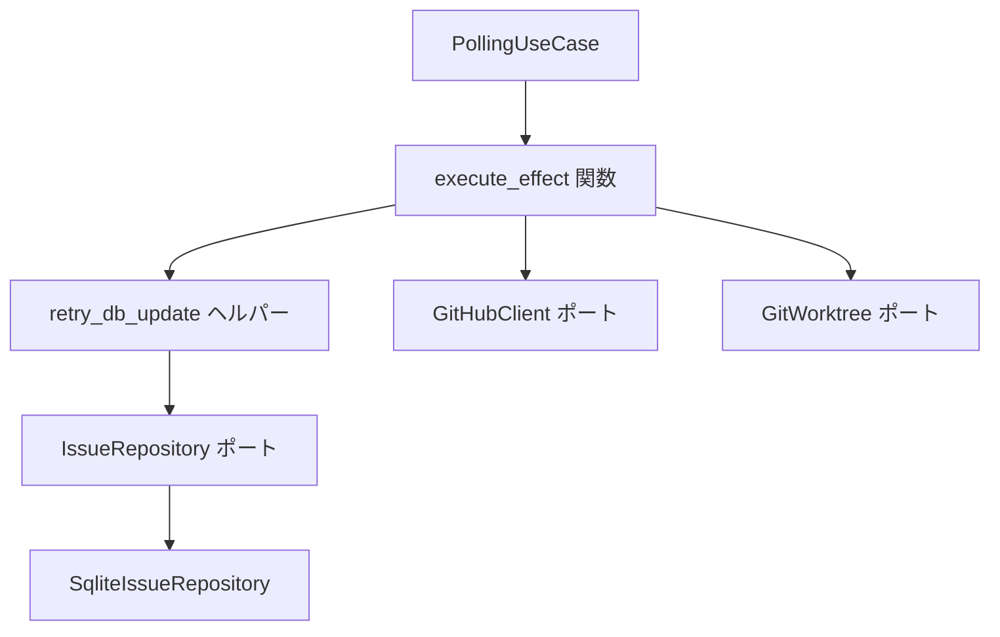
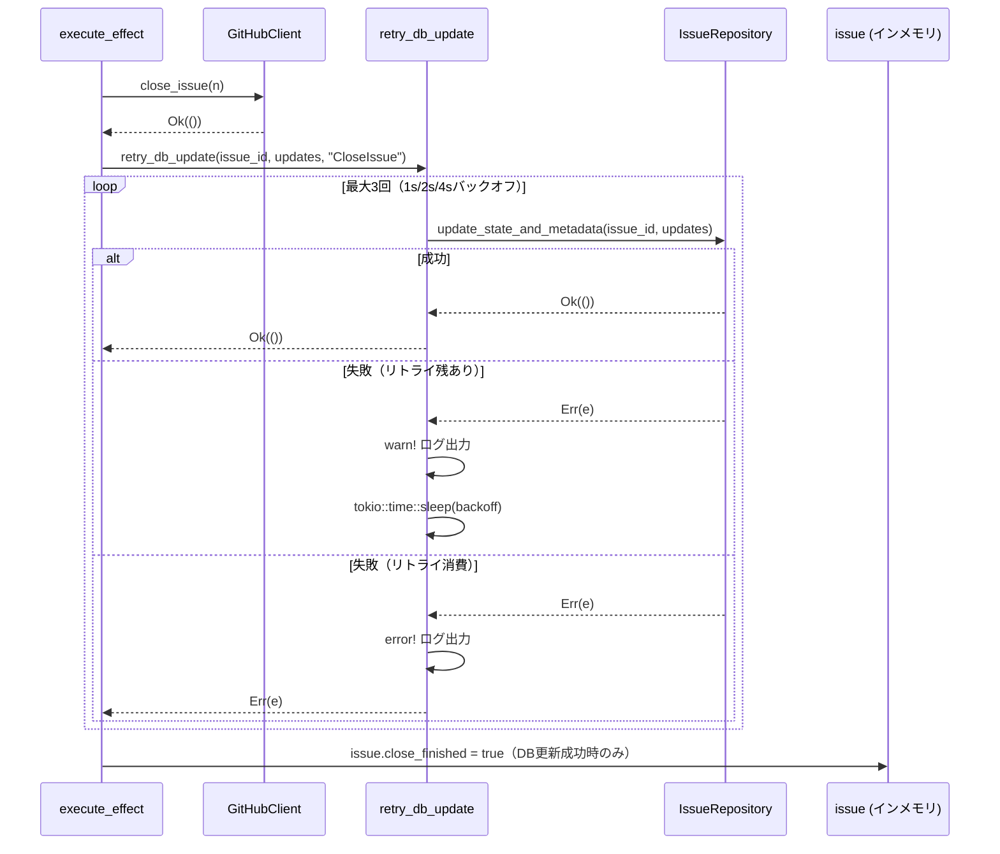

# 設計書

## Overview

本設計は、`CloseIssue` および `CleanupWorktree` エフェクトハンドラにおける GitHub API / Git 操作成功後の DB 更新失敗問題を修正する。

DB 更新は一時的な障害（ロックタイムアウト、ディスクフル等）によって失敗する場合があり、現状の実装では失敗時にインメモリ状態が更新されないため、次のポーリングサイクルでエフェクトが再試行されずステートマシンが不整合状態に陥る。本修正では、DB 更新呼び出しを指数バックオフ付きリトライでラップし、部分的失敗を構造化ログで観測可能にする。

### Goals

- `CloseIssue` における `Cancelled→Idle` 遷移ブロックを解消する
- `CleanupWorktree` における意図しない worktree 再削除ループを解消する
- 一時的な DB 障害に対して自動リカバリを提供する
- 部分的失敗（API 成功 + DB 永続失敗）を `error` ログで観測可能にする

### Non-Goals

- `IssueRepository::update_state_and_metadata` 自体のトランザクション化
- 他エフェクト（`SpawnProcess` 等）へのリトライ適用
- DB 障害の根本原因の検出・自動修復

## 要件トレーサビリティ

| Requirement | Summary | Components | Interfaces | Flows |
|-------------|---------|------------|------------|-------|
| 1.1 | CloseIssue DB 更新リトライ | `retry_db_update` ヘルパー | `IssueRepository::update_state_and_metadata` | CloseIssue フロー |
| 1.2 | CleanupWorktree DB 更新リトライ | `retry_db_update` ヘルパー | `IssueRepository::update_state_and_metadata` | CleanupWorktree フロー |
| 1.3 | 全リトライ失敗時のエラー返却 | `retry_db_update` ヘルパー | — | 両エフェクトフロー |
| 1.4 | リトライロジックの再利用 | `retry_db_update` ヘルパー | — | — |
| 1.5 | 非同期スリープによるノンブロッキング | `retry_db_update` ヘルパー | `tokio::time::sleep` | — |
| 2.1 | リトライ警告ログ | `retry_db_update` ヘルパー | `tracing::warn!` | — |
| 2.2 | 永続失敗エラーログ | `retry_db_update` ヘルパー | `tracing::error!` | — |
| 2.3 | 構造化ログフィールド | `retry_db_update` ヘルパー | `tracing` | — |
| 3.1 | CloseIssue 部分失敗ユニットテスト | `execute.rs` テスト | MockIssueRepository | — |
| 3.2 | CleanupWorktree 永続失敗ユニットテスト | `execute.rs` テスト | MockIssueRepository | — |
| 3.3 | リトライヘルパーユニットテスト | `execute.rs` テスト | — | — |
| 3.4 | インメモリ状態不変検証テスト | `execute.rs` テスト | MockIssueRepository | — |

## Architecture

### Existing Architecture Analysis

`execute.rs`（`src/application/polling/`）はアプリケーション層に属し、各エフェクトの実行ロジックを担う。`IssueRepository` ポートトレイトを介して DB 操作を行い、具体的な実装（`SqliteIssueRepository`）には依存しない。

現状の `CloseIssue` / `CleanupWorktree` 処理は以下の 3 ステップで構成される:
1. 外部操作（GitHub API / Git コマンド）
2. `issue_repo.update_state_and_metadata()` による DB 更新
3. `issue.xxx = value` によるインメモリ状態更新

ステップ 2 が失敗すると `?` 演算子でエラーが伝播し、ステップ 3 が実行されない。

### Architecture Pattern & Boundary Map



**Architecture Integration**:
- 選択パターン: アプリケーション層プライベートヘルパー関数（`execute.rs` 内）
- 既存パターン維持: `IssueRepository` ポートへの依存はそのまま維持
- 新規コンポーネント: `retry_db_update` — DB 更新のリトライロジックをカプセル化
- Clean Architecture 準拠: アプリケーション層内での変更のみ、アダプター層への依存なし

### Technology Stack

| Layer | Choice / Version | Role in Feature | Notes |
|-------|------------------|-----------------|-------|
| 非同期ランタイム | tokio (既存) | 非同期スリープ (`tokio::time::sleep`) | 既存の tokio を使用 |
| ログ | tracing (既存) | 構造化ログ出力 (`warn!`, `error!`) | 既存の tracing を使用 |

## System Flows

### CloseIssue エフェクト（修正後）



**Key Decisions**: 
- `retry_db_update` 成功時のみ `issue.close_finished = true` を更新（インメモリ/DB 一貫性保証）
- リトライ失敗時はエラーを返し、ポーリングループが次サイクルでエフェクト全体を再試行

### CleanupWorktree エフェクト（修正後）

CloseIssue と同一のリトライパターンを適用。`worktree.remove()` 成功後に `retry_db_update` を呼び出し、成功時のみ `issue.worktree_path = None` を更新する。

## Components and Interfaces

### コンポーネントサマリー

| Component | Domain/Layer | Intent | Req Coverage | Key Dependencies | Contracts |
|-----------|--------------|--------|--------------|------------------|-----------|
| `retry_db_update` | application/polling | DB更新を指数バックオフでリトライ | 1.1–1.5, 2.1–2.3 | IssueRepository (P0), tokio::time (P0), tracing (P1) | Service |
| `execute_effect` (修正) | application/polling | CloseIssue/CleanupWorktree ハンドラでリトライヘルパーを使用 | 1.1, 1.2, 3.1–3.4 | retry_db_update (P0) | — |

### application/polling

#### `retry_db_update` ヘルパー関数

| Field | Detail |
|-------|--------|
| Intent | DB 更新を指数バックオフ付きで最大 3 回リトライし、部分的失敗をログ出力する |
| Requirements | 1.1, 1.2, 1.3, 1.4, 1.5, 2.1, 2.2, 2.3 |

**Responsibilities & Constraints**

- DB 更新クロージャを受け取り、失敗時に指数バックオフ（1s, 2s, 4s）でリトライする
- リトライ試行ごとに `warn!` ログ（Issue 番号・エフェクト種別・試行回数・エラー内容）を出力する
- 全リトライ消費後は `error!` ログを出力し、最後のエラーを返す
- 成功・失敗に関わらず呼び出し元はインメモリ状態を自身で更新する（ヘルパーはインメモリ状態を変更しない）
- `execute.rs` 内のプライベート非同期関数として実装する

**Dependencies**

- Inbound: `execute_effect` 関数 — DB 更新クロージャと Issue 番号・エフェクト種別を渡す (P0)
- Outbound: `IssueRepository::update_state_and_metadata` — DB 更新本体 (P0)
- External: `tokio::time::sleep` — 非同期バックオフスリープ (P0)
- External: `tracing::warn!` / `tracing::error!` — 構造化ログ出力 (P1)

**Contracts**: Service [x]

##### Service Interface

```rust
// application/polling/execute.rs 内プライベート関数
async fn retry_db_update<F, Fut>(
    issue_number: u64,
    effect_name: &str,
    db_update: F,
) -> anyhow::Result<()>
where
    F: Fn() -> Fut,
    Fut: std::future::Future<Output = anyhow::Result<()>>,
```

- Preconditions: `db_update` は何度呼び出しても副作用が同じ（冪等）であること
- Postconditions: 成功時は `Ok(())`、全リトライ失敗時は最後のエラーを `Err` で返す
- Invariants: バックオフ遅延は `[1s, 2s, 4s]` の固定スケジュール（最大 3 回）

**Implementation Notes**

- Integration: `CloseIssue` では `github.close_issue()` 後、`CleanupWorktree` では `worktree.remove()` 後に呼び出す
- Validation: バックオフ配列をコンパイル時定数 `const RETRY_DELAYS: [Duration; 3]` として定義
- Risks: リトライ中の合計レイテンシは最大 7 秒。通常のポーリングサイクル（数十秒）に対して許容範囲内

## Error Handling

### Error Strategy

- DB 更新失敗は一時的（transient）エラーとして扱い、リトライで対処する
- 永続的（permanent）な DB 障害は全リトライ消費後にエラーとして返し、ポーリングループに委ねる
- GitHub API / Git 操作の失敗はリトライ対象外（従来通り即座にエラー返却）

### Error Categories and Responses

**System Errors (DB 更新失敗)**:
- 一時的障害（ロックタイムアウト、ディスクフル）→ 指数バックオフリトライ
- 全リトライ失敗 → `error!` ログ + `Err` 返却 → 次のポーリングサイクルでエフェクト全体を再試行

### Monitoring

- `tracing::warn!` フィールド: `issue_number`, `effect`, `attempt`, `error`
- `tracing::error!` フィールド: `issue_number`, `effect`, `max_attempts`, `error`
- これらのログは既存の `tracing-appender` による日付別ファイル出力に自動的に含まれる

## Testing Strategy

### Unit Tests

1. `retry_db_update` — クロージャが 1 回失敗後に成功するケースの検証（2 回呼ばれることを確認）
2. `retry_db_update` — クロージャが 3 回失敗するケースの検証（`Err` が返ること）
3. `retry_db_update` — バックオフ遅延の呼び出し順序の検証（実際の sleep は短縮してテスト）
4. `CloseIssue` ハンドラ — DB 更新 1 回失敗後成功時に `issue.close_finished = true` が更新されることを検証
5. `CloseIssue` ハンドラ — DB 更新永続失敗時に `issue.close_finished` が変更されないことを検証
6. `CleanupWorktree` ハンドラ — DB 更新永続失敗時に `issue.worktree_path` が変更されないことを検証

### Integration Tests

既存の `tests/` 配下の統合テストパターンに従い、`MockIssueRepository` を使用してエフェクト実行をエンドツーエンドで検証する。
