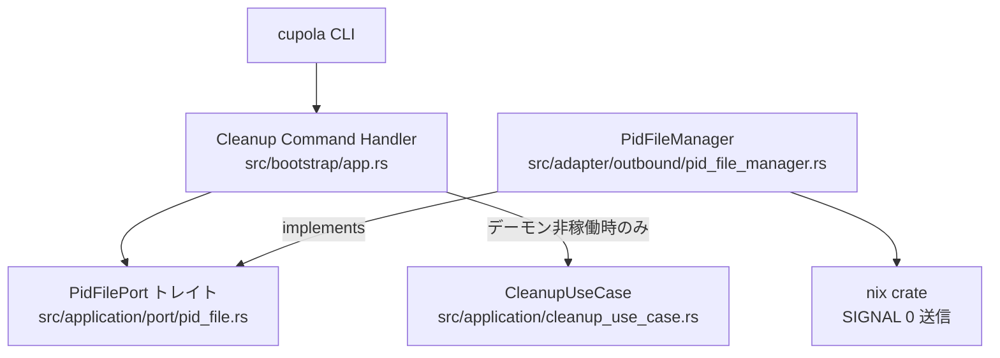
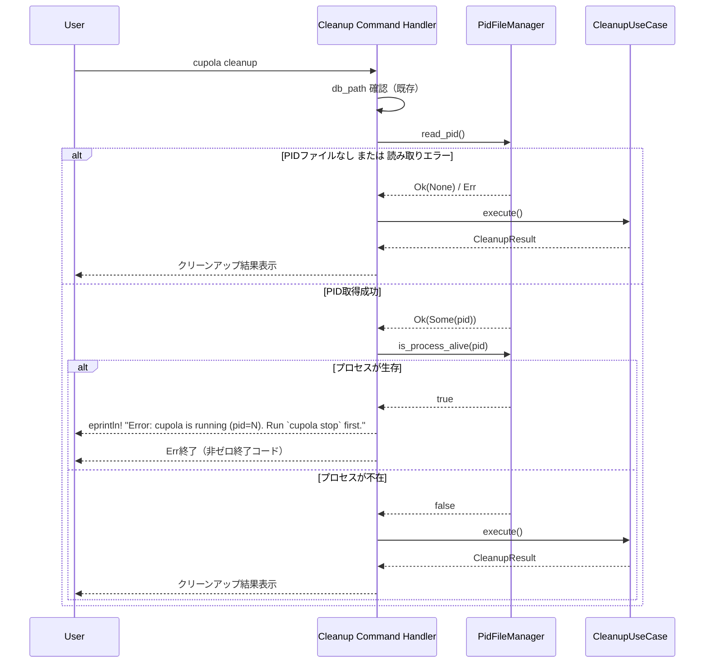

# Design Document

## Overview

`cupola cleanup` コマンドがデーモン稼働中にエラー終了すべきというドキュメント仕様と実装のミスマッチを修正する。現状の実装は警告メッセージを表示するだけでクリーンアップを継続するため、データ破損リスクがある。

**Purpose**: ドキュメント（`docs/commands/cleanup.md`）が定義する「デーモン稼働中はエラーで終了する」動作を `src/bootstrap/app.rs` の `Command::Cleanup` ハンドラに実装する。  
**Users**: `cupola cleanup` を実行する開発者・オペレーター。  
**Impact**: デーモン稼働中に `cupola cleanup` を実行した場合の動作が「警告のみ・処理継続」から「エラー終了・処理中止」に変わる。

### Goals

- デーモン稼働中の `cupola cleanup` 実行をエラー終了させる
- ドキュメント定義のエラーメッセージ形式 `"Error: cupola is running (pid={pid}). Run \`cupola stop\` first."` を正確に出力する
- デーモン非稼働時の既存のクリーンアップ動作を維持する

### Non-Goals

- `CleanupUseCase` の変更（アプリケーション層の修正は行わない）
- ステールPIDファイルの自動クリーンアップ（`status` コマンドの挙動とは異なる）
- 新規依存クレートの追加

## Requirements Traceability

| Requirement | Summary | Components | Flows |
|-------------|---------|------------|-------|
| 1.1 | PIDファイルからPID読み取り | Cleanup Command Handler | PID読み取りフロー |
| 1.2 | プロセス生存確認 | Cleanup Command Handler | プロセスチェックフロー |
| 1.3 | PIDファイル不在時は継続 | Cleanup Command Handler | 正常継続フロー |
| 1.4 | PIDファイル読み取りエラー時は継続 | Cleanup Command Handler | 正常継続フロー |
| 2.1 | エラーメッセージをstderrに出力 | Cleanup Command Handler | エラー終了フロー |
| 2.2 | 非ゼロ終了コードで終了 | Cleanup Command Handler | エラー終了フロー |
| 2.3 | CleanupUseCase を呼び出さない | Cleanup Command Handler | エラー終了フロー |
| 3.1 | デーモン非稼働時は既存処理を継続 | Cleanup Command Handler | 正常継続フロー |
| 3.2 | ステールPIDファイル時は継続 | Cleanup Command Handler | 正常継続フロー |

## Architecture

### Existing Architecture Analysis

`Command::Cleanup` ハンドラは bootstrap 層（`src/bootstrap/app.rs`）に配置されている。bootstrap 層は全具体型を知る唯一の層であり、インフラ初期化・DI結線・コマンドルーティングを担う。

現行の `status` コマンド（`handle_status` 関数）がデーモンチェックの正しい参照実装となっている：

```
read_pid() → is_process_alive(pid) → 情報表示
```

`cleanup` では同様のチェックを行いつつ、デーモン稼働確認時には `Err(...)` で早期リターンする。

### Architecture Pattern & Boundary Map



**Architecture Integration**:
- 選択パターン: bootstrap 層で既存の `PidFileManager` を直接インスタンス化（`status` コマンドの同等パターンに準拠）
- 既存のクリーン・アーキテクチャ境界を維持（`PidFilePort` トレイトを介してアダプタを使用）
- 新規コンポーネントなし。`Command::Cleanup` ハンドラの修正のみ

### Technology Stack

| Layer | Choice | Role | Notes |
|-------|--------|------|-------|
| Bootstrap | Rust / `src/bootstrap/app.rs` | CLIコマンドルーティング・DI結線 | 修正対象ファイル |
| Adapter outbound | `PidFileManager` | PIDファイル読み取り・プロセス生存確認 | 既存実装をそのまま使用 |
| Infrastructure | `nix` crate | POSIX `kill(pid, 0)` によるプロセス存在確認 | 既存依存 |

## System Flows



## Components and Interfaces

| Component | Layer | Intent | Req Coverage | Key Dependencies |
|-----------|-------|--------|--------------|------------------|
| Cleanup Command Handler | Bootstrap | クリーンアップコマンドの前提チェック・処理実行 | 1.1〜3.2 全件 | PidFileManager (P0), CleanupUseCase (P0) |

### Bootstrap Layer

#### Cleanup Command Handler

| Field | Detail |
|-------|--------|
| Intent | `cupola cleanup` 実行前のデーモン稼働チェック、エラー終了または処理委譲 |
| Requirements | 1.1, 1.2, 1.3, 1.4, 2.1, 2.2, 2.3, 3.1, 3.2 |

**Responsibilities & Constraints**
- `PidFileManager` をインスタンス化してデーモン稼働状態を確認する
- デーモン稼働確認時は `eprintln!` でエラーメッセージを stderr に出力し `Err(...)` を返す
- デーモン非稼働時（PIDなし・ステールPID・読み取りエラー）は既存のクリーンアップ処理を継続する
- エラーメッセージ形式はドキュメント定義に厳密に従う: `"Error: cupola is running (pid={pid}). Run \`cupola stop\` first."`

**Dependencies**
- Outbound: `PidFileManager` — PIDファイル読み取り・プロセス生存確認 (P0)
- Outbound: `CleanupUseCase` — クリーンアップ処理本体（デーモン非稼働時のみ） (P0)

**Contracts**: Service [x]

##### Service Interface

修正後の処理フロー（疑似コード、実装詳細は `research.md` 参照）:

```
Command::Cleanup { config } =>
  1. db_path を構成・存在チェック（既存）
  2. pid_path = config.parent() / "cupola.pid"
  3. pid_manager = PidFileManager::new(pid_path)
  4. if let Ok(Some(pid)) = pid_manager.read_pid()
       if pid_manager.is_process_alive(pid)
         eprintln!("Error: cupola is running (pid={pid}). Run `cupola stop` first.")
         return Err(anyhow::anyhow!("daemon is running"))
  5. // 既存のクリーンアップ処理（変更なし）
     db = SqliteConnection::open(&db_path)
     uc = CleanupUseCase::new(...)
     result = uc.execute().await?
     // 結果表示（変更なし）
```

- Preconditions: `config` パスが有効で、PIDファイルパスが構成可能であること
- Postconditions: デーモン稼働時は非ゼロ終了コード・エラーメッセージ出力、非稼働時はクリーンアップ完了

**Implementation Notes**
- Integration: `PidFileManager::new()` の引数は `config.parent().unwrap_or_else(|| Path::new(".")).join("cupola.pid")` — `db_path` 構成と同パターン
- Validation: `read_pid()` のエラー・`None` は安全側（非稼働）に倒す
- Risks: PIDファイル読み取りエラーを無視する設計だが、これは意図的（ファイルシステム問題でクリーンアップをブロックしない）

## Error Handling

### Error Strategy

| 状態 | 処理 | 出力先 | 終了コード |
|------|------|--------|-----------|
| デーモン稼働中 | `Err(anyhow::anyhow!("daemon is running"))` を返す | stderr（`eprintln!`） | 非ゼロ |
| PIDファイルなし | 非稼働とみなし処理継続 | なし | 0（成功時） |
| PIDファイル読み取りエラー | 非稼働とみなし処理継続 | なし | 0（成功時） |
| ステールPIDファイル | 非稼働とみなし処理継続 | なし | 0（成功時） |

エラーは `main()` の `anyhow::Result` で捕捉され、プロセスが非ゼロ終了コードで終了する。

## Testing Strategy

### Unit Tests

`handle_status` 関数と同様のパターンで、モック `PidFilePort` を注入してテスト可能にする。ただし現行の `Command::Cleanup` ハンドラは `handle_status` とは異なりインライン実装のため、リファクタリングを伴わない単体テストは限定的。

- デーモン稼働中: `read_pid()` が `Some(pid)` を返し、`is_process_alive(pid)` が `true` を返す場合にエラーが発生すること
- デーモン非稼働（PIDなし）: `read_pid()` が `None` を返す場合にエラーが発生しないこと
- ステールPID: `read_pid()` が `Some(pid)` を返し、`is_process_alive(pid)` が `false` を返す場合にエラーが発生しないこと

### Integration Tests

1. `tests/` 配下のインテグレーションテストで、モックの `PidFilePort` を使用した `cleanup` ロジックを検証
2. デーモン稼働確認後に `CleanupUseCase` が呼び出されないことをアサート
3. エラーメッセージが正確な形式であることを検証: `"Error: cupola is running (pid={pid}). Run \`cupola stop\` first."`
4. PIDファイルが存在しない場合に正常にクリーンアップが実行されることを検証
