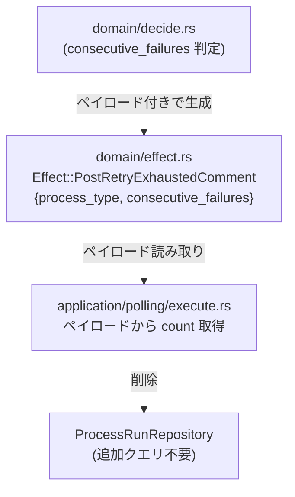
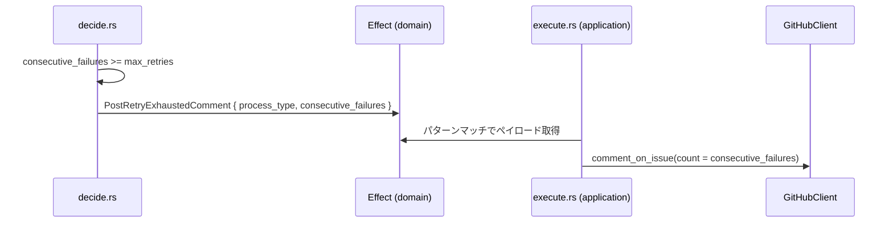

# 設計ドキュメント

## 概要

`PostRetryExhaustedComment` エフェクトが GitHub コメントに表示する失敗回数が、実際のリトライ上限トリガー条件（プロセスタイプごとの連続失敗数）と乖離している問題を修正する。

現在の実装は `count_total_failures()` により全プロセスタイプを横断した累計失敗数を使用しているが、ドキュメント（`docs/architecture/effects.md`）および決定ロジック（`decide.rs`）は「連続失敗数（consecutive failures）」を根拠としている。本修正は `Effect::PostRetryExhaustedComment` バリアントにペイロードを追加し、ドメイン層が保持している正確な値を実行フェーズへ伝達する。

### Goals

- `PostRetryExhaustedComment` コメントに表示する `%{count}` を、上限到達プロセスタイプの連続失敗数に統一する
- ドメイン層（`decide.rs`）が決定時点で保持する情報をエフェクトペイロードとして渡し、追加 DB クエリを不要とする
- `docs/architecture/effects.md` の記述とコードの動作を一致させる

### Non-Goals

- コメントテンプレート文言（`locales/ja.yml`）の変更（%{count} の意味は正確化されるが、テンプレート文字列は変えない）
- `max_retries` 設定値自体の変更
- DesignFix / ImplFix 以外のプロセスタイプに対する新規上限ロジックの追加

---

## アーキテクチャ

### 既存アーキテクチャの分析

本システムは Clean Architecture を採用しており、依存は内向きのみ。

- **`domain/effect.rs`**: `Effect` 列挙型を定義。現在 `PostRetryExhaustedComment` はユニット型バリアント（ペイロードなし）
- **`domain/decide.rs`**: 純粋関数群。`ProcessSnapshot.consecutive_failures` を参照してリトライ上限を判定し `go_cancelled_retry_exhausted` を呼ぶ。この時点で `process_type` と `consecutive_failures` は既知
- **`application/polling/execute.rs`**: エフェクトを実行する非同期関数群。現在 `count_total_failures` を呼んで回数を取得している

### アーキテクチャパターンと境界マップ



**変更の境界**:
- `domain` 層: `Effect` バリアントの変更、`go_cancelled_retry_exhausted` シグネチャ変更
- `application` 層: `execute.rs` で `count_total_failures` を廃止し、ペイロードを直接利用

### 技術スタック

| レイヤー | 対象 | 変更内容 |
|----------|------|----------|
| domain | `effect.rs` | `PostRetryExhaustedComment` バリアントにフィールド追加 |
| domain | `decide.rs` | `go_cancelled_retry_exhausted` シグネチャ変更・各呼び出し箇所の更新 |
| application | `execute.rs` | ペイロードからの値読み取りへ変更、`count_total_failures` 削除 |

---

## システムフロー



---

## 要件トレーサビリティ

| 要件 | サマリー | コンポーネント | フロー |
|------|----------|----------------|--------|
| 1.1 | 連続失敗数をコメント回数として使用 | `Effect`, `execute.rs` | PostRetryExhaustedComment 実行 |
| 1.2 | count_total_failures を使用しない | `execute.rs` | count_total_failures 削除 |
| 1.3 | 各プロセスタイプで正しい count を渡す | `decide.rs` | go_cancelled_retry_exhausted 更新 |
| 2.1 | Effect ペイロードに process_type / consecutive_failures | `effect.rs` | バリアント定義変更 |
| 2.2 | decide.rs が正しい値をエフェクトに渡す | `decide.rs` | go_cancelled_retry_exhausted 呼び出し更新 |
| 2.3 | execute.rs が追加 DB クエリなしで取得 | `execute.rs` | ペイロード読み取り |
| 3.1 | ドキュメントと実装の一致 | `docs/architecture/effects.md` | — |
| 3.2 | コード側を正しい挙動に合わせる | `decide.rs`, `execute.rs` | — |
| 4.1 | ユニットテストで連続失敗数を検証 | `execute.rs` tests | — |
| 4.2 | decide.rs テストで各タイプを検証 | `decide.rs` tests | — |
| 4.3 | count_total_failures 削除後の CI 通過 | `execute.rs` | — |

---

## コンポーネントとインターフェース

### コンポーネントサマリー

| コンポーネント | レイヤー | 役割 | 要件カバレッジ | 変更種別 |
|----------------|----------|------|----------------|----------|
| `Effect::PostRetryExhaustedComment` | domain | ペイロード付きエフェクトバリアント | 2.1 | バリアント型変更 |
| `go_cancelled_retry_exhausted` | domain | エフェクト生成ヘルパー | 2.2 | シグネチャ変更 |
| `execute_effects` (PostRetryExhaustedComment アーム) | application | コメント投稿 | 1.1, 1.2, 2.3 | ロジック変更 |
| `count_total_failures` | application | 累計失敗数集計（削除対象） | 1.2 | 削除 |

---

### Domain

#### Effect::PostRetryExhaustedComment

| フィールド | 詳細 |
|------------|------|
| Intent | リトライ上限到達時に GitHub コメントを投稿するトリガー情報を保持 |
| Requirements | 2.1 |

**責務と制約**
- `process_type: ProcessRunType`: 上限に達したプロセスタイプ
- `consecutive_failures: u32`: そのプロセスタイプの連続失敗数（`decide.rs` が判定時に参照した値と同一）
- `ProcessRunType` はドメイン型であり、外部依存なし

**変更前後**

```
// 変更前
Effect::PostRetryExhaustedComment  // ユニット型

// 変更後
Effect::PostRetryExhaustedComment {
    process_type: ProcessRunType,
    consecutive_failures: u32,
}
```

**依存**
- Inbound: `decide.rs` — エフェクト生成
- Outbound: `execute.rs` — ペイロード読み取り

**Contracts**: State [ ✓ ]

**実装上の注意**
- `Effect` は `Clone + PartialEq + Eq` を derives。`ProcessRunType` が同 derives を持つことを確認（既存のまま問題なし）
- `is_best_effort()` と `priority()` のパターンマッチを更新する

---

#### go_cancelled_retry_exhausted

| フィールド | 詳細 |
|------------|------|
| Intent | `PostRetryExhaustedComment` と `CloseIssue` を effects に追加し `State::Cancelled` を返す |
| Requirements | 2.2 |

**変更前後**

```
// 変更前
fn go_cancelled_retry_exhausted(effects: &mut Vec<Effect>) -> State

// 変更後
fn go_cancelled_retry_exhausted(
    effects: &mut Vec<Effect>,
    process_type: ProcessRunType,
    consecutive_failures: u32,
) -> State
```

**各呼び出し箇所（decide.rs 内）**

| 呼び出し元 | 参照する ProcessSnapshot フィールド |
|------------|-------------------------------------|
| `decide_init_running` (line 147) | `snap.processes.init.consecutive_failures` |
| `decide_design_running` (line 204) | `snap.processes.design.consecutive_failures` |
| `decide_impl_running` (line 558) | `snap.processes.impl_.consecutive_failures` |
| その他（line 371, 738） | 対応する `ProcessSnapshot.consecutive_failures` |

---

### Application

#### execute_effects — PostRetryExhaustedComment アーム

| フィールド | 詳細 |
|------------|------|
| Intent | エフェクトペイロードから `consecutive_failures` を読み取り GitHub コメントを投稿 |
| Requirements | 1.1, 1.2, 2.3 |

**変更前後**

```
// 変更前
Effect::PostRetryExhaustedComment => {
    let count = count_total_failures(process_repo, issue.id).await;
    // ...
}

// 変更後
Effect::PostRetryExhaustedComment { consecutive_failures, .. } => {
    let count = consecutive_failures;
    // find_last_error は引き続き使用
}
```

**実装上の注意**
- `count_total_failures` 関数は削除する（dead code 警告回避）
- `find_last_error` は継続使用（最後のエラーメッセージ取得）

---

## エラー処理

### エラー戦略

本修正は既存のエラー処理パスを変更しない。`PostRetryExhaustedComment` は `is_best_effort() = true` であり、失敗してもポーリングチェーンは継続する。

---

## テスト戦略

### ユニットテスト

1. **`effect.rs`**: `PostRetryExhaustedComment { process_type, consecutive_failures }` の構築・`priority()`・`is_best_effort()` が正しい値を返すこと（要件 2.1）
2. **`decide.rs`**:
   - Init が `consecutive_failures >= max_retries` のとき `PostRetryExhaustedComment { process_type: Init, consecutive_failures: N }` が生成されること（要件 2.2, 1.3）
   - Design / Impl でも同様（要件 1.3）
3. **`execute.rs`**:
   - `PostRetryExhaustedComment { process_type: Design, consecutive_failures: 3 }` を渡したとき、GitHub コメントに `count = 3` が渡されること（要件 1.1, 4.1）
   - `count_total_failures` が存在しないこと（要件 1.2, 4.3）

### 統合テスト

- 既存の `decide.rs` テスト群が新シグネチャでコンパイル・パスすること
- CI (`cargo clippy -- -D warnings`, `cargo test`) が全通過すること（要件 4.3）
