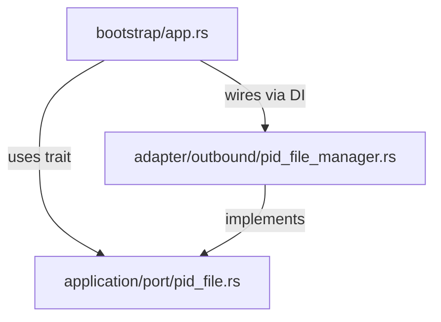
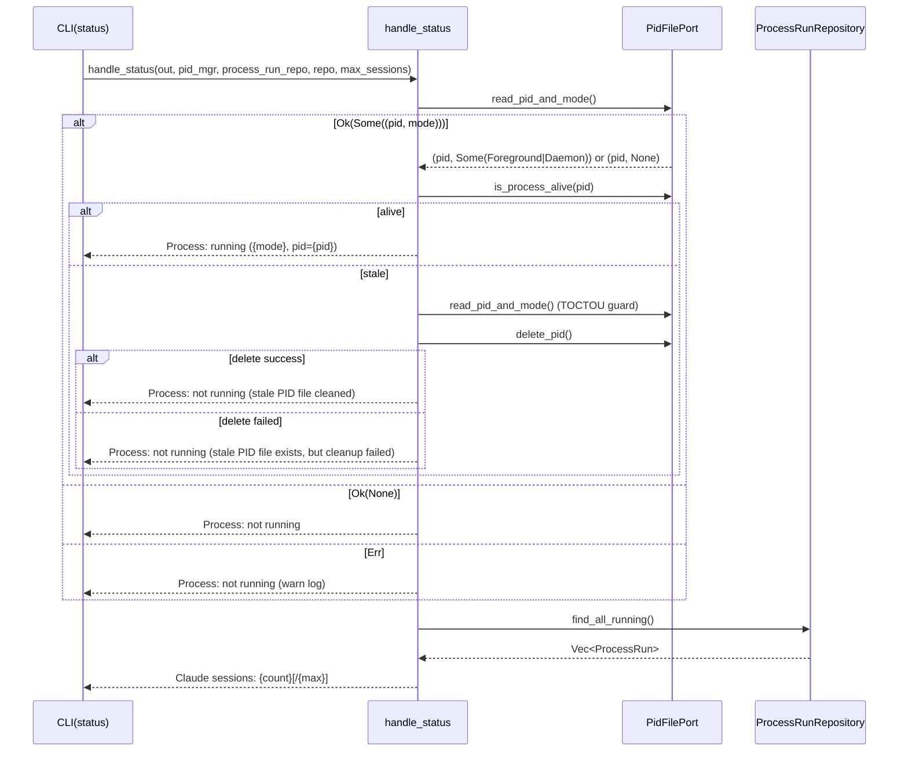

# 設計ドキュメント

## 概要

本機能は、PIDファイルフォーマットの不一致および `status` コマンド出力ラベル誤りという3つのバグを修正する。ドキュメント仕様に従い、PIDファイルを `{pid}\n{mode}` の2行フォーマットに拡張し、`status` コマンドの出力プレフィックス・モード表示・セッション数ラベルを正しく整合させる。

対象ユーザーは Cupola を運用する開発者であり、`cupola status` コマンドによってデーモンの起動モード（foreground/daemon）を正確に把握できることが期待される。

### Goals

- `PidFilePort` トレイトにモード付き書き込み・読み込みメソッドを追加する
- `status` コマンド出力を `Process:` プレフィックスと起動モード表示に修正する
- `Claude sessions:` ラベルを使用してセッション数を表示する
- レガシーPIDファイル（1行フォーマット）を後方互換的に処理する
- `handle_status` の `running_count` ハードコード（`TODO(phase 6)`）を解消し、`process_runs` テーブルの `state = 'running'` レコード数を実カウントで表示する

### Non-Goals

- `write_pid` / `read_pid` メソッドの削除（後方互換性のため残存）
- 既存PIDファイルの強制的な移行・削除

## 要件トレーサビリティ

| 要件 | サマリー | コンポーネント | インターフェース | フロー |
|------|---------|--------------|--------------|------|
| 1.1 | ProcessMode 型定義 | PidFilePort | ProcessMode enum | — |
| 1.2 | foreground 起動時の2行書き込み | PidFileManager, app.rs | write_pid_with_mode | — |
| 1.3 | daemon 起動時の2行書き込み | PidFileManager, app.rs | write_pid_with_mode | — |
| 1.4 | PIDとモードの読み取り | PidFileManager | read_pid_and_mode | — |
| 1.5 | レガシー1行フォーマットの後方互換 | PidFileManager | read_pid_and_mode | — |
| 1.6 | ファイル不在時 Ok(None) | PidFileManager | read_pid_and_mode | — |
| 1.7 | 不正内容のエラー返却 | PidFileManager | read_pid_and_mode | — |
| 2.1 | Process: running (foreground, ...) | handle_status | read_pid_and_mode | Status Flow |
| 2.2 | Process: running (daemon, ...) | handle_status | read_pid_and_mode | Status Flow |
| 2.3 | Process: running (unknown, ...) | handle_status | read_pid_and_mode | Status Flow |
| 2.4 | Process: not running | handle_status | read_pid_and_mode | Status Flow |
| 2.5 | Process: not running (stale cleaned) | handle_status | delete_pid | Status Flow |
| 2.6 | Process: not running (cleanup failed) | handle_status | delete_pid | Status Flow |
| 3.1 | Claude sessions: alive/max | handle_status | — | — |
| 3.2 | Claude sessions: alive | handle_status | — | — |
| 3.3 | running_count を process_runs テーブルから取得 | handle_status | find_all_running | — |

## アーキテクチャ

### 既存アーキテクチャ分析

本プロジェクトは Clean Architecture（4層）を採用しており、依存関係は内側にのみ向かう。

- `application/port/pid_file.rs` — `PidFilePort` トレイト定義（アプリケーション層）
- `adapter/outbound/pid_file_manager.rs` — `PidFileManager` 実装（アダプター層）
- `bootstrap/app.rs` — 起動時の `write_pid` 呼び出し、`handle_status` 関数（ブートストラップ層）

### アーキテクチャ図



**変更対象**:
- `Port`: `ProcessMode` enum と `write_pid_with_mode` / `read_pid_and_mode` メソッドをトレイトに追加
- `Manager`: 新メソッドを実装、レガシー1行フォーマットの後方互換処理を追加
- `Bootstrap`: `write_pid` → `write_pid_with_mode` への呼び出し変更、`handle_status` の出力ロジック修正

### テクノロジースタック

| レイヤー | 技術 | 役割 |
|---------|------|------|
| アプリケーション層（ポート） | Rust trait + enum | `ProcessMode` 型と拡張トレイト定義 |
| アダプター層（outbound） | Rust + std::fs | PIDファイルの2行読み書き実装 |
| ブートストラップ層 | Rust | 呼び出しサイト変更、status出力修正 |
| テスト | `tempfile` crate | 一時ファイルを用いたユニットテスト |

## システムフロー

### Statusコマンド処理フロー



> `read_pid_and_mode()` を使用してステータス確認を行い、取得したモード情報を出力フォーマットに組み込む。stale判定時のTOCTOU対策として2回目の読み取りも `read_pid_and_mode()` を使用する。`running_count` は `ProcessRunRepository::find_all_running()` の件数で取得する。`SessionManager` はデーモンプロセス内のインメモリ状態であり `status` サブコマンドからはアクセスできないため、DB を正規ソースとして使用する。

## コンポーネントとインターフェース

### コンポーネントサマリー

| コンポーネント | レイヤー | 目的 | 要件対応 | 主要依存 | 契約 |
|--------------|---------|------|---------|---------|------|
| ProcessMode | application/port | 起動モードの値型 | 1.1 | — | State |
| PidFilePort (拡張) | application/port | モード付きPIDファイル操作のトレイト | 1.1–1.7 | — | Service |
| PidFileManager (拡張) | adapter/outbound | トレイトの具体実装 | 1.2–1.7 | std::fs | Service |
| handle_status (修正) | bootstrap | status出力ロジック | 2.1–2.6, 3.1–3.3 | PidFilePort, ProcessRunRepository | Service |

### Application/Port 層

#### ProcessMode + PidFilePort 拡張

| フィールド | 詳細 |
|----------|------|
| Intent | プロセス起動モードを表す値型、およびモード付きPIDファイル操作のトレイト拡張 |
| Requirements | 1.1, 1.2, 1.3, 1.4, 1.5, 1.6, 1.7 |

**責務と制約**
- `ProcessMode` は `Foreground` と `Daemon` の2バリアントを持つ列挙型
- `write_pid_with_mode` は `{pid}\n{mode_string}` の2行フォーマットで書き込む
- `read_pid_and_mode` は2行フォーマットと1行レガシーフォーマットの両方を処理する
- 既存の `write_pid` / `read_pid` は後方互換のためトレイトに残す

**コントラクト**: Service [x]

##### サービスインターフェース

```rust
#[derive(Debug, Clone, Copy, PartialEq, Eq)]
pub enum ProcessMode {
    Foreground,
    Daemon,
}

pub trait PidFilePort: Send + Sync {
    // 既存メソッド（後方互換のため残存）
    fn write_pid(&self, pid: u32) -> Result<(), PidFileError>;
    fn read_pid(&self) -> Result<Option<u32>, PidFileError>;
    fn delete_pid(&self) -> Result<(), PidFileError>;
    fn is_process_alive(&self, pid: u32) -> bool;

    // 新メソッド
    fn write_pid_with_mode(&self, pid: u32, mode: ProcessMode) -> Result<(), PidFileError>;
    fn read_pid_and_mode(&self) -> Result<Option<(u32, Option<ProcessMode>)>, PidFileError>;
}
```

- 事前条件: `write_pid_with_mode` — ファイルが存在しないこと（存在する場合は `PidFileError::AlreadyExists`）
- 事後条件: `write_pid_with_mode` 成功後、PIDファイルは `{pid}\n{mode_string}\n` の2行で存在する
- 不変条件: `read_pid_and_mode` は PID が `1..=i32::MAX` 範囲外の場合 `Err(InvalidContent)` を返す

**実装ノート**
- `ProcessMode::Foreground` → ファイル書き込み文字列は `"foreground"`
- `ProcessMode::Daemon` → ファイル書き込み文字列は `"daemon"`
- `read_pid_and_mode` で2行目が存在しない場合（レガシー）: `tracing::info!("PID file has no mode line (legacy format), treating as unknown")` を出力して `(pid, None)` を返す
- `read_pid_and_mode` で2行目が不明な文字列の場合（`"foreground"` / `"daemon"` 以外）: `tracing::warn!` を出力して `None` として扱う（実装選択）

### Adapter/Outbound 層

#### PidFileManager 拡張

| フィールド | 詳細 |
|----------|------|
| Intent | `write_pid_with_mode` / `read_pid_and_mode` の具体的なファイルI/O実装 |
| Requirements | 1.2, 1.3, 1.4, 1.5, 1.6, 1.7 |

**責務と制約**
- `write_pid_with_mode`: `create_new` モードでファイルを開き、`{pid}\n{mode_string}\n` を書き込む
- `read_pid_and_mode`: ファイル全体を読み込み、行分割してPIDとモードを解析する
- PID範囲バリデーション（`pid == 0 || pid > i32::MAX`）を `read_pid` と同一ロジックで適用する

**依存**
- Inbound: `PidFilePort` トレイト — 実装対象 (P0)
- External: `std::fs`, `nix` — ファイルI/OとPID生存確認 (P0)

**コントラクト**: Service [x]

### Bootstrap 層

#### handle_status 修正

| フィールド | 詳細 |
|----------|------|
| Intent | `read_pid_and_mode` を使用した正確なプロセス状態・モード表示、`Claude sessions:` ラベルへの修正、および `running_count` 実カウント実装 |
| Requirements | 2.1, 2.2, 2.3, 2.4, 2.5, 2.6, 3.1, 3.2, 3.3 |

**責務と制約**
- `read_pid()` の代わりに `read_pid_and_mode()` を使用してステータスを取得する
- モード文字列のマッピング: `Some(Foreground)` → `"foreground"`, `Some(Daemon)` → `"daemon"`, `None` → `"unknown"`
- stale判定時のTOCTOU対策の `read_pid()` 呼び出しも `read_pid_and_mode()` に変更する
- `Running:` ラベルを `Claude sessions:` に変更する
- `running_count` を `ProcessRunRepository::find_all_running()` の結果の件数で置き換える
- `handle_status` のシグネチャに `process_run_repo: &impl ProcessRunRepository` パラメータを追加する

**実装ノート**
- stale判定の等価比較は PID のみを比較する（モードは不要）: `pid_mgr.read_pid_and_mode().ok().flatten().map(|(p, _)| p) == Some(pid)`
- `write_pid` → `write_pid_with_mode` への変更は foreground 呼び出しサイト（app.rs ~434）と daemon child 呼び出しサイト（app.rs ~595）の2箇所
- `SessionManager` はデーモンプロセス内のインメモリ状態であるため、`status` コマンドからはアクセス不可。`ProcessRunRepository` は SQLite DB 経由でアクセスできるため、`find_all_running()` で Running レコード数を取得する

## データモデル

### ドメインモデル

```
ProcessMode (値型)
  ├── Foreground  (文字列表現: "foreground")
  └── Daemon      (文字列表現: "daemon")

PIDファイル (2行フォーマット)
  行1: u32 (PID, 1..=i32::MAX)
  行2: &str ("foreground" | "daemon")
```

**不変条件**:
- PIDは1以上かつi32::MAX以下の整数
- モード文字列は `"foreground"` または `"daemon"` のいずれか

## エラーハンドリング

### エラー戦略

既存の `PidFileError` に新しいバリアントは追加しない。`InvalidContent` を既存通り使用し、レガシーファイルはエラーではなく `(pid, None)` で表現する。

### エラーカテゴリ

| エラー | 種別 | 対応 |
|--------|------|------|
| PIDファイル書き込み失敗 | `PidFileError::Write` | エラー伝播 |
| PIDファイル読み取り失敗 | `PidFileError::Read` | エラー伝播 |
| 不正なPID値（範囲外・非数値） | `PidFileError::InvalidContent` | エラー返却 |
| ファイル不在 | — | `Ok(None)` |
| レガシー1行フォーマット | — | `Ok(Some((pid, None)))` + info log |
| 未知のモード文字列 | — | `Ok(Some((pid, None)))` + warn log |
| ファイル既存（多重起動） | `PidFileError::AlreadyExists` | エラー返却 |

## テスト戦略

### ユニットテスト（`pid_file_manager.rs`）

- `test_write_and_read_pid_with_mode_foreground` — foregroundモードを書き込み、`read_pid_and_mode` で正しく読み取れることを確認
- `test_write_and_read_pid_with_mode_daemon` — daemonモードを書き込み、`read_pid_and_mode` で正しく読み取れることを確認
- `test_read_pid_and_mode_legacy_single_line` — 1行PIDファイルを `(pid, None)` として読み取れることを確認
- `test_read_pid_and_mode_returns_none_when_absent` — ファイル不在時に `Ok(None)` を返すことを確認
- `test_read_pid_and_mode_invalid_pid` — 不正PID（0、範囲外）を `InvalidContent` エラーとして返すことを確認
- `test_write_pid_with_mode_already_exists` — ファイル既存時に `AlreadyExists` を返すことを確認

### ユニットテスト（`bootstrap/app.rs` の `handle_status`）

- `test_status_output_foreground_mode` — foregroundモード起動中にモードと `Process:` プレフィックスが正しく表示されることを確認
- `test_status_output_daemon_mode` — daemonモード起動中に正しい出力が表示されることを確認
- `test_status_output_unknown_mode` — レガシーPIDファイル（1行）の場合に `(unknown, pid=...)` が表示されることを確認
- `test_status_output_not_running` — PIDファイル不在時に `Process: not running` が表示されることを確認
- `test_status_output_session_label_with_max` — `Claude sessions: {alive}/{max}` が正しく表示されることを確認
- `test_status_output_session_label_no_max` — `Claude sessions: {alive}` が正しく表示されることを確認
- `test_status_running_count_from_process_runs` — `process_runs` テーブルに Running レコードが存在する場合、`Claude sessions:` に実カウントが反映されることを確認
- `test_status_running_count_zero_when_no_running_records` — Running レコードが存在しない場合、カウントが 0 であることを確認
