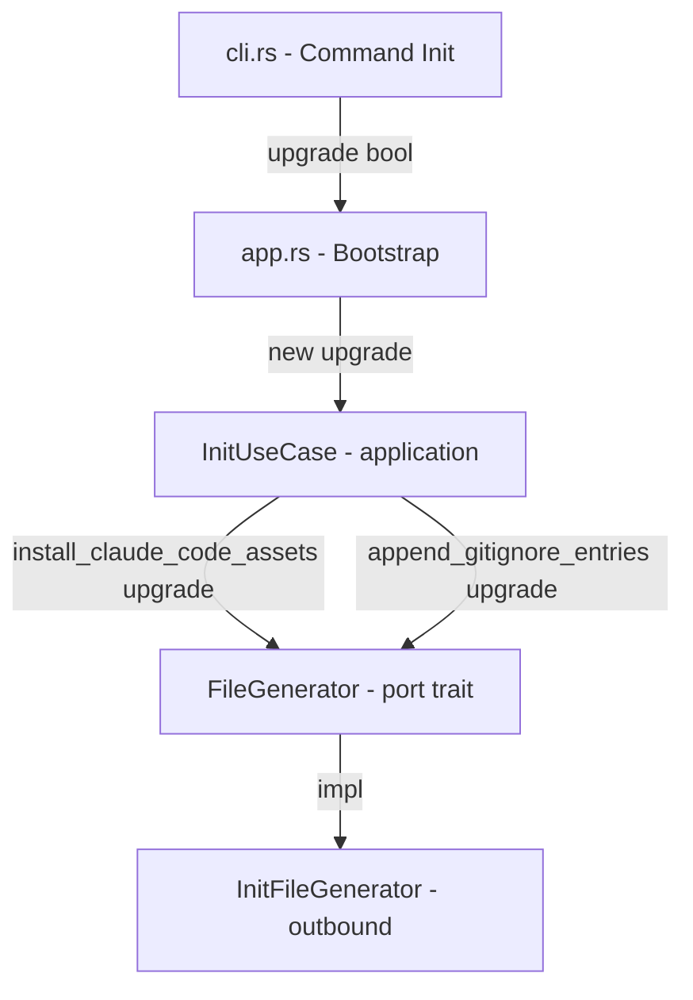
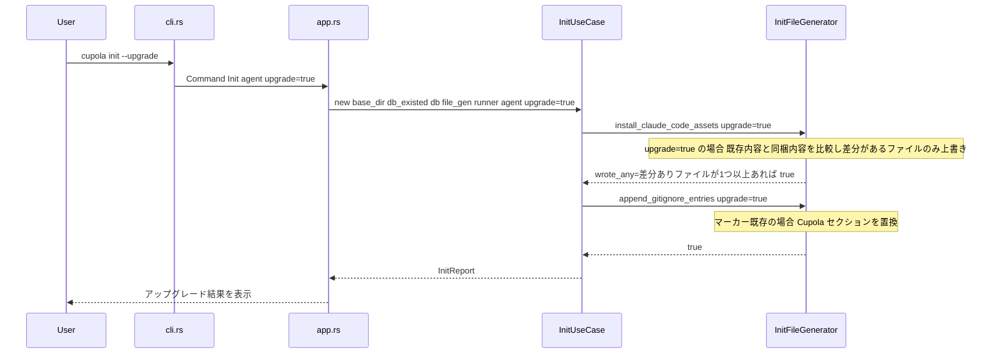

# 設計ドキュメント: `cupola init --upgrade`

## 概要

本機能は `cupola init` コマンドに `--upgrade` フラグを追加し、Cupola管理ファイル（ルール・テンプレート・スキル）をバイナリ同梱の最新版で上書きできるようにする。ユーザー所有ファイル（`cupola.toml`・ステアリング・スペック）は `--upgrade` 実行時でも保護される。

**対象ユーザー**: Cupolaをバージョンアップしたユーザー。旧バージョンでインストールされたガイダンスファイルを再インストールせずに更新できる。

**影響範囲**: 既存の `cupola init` フローに `upgrade: bool` フラグのスレッドを追加する。新しい永続化・外部依存は発生しない。

### ゴール

- `cupola init --upgrade` でCupola管理ファイルを最新版に更新できる
- アップグレード時もユーザー所有ファイルは変更されない
- 既存の `cupola init`（フラグなし）の動作は変化しない

### 非ゴール

- `cupola.toml`・ステアリング・スペックの自動マイグレーション
- バージョン間の差分検出・変更通知
- ロールバック機能

## 要件トレーサビリティ

| 要件 | サマリー | コンポーネント | インターフェース | フロー |
|------|---------|----------------|----------------|-------|
| 1.1, 1.2, 1.3, 1.4 | `--upgrade` CLIフラグ | CLI Adapter, Bootstrap | Command::Init | Init フロー |
| 2.1, 2.2, 2.3, 2.4 | Cupola管理ファイルの上書き | InitFileGenerator | FileGenerator::install_claude_code_assets | Init フロー |
| 3.1, 3.2, 3.3, 3.4 | ユーザー所有ファイルの保護 | InitFileGenerator | FileGenerator::generate_toml_template (変更なし) | Init フロー |
| 4.1, 4.2, 4.3, 4.4 | .gitignore エントリのアップグレード | InitFileGenerator | FileGenerator::append_gitignore_entries | Init フロー |
| 5.1, 5.2, 5.3 | アップグレード結果の報告 | Bootstrap (app.rs) | InitReport | Init フロー |

## アーキテクチャ

### 既存アーキテクチャ分析

`cupola init` は以下の4層を経由して実行される。

- **inbound adapter** (`cli.rs`): `Command::Init { agent }` を解析
- **bootstrap** (`app.rs`): 依存関係を組み立てて `InitUseCase::run()` を呼び出す
- **application** (`init_use_case.rs`): `FileGenerator` ポートを介してファイル操作を実行
- **outbound adapter** (`init_file_generator.rs`): 実際のファイル書き込みを担う

変更は全層に及ぶが、各変更点は局所的で既存の責務分離を維持する。

### アーキテクチャ図



### アーキテクチャ統合

- **選択パターン**: 既存のClean Architecture + Port/Adapter
- **変更の範囲**: `upgrade: bool` フラグを4層に縦断的にスレッドするのみ
- **保護される既存パターン**: `FileGenerator` トレイトによる依存逆転、`InitReport` による結果集約
- **新規コンポーネント**: なし（既存コンポーネントの拡張のみ）

### テクノロジースタック

| レイヤー | 変更 | 役割 | 備考 |
|---------|------|------|------|
| CLI | `clap` derive — `Init` struct に `upgrade: bool` 追加 | `--upgrade` フラグ解析 | `#[arg(long, default_value_t = false)]` |
| Application | `InitUseCase` — `upgrade: bool` フィールド追加 | フラグのスレッドと FileGenerator への委譲 | 既存パターンと同じコンストラクタ注入 |
| Port | `FileGenerator` トレイト — メソッドシグネチャ変更 | アップグレード動作の抽象化 | 2メソッドのみ変更 |
| Outbound | `InitFileGenerator` — 上書きロジック実装 | 実際のファイルI/O | `CLAUDE_CODE_ASSETS` を利用 |

## システムフロー



フロー上の重要な判断点:
- `upgrade=true` 時、`install_claude_code_assets` は `CLAUDE_CODE_ASSETS` の各ファイルについて既存内容と同梱内容を比較し、差分がある場合のみ上書きする（差分なしはスキップ）。
- `.gitignore` 置換はCupolaブロック（`# cupola` マーカーから次の空行まで）を特定して差し替える。

## コンポーネントとインターフェース

### サマリーテーブル

| コンポーネント | レイヤー | 目的 | 要件カバレッジ | 主要依存 | 契約 |
|-------------|---------|------|--------------|---------|------|
| `Command::Init` | inbound adapter | `--upgrade` フラグの解析 | 1.1, 1.2, 1.3, 1.4 | clap (P0) | State |
| `InitUseCase` | application | `upgrade` フラグのスレッドと処理委譲 | 1.1, 2.1–2.4, 3.1–3.4, 4.1–4.4 | FileGenerator (P0) | Service |
| `FileGenerator` (trait) | port | ファイル操作の抽象化 | 2.1–2.4, 3.1–3.4, 4.1–4.4 | — | Service |
| `InitFileGenerator` | outbound adapter | Cupola管理ファイルの実際の上書き | 2.1–2.4, 4.1–4.4 | std::fs (P0) | Service |
| Bootstrap (`app.rs`) | bootstrap | 結果報告の表示 | 5.1, 5.2, 5.3 | InitReport (P0) | — |

---

### Inbound Adapter

#### `Command::Init`（`src/adapter/inbound/cli.rs`）

| フィールド | 詳細 |
|----------|------|
| Intent | `--upgrade` フラグを受け取り、`InitUseCase` に渡す |
| Requirements | 1.1, 1.2, 1.3, 1.4 |

**変更内容**:
- `upgrade: bool` フィールドを `Init` variant に追加
- `#[arg(long, default_value_t = false)]` アトリビュート付与

**契約**: State [x]

##### 状態定義

```rust
// 変更後の Init variant
Init {
    #[arg(long, value_enum, default_value_t = InitAgent::ClaudeCode)]
    agent: InitAgent,
    /// Cupola 管理ファイルを最新版で上書きする
    #[arg(long, default_value_t = false)]
    upgrade: bool,
}
```

**実装ノート**:
- `upgrade` フラグのデフォルトは `false`（後方互換性維持）
- `--agent` フラグとは独立して機能する

---

### Application Layer

#### `InitUseCase`（`src/application/init_use_case.rs`）

| フィールド | 詳細 |
|----------|------|
| Intent | `upgrade` フラグを保持し、`FileGenerator` ポートへ委譲する |
| Requirements | 1.1, 2.1–2.4, 3.1–3.4, 4.1–4.4, 5.1–5.3 |

**変更内容**:
- `upgrade: bool` フィールドを構造体に追加
- `new()` コンストラクタに `upgrade: bool` パラメータを追加
- `run()` 内の `file_gen.install_claude_code_assets()` → `file_gen.install_claude_code_assets(self.upgrade)`
- `run()` 内の `file_gen.append_gitignore_entries()` → `file_gen.append_gitignore_entries(self.upgrade)`
- `generate_toml_template()` は変更なし（ユーザー所有ファイル）

**契約**: Service [x]

##### サービスインターフェース

```rust
impl<D, F, R> InitUseCase<D, F, R>
where D: DbInitializer, F: FileGenerator, R: CommandRunner
{
    pub fn new(
        base_dir: PathBuf,
        db_existed: bool,
        db_init: D,
        file_gen: F,
        command_runner: R,
        init_agent: InitAgent,
        upgrade: bool,   // NEW
    ) -> Self;

    pub fn run(&self) -> Result<InitReport>;
}
```

- 事前条件: `base_dir` が存在するディレクトリ
- 事後条件: Cupola管理ファイルが `upgrade` に応じて上書き/スキップされ、`InitReport` が返る
- 不変条件: `upgrade=false` の場合の動作は既存と同一

---

### Port

#### `FileGenerator` トレイト（`src/application/port/file_generator.rs`）

| フィールド | 詳細 |
|----------|------|
| Intent | アップグレード動作を含むファイル操作を抽象化するポート定義 |
| Requirements | 2.1–2.4, 3.1–3.4, 4.1–4.4 |

**変更対象メソッド**:
- `install_claude_code_assets(&self, upgrade: bool) -> Result<bool>`
- `append_gitignore_entries(&self, upgrade: bool) -> Result<bool>`

**変更なしメソッド**:
- `generate_toml_template(&self) -> Result<bool>`（ユーザー所有ファイル）
- `generate_spec_directory(...)` / `generate_spec_directory_at(...)`（ユーザー所有）

**契約**: Service [x]

##### サービスインターフェース

```rust
pub trait FileGenerator: Send + Sync {
    /// cupola.toml テンプレートを生成する（冪等）。upgrade 対象外。
    fn generate_toml_template(&self) -> Result<bool>;

    /// Claude Code 向けの Cupola assets を導入する（冪等）。
    /// upgrade=true の場合は既存ファイルを上書きする。
    fn install_claude_code_assets(&self, upgrade: bool) -> Result<bool>;

    /// .gitignore に cupola エントリを追記/置換する（冪等）。
    /// upgrade=true かつマーカー既存の場合はセクション全体を置換する。
    fn append_gitignore_entries(&self, upgrade: bool) -> Result<bool>;

    // generate_spec_directory, generate_spec_directory_at は変更なし
}
```

---

### Outbound Adapter

#### `InitFileGenerator`（`src/adapter/outbound/init_file_generator.rs`）

| フィールド | 詳細 |
|----------|------|
| Intent | Cupola管理ファイルの上書きおよび `.gitignore` セクション置換の実装 |
| Requirements | 2.1, 2.2, 2.3, 2.4, 4.1, 4.2, 4.3, 4.4 |

**依存**:
- Inbound: `FileGenerator` トレイトの実装として `InitUseCase` から呼ばれる (P0)
- External: `std::fs` ファイルI/O (P0)、`CLAUDE_CODE_ASSETS` 埋め込みデータ (P0)

**契約**: Service [x]

##### `install_claude_code_assets(upgrade: bool)` の実装方針

```
upgrade=false（従来動作）:
  CLAUDE_CODE_ASSETS の各ファイルを path.exists() チェックし、存在すればスキップ

upgrade=true（新動作）:
  CLAUDE_CODE_ASSETS の各ファイルについて既存内容と同梱内容を比較する
  ファイルが存在しない場合は新規作成、存在して内容差分がある場合のみ上書きする
  内容差分がない場合は書き込みを省略する
  ステアリングディレクトリの作成はどちらのケースでも実行
  戻り値: 少なくとも1ファイルを新規作成または更新した場合 true、差分がなく変更なしの場合 false
```

##### `append_gitignore_entries(upgrade: bool)` の実装方針

```
upgrade=false（従来動作）:
  マーカーまたは既知エントリが存在すればスキップ（変更なし）

upgrade=true かつマーカーが存在する場合:
  .gitignore の内容を行単位で分割
  GITIGNORE_MARKER 行（"# cupola"）を見つける
  マーカー行から連続する非空行（Cupolaブロック）を新しい GITIGNORE_ENTRIES で置換
  マーカー以後の空行で区切られたユーザー行は保持
  CRLF/LF の改行コードを維持

upgrade=true かつマーカーが存在しない場合:
  upgrade=false と同様に末尾追記
```

**実装ノート**:
- Integration: `FileGenerator` トレイト impl に `upgrade` を受け取り、`InitFileGenerator` の既存メソッドに委譲する
- Validation: `upgrade=true` でも `.gitignore` が存在しない場合は通常追記と同じ動作
- Risks: `.gitignore` 置換ロジックの境界判定誤りでユーザーエントリを消去するリスクあり。単体テストでエッジケース（末尾改行なし・空ファイル・Cupolaブロックが末尾にある場合）を網羅する

---

### Bootstrap

#### `app.rs` の Init ハンドラ

| フィールド | 詳細 |
|----------|------|
| Intent | `upgrade` フラグを `InitUseCase` に渡し、結果報告メッセージを `upgrade` に応じて切り替える |
| Requirements | 5.1, 5.2, 5.3 |

**変更内容**:
- `Command::Init { agent, upgrade }` パターンマッチに `upgrade` を追加
- `InitUseCase::new(...)` への `upgrade` 引数を追加
- `agent assets:` の出力メッセージを `upgrade` フラグに応じて切り替え

**実装ノート**:
- `upgrade=true` 時の `agent assets` メッセージ: `"upgraded"` / `"already up to date"`（`installed` / `skipped` とは区別）
- `upgrade=true` 時の `.gitignore` メッセージ: `"upgraded"` / `"already up to date"`

## エラーハンドリング

### エラー戦略

既存の `anyhow::Result` + `.context()` パターンを踏襲する。アップグレード処理でのファイル書き込みエラーは早期に返し、処理を中断する。

### エラーカテゴリと応答

**システムエラー（5xx相当）**:
- ファイル書き込み失敗 → `anyhow::Error` + `with_context` で対象パスを付与して上位へ伝播
- ディレクトリ作成失敗 → 同上

**ユーザーエラー（4xx相当）**:
- なし（`--upgrade` は安全な冪等操作であり、不正な状態を引き起こさない）

## テスト戦略

### 単体テスト（`src/adapter/outbound/init_file_generator.rs`）

- `upgrade=true` 時に差分ありの場合は既存ファイルの内容が最新版に変わること
- `upgrade=true` 時に差分なしの場合は書き込みが省略（スキップ）されること
- `upgrade=false` 時に既存ファイルがスキップされること（変更なし）
- `.gitignore` 置換: マーカー既存かつ `upgrade=true` の場合にCupolaセクションのみが置換されること
- `.gitignore` 置換: マーカー後のユーザー定義エントリが保護されること
- `.gitignore` 置換: `upgrade=true` かつマーカーなしの場合に末尾追記されること
- `.gitignore` 置換: CRLF改行コードが維持されること
- `.gitignore` 置換エッジケース: 末尾改行なし、ファイルなし、Cupolaブロックが最終行の場合

### 単体テスト（`src/application/init_use_case.rs`）

- `upgrade=true` で `file_gen` に `install_claude_code_assets(true)` が呼ばれること
- `upgrade=false` で `file_gen` に `install_claude_code_assets(false)` が呼ばれること
- `upgrade=true` でも `generate_toml_template()` が変更なしで呼ばれること（ユーザー所有ファイルの保護確認）

### 単体テスト（`src/adapter/inbound/cli.rs`）

- `cupola init --upgrade` のパース: `upgrade=true` が取得できること
- `cupola init` のパース: `upgrade=false`（デフォルト）が取得できること
- `cupola init --upgrade --agent claude-code` のパース: 両フラグが独立して動作すること
