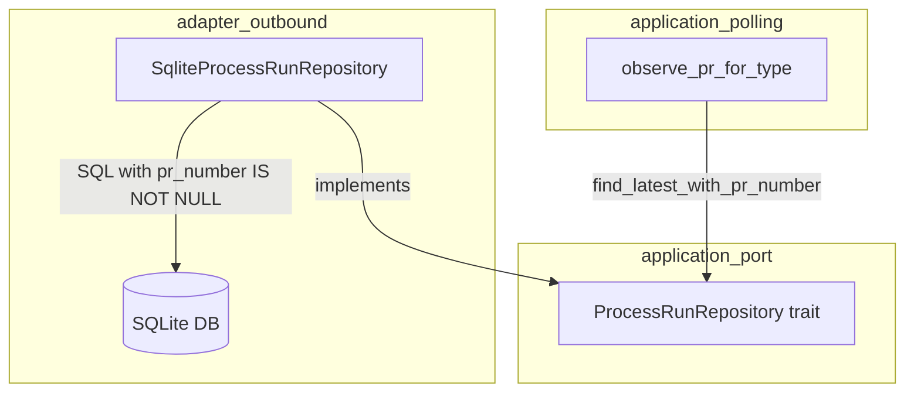
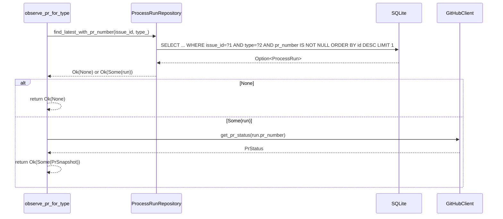

# Design Document

## Overview

本機能は、`observe_pr_for_type` 関数が `pr_number IS NOT NULL` 条件を SQLレベルで強制することで、アーキテクチャ仕様に準拠した堅牢な実装を実現する。

**Purpose**: `ProcessRunRepository` トレイトに `find_latest_with_pr_number` メソッドを追加し、SQLite アダプターで実装することで、`observe_pr_for_type` の後処理フィルタを排除する。

**Users**: 将来の開発者が `observe_pr_for_type` を保守・拡張する際に、`pr_number IS NOT NULL` 不変条件が自動的に保証される。

**Impact**: `observe_pr_for_type` における `.and_then(|r| r.pr_number)` によるRustレベルの後処理フィルタが削除され、SQLクエリが唯一の真実の源となる。

### Goals

- `pr_number IS NOT NULL` フィルタをSQLレベルで強制し、アーキテクチャ仕様との完全な整合性を確保する
- `observe_pr_for_type` のRustコードを簡潔化し、誤実装のリスクを排除する
- 既存のAPIおよびテストへの破壊的変更を最小化する

### Non-Goals

- `find_latest` メソッドの変更（他の呼び出し箇所に影響するため）
- データベーススキーマの変更
- `observe_pr_for_type` の404ハンドリングロジックの変更

## Architecture

### Existing Architecture Analysis

本修正はClean Architecture の4層構造に従う。変更は以下の2層にまたがる：

- **application/port** (`ProcessRunRepository` トレイト): 新しいポートメソッドの追加
- **adapter/outbound** (`SqliteProcessRunRepository`): 新しいSQLクエリの実装
- **application/polling/collect**: 既存の `find_latest` 呼び出しを `find_latest_with_pr_number` に置き換え

依存方向は既存と同じく内向き（adapter → application → domain）を維持する。

### Architecture Pattern & Boundary Map



**Architecture Integration**:
- 選択パターン: Ports & Adapters（既存パターンの踏襲）
- 変更の境界: `ProcessRunRepository` トレイト（ポート）に新メソッドを追加し、アダプターで実装
- 既存パターンの維持: `spawn_blocking` + `Arc<Mutex<Connection>>`、`impl Future + Send`
- 新コンポーネントなし: 既存の構造を最小限に拡張するのみ

### Technology Stack

| Layer | Choice / Version | Role in Feature | Notes |
|-------|------------------|-----------------|-------|
| Backend | Rust (Edition 2024) | トレイト定義・実装 | 変更なし |
| Data | rusqlite (SQLite) | `pr_number IS NOT NULL` クエリ | WHERE句の拡張のみ |
| Runtime | tokio spawn_blocking | 非同期DB操作 | 変更なし |

## System Flows



フロー上のキー決定: `find_latest_with_pr_number` が `None` を返す場合は、Rustレベルの追加チェックなしに即座に `Ok(None)` を返す。`Some(run)` の場合は `run.pr_number` が型レベルで `Some(u64)` であることが SQLクエリで保証されているため、安全に `.unwrap()` せずに使用できる（実装では `.expect()` は使わず直接フィールドアクセス）。

## Requirements Traceability

| Requirement | Summary | Components | Interfaces | Flows |
|-------------|---------|------------|------------|-------|
| 1.1 | `find_latest_with_pr_number` メソッドシグネチャ | ProcessRunRepository trait | Service Interface | — |
| 1.2 | `pr_number IS NOT NULL` の最新レコードを返す | SqliteProcessRunRepository | SQL Query | observe_pr_for_type フロー |
| 1.3 | 該当レコードなし時に `Ok(None)` を返す | SqliteProcessRunRepository | SQL Query | — |
| 2.1 | SQL WHERE句に `AND pr_number IS NOT NULL` | SqliteProcessRunRepository | SQL Query | — |
| 2.2 | spawn_blocking + Arc<Mutex<Connection>> パターン | SqliteProcessRunRepository | — | — |
| 2.3 | クエリ結果なし時に `Ok(None)` | SqliteProcessRunRepository | SQL Query | — |
| 3.1 | `find_latest_with_pr_number` の呼び出し | observe_pr_for_type | — | observe_pr_for_type フロー |
| 3.2 | Rustレベルのnullチェック削除 | observe_pr_for_type | — | observe_pr_for_type フロー |
| 3.3 | `run.pr_number` の直接使用 | observe_pr_for_type | — | observe_pr_for_type フロー |
| 3.4 | 404ハンドリングの維持 | observe_pr_for_type | — | observe_pr_for_type フロー |
| 4.1 | モック `None` 返却時のユニットテスト | テストモジュール | Mock ProcessRunRepository | — |
| 4.2 | モック `Some(run)` 返却時のユニットテスト | テストモジュール | Mock ProcessRunRepository | — |
| 4.3 | 混在データでのインテグレーションテスト | テストモジュール | SqliteProcessRunRepository | — |
| 4.4 | 既存テストの回帰確認 | 全テスト | — | — |

## Components and Interfaces

### コンポーネント概要

| Component | Domain/Layer | Intent | Req Coverage | Key Dependencies | Contracts |
|-----------|--------------|--------|--------------|------------------|-----------|
| ProcessRunRepository trait | application/port | `find_latest_with_pr_number` ポートを定義 | 1.1, 1.2, 1.3 | ProcessRun, ProcessRunType | Service |
| SqliteProcessRunRepository | adapter/outbound | `find_latest_with_pr_number` をSQLで実装 | 2.1, 2.2, 2.3 | rusqlite, SqliteConnection | Service |
| observe_pr_for_type | application/polling | 新メソッドを使用してPR観測を実行 | 3.1, 3.2, 3.3, 3.4 | ProcessRunRepository, GitHubClient | — |

### Application Port

#### ProcessRunRepository (トレイト拡張)

| Field | Detail |
|-------|--------|
| Intent | `pr_number IS NOT NULL` のSQLフィルタを表現するポートメソッドを追加 |
| Requirements | 1.1, 1.2, 1.3 |

**Responsibilities & Constraints**
- `find_latest` と同じ `(issue_id, type_)` パラメータを受け取り、`pr_number IS NOT NULL` 条件を満たす最新レコードを返す
- Rustレベルのフィルタリングを呼び出し側が行わなくても済むよう、契約として明示する

**Contracts**: Service [x]

##### Service Interface

```rust
fn find_latest_with_pr_number(
    &self,
    issue_id: i64,
    type_: ProcessRunType,
) -> impl std::future::Future<Output = Result<Option<ProcessRun>>> + Send;
```

- Preconditions: `issue_id` および `type_` は有効な値である
- Postconditions: `Some(run)` の場合、`run.pr_number` は必ず `Some(_)` である
- Invariants: データベースクエリが `pr_number IS NOT NULL` を強制する

**Implementation Notes**
- Integration: `find_latest` と同じ場所に定義し、ドキュメントコメントで `pr_number IS NOT NULL` 保証を明記する
- Risks: トレイトを実装する全てのモックに本メソッドの追加が必要（コンパイラが強制）

### Adapter Outbound

#### SqliteProcessRunRepository (新メソッド実装)

| Field | Detail |
|-------|--------|
| Intent | `pr_number IS NOT NULL` を含むSQLクエリを実行し、`find_latest_with_pr_number` を実装する |
| Requirements | 2.1, 2.2, 2.3 |

**Responsibilities & Constraints**
- 既存の `find_latest` 実装を参考に、WHERE句に `AND pr_number IS NOT NULL` を追加する
- `spawn_blocking` + `Arc<Mutex<Connection>>` パターンに従う

**Contracts**: Service [x]

##### Service Interface (SQL)

```sql
SELECT id, issue_id, type, idx, state, pid, pr_number, causes,
        started_at, finished_at, error_message
 FROM process_runs
 WHERE issue_id = ?1 AND type = ?2 AND pr_number IS NOT NULL
 ORDER BY id DESC LIMIT 1
```

- Preconditions: `issue_id` と `type_` がバインドパラメータとして渡される
- Postconditions: 結果行が存在する場合、`pr_number` カラムは必ずNULLでない値を持つ
- Invariants: `ORDER BY id DESC LIMIT 1` により最新の1件のみが返される

**Implementation Notes**
- Integration: `find_latest` の実装を複製し、WHERE句を拡張する
- Validation: クエリ結果のマッピングには既存の `row_to_process_run` ヘルパーを再利用する
- Risks: `spawn_blocking` 内のパニックは `map_err` で `anyhow::Error` に変換する（既存パターン踏襲）

### Application Polling

#### observe_pr_for_type (呼び出し変更)

| Field | Detail |
|-------|--------|
| Intent | `find_latest` を `find_latest_with_pr_number` に置き換え、Rustレベルのnullチェックを削除する |
| Requirements | 3.1, 3.2, 3.3, 3.4 |

**Responsibilities & Constraints**
- `find_latest_with_pr_number` を呼び出し、結果が `None` の場合は直ちに `Ok(None)` を返す
- `Some(run)` の場合、`run.pr_number` を使用して `github.get_pr_status` を呼び出す
- 既存の404エラーハンドリングロジックは変更しない

**Implementation Notes**
- 変更前: `process_repo.find_latest(...).await?` → `.and_then(|r| r.pr_number)`
- 変更後: `process_repo.find_latest_with_pr_number(...).await?` → `match` on `Option<ProcessRun>`
- `run.pr_number` は `Some(_)` が保証されているため、`.expect()` なしで直接使用可能（`unwrap_used = "deny"` に準拠するため `run.pr_number.expect(...)` も避け、クエリの保証を信頼したコードとする）

## Data Models

### Domain Model

変更なし。`ProcessRun` ドメインエンティティおよびそのフィールド（`pr_number: Option<u64>`）は変更しない。フィルタリングはポートレイヤーの契約として表現され、ドメインモデルには影響しない。

### Physical Data Model

`process_runs` テーブルのスキーマ変更なし。既存の `pr_number` カラム（NULLABLEのINTEGER）をクエリのフィルタ条件として使用するだけである。

## Error Handling

### Error Strategy

既存の `anyhow::Result` ベースのエラーハンドリングを踏襲する。新メソッドは既存メソッドと同じエラー伝播パターンを使用する。

### Error Categories and Responses

- **DB エラー**: `spawn_blocking` 内の rusqlite エラーは `.context("find_latest_with_pr_number failed")` でラップして伝播
- **ロックエラー**: `Mutex` のロック失敗は `anyhow::anyhow!("failed to acquire database lock: {e}")` でラップ
- **GitHub 404**: `observe_pr_for_type` 内の既存404ハンドリングは変更しない

## Testing Strategy

### Unit Tests (`src/application/polling/collect.rs` 内 `#[cfg(test)]` ブロック)

1. `find_latest_with_pr_number` が `None` を返す場合 → `observe_pr_for_type` が `Ok(None)` を返すことを検証
2. `find_latest_with_pr_number` が `Some(run)` (pr_number = Some(42)) を返す場合 → `github.get_pr_status(42)` が呼ばれることを検証
3. `github.get_pr_status` が404エラーを返す場合 → `observe_pr_for_type` が `Ok(None)` を返すことを検証（既存ロジックの回帰確認）

### Integration Tests (`tests/` ディレクトリ)

1. `process_runs` に同一 `(issue_id, type_)` で `pr_number` がNULLのレコードと非NULLのレコードを混在させ、`find_latest_with_pr_number` がNULLレコードをスキップして非NULLレコードを返すことを検証
2. 全て `pr_number = NULL` のレコードのみの場合、`find_latest_with_pr_number` が `Ok(None)` を返すことを検証
3. 既存の `observe_github_issue` および他のスナップショットビルダーのテストが引き続きパスすることを確認
