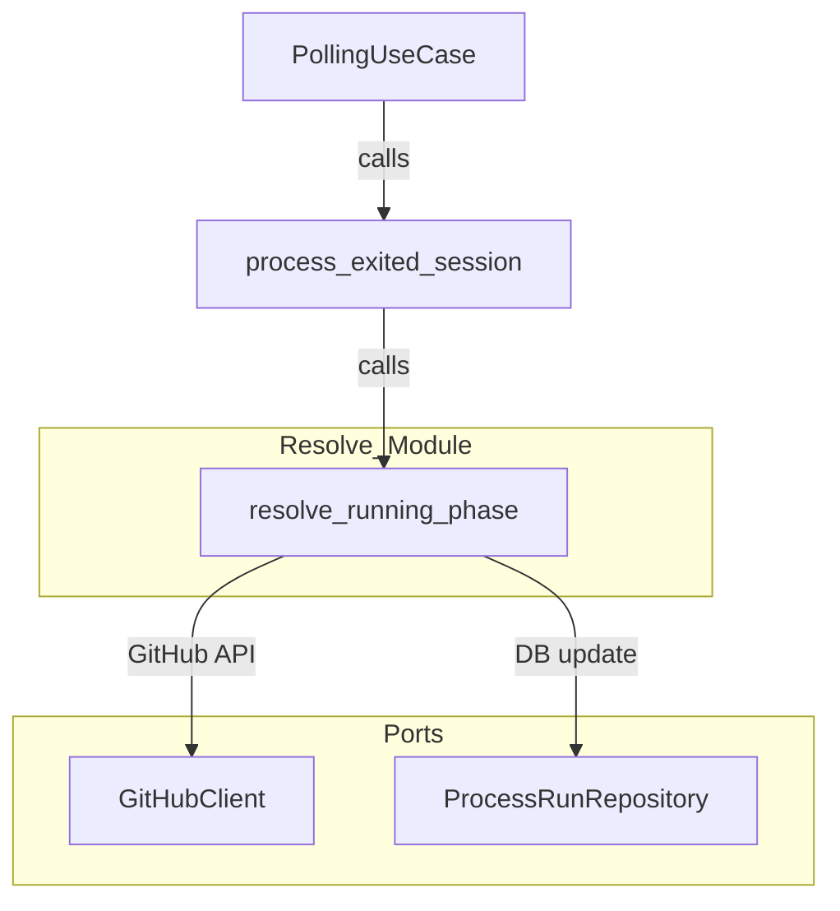

# Design Document

## Overview

本修正は、`src/application/polling/resolve.rs` の Running フェーズにおいて GitHub API 呼び出し（`find_pr_by_branches` / `create_pr`）のエラーをセッション単位に局所化する。

**Purpose**: GitHub API の一時的障害が 1 セッションの失敗に限定され、同一ポーリングサイクル内の他セッションの `ProcessRun` 更新が継続して行われるようにする。

**Users**: ポーリングループ（`PollingUseCase`）および Cupola 状態機械全体が影響を受ける。

**Impact**: `process_exited_session` ループが GitHub API エラーで中断される問題を解消し、各セッションの `ProcessRun` 状態が正しく `failed` または `succeeded` に遷移するようになる。

### Goals

- GitHub API エラーを当該セッションの `ProcessRun.state = failed` として記録する
- エラー発生後に `Ok(())` を返し、ポーリングループを継続させる
- Fixing フェーズの既存パターンと整合した実装スタイルを維持する

### Non-Goals

- Fixing フェーズの処理ロジックの変更
- `mark_failed` 自体のエラーハンドリングの変更（DB 障害はループ停止が妥当）
- GitHub API リトライロジックの追加
- `RetryPolicy` の変更

## Requirements Traceability

| Requirement | Summary | Components | Interfaces | Flows |
|-------------|---------|------------|------------|-------|
| 1.1 | find_pr_by_branches エラー時に mark_failed + Ok(()) | Resolve モジュール | ProcessRunRepository::mark_failed | Running フェーズエラーフロー |
| 1.2 | create_pr エラー時に mark_failed + Ok(()) | Resolve モジュール | ProcessRunRepository::mark_failed | Running フェーズエラーフロー |
| 1.3 | run_id=0 時は mark_failed スキップ | Resolve モジュール | — | — |
| 1.4 | tracing::warn! でエラーログ | Resolve モジュール | tracing | — |
| 1.5 | mark_failed エラーは ? で伝播 | Resolve モジュール | ProcessRunRepository::mark_failed | — |
| 2.1 | エラー後 Ok(()) を返す | Resolve モジュール | — | Running フェーズエラーフロー |
| 2.2 | 兄弟セッションが同サイクルで処理される | PollingUseCase / Resolve | — | ループ継続フロー |
| 2.3 | GitHub API エラーを呼び出し元に伝播しない | Resolve モジュール | — | — |
| 3.1 | mark_failed で state=failed に遷移 | Resolve モジュール | ProcessRunRepository::mark_failed | — |
| 3.2 | 失敗時に mark_succeeded を呼ばない | Resolve モジュール | — | — |
| 4.1 | find_pr_by_branches 失敗ユニットテスト | テスト | MockGitHubClient, MockProcessRunRepository | — |
| 4.2 | create_pr 失敗ユニットテスト | テスト | MockGitHubClient, MockProcessRunRepository | — |
| 4.3 | 2 セッション並行インテグレーションテスト | テスト | — | ループ継続フロー |
| 4.4 | ログ検証テスト | テスト | tracing テストサポート | — |

## Architecture

### Existing Architecture Analysis

- **対象ファイル**: `src/application/polling/resolve.rs`（Application 層）
- **Clean Architecture 位置**: Application 層内の `polling` サブモジュール
- **既存パターン**: Fixing フェーズ（行 316–326）に `if let Err(e)` + `tracing::warn!` パターンが存在する
- **ProcessRunRepository トレイト**: `mark_failed(run_id: i64, error_message: Option<String>) -> Result<()>` が Application 層のポートとして定義済み

### Architecture Pattern & Boundary Map



**Architecture Integration**:
- 選択パターン: 既存の Fixing フェーズパターン（`if let Err(e)`）を Running フェーズに適用
- 変更境界: `resolve.rs` 内の Running フェーズブロックのみ
- 既存パターンの保持: Clean Architecture 依存方向・ポートトレイト使用・`?` 伝播ポリシー（DB 障害のみ）を維持

### Technology Stack

| Layer | Choice / Version | Role | Notes |
|-------|-----------------|------|-------|
| Application | Rust / resolve.rs | エラー局所化ロジック | 既存ファイル修正のみ |
| Port | ProcessRunRepository | mark_failed 呼び出し | 既存トレイト使用 |
| Port | GitHubClient | find_pr_by_branches / create_pr | 既存トレイト使用 |
| Logging | tracing | warn! マクロ | 既存ライブラリ使用 |

## System Flows

### Running フェーズ エラーフロー（修正後）

```mermaid
sequenceDiagram
    participant Loop as process_exited_session loop
    participant Resolve as resolve_running_phase
    participant GH as GitHubClient
    participant DB as ProcessRunRepository

    Loop->>Resolve: session A
    Resolve->>GH: find_pr_by_branches / create_pr
    GH-->>Resolve: Err(e)
    Resolve->>DB: mark_failed(run_id, Some(e.to_string()))
    DB-->>Resolve: Ok(())
    Resolve-->>Loop: Ok(())
    Note over Loop: ループ継続（中断なし）
    Loop->>Resolve: session B
    Resolve->>GH: find_pr_by_branches
    GH-->>Resolve: Ok(Some(pr))
    Resolve->>DB: mark_succeeded(run_id, Some(pr_number))
    DB-->>Resolve: Ok(())
    Resolve-->>Loop: Ok(())
```

## Components and Interfaces

### コンポーネントサマリー

| Component | Domain/Layer | Intent | Req Coverage | Key Dependencies | Contracts |
|-----------|-------------|--------|-------------|-----------------|-----------|
| Resolve モジュール（Running フェーズ） | Application | GitHub API エラー局所化 + mark_failed 呼び出し | 1.1–1.5, 2.1–2.3, 3.1–3.2 | GitHubClient (P0), ProcessRunRepository (P0) | State |

### Application Layer

#### Resolve モジュール（Running フェーズ修正箇所）

| Field | Detail |
|-------|--------|
| Intent | `find_pr_by_branches` / `create_pr` のエラーをセッション単位に局所化し `mark_failed` を呼び出す |
| Requirements | 1.1, 1.2, 1.3, 1.4, 1.5, 2.1, 2.2, 2.3, 3.1, 3.2 |

**Responsibilities & Constraints**

- `find_pr_by_branches` または `create_pr` が `Err` を返した場合、`mark_failed(run_id, Some(e.to_string())).await?` を呼び出してから `return Ok(())` する
- `run_id == 0` の場合は `mark_failed` をスキップして `return Ok(())` する
- エラー発生時は `tracing::warn!` で `run_id`・`head_branch`・`base_branch`・エラー詳細を記録する
- `mark_failed` 自体のエラーは `?` で呼び出し元に伝播する（DB 障害はループ停止が妥当）
- `mark_succeeded` の呼び出しパスには到達しない

**Dependencies**

- Inbound: `process_exited_session` — セッション情報の提供（P0）
- Outbound: `GitHubClient::find_pr_by_branches` — PR 存在確認（P0）
- Outbound: `GitHubClient::create_pr` — PR 作成（P0）
- Outbound: `ProcessRunRepository::mark_failed` — 失敗状態記録（P0）

**Contracts**: State [x]

##### State Management

- 修正前: `find_pr_by_branches / create_pr` のエラーが `?` で伝播 → ループ中断
- 修正後: エラーをキャプチャ → `mark_failed` → `Ok(())` 返却 → ループ継続
- 状態遷移: `ProcessRun.state` が `running → failed`（GitHub API エラー時）

**Implementation Notes**

- 変更箇所は `resolve.rs` 行 289–309 の Running フェーズブロックのみ
- Fixing フェーズの `if let Err(e)` パターン（行 316–326）をモデルとして使用するが、`mark_failed` 呼び出しが追加で必要な点が異なる
- `find_pr_by_branches` と `create_pr` のエラーハンドリングを統合するか分離するかは実装者の裁量だが、どちらのケースも `mark_failed` + `return Ok(())` に至ること

## Error Handling

### Error Strategy

GitHub API エラー（外部障害）は局所化し、DB 障害（内部障害）は伝播する非対称設計を採用する。

### Error Categories and Responses

| エラー種別 | 発生箇所 | 対応 |
|-----------|---------|------|
| GitHub API エラー | `find_pr_by_branches` / `create_pr` | `mark_failed` + `tracing::warn!` + `Ok(())` 返却 |
| DB エラー | `mark_failed` | `?` で伝播（ループ停止） |

### Monitoring

- `tracing::warn!` に `run_id`・`head_branch`・`base_branch`・エラーメッセージを含める
- 既存の `dump_session_io` によるログ出力は変更なし

## Testing Strategy

### Unit Tests

1. `find_pr_by_branches` がエラーを返す場合: `mark_failed` が `run_id` と正しいエラーメッセージで呼ばれ、関数が `Ok(())` を返すことを検証（要件 1.1, 2.1, 3.1）
2. `create_pr` がエラーを返す場合: `mark_failed` が `run_id` と正しいエラーメッセージで呼ばれ、関数が `Ok(())` を返すことを検証（要件 1.2, 2.1, 3.1）
3. `run_id == 0` かつ GitHub API がエラーを返す場合: `mark_failed` が呼ばれず `Ok(())` を返すことを検証（要件 1.3）
4. GitHub API エラー時に `mark_succeeded` が呼ばれないことを検証（要件 3.2）

### Integration Tests

1. 同一サイクルで 2 セッションが完了し、1 セッションの GitHub API 呼び出しをスタブでエラーにした場合: 失敗セッションの `ProcessRun.state = failed / error_message 設定済み`、成功セッションの `ProcessRun` が正常に更新されることを検証（要件 2.2, 4.3）

### ログ検証

1. GitHub API エラー発生時に `tracing::warn!` が `run_id`・`head_branch`・`base_branch`・エラー詳細を含むことを検証（要件 1.4, 4.4）
