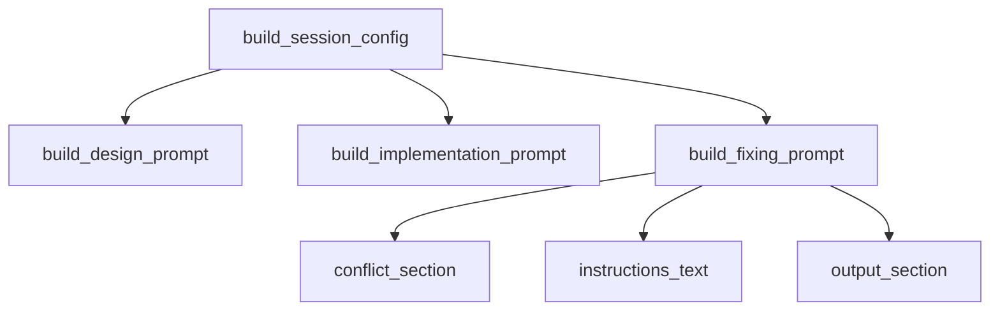
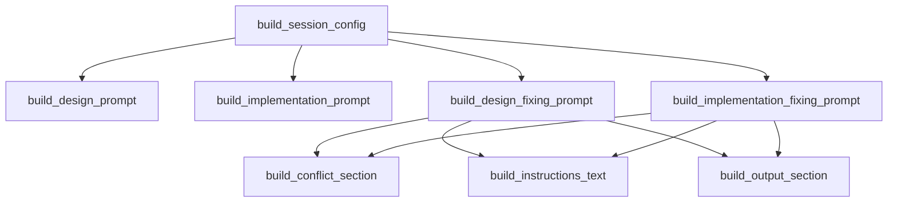
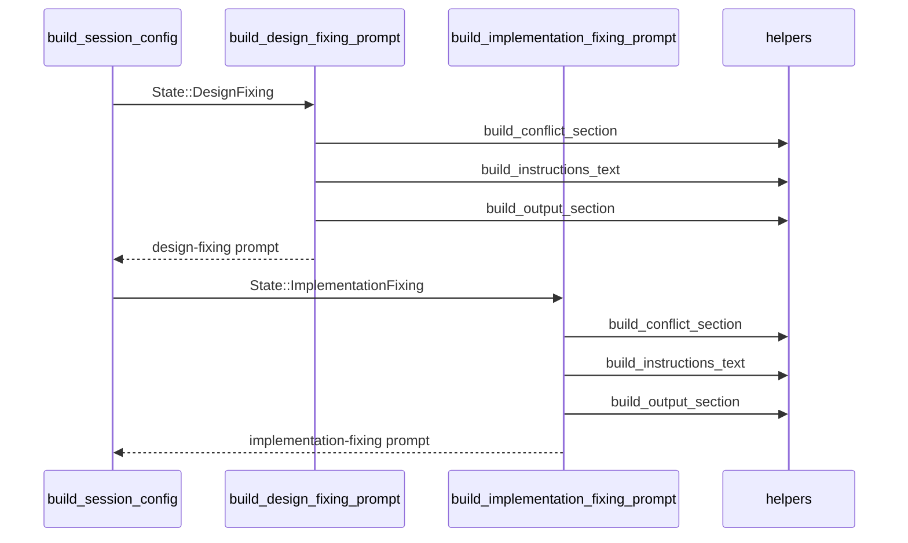

# Design Document — issue-235: Fixing プロンプトの種別分割

## Overview

本機能は `src/application/prompt.rs` 内の `build_fixing_prompt` 関数を `build_design_fixing_prompt` と `build_implementation_fixing_prompt` の 2 関数に分割する。

`DesignFixing` 状態では修正対象が `.cupola/specs/` 配下の設計ドキュメント（requirements.md / design.md / tasks.md）であり、コード修正を前提とした文言・コミットプレフィックスは不適切である。分割により、各エージェントが修正対象の性質に応じた明確な指示を受け取れるようになる。

影響ファイルは `src/application/prompt.rs` のみ。Clean Architecture のアプリケーション層内部での変更であり、外部インタフェース（`build_session_config` の呼び出しシグネチャ）は変わらない。

### Goals

- `DesignFixing` プロンプトを設計ドキュメント修正に特化させる（文言・コミットプレフィックス）
- `ImplementationFixing` プロンプトを現状相当のコード修正向けとして維持する
- マージコンフリクト処理・causes 解析・output-schema 生成の共通ロジックを重複なく保持する

### Non-Goals

- `build_session_config` の公開シグネチャ変更
- `FixingProblemKind` の種類追加
- 他の状態（`DesignRunning`, `ImplementationRunning`）のプロンプト変更

## Architecture

### Existing Architecture Analysis

`src/application/prompt.rs` はアプリケーション層のプロンプト生成モジュールである。公開エントリポイントは `build_session_config` のみであり、内部ヘルパー関数（`build_design_prompt`, `build_implementation_prompt`, `build_fixing_prompt`）はモジュールプライベートである。

現在の呼び出し関係：



分割後の呼び出し関係：



### Architecture Pattern & Boundary Map

- **選択パターン**: ヘルパー関数抽出 + 2 エントリポイント関数
- **境界**: アプリケーション層内部の変更のみ。ドメイン層・アダプター層・ブートストラップ層は無影響
- **既存パターンの維持**: `build_session_config` の公開インタフェースは変更しない
- **新規コンポーネントの根拠**: 修正対象の性質（設計ドキュメント vs. 実装コード）が異なるため、専用関数が必要

### Technology Stack

| 層 | 選択 | 役割 |
|----|------|------|
| application | Rust（既存） | プロンプト文字列生成 |

新規依存クレートなし。

## Requirements Traceability

| Requirement | Summary | Components | Interfaces | Flows |
|-------------|---------|------------|------------|-------|
| 1.1–1.7 | DesignFixing 専用プロンプト | `build_design_fixing_prompt` | `build_session_config` | DesignFixing 分岐 |
| 2.1–2.7 | ImplementationFixing 専用プロンプト | `build_implementation_fixing_prompt` | `build_session_config` | ImplementationFixing 分岐 |
| 3.1–3.5 | 共通ロジック保持 | `build_conflict_section`, `build_instructions_text`, `build_output_section` | — | 両 fixing 分岐 |
| 4.1–4.4 | テストカバレッジ | テストモジュール | — | — |

## Components and Interfaces

### Summary

| Component | Layer | Intent | Req Coverage | Key Dependencies |
|-----------|-------|--------|--------------|-----------------|
| `build_design_fixing_prompt` | application | DesignFixing 向けプロンプト生成 | 1.1–1.7, 3.1–3.5 | `build_conflict_section` (P0), `build_instructions_text` (P0), `build_output_section` (P0) |
| `build_implementation_fixing_prompt` | application | ImplementationFixing 向けプロンプト生成 | 2.1–2.7, 3.1–3.5 | `build_conflict_section` (P0), `build_instructions_text` (P0), `build_output_section` (P0) |
| `build_conflict_section` | application | マージコンフリクト解消セクション生成 | 3.1 | — |
| `build_instructions_text` | application | causes から指示文リストを生成 | 3.2, 3.3 | — |
| `build_output_section` | application | output-schema セクション生成 | 3.2, 3.3 | — |

### application layer

#### `build_design_fixing_prompt`

| Field | Detail |
|-------|--------|
| Intent | `State::DesignFixing` 向けのプロンプト文字列を生成する |
| Requirements | 1.1, 1.2, 1.3, 1.4, 1.5, 1.6, 1.7, 3.1, 3.2, 3.3, 3.4 |

**Responsibilities & Constraints**

- 修正対象が設計ドキュメントであることを明示する文言を生成する
- コミットメッセージプレフィックスを `docs:` とする
- `GENERIC_QUALITY_CHECK_INSTRUCTION` を品質チェック指示として使用する
- `build_conflict_section` / `build_instructions_text` / `build_output_section` を呼び出して各セクションを組み立てる

**Contracts**: Service [x]

##### Service Interface

```rust
fn build_design_fixing_prompt(
    issue_number: u64,
    pr_number: u64,
    language: &str,
    causes: &[FixingProblemKind],
    has_merge_conflict: bool,
    default_branch: &str,
) -> String
```

- Preconditions: なし（呼び出し側が `pr_number` の存在を保証する）
- Postconditions: 設計ドキュメント修正向けの指示文字列を返す
- Invariants: 返値に "to the code" 等のコード修正文言を含まない

**Implementation Notes**

- `git commit -m "docs: address requested changes"` をコミット指示として使用
- "Apply the necessary fixes to the design documents" 相当の文言を使用
- `build_output_section` と `build_instructions_text` の呼び出しは `build_implementation_fixing_prompt` と共通

---

#### `build_implementation_fixing_prompt`

| Field | Detail |
|-------|--------|
| Intent | `State::ImplementationFixing` 向けのプロンプト文字列を生成する |
| Requirements | 2.1, 2.2, 2.3, 2.4, 2.5, 2.6, 2.7, 3.1, 3.2, 3.3, 3.4 |

**Responsibilities & Constraints**

- 修正対象が実装コードであることを明示する文言を生成する
- コミットメッセージプレフィックスを `fix:` とする（現状維持）
- `GENERIC_QUALITY_CHECK_INSTRUCTION` を品質チェック指示として使用する
- `build_conflict_section` / `build_instructions_text` / `build_output_section` を呼び出して各セクションを組み立てる

**Contracts**: Service [x]

##### Service Interface

```rust
fn build_implementation_fixing_prompt(
    issue_number: u64,
    pr_number: u64,
    language: &str,
    causes: &[FixingProblemKind],
    has_merge_conflict: bool,
    default_branch: &str,
) -> String
```

- Preconditions: なし
- Postconditions: 実装コード修正向けの指示文字列を返す
- Invariants: 現行 `build_fixing_prompt` と実質同等の出力を持つ（コミットプレフィックスを除く）

**Implementation Notes**

- `git commit -m "fix: address requested changes"` をコミット指示として使用（現状維持）
- 実質的に現行 `build_fixing_prompt` の内容を引き継ぐ

---

#### `build_conflict_section`（プライベートヘルパー）

| Field | Detail |
|-------|--------|
| Intent | `has_merge_conflict` フラグに基づきマージコンフリクト解消セクションを生成する |
| Requirements | 3.1, 1.7, 2.7 |

**Contracts**: Service [x]

##### Service Interface

```rust
fn build_conflict_section(has_merge_conflict: bool, default_branch: &str) -> String
```

- Postconditions: `has_merge_conflict` が true の場合は解消手順を含む文字列、false の場合は空文字列を返す

---

#### `build_instructions_text`（プライベートヘルパー）

| Field | Detail |
|-------|--------|
| Intent | `causes` から番号付き指示文リストを生成する |
| Requirements | 3.2, 3.3 |

**Contracts**: Service [x]

##### Service Interface

```rust
fn build_instructions_text(causes: &[FixingProblemKind]) -> String
```

- Postconditions: causes が空の場合はデフォルト文言を、そうでない場合は番号付きリストを返す

---

#### `build_output_section`（プライベートヘルパー）

| Field | Detail |
|-------|--------|
| Intent | `causes` に ReviewComments が含まれるかに応じて output-schema セクションを生成する |
| Requirements | 3.2, 3.3 |

**Contracts**: Service [x]

##### Service Interface

```rust
fn build_output_section(causes: &[FixingProblemKind], language: &str) -> String
```

- Postconditions: ReviewComments が含まれる場合は thread_id / response / resolved を求める文言、含まれない場合は `{"threads": []}` 返却指示を生成する

## System Flows



## Error Handling

### Error Strategy

`build_design_fixing_prompt` / `build_implementation_fixing_prompt` 自体はエラーを返さない（`String` を直接返す）。`pr_number` の検証は `build_session_config` 側で `anyhow::Context` を使って行う（現状維持）。

## Testing Strategy

### Unit Tests

- `design_fixing_prompt_contains_docs_prefix` — `DesignFixing` のプロンプトに `docs:` コミット指示が含まれることを確認
- `design_fixing_prompt_does_not_contain_code_wording` — `DesignFixing` のプロンプトに「fix to the code」等のコード向け文言が含まれないことを確認
- `implementation_fixing_prompt_contains_fix_prefix` — `ImplementationFixing` のプロンプトに `fix:` コミット指示が含まれることを確認
- `both_fixing_prompts_handle_review_comments` — `ReviewComments` cause に対し両プロンプトが `review_threads.json` 参照を含むことを確認
- `both_fixing_prompts_handle_ci_failure` — `CiFailure` cause に対し両プロンプトが `ci_errors.txt` 参照を含むことを確認
- `both_fixing_prompts_handle_merge_conflict` — `has_merge_conflict=true` で両プロンプトにコンフリクト解消セクションが含まれることを確認
- `both_fixing_prompts_no_git_add_all` — 両プロンプトに `git add -A` が含まれないことを確認
- 既存の `fixing_prompt_*` テスト群を `DesignFixing` / `ImplementationFixing` 両方に拡張
