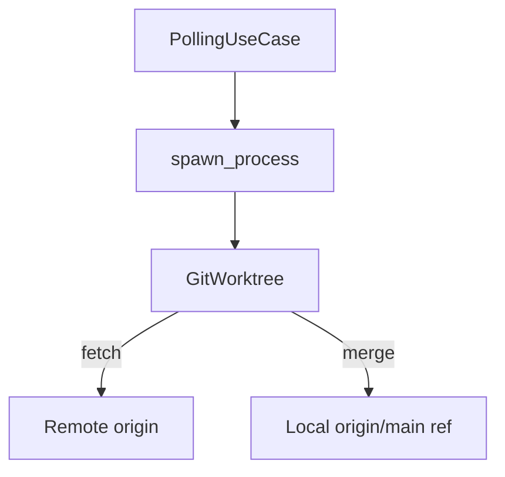
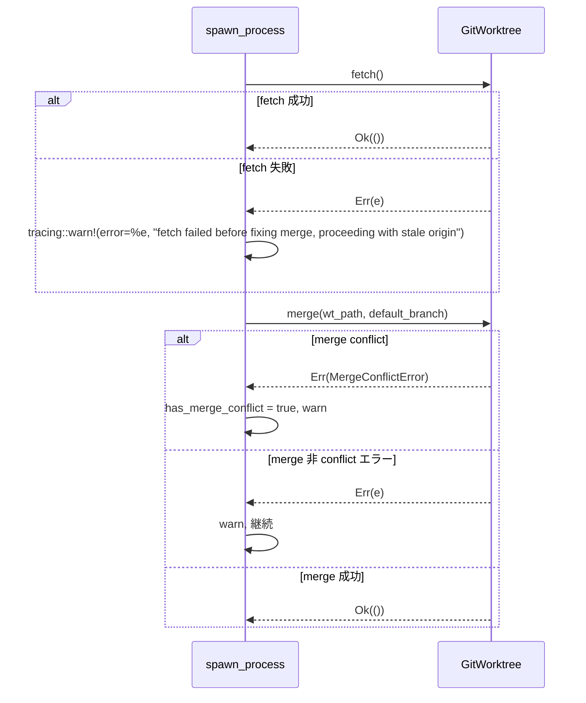

# Design Document — Fixing spawn 前の fetch 追加（issue-250）

## Overview

本機能は、`DesignFix` / `ImplFix` フェーズの spawn 処理において `worktree.merge()` 直前に `worktree.fetch()` を実行することで、ローカルの `origin/main` ref が古いまま merge される問題を修正する。

**Purpose**: fetch 欠如による古い ref への merge を排除し、GitHub 上での `mergeable=CONFLICTING` 再発を防ぐ。  
**Users**: Cupola が自動実行する Fixing spawn フローが対象。エンドユーザーへの UI 変更はない。  
**Impact**: `src/application/polling/execute.rs` の `spawn_process` 関数に 1 つの fetch 呼び出しと warn ログを追加する。

### Goals

- Fixing spawn 時に必ず最新の `origin/main` を取得してから merge する
- fetch 失敗を fatal とせず warn で継続し、既存の merge エラーハンドリングと対称的な動作を維持する
- 既存の `SpawnInit` 実装（`perform_init_sync`）のパターンと整合させる

### Non-Goals

- 非 conflict merge エラーの audit trail（`ProcessRun.error_message` 書き込み）は本 Issue で扱わない
- `DesignFix` / `ImplFix` 以外の spawn タイプへの fetch 追加は対象外
- fetch 頻度の最適化（全 worktree での共有 ref 利用）は対象外

## Requirements Traceability

| Requirement | Summary | Components | Flows |
|-------------|---------|------------|-------|
| 1.1 | Fixing spawn で merge 前に fetch を実行 | `spawn_process` | Fixing Spawn Flow |
| 1.2 | fetch 失敗時は warn で継続 | `spawn_process` | Fixing Spawn Flow |
| 1.3 | merge の既存エラーハンドリングを維持 | `spawn_process` | Fixing Spawn Flow |
| 2.1 | fetch → merge の順序をテスト検証 | `MockGitWorktree` | — |
| 2.2 | fetch 失敗時の継続をテスト検証 | `MockGitWorktree` | — |
| 2.3 | 非 Fixing タイプで fetch が呼ばれないことをテスト | `MockGitWorktree` | — |

## Architecture

### Existing Architecture Analysis

`spawn_process` 関数（`src/application/polling/execute.rs:560`〜）は `SpawnableGitWorktree` トレイト境界を持つ。  
`SpawnableGitWorktree` は `GitWorktree + Clone + 'static` のブランケット実装であり、`GitWorktree::fetch()` をすでに持つ。追加のトレイト変更や新規コンポーネントは不要。

### Architecture Pattern & Boundary Map

変更は Application 層の `execute.rs` 内のみに閉じる。Clean Architecture の層境界に変更はない。



**Key Decisions**:
- `GitWorktree` トレイトの変更なし（`fetch()` は既に定義済み）
- `spawn_process` の `DesignFix`/`ImplFix` 分岐内に fetch を追加するのみ

### Technology Stack

| Layer | Choice / Version | Role | Notes |
|-------|-----------------|------|-------|
| Application | Rust (Edition 2024) | `spawn_process` 変更 | `execute.rs` のみ修正 |
| Port | `GitWorktree` trait | fetch/merge 呼び出し | 変更なし |
| Adapter | `GitWorktreeManager` | 実際の git 操作 | 変更なし |

## System Flows

### Fixing Spawn Flow（修正後）



## Components and Interfaces

### Application Layer

#### `spawn_process`（`execute.rs`）

| Field | Detail |
|-------|--------|
| Intent | Fixing spawn フェーズで fetch → merge の順序を保証する |
| Requirements | 1.1, 1.2, 1.3 |

**Responsibilities & Constraints**
- `DesignFix` / `ImplFix` の match 分岐内で `worktree.fetch()` を `worktree.merge()` の直前に追加
- fetch 失敗は `tracing::warn!` を出力して継続。`merge` の呼び出しはスキップしない
- merge 以降の既存ロジック（`MergeConflictError` 分岐、`write_review_threads_input` 等）は無変更

**Dependencies**
- Inbound: `PollingUseCase` — spawn 開始 (P0)
- Outbound: `GitWorktree::fetch()` — リモート ref 更新 (P0)
- Outbound: `GitWorktree::merge()` — ローカル worktree へのマージ (P0)

**Contracts**: Service [x]

##### Service Interface

変更前後の差分（擬似コード）：

```
// 変更前
if matches!(type_, DesignFix | ImplFix) {
    worktree.merge(wt_path, &config.default_branch)?;  // fetch なし
}

// 変更後
if matches!(type_, DesignFix | ImplFix) {
    if let Err(e) = worktree.fetch() {
        tracing::warn!(error = %e, "fetch failed before fixing merge, proceeding with stale origin");
    }
    if let Err(e) = worktree.merge(wt_path, &config.default_branch) {
        tracing::warn!(error = %e, "merge failed after fetch in fixing spawn, proceeding");
    }
}
```

- Preconditions: `type_` が `DesignFix` または `ImplFix`
- Postconditions: fetch 成功/失敗に関わらず `merge()` が呼ばれる
- Invariants: merge 以降のロジックは変更なし

**Implementation Notes**
- Integration: `perform_init_sync`（`execute.rs:432`）の `worktree.fetch()?` パターンを参考にするが、Fixing spawn では失敗を fatal にしない点が異なる
- Validation: `ProcessRunType` の match は既存のまま変更なし
- Risks: 既存テストが `spawn_process` の mock 期待値に fetch を含んでいない場合、テスト修正が必要

## Error Handling

### Error Strategy

fetch 失敗は `tracing::warn!` で記録し、merge ステップへ進む（Graceful Degradation）。  
merge 失敗は既存の分岐（`MergeConflictError` → warn + `has_merge_conflict = true`、その他 → warn 継続）を維持する。

### Error Categories and Responses

| エラー種別 | 発生箇所 | 対応 |
|-----------|---------|-----|
| `fetch()` 失敗（ネットワーク等） | `GitWorktree::fetch` | `tracing::warn!`、merge へ継続 |
| `merge()` — MergeConflictError | `GitWorktree::merge` | `has_merge_conflict = true`、warn、継続（既存） |
| `merge()` — 非 conflict エラー | `GitWorktree::merge` | warn、継続（既存） |

### Monitoring

`tracing::warn!(error = %e, "fetch failed before fixing merge, proceeding with stale origin")` により、fetch 失敗はログファイルに記録される。fetch 失敗が頻発する場合はネットワーク障害や認証問題の指標となる。

## Testing Strategy

### Unit Tests

- `spawn_process` のモックを用いたユニットテスト（`execute.rs` 内の `#[cfg(test)] mod tests`）：
  1. `DesignFix` / `ImplFix` タイプで fetch → merge の順序を検証（要件 2.1）
  2. fetch が `Err` を返しても merge が呼ばれることを検証（要件 2.2）
  3. `SpawnInit` 等の非 Fixing タイプで fetch が呼ばれないことを検証（要件 2.3）

`MockGitWorktree` に `fetch` の呼び出し記録機構（`Arc<AtomicBool>` または呼び出しカウンタ）を追加し、順序と呼び出し有無を検証する。
