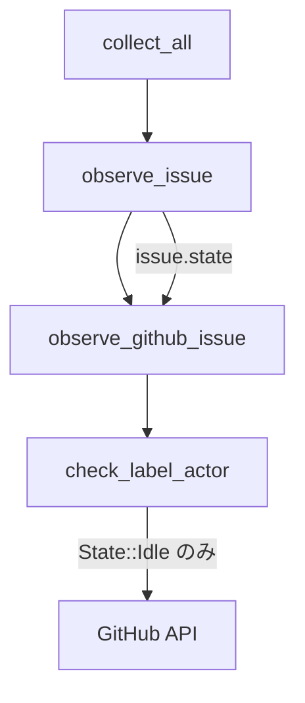
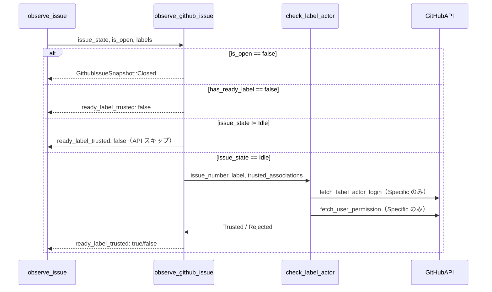

# Design Document

## Overview

本機能は、ポーリングループにおける不要な GitHub API 呼び出し（`check_label_actor`）を削減するシンプルな最適化である。

`ready_label_trusted` の結果を利用するのは `decide_idle` のみであるため、`issue.state == State::Idle` の場合のみ `check_label_actor` を呼ぶよう `observe_github_issue` を変更する。
これにより、active・terminal 状態が継続する issue において、1 サイクルあたり 2 回の GitHub API 呼び出し（Timeline API + Permission API）が削減される。

**変更スコープ**: `src/application/polling/collect.rs` の `observe_github_issue` 関数のシグネチャ変更と条件分岐追加、および既存・新規テストの更新。

### Goals

- Idle 以外の状態における `check_label_actor` 呼び出しを完全に排除する
- Idle 状態における既存の信頼性検証フローを維持する
- 全 `State` variant に対するテストカバレッジを確保する

### Non-Goals

- TTL キャッシュ（#215）などのキャッシュ機構の導入
- `observe_github_issue` の責務の大規模な変更
- `State` enum への新 variant 追加

## Requirements Traceability

| Requirement | Summary | Components | Interfaces | Flows |
|-------------|---------|------------|------------|-------|
| 1.1 | Idle + ready_label → check_label_actor 呼び出し | observe_github_issue | — | ラベルアクター検証フロー |
| 1.2 | 非 Idle + ready_label → check_label_actor スキップ | observe_github_issue | — | ラベルアクター検証フロー |
| 1.3 | Cancelled → Idle 後の次サイクルで正常動作 | observe_issue | — | ポーリングサイクル |
| 1.4 | observe_issue が issue.state を渡す | observe_issue → observe_github_issue | State 引数 | — |
| 2.1 | TrustedAssociations::All → API 非呼び出しで trusted | observe_github_issue | association_guard | — |
| 2.2 | TrustedAssociations::Specific → Timeline + Permission API 呼び出し | observe_github_issue | association_guard | — |
| 2.3 | ready_label なし → trusted: false, API 非呼び出し | observe_github_issue | — | — |
| 2.4 | API エラー時 → 警告ログ + untrusted 扱い | observe_github_issue | — | — |
| 3.1 | 非 Idle 全 variant でのテスト | テスト (collect.rs) | — | — |
| 3.2 | Idle + ready_label + Specific でのテスト | テスト (collect.rs) | — | — |
| 3.3 | Idle + ready_label なしでのテスト | テスト (collect.rs) | — | — |

## Architecture

### Existing Architecture Analysis

`observe_github_issue` は `collect.rs` の application レイヤー内部関数。呼び出し連鎖は以下の通り:

```
collect_all
  └─ observe_issue(issue: &Issue, is_open, labels)
       └─ observe_github_issue(github, config, issue_number, is_open, labels)
```

`observe_issue` は `issue: &Issue` を保持しており、`issue.state` を直接参照可能。

### Architecture Pattern & Boundary Map



**Key Decisions**:
- `observe_github_issue` に `issue_state: State` を追加（最小限のシグネチャ変更）
- `issue.state == State::Idle` かつ `has_ready_label == true` の場合のみ `check_label_actor` を呼ぶ
- それ以外は `ready_label_trusted = false` を設定し API コールをスキップ

### Technology Stack

| Layer | Choice / Version | Role in Feature | Notes |
|-------|------------------|-----------------|-------|
| Application | Rust / collect.rs | observe_github_issue の条件分岐変更 | application レイヤー内の変更のみ |
| Domain | State enum | Idle 判定 | 新規追加なし |

## System Flows

### ラベルアクター検証フロー（変更後）



## Components and Interfaces

| Component | Domain/Layer | Intent | Req Coverage | Key Dependencies | Contracts |
|-----------|--------------|--------|--------------|------------------|-----------|
| observe_github_issue | Application | issue_state に基づき check_label_actor の呼び出しを制御 | 1.1, 1.2, 1.3, 1.4, 2.1, 2.2, 2.3, 2.4 | check_label_actor (P1) | Service |
| observe_issue | Application | issue.state を observe_github_issue に伝達 | 1.4 | observe_github_issue (P0) | — |

### Application Layer

#### observe_github_issue

| Field | Detail |
|-------|--------|
| Intent | `issue_state` が `Idle` の場合のみ `check_label_actor` を呼び出し、それ以外は即座に `ready_label_trusted: false` を返す |
| Requirements | 1.1, 1.2, 1.3, 1.4, 2.1, 2.2, 2.3, 2.4 |

**Responsibilities & Constraints**
- `issue_state: State` 引数を受け取り、`State::Idle` かどうかを判定する
- `State::Idle` 以外かつ `has_ready_label == true` の場合は `ready_label_trusted = false` とし、外部 API を呼ばない
- `State::Idle` かつ `has_ready_label == true` の場合のみ既存ロジックで `check_label_actor` を呼ぶ

**Dependencies**
- Inbound: `observe_issue` — `issue.state` を渡す (P0)
- Outbound: `check_label_actor` — ラベルアクターの信頼検証 (P1, Idle 状態のみ)

**Contracts**: Service [x]

##### Service Interface

```rust
// 変更後のシグネチャ（概念）
async fn observe_github_issue<G: GitHubClient>(
    github: &G,
    config: &Config,
    issue_number: u64,
    issue_state: State,   // 追加
    is_open: bool,
    labels: Option<&[String]>,
) -> Result<GithubIssueSnapshot>
```

- Preconditions: `is_open == true` の場合に `labels` は `Some`
- Postconditions: `issue_state != State::Idle` の場合、`ready_label_trusted` は必ず `false`
- Invariants: `has_ready_label == false` の場合、常に `ready_label_trusted: false`（state によらず）

**Implementation Notes**
- Integration: `observe_issue` 内の `observe_github_issue` 呼び出し箇所に `issue.state` を追加するだけ
- Validation: `is_open == false` の場合は引き続き即座に `GithubIssueSnapshot::Closed` を返す（変更なし）
- Risks: なし（変更範囲が非常に限定的）

## Testing Strategy

### Unit Tests

変更する `observe_github_issue` のテストを `collect.rs` 内の `#[cfg(test)] mod tests` で行う。

1. **非 Idle 状態 + ready_label あり → API 非呼び出し**: `State::all()` から `State::Idle` を除いた全 variant に対して、`fetch_label_actor_login` が呼ばれないことを検証（パラメータ化テスト）
2. **Idle + ready_label + Specific → API 呼び出し**: 既存テスト `open_issue_with_ready_label_calls_permission_api` を `issue_state: State::Idle` を渡すよう更新
3. **Idle + ready_label なし → API 非呼び出し**: 既存テスト `open_issue_without_ready_label_is_not_trusted` を `issue_state: State::Idle` を渡すよう更新
4. **closed issue → API 非呼び出し**: 既存テスト `closed_issue_returns_closed_snapshot` を更新（`issue_state` は任意の値でよい）
