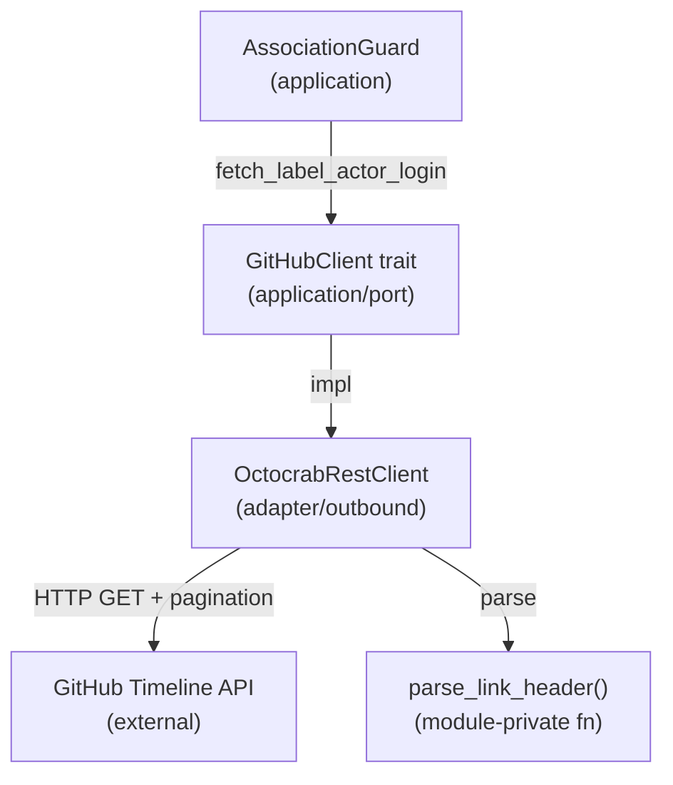

# Design Document

## Overview

本機能は `fetch_label_actor_login()` に GitHub Timeline API の Linkヘッダーページネーションを追加する。現状は最大 100 件しか取得できないため、長寿命 issue（100 件超のタイムラインイベント）では `agent:ready` ラベル付与イベントが検索範囲外に押し出され、trust 判定が silent 失敗する。

変更スコープは `src/adapter/outbound/github_rest_client.rs` 内の1メソッドに限定される。Clean Architecture の adapter/outbound 層の責務範囲内であり、application 層のポートインターフェース（`GitHubClient` trait）への変更は不要。

### Goals

- Linkヘッダーの `rel="next"` を辿り全ページのイベントを取得する
- 最大 10 ページ（最大 1000 イベント）の上限で無限ループを防止する
- 既存の逆順検索ロジック（`.rev()`）との整合性を維持する

### Non-Goals

- `GitHubClient` ポートトレイトのインターフェース変更
- Review Thread Comments や他 API へのページネーション対応（既知の制限として docs に記載済み）
- ページネーション上限の設定ファイル化

## Architecture

### Existing Architecture Analysis

`fetch_label_actor_login()` は `src/adapter/outbound/github_rest_client.rs` の `OctocrabRestClient` に実装されており、`src/application/association_guard.rs` の `AssociationGuard` から呼び出される。変更は adapter 層の実装詳細に閉じており、application 層のポート定義（`GitHubClient` trait の `fetch_label_actor_login` シグネチャ）に変更を加えない。

### Architecture Pattern & Boundary Map



**Architecture Integration**:
- 変更対象: `OctocrabRestClient::fetch_label_actor_login()` — ループ構造の追加
- 新規追加: `parse_link_header()` — `github_rest_client.rs` 内のプライベート関数
- 既存パターン保持: `list_open_issues()` と同様のページネーションループ構造を踏襲
- Clean Architecture 準拠: adapter 層の実装詳細の変更のみ

### Technology Stack

| Layer | Choice / Version | Role in Feature | Notes |
|-------|------------------|-----------------|-------|
| adapter/outbound | reqwest (既存) | HTTP リクエスト発行・ヘッダー取得 | 既存 `http_client` フィールドを使用 |
| adapter/outbound | serde_json (既存) | レスポンス JSON パース | 変更なし |

## System Flows

```mermaid
sequenceDiagram
    participant AG as AssociationGuard
    participant ORC as OctocrabRestClient
    participant GH as GitHub Timeline API

    AG->>ORC: fetch_label_actor_login(issue_number, label_name)
    ORC->>GH: GET /timeline?per_page=100 (page 1)
    GH-->>ORC: events[] + Link: <page2>; rel="next"
    ORC->>ORC: link_header を保存 → body 消費 → events 収集

    ORC->>GH: GET /timeline?per_page=100&page=2
    GH-->>ORC: events[] (Link なし)
    ORC->>ORC: link_header を保存 → body 消費 → events 収集

    ORC->>ORC: 全イベントを .rev() で逆順検索
    ORC-->>AG: Ok(Some("actor_login"))
```

ページ上限（10ページ）に達した場合、またはレスポンスに `rel="next"` が存在しない場合にループを終了する。

## Requirements Traceability

| Requirement | Summary | Components | Interfaces | Flows |
|-------------|---------|------------|------------|-------|
| 1.1 | 全ページ取得ループ | OctocrabRestClient | fetch_label_actor_login | ページネーションループ |
| 1.2 | 全イベント結合後に逆順検索 | OctocrabRestClient | fetch_label_actor_login | 逆順検索 |
| 1.3 | rel="next" なしでループ終了 | parse_link_header, OctocrabRestClient | — | ループ終了条件 |
| 1.4 | headers を body 消費前に保存 | OctocrabRestClient | — | headers 取得順序 |
| 2.1 | 最大ページ数上限 | OctocrabRestClient, TIMELINE_MAX_PAGES | — | ページカウント |
| 2.2 | 上限到達時もエラーにしない | OctocrabRestClient | — | ループ終了条件 |
| 2.3 | 上限値を定数として定義 | TIMELINE_MAX_PAGES定数 | — | — |
| 3.1–3.5 | テスト網羅 | テストモジュール | MockServer | 各テストケース |

## Components and Interfaces

### adapter/outbound

#### OctocrabRestClient::fetch_label_actor_login（変更）

| Field | Detail |
|-------|--------|
| Intent | Timeline API を全ページ取得し、指定ラベルの最終付与 actor login を返す |
| Requirements | 1.1, 1.2, 1.3, 1.4, 2.1, 2.2 |

**Responsibilities & Constraints**
- `per_page=100` で Timeline API を呼び出し、Link ヘッダーの `rel="next"` を辿る
- `TIMELINE_MAX_PAGES` に達した場合はそれ以降のページ取得を打ち切る
- `reqwest::Response` のヘッダーを body（`resp.json()`）消費前に文字列として保存する
- 全ページのイベントを `Vec<serde_json::Value>` に収集し、逆順で `labeled` イベントを検索する

**Dependencies**
- External: GitHub REST API `/repos/{owner}/{repo}/issues/{number}/timeline` — ページネーション対応 Timeline エンドポイント (P0)

**Contracts**: Service [x]

##### Service Interface

```rust
// シグネチャは変更なし
async fn fetch_label_actor_login(
    &self,
    issue_number: u64,
    label_name: &str,
) -> Result<Option<String>>
```

- Preconditions: `issue_number` は有効な GitHub Issue 番号、`label_name` は非空文字列
- Postconditions: 指定ラベルの最終付与 actor login を返す。見つからない場合は `Ok(None)`
- Invariants: HTTP エラー時は `Err` を返す

**Implementation Notes**
- Integration: `let link = resp.headers().get("link").and_then(|v| v.to_str().ok()).map(String::from);` の後に `resp.json().await` を呼ぶ
- Risks: GitHub が Link ヘッダーフォーマットを変更した場合にパースが失敗する可能性（テストで検証）

#### parse_link_header（新規追加）

| Field | Detail |
|-------|--------|
| Intent | `Link` ヘッダー文字列から指定 rel の URL を抽出する |
| Requirements | 1.3 |

**Responsibilities & Constraints**
- `github_rest_client.rs` 内のモジュールプライベート関数
- RFC 5988 形式の Link ヘッダー文字列を受け取り、指定 `rel` の URL を返す
- `rel="next"` が存在しない場合は `None` を返す

**Contracts**: Service [x]

##### Service Interface

```rust
fn parse_link_header(header: &str, rel: &str) -> Option<String>
```

- Preconditions: `header` は GitHub API が返す Link ヘッダー文字列
- Postconditions: 指定 rel に対応する URL を返す。存在しない場合は `None`

#### TIMELINE_MAX_PAGES 定数（新規追加）

| Field | Detail |
|-------|--------|
| Intent | Timeline API のページネーション上限値を定義する |
| Requirements | 2.1, 2.3 |

```rust
const TIMELINE_MAX_PAGES: usize = 10;
```

## Error Handling

### Error Strategy

既存の `anyhow::Result` ベースのエラー伝播パターンを踏襲する。

### Error Categories and Responses

**System Errors**: HTTP リクエスト失敗 → `anyhow!` で `Err` を返す。既存実装と同様のパターン。ページネーション上限到達はエラーとせず、取得済みイベントで処理を継続する。

## Testing Strategy

### Unit Tests（github_rest_client.rs 内 `#[cfg(test)]` ブロック）

- `parse_link_header()` の正常系: `rel="next"` を含む Link ヘッダーから URL を抽出
- `parse_link_header()` の異常系: `rel="next"` が存在しない場合に `None` を返す
- `parse_link_header()` の複合ヘッダー: `rel="next"` と `rel="last"` が混在する場合

### Integration Tests（mock HTTP サーバー使用）

- 2ページ取得テスト: ページ 1 に `Link: <page2>; rel="next"` を含む場合、ページ 2 のイベントも取得できる
- 2ページ目での actor 検索: ページ 2 に `labeled` イベントが存在する場合、actor login が返される
- 単一ページ終了テスト: `rel="next"` が存在しない場合にループが終了する
- 最大ページ数上限テスト: `TIMELINE_MAX_PAGES` ページに達した場合、それ以降のリクエストが送られない
