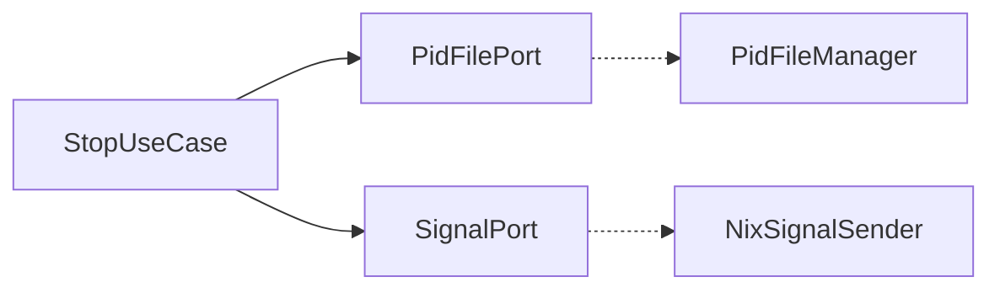
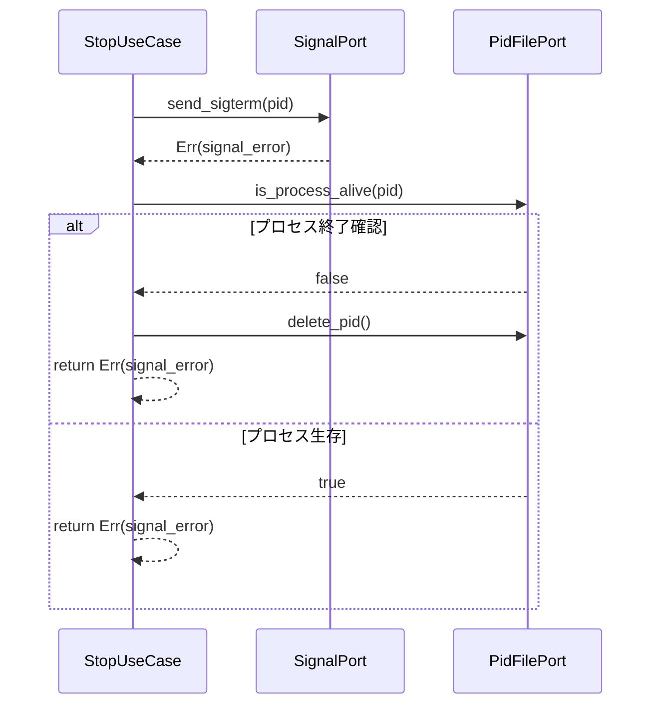

# Design Document: issue-258 — StopUseCase PID ファイルリーク修正

## Overview

`StopUseCase::execute()` において `send_sigterm()` または `send_sigkill()` がエラーを返した際、即座に `?` で伝播するため `delete_pid()` が呼ばれずステール PID ファイルが残留するバグを修正する。

プロセスが確認できない状況（EPERM、カーネル競合など）でシグナル送信が失敗した場合でも、`is_process_alive()` でプロセスの終了を確認した上で `delete_pid()` を呼び出すことで、PID ファイルが必ずクリーンアップされる保証を与える。

修正範囲は `src/application/stop_use_case.rs` の 2 箇所のみ。新しい型・依存関係・インターフェース変更は一切発生しない。

### Goals

- シグナル送信失敗 + プロセス終了確認のケースで PID ファイルを確実に削除する
- 既存の正常停止フロー（T-6.SP.*）に対してリグレッションを起こさない
- テストでシグナル失敗パスのクリーンアップ動作を検証する

### Non-Goals

- `SignalPort` や `PidFilePort` インターフェースの変更
- RAII ガード構造体の導入（将来拡張として research.md に記録）
- SIGKILL 後にもプロセスが生存している場合の挙動変更（既存通り `StopError::Signal` を返す）

## Architecture

### Existing Architecture Analysis

`StopUseCase` は Clean Architecture の application 層に属し、`PidFilePort` および `SignalPort` という 2 つのアウトバウンドポートに依存する。既存コードは正常パスと InvalidPid・StalePid パスでは `delete_pid()` を適切に呼び出しているが、シグナル送信エラーパスのみ漏れていた。

### Architecture Pattern & Boundary Map



- **修正箇所**: `StopUseCase::execute()` のシグナル送信直後のエラーパス（2 箇所）
- **既存境界の維持**: application / adapter 境界は変化なし。ポートトレイトは変更しない
- **新コンポーネント**: なし

### Technology Stack

| Layer | Choice / Version | Role in Feature |
|-------|-----------------|-----------------|
| Application | Rust (Edition 2024) | `StopUseCase` 修正 |
| Port | `PidFilePort`, `SignalPort` (既存) | クリーンアップと生死確認の API |

## System Flows

### 修正後のシグナル失敗パス



同様のフローが `send_sigkill()` 失敗パスにも適用される。

## Requirements Traceability

| Requirement | Summary | コンポーネント | フロー |
|-------------|---------|--------------|-------|
| 1.1 | SIGTERM 失敗 + プロセス終了確認 → delete_pid | StopUseCase | シグナル失敗パス |
| 1.2 | SIGKILL 失敗 + プロセス終了確認 → delete_pid | StopUseCase | シグナル失敗パス |
| 1.3 | シグナル失敗 + プロセス生存 → delete_pid 不呼出し | StopUseCase | シグナル失敗パス |
| 1.4 | delete_pid エラーはログ記録し、シグナルエラーを優先 | StopUseCase | エラー処理 |
| 2.1 | 正常 SIGTERM パスは変更なし | StopUseCase | 正常停止フロー |
| 2.2 | 正常 SIGKILL パスは変更なし | StopUseCase | SIGKILL 強制終了フロー |
| 2.3 | T-6.SP.* リグレッションなし | StopUseCase | 全既存テスト |
| 3.1 | SIGTERM 失敗 + プロセス死亡のテスト | テストモジュール | — |
| 3.2 | SIGKILL 失敗 + プロセス死亡のテスト | テストモジュール | — |
| 3.3 | SIGTERM 失敗 + プロセス生存のテスト | テストモジュール | — |

## Components and Interfaces

| Component | Domain/Layer | Intent | Req Coverage | Key Dependencies | Contracts |
|-----------|-------------|--------|-------------|-----------------|-----------|
| StopUseCase | Application | デーモン停止オーケストレーション | 1.1–1.4, 2.1–2.3 | PidFilePort (P0), SignalPort (P0) | Service |

### Application Layer

#### StopUseCase

| Field | Detail |
|-------|--------|
| Intent | シグナル送信失敗時も含むすべての停止パスで PID ファイルを整合的に管理する |
| Requirements | 1.1, 1.2, 1.3, 1.4, 2.1, 2.2, 2.3 |

**Responsibilities & Constraints**

- `send_sigterm()` / `send_sigkill()` のエラーパスにおいて `is_process_alive()` でプロセスの終了を確認し、終了済みであれば `delete_pid()` を呼び出す
- プロセスがまだ生存している場合は PID ファイルを削除しない（正当な残留）
- `delete_pid()` のクリーンアップ失敗は `tracing::warn!` でログ記録し、元のシグナルエラーを上位に返す（エラーを隠蔽しない）

**Dependencies**

- Inbound: CLI handler — `stop` サブコマンドから呼び出し (P0)
- Outbound: `PidFilePort` — PID 読み取り・削除・プロセス生死確認 (P0)
- Outbound: `SignalPort` — SIGTERM / SIGKILL 送信 (P0)

**Contracts**: Service [x]

##### Service Interface

修正後の `execute()` メソッドの事前・事後条件:

```
fn execute(&self) -> Result<StopResult, StopError>
```

- **Preconditions**: PID ファイルが存在するか存在しないか（いずれも正常入力）
- **Postconditions (成功時)**: `StopResult` を返し、PID ファイルは削除済み
- **Postconditions (エラー時)**: `StopError` を返す。プロセスが終了済みであれば PID ファイルは削除済み。プロセスが生存中であれば PID ファイルは維持される
- **Invariants**: `delete_pid()` は「プロセスが終了済みであること」が確認された場合にのみ呼び出される

**Implementation Notes**

- 修正は `?` によるエラー伝播を `if let Err(e) = ...` ブロックに置き換えることで実現する
- 置き換えは `send_sigterm(pid)` (line 42) と `send_sigkill(pid)` (line 59) の 2 箇所
- `delete_pid()` の呼び出しは `let _ = ... ; if let Err(de) = ... { tracing::warn!(...) }` パターンで副作用を明示
- 既存の正常パス（line 52, 70）の `delete_pid()` 呼び出しは変更しない

## Error Handling

### Error Strategy

シグナル送信エラーパスでのクリーンアップ失敗は二次的エラーとして扱い、一次エラー（シグナル送信失敗）を呼び出し元に返す。

### Error Categories and Responses

| エラー種別 | 発生条件 | 処理方針 |
|-----------|---------|---------|
| `StopError::Signal` (シグナル送信失敗) | EPERM 等でシグナル送信不可 | プロセス終了確認後 delete_pid → 返す |
| `PidFileError::Delete` (削除失敗) | クリーンアップパスでの副次的失敗 | `tracing::warn!` でログ記録し swallow |

### Monitoring

- `tracing::warn!(pid, "failed to delete PID file after signal error: {e}")` でクリーンアップ失敗を可観測にする

## Testing Strategy

### Unit Tests

1. **T-258-1**: `send_sigterm()` が Err を返し、プロセスが死亡している場合に `delete_pid()` が呼ばれること
2. **T-258-2**: `send_sigkill()` が Err を返し、プロセスが死亡している場合に `delete_pid()` が呼ばれること
3. **T-258-3**: `send_sigterm()` が Err を返し、プロセスが生存している場合に `delete_pid()` が呼ばれないこと
4. **T-6.SP.* リグレッション**: 既存テスト全件通過の確認（修正後に `devbox run test` で検証）

各テストは `MockPidFile` に `deleted: Arc<Mutex<bool>>` フラグを追加した変形 mock を使用し、`delete_pid()` 呼び出しの有無を検証する。
