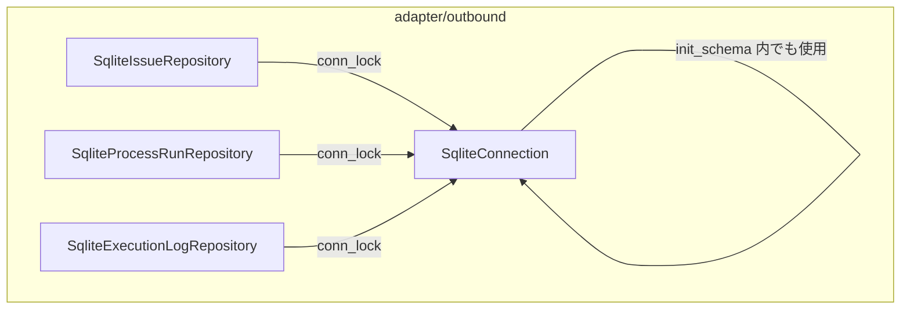

# Design Document — SQLiteリポジトリ Mutexロック毒化の致命的エラー処理

## Overview

本変更は、SQLiteリポジトリ層（`adapter/outbound/sqlite_*.rs`）における Mutex ロック取得コードの誤ったエラー処理を修正する。現状は `.lock().map_err(|e| anyhow::anyhow!(...))` でロック毒化エラーを通常の `anyhow::Error` としてラップし、呼び出しコードが `?` で伝播・リトライ可能な状態にしている。ロック毒化は前スレッドがクリティカルセクション内でパニックした場合にのみ発生する回復不可能な致命的状態であり、即時 `panic!` が正しい対処である。

**Users**: Cupola デーモン。SQLiteリポジトリを通じて Issue 状態・プロセス実行記録・実行ログを永続化する。  
**Impact**: 現在の誤ったエラーハンパリングコードを修正し、深刻なシステム障害を早期検出できるようにする。データ・スキーマ・永続化モデルへの変更は一切ない。

### Goals

- Mutex ロック毒化を `panic!` で即時終了させる（致命的状態を正しく扱う）
- ロック取得ロジックを `SqliteConnection::conn_lock()` に集約し、全リポジトリで統一する
- パニック時のメッセージとコメントでロック毒化が致命的な理由を明記する

### Non-Goals

- SQLite 接続の pooling や並列化
- ロック競合（非毒化時のタイムアウト）への対処
- エラーリカバリやグレースフルシャットダウンのトリガー（今後の課題）
- テストコードの `.expect()` 使用パターンの変更

## Architecture

### Existing Architecture Analysis

`SqliteConnection` は `Arc<Mutex<Connection>>` を内包し、各リポジトリに `Clone` 渡しされる。リポジトリはすべて `tokio::task::spawn_blocking` 内でロックを取得する。現状の `conn()` メソッドは `&Arc<Mutex<Connection>>` を返すため、呼び出し側が `.lock()` と毒化エラー処理を担っている。

### Architecture Pattern & Boundary Map



**Architecture Integration**:
- 選択パターン: `SqliteConnection` に `conn_lock()` ヘルパーメソッドを追加するファサード拡張
- 境界: アダプター層内で完結。ドメイン・アプリケーション層への影響なし
- 既存パターンの維持: `spawn_blocking` パターン、`Arc<Mutex<Connection>>` の内包構造は変更しない
- 新規コンポーネントの根拠: `conn_lock()` は Mutex 毒化のパニック処理を1箇所に集約するためのラッパー

### Technology Stack

| Layer | 採用技術 | 本機能での役割 | Notes |
|-------|----------|---------------|-------|
| Data / Storage | rusqlite + `std::sync::Mutex` | ロック取得処理の変更対象 | Mutex PoisonError を正しくパニックに変換 |

## Requirements Traceability

| Requirement | Summary | Components | Interfaces | Flows |
|-------------|---------|------------|------------|-------|
| 1.1 | 毒化時にパニック | `SqliteConnection::conn_lock()` | `conn_lock()` メソッド | ロック取得パス |
| 1.2 | anyhow エラーとして伝播しない | 全リポジトリの `.lock()` 呼び出し箇所 | `conn_lock()` | ロック取得パス |
| 1.3 | 致命的理由のコメント | `SqliteConnection::conn_lock()` | — | — |
| 1.4 | ヘルパーメソッドへの集約 | `SqliteConnection` | `conn_lock()` | — |
| 2.1 | 毒化時パニックのテスト | `sqlite_connection.rs` のテストモジュール | `conn_lock()` | — |
| 2.2 | 正常動作のリグレッション | 既存のすべてのテスト | 全リポジトリメソッド | — |
| 2.3 | `conn_lock()` の直接テスト | `sqlite_connection.rs` のテストモジュール | `conn_lock()` | — |

## Components and Interfaces

| Component | Layer | Intent | Req Coverage | Key Dependencies | Contracts |
|-----------|-------|--------|--------------|------------------|-----------|
| `SqliteConnection::conn_lock()` | adapter/outbound | 毒化時パニック付きロック取得 | 1.1, 1.2, 1.3, 1.4 | `std::sync::Mutex` (P0) | Service |
| 全 `sqlite_*_repository.rs` 呼び出しサイト | adapter/outbound | `conn_lock()` を使用するよう置換 | 1.2, 2.2 | `SqliteConnection` (P0) | — |
| テスト: 毒化シナリオ | adapter/outbound (test) | `conn_lock()` の `#[should_panic]` テスト | 2.1, 2.3 | `std::thread` (P1) | — |

### adapter/outbound

#### SqliteConnection（拡張）

| Field | Detail |
|-------|--------|
| Intent | Mutex ロック取得を集約し、毒化時はパニックする安全なラッパーメソッドを提供する |
| Requirements | 1.1, 1.2, 1.3, 1.4 |

**Responsibilities & Constraints**
- `conn_lock()` は `std::sync::MutexGuard<'_, rusqlite::Connection>` を返す
- ロック毒化（`PoisonError`）が発生した場合、即座に `panic!` する
- パニックメッセージは毒化の事実と原因（前スレッドのパニック）を明記する
- 既存の `conn()` メソッド（`&Arc<Mutex<Connection>>` を返す）はテストコード用に残す

**Dependencies**
- Internal: `std::sync::Mutex<rusqlite::Connection>` — ロックの実体（P0）

**Contracts**: Service [x]

##### Service Interface

```rust
impl SqliteConnection {
    /// Mutexロックを取得して返す。
    ///
    /// # Panics
    /// Mutexが毒化している場合（前スレッドがクリティカルセクション内でパニック
    /// した場合）にパニックする。ロック毒化は回復不可能な致命的状態であり、
    /// 通常のエラーとして扱ってはならない。
    pub fn conn_lock(&self) -> std::sync::MutexGuard<'_, rusqlite::Connection>;
}
```

- Preconditions: `self.conn` が有効な `Arc<Mutex<Connection>>` を保持していること
- Postconditions: 毒化していない場合、有効な `MutexGuard` を返す
- Invariants: 毒化している場合、必ず `panic!` する（`Err` を返さない）

**Implementation Notes**
- Integration: `unwrap_or_else(|e| panic!("database Mutex poisoned: ...: {e}"))` を使用（`expect_used = "deny"` のため `.expect()` は不可）
- Validation: 既存の全テストが `conn_lock()` 使用後も通過することを確認
- Risks: `spawn_blocking` タスク内でパニックすると `JoinError` が上位に伝播する。これは意図した動作（致命的エラーの早期検出）

## Error Handling

### Error Strategy

Mutex ロック毒化は回復不可能なプログラムエラーであるため、`panic!` マクロによる即時終了を採用する。これは Rust の慣習的な処理方法であり、`unwrap_or_else(|e| panic!(...))` パターンで実装する。

### Error Categories and Responses

| カテゴリ | 発生条件 | 処理 |
|----------|----------|------|
| Mutex ロック毒化 | 前スレッドがクリティカルセクション内でパニック | `panic!("database Mutex poisoned: ...")` |
| 通常の DB エラー | SQL 文エラー、制約違反など | 変更なし（既存の `anyhow::Error` 伝播を維持） |

### Monitoring

パニックは tokio の `JoinError` として上位に伝播し、ポーリングループのエラーログに記録される。運用上は "Mutex poisoned" を含むパニックメッセージがログに出現した場合、デーモンの異常終了として扱う。

## Testing Strategy

### Unit Tests（`sqlite_connection.rs` のテストモジュール）

1. `conn_lock_panics_on_poisoned_mutex` — Mutex を手動で毒化し、`conn_lock()` 呼び出しで `#[should_panic(expected = "poisoned")]` を検証
2. `conn_lock_succeeds_on_healthy_mutex` — 毒化していない `SqliteConnection` で `conn_lock()` が正常に `MutexGuard` を返すことを検証

### リグレッションテスト

既存の全テストスイート（`sqlite_issue_repository.rs`、`sqlite_process_run_repository.rs`、`sqlite_execution_log_repository.rs`、`sqlite_connection.rs` のテスト）が `conn_lock()` 移行後もすべて通過することを確認する。
