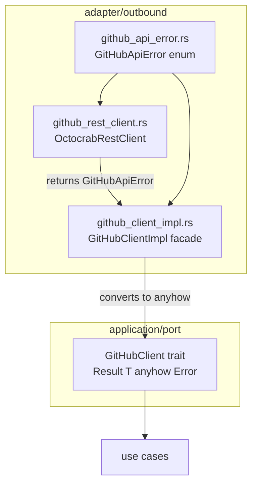
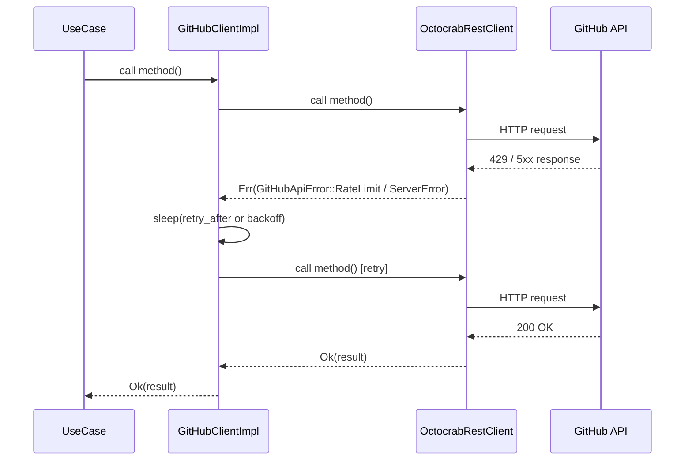
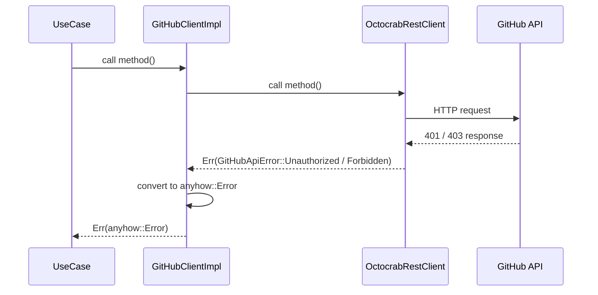

# Design Document: GitHubApiError 型付きエラー enum の導入

## Overview

本機能は `src/adapter/outbound/github_rest_client.rs` における HTTP エラーの型付き分類と、それに基づくアダプター内リトライロジックを実現する。

現在 5 箇所の HTTP エラーサイトがすべて `anyhow!()` に畳まれているため、呼び出し側が 429 / 401 / 403 / 5xx を区別できない。`GitHubApiError` enum を `thiserror` で定義し、変換・リトライをアダプター層に封じ込めることで、ポートトレイト `GitHubClient` のインターフェースを変えずに問題を解決する。

**Impact**: アダプター層のみの変更。ユースケースやドメインコードへの変更は不要。既存のポートトレイト境界は `anyhow::Result<T>` のまま維持される。

### Goals

- `GitHubApiError` enum により HTTP エラー種別をコンパイル時に保証する
- 429 (Rate Limit) / 5xx (Server Error) を自動リトライする
- 401 / 403 を受け取った際は即時エラーとして伝播する
- ポートトレイト `GitHubClient` の署名を変更しない

### Non-Goals

- ポートトレイト `GitHubClient` の戻り値を `Result<T, GitHubClientError>` に変更すること（#166 のスコープ）
- GraphQL クライアント (`github_graphql_client.rs`) のエラー型付け
- アプリケーション層でのエラー種別分岐

## Architecture

### Existing Architecture Analysis

現在のエラー伝播経路:

```
OctocrabRestClient (anyhow::Result<T>)
  → GitHubClientImpl [facade] (anyhow::Result<T>)
  → GitHubClient port trait (anyhow::Result<T>)
  → use cases
```

5 箇所のエラーサイトは `if !resp.status().is_success()` パターンで検出され、すべて `anyhow!()` で生成される。404 については 2 メソッドで早期 `Ok(...)` を返す idempotent 処理がある。

### Architecture Pattern & Boundary Map



**Key Decisions**:
- `GitHubApiError` は `src/adapter/outbound/github_api_error.rs` に定義（単一責任）
- `OctocrabRestClient` のメソッドは `Result<T, GitHubApiError>` を返す内部型として使用
- `GitHubClientImpl` がリトライロジックを持ち、ポート境界で `anyhow::Error` に変換
- Clean Architecture の依存方向は維持される

### Technology Stack

| レイヤー | ライブラリ | 役割 | 備考 |
|----------|-----------|------|------|
| adapter/outbound | thiserror | `GitHubApiError` の derive | tech.md では domain/app 向けだが、内部型として問題なし |
| adapter/outbound | reqwest | `Retry-After` ヘッダー取得 | 既存依存 |
| adapter/outbound | tokio::time | 非同期 sleep によるリトライ待機 | 既存依存 |

## System Flows

### リトライシーケンス (429 / 5xx の場合)



### エラー即時伝播 (401 / 403 の場合)



## Requirements Traceability

| Requirement | Summary | Components | Flows |
|-------------|---------|------------|-------|
| 1.1–1.8 | GitHubApiError enum の定義とバリアント | GitHubApiError | — |
| 2.1–2.7 | HTTP ステータスからの変換と既存エラーサイトの更新 | GitHubApiError, OctocrabRestClient | — |
| 3.1–3.6 | リトライロジック | GitHubClientImpl | リトライシーケンス |
| 4.1–4.4 | 後方互換性の維持 | GitHubClientImpl, GitHubClient port | — |

## Components and Interfaces

### コンポーネント概要

| Component | Layer | Intent | Req Coverage |
|-----------|-------|--------|--------------|
| GitHubApiError | adapter/outbound | HTTP エラーの型付き分類 | 1.1–1.8, 2.1–2.6 |
| OctocrabRestClient (更新) | adapter/outbound | 5 エラーサイトを GitHubApiError に変換 | 2.7, 4.3 |
| GitHubClientImpl (更新) | adapter/outbound | リトライロジック + anyhow 変換 | 3.1–3.6, 4.1–4.2 |

### adapter/outbound

#### GitHubApiError

| Field | Detail |
|-------|--------|
| Intent | GitHub HTTP API エラーをバリアント別に型付けし、リトライ可否を判断できるようにする |
| Requirements | 1.1, 1.2, 1.3, 1.4, 1.5, 1.6, 1.7, 1.8, 2.1, 2.2, 2.3, 2.4, 2.5, 2.6 |

**Responsibilities & Constraints**
- `thiserror::Error` を derive し、各バリアントに `#[error(...)]` メッセージを定義する
- `GitHubApiError` は `std::error::Error` を実装するため、anyhow の汎用 `From<E: Error>` 実装によって `anyhow::Error` に包むことができ、`?` 演算子で `anyhow::Result` に変換可能
- HTTP ステータスコードと必要なヘッダー (Retry-After) を受け取り適切なバリアントを返す変換関数を公開する

**Dependencies**
- External: `thiserror` — Error derive (P0)
- External: `reqwest::StatusCode` — ステータスコード型 (P0)
- External: `std::time::Duration` — `retry_after` フィールド型 (P0)

**Contracts**: Service [x]

##### Service Interface

```rust
#[derive(Debug, thiserror::Error)]
pub enum GitHubApiError {
    #[error("rate limit exceeded (retry after {retry_after:?})")]
    RateLimit { retry_after: Option<Duration> },
    #[error("unauthorized: check token")]
    Unauthorized,
    #[error("forbidden: {0}")]
    Forbidden(String),
    #[error("server error (5xx): {status}")]
    ServerError { status: StatusCode },
    #[error("not found: {resource}")]
    NotFound { resource: String },
    #[error("other: {0}")]
    Other(#[from] anyhow::Error),
}

/// HTTP ステータスコード・ボディ・ヘッダーから GitHubApiError に変換する
pub fn classify_http_error(
    status: StatusCode,
    body: String,
    retry_after: Option<Duration>,
    resource: &str,
) -> GitHubApiError;
```

- Preconditions: `status.is_success()` が false であること
- Postconditions: バリアントは `status` に基づいて一意に決定される
- Invariants: `NotFound` は `404` のときのみ返される

**Implementation Notes**
- Integration: `github_rest_client.rs` の 5 エラーサイトから呼び出す。各サイトで `resp.headers()` から `Retry-After` を読み取る
- Validation: `Retry-After` ヘッダーが数値でない場合は `None` として処理する
- Risks: `anyhow::Error` を `Other` バリアントに包む際に `From` ループが起きないよう注意（`thiserror` の `#[from]` は自動対処）

#### OctocrabRestClient (更新)

| Field | Detail |
|-------|--------|
| Intent | 既存の 5 エラーサイトを `classify_http_error` 経由で `GitHubApiError` に置き換える |
| Requirements | 2.7, 4.3 |

**Responsibilities & Constraints**
- `get_job_logs`、`fetch_label_actor_login`（2 箇所）、`fetch_user_permission`、`remove_label` の各エラーサイトを更新する
- `fetch_user_permission` と `remove_label` の 404 idempotent 処理は維持する（`classify_http_error` 呼び出し前に分岐）
- メソッドの公開シグネチャは `anyhow::Result<T>` のまま維持する（`GitHubApiError` は `.map_err(Into::into)` で変換）

**Implementation Notes**
- Risks: ページネーション上限エラー (`fetch_label_actor_login`) は HTTP ステータスとは無関係のため `GitHubApiError::Other` にラップする

#### GitHubClientImpl (更新)

| Field | Detail |
|-------|--------|
| Intent | ファサード層でリトライロジックを実装し、永続的エラーを `anyhow::Error` に変換する |
| Requirements | 3.1, 3.2, 3.3, 3.4, 3.5, 3.6, 4.1, 4.2 |

**Responsibilities & Constraints**
- `OctocrabRestClient` の呼び出しを汎用リトライラッパーで包む
- `GitHubApiError::RateLimit` → `retry_after` または 60 秒デフォルトで待機 → 最大 3 回リトライ
- `GitHubApiError::ServerError` → 指数バックオフ (1s → 2s → 4s) → 最大 3 回リトライ
- `GitHubApiError::Unauthorized` / `Forbidden` → 即時 `anyhow::Error` に変換して返す
- リトライごとに `tracing::warn!` でエラー種別・試行回数・待機時間をログ出力する
- `GitHubClient` ポートトレイトの戻り値 `anyhow::Result<T>` は変更しない

**Dependencies**
- Inbound: `GitHubClient` port trait — use cases からの呼び出し (P0)
- Outbound: `OctocrabRestClient` — 実際の HTTP 実行 (P0)
- External: `tokio::time::sleep` — 非同期待機 (P0)
- External: `tracing::warn!` — リトライログ (P1)

**Contracts**: Service [x]

##### Service Interface

```rust
/// リトライポリシーを適用してクロージャを実行する汎用ヘルパー
async fn with_retry<T, F, Fut>(
    op_name: &str,
    f: impl Fn() -> Fut,
) -> anyhow::Result<T>
where
    Fut: Future<Output = Result<T, GitHubApiError>>;
```

- Preconditions: `f` はリトライ安全（冪等）な HTTP 操作であること
- Postconditions: 成功時は `Ok(T)`、リトライ枯渇時は `Err(anyhow::Error)`
- Invariants: リトライ回数は最大 3 回。Unauthorized / Forbidden は即時返却

**Implementation Notes**
- Integration: `GitHubClientImpl` の各 `GitHubClient` trait メソッド実装内で `with_retry` を呼び出す
- Risks: `with_retry` を全メソッドに適用すると、idempotent でない操作 (例: ラベル削除) も含まれる。べき等でない操作については慎重にリトライ要否を判断する

## Error Handling

### Error Strategy

`GitHubApiError` バリアントごとの処理方針:

| バリアント | 処理 | 理由 |
|-----------|------|------|
| `RateLimit` | 待機後リトライ (最大 3 回) | 時間経過で解消する一時的エラー |
| `Unauthorized` | 即時伝播 | トークン無効 — リトライ無効 |
| `Forbidden` | 即時伝播 | 権限不足 — リトライ無効 |
| `ServerError` | 指数バックオフ後リトライ (最大 3 回) | 一時的なサーバー障害 |
| `NotFound` | 呼び出し元で処理 (idempotent か否か) | メソッド依存 |
| `Other` | 即時伝播 | 不明なエラー — リトライ判断不可 |

### Monitoring

- リトライ試行: `tracing::warn!(error, attempt, wait_secs, op_name)` でログ出力
- リトライ枯渇: `tracing::error!(error, op_name)` でログ出力

## Testing Strategy

### Unit Tests

- `classify_http_error` のバリアント分岐テスト (各ステータスコードに対するバリアント検証)
- `Retry-After` ヘッダーのパーステスト (数値・欠損・不正値)
- `with_retry` のリトライカウントテスト (mock で RateLimit / ServerError を n 回返したのち成功)
- `with_retry` の即時返却テスト (Unauthorized / Forbidden は 1 回で終了)

### Integration Tests

- `github_client_impl.rs` に対して mock `OctocrabRestClient` を注入し、429 → リトライ → 成功 のフローを検証
- 既存の integration tests がコンパイル・パスすることを確認
