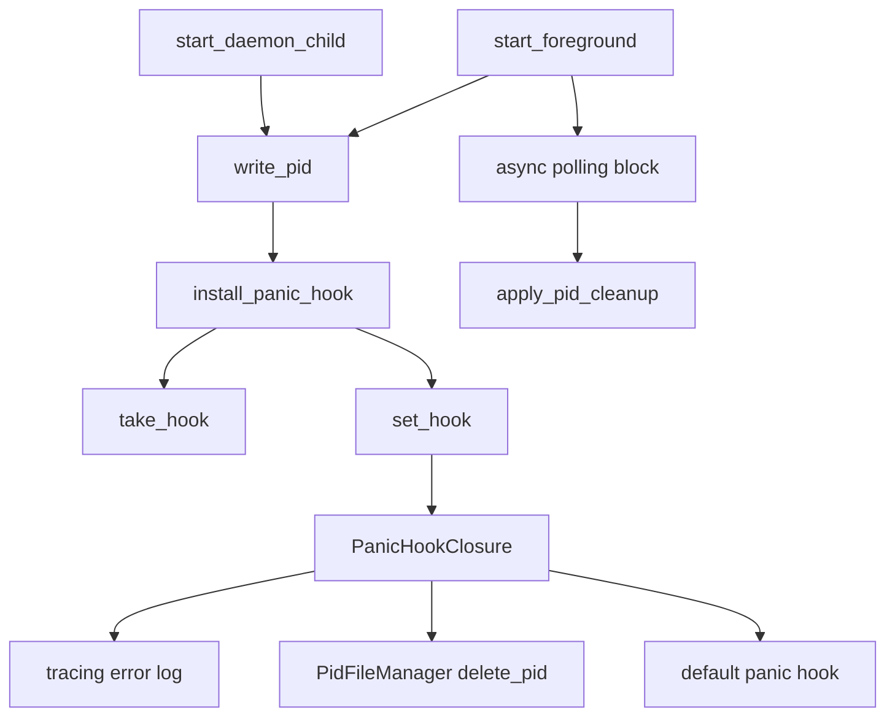
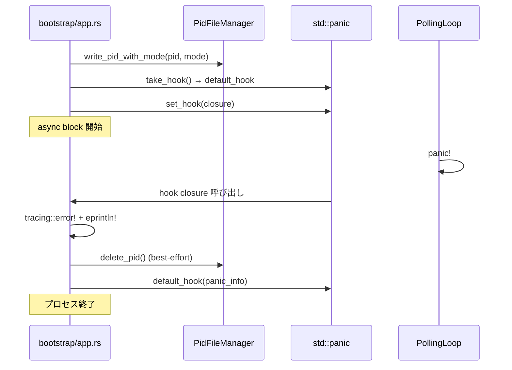

# Design Document: パニック時 PID ファイル自動クリーンアップ

## Overview

Cupola デーモンの polling loop が panic を起こすと、プロセスが `apply_pid_cleanup` などの正常終了パスを通らずに終了するため PID ファイルが残存し、次回起動を妨げる。

本機能は `std::panic::set_hook` を用いて panic 発生時に PID ファイルを削除するフックを `bootstrap/app.rs` に追加する。フォアグラウンドモードとデーモンモードの両方に適用し、既存の `apply_pid_cleanup` を補完する。

### Goals

- panic 発生時の PID ファイル自動削除
- panic 情報をエラーログに記録
- デフォルト panic 動作（スタックトレース出力・プロセス終了）の保持

### Non-Goals

- panic からの自動回復・リスタート
- polling loop 以外の panic ハンドリング
- `PidFilePort` トレイトの変更

## Requirements Traceability

| Requirement | Summary | Components | Interfaces |
|-------------|---------|------------|------------|
| 1.1 | panic 時 PID ファイル削除 | `install_panic_hook` | `PidFilePort::delete_pid` |
| 1.2 | panic ログ記録 | `install_panic_hook` | `tracing::error!`, `eprintln!` |
| 1.3 | デフォルト handler 再呼び出し | `install_panic_hook` | `std::panic::take_hook` |
| 1.4 | 削除失敗時の無視 | `install_panic_hook` | — |
| 1.5 | 両モードへの hook 設定 | `start_foreground`, `start_daemon_child` | `install_panic_hook` |
| 2.1 | PID 削除のインテグレーションテスト | `tests/integration_test.rs` | — |
| 2.2 | ログ記録の確認 | `bootstrap/app.rs` unit tests | — |
| 2.3 | 単体テスト容易性 | `install_panic_hook` | — |

## Architecture

### Existing Architecture Analysis

`bootstrap/app.rs` は `start_foreground` と `start_daemon_child` で次のシーケンスを実行する:

1. `write_pid_with_mode(pid, mode)` — PID ファイル書き込み
2. async ブロック内で logging 初期化・DB 接続・polling loop 実行
3. `apply_pid_cleanup(result, pid_path)` — 正常/エラー終了時の PID ファイル削除

現在 **panic** は `Result` パスを通らないため `apply_pid_cleanup` が呼ばれず PID ファイルが残存する。

### Architecture Pattern & Boundary Map



**Architecture Integration**:
- 配置レイヤー: bootstrap（具体型を知る唯一の層であるため適切）
- 新規コンポーネント: `install_panic_hook` 関数のみ追加
- 既存パターンの保持: `PidFilePort` トレイト変更なし、`apply_pid_cleanup` は既存のまま

### Technology Stack

| Layer | Choice / Version | Role |
|-------|------------------|------|
| Bootstrap | `std::panic` | Hook の設定・取得 (`set_hook`, `take_hook`) |
| Bootstrap | `tracing` (既存) | panic ログ記録 |
| Adapter/Outbound | `PidFileManager` (既存) | PID ファイル削除 |

## System Flows



## Components and Interfaces

| Component | Layer | Intent | Req Coverage | Key Dependencies |
|-----------|-------|--------|--------------|-----------------|
| `install_panic_hook` | Bootstrap | PID ファイルを削除する panic hook を登録する | 1.1, 1.2, 1.3, 1.4 | `PidFileManager` (P0), `std::panic` (P0) |
| `start_foreground` (変更) | Bootstrap | PID 書き込み後に hook を設定する | 1.5 | `install_panic_hook` (P0) |
| `start_daemon_child` (変更) | Bootstrap | PID 書き込み後に hook を設定する | 1.5 | `install_panic_hook` (P0) |

### Bootstrap Layer

#### `install_panic_hook`

| Field | Detail |
|-------|--------|
| Intent | PID ファイル削除と panic ログを行う panic hook を設定する |
| Requirements | 1.1, 1.2, 1.3, 1.4 |

**Responsibilities & Constraints**
- `std::panic::take_hook()` で既存のデフォルト hook を取得し、新しい hook に move キャプチャする
- 新しい hook 内では: ① tracing + stderr にログ出力 ② PID ファイルを削除（失敗は無視）③ デフォルト hook を呼び出す
- hook クロージャは `'static` 制約を満たすため、`PathBuf` を move キャプチャする
- hook 内で新たな `PidFileManager` を生成し `delete_pid()` を呼び出す

**Dependencies**
- Outbound: `PidFileManager` — PID ファイル削除 (P0)
- External: `std::panic` — hook の取得・設定 (P0)
- External: `tracing` — panic ログ (P1)

**Contracts**: Service [x]

##### Service Interface

```rust
fn install_panic_hook(pid_path: std::path::PathBuf);
```

- Preconditions: `pid_path` が PID ファイルの実際のパスと一致すること
- Postconditions: global panic hook に PID ファイル削除ロジックが登録される
- Invariants: 既存のデフォルト hook は新 hook の末尾で必ず呼び出される

**Implementation Notes**
- Integration: `start_foreground` と `start_daemon_child` の `write_pid_with_mode` 呼び出し直後に追加
- Validation: `delete_pid()` の戻り値は無視（best-effort）。`tracing::error!` は subscriber 未登録時に no-op
- Risks: hook 内での再 panic は `PidFileManager::delete_pid` の実装が panic しない前提で安全

## Error Handling

### Error Strategy

panic hook 内での処理はすべて best-effort とする。PID ファイル削除の失敗はエラーを握りつぶし、元の panic 伝播を妨げない。

### Error Categories and Responses

| エラー種別 | 発生箇所 | 対応 |
|-----------|---------|------|
| PID ファイル削除失敗 | `delete_pid()` | エラーを無視して続行 |
| tracing 未初期化 | `tracing::error!` | no-op のため無害。`eprintln!` でカバー |

## Testing Strategy

### Unit Tests

`bootstrap/app.rs` の `#[cfg(test)] mod tests` 内に追加:

1. `install_panic_hook` 呼び出し後、hook クロージャを直接起動して PID ファイルが削除されることを確認
2. PID ファイルが存在しない場合でも hook クロージャが安全に完了することを確認
3. hook クロージャ実行後にデフォルト hook が呼ばれる（`take_hook` で取得した関数が呼ばれること）の確認

### Integration Tests

`tests/integration_test.rs` または `tests/scenarios.rs` に追加:

1. 子プロセスを spawn し、PID ファイル書き込み後に panic させて、親プロセスから PID ファイルが削除されていることを確認
2. もしくは `std::thread::spawn` でスレッドパニックを起こし、hook が呼ばれた後にファイルが削除されることを確認（`catch_unwind` は hook を呼ばないため不適）
